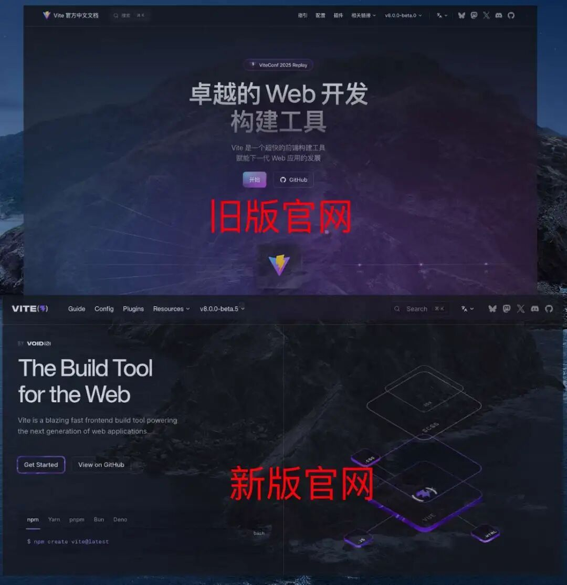
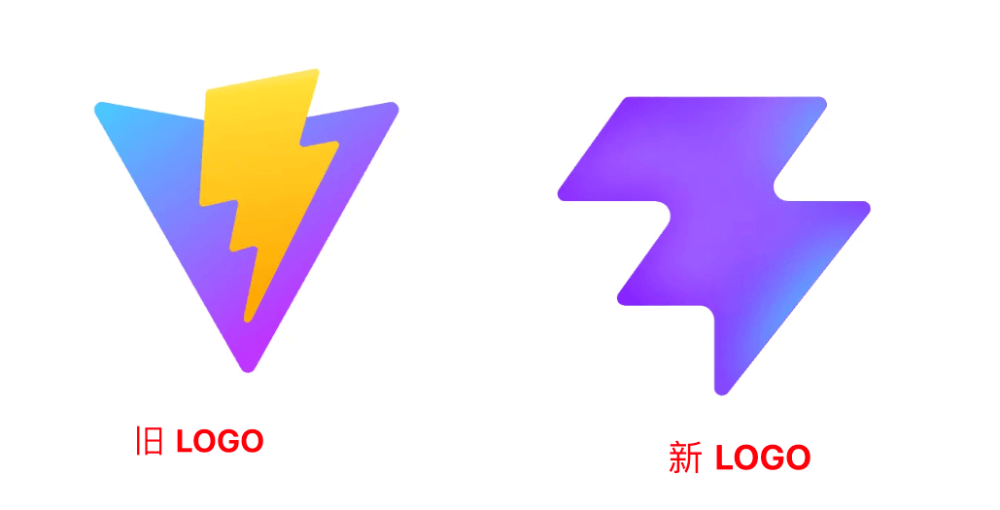
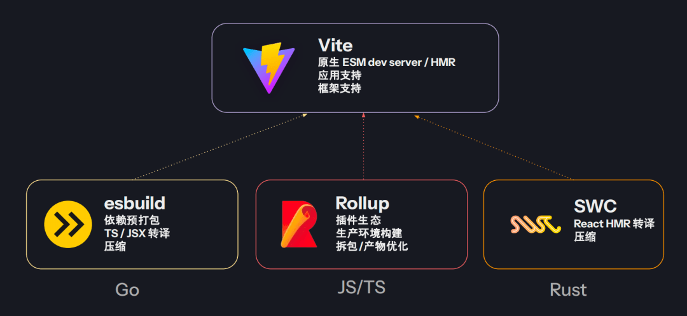
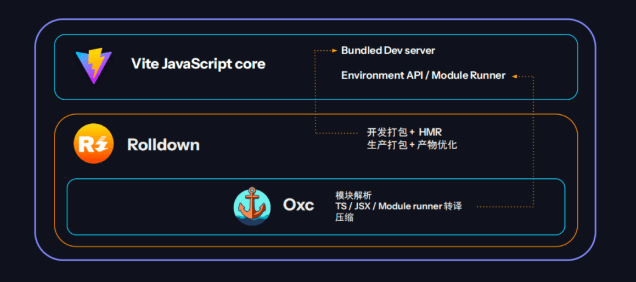
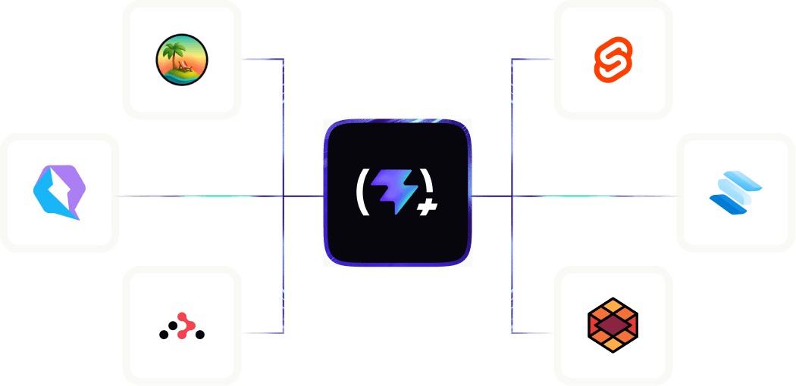
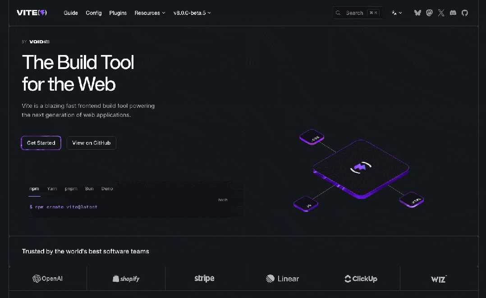

# Vite8 官网、Logo 换新！

如果你最近关注 **Vite** 相关的动态，可能会发现一件事：**Vite 好像正在发生一次“气质变化”。**

不只是`构建速度`，不只是`版本号`，而是从`文档、官网风格`：

`LOGO` 设计：

都在慢慢往另一个方向靠。

## 从一开始，Vite 走的就是一条“很聪明”的路

回到 **2019** 年，**Vite** 出现时解决的是一个非常具体的问题：

> 开发体验太慢了。

它给出的答案也非常直接：

- `dev` 阶段用 **esbuild**，快到极致
- `build` 阶段用 **Rollup**，结果稳定、生态成熟

**Vite** 自己并不**“硬刚”**底层实现，而是把两者巧妙地串在一起，把体验做到最好。

在当时，这是一个近乎完美的选择。

## 但随着项目越来越大，这套模式开始显得别扭

问题并不是 **Vite** 做得不好，而是这套结构天然有边界：

- `dev` 和 `build` 是两套语义
- 插件逻辑需要区分环境
- 行为一致性很难完全保证
- `Rollup` 的性能也逐渐逼近上限

这些问题在小项目里不明显，但一旦规模上来，就会反复出现。

本质原因只有一个：**Vite 并不真正控制整条构建链路。**

## Vite 8 的出现，是一次方向上的转折

**Vite 8** 并没有继续在原有架构上**“打补丁”**。

它选择的是彻底换思路：

- 用 **Rolldown** 重写打包语义
- 用 **Oxc** 统一解析、转换、压缩
- `dev / build / optimize` 共享同一套 `AST`

这意味着什么？

意味着 **Vite** 从`“整合工具”`，变成了`自持内核”`。

这是一次性质完全不同的升级。

## 把 Vite+ 放进来一起看，变化就更明显了

**Vite+** 并不是一个突然冒出来的产品。

如果你对它的定位有了解，会发现它和 **Vite 8** 在底层思路上高度一致：

- 都基于 `Rust`
- 都强调`统一工具链`
- 都在减少拼装和割裂
- 都在往“基础设施”靠拢

只是分工不同：

- **Vite 8**：把构建器这件事做到极致
- **Vite+**：把测试、lint、格式化、任务系统一并收进来

这已经不是“工具升级”，而是**角色升级**。

## 在这种背景下，官网和 Logo 的变化就不难理解了

这里的关键点，并不是**“旧 Logo 好不好看”**。

而是：

> 旧形象对应的是一个轻量、灵巧、偏工具型的 Vite 新内核支撑的是一个长期演进的工程化基础设施

当项目的定位发生变化，对外的表达方式迟早要跟上。

`官网`、`视觉`、`品牌`，只是最直观的一层体现。

## 所以真正值得关注的，不是样式本身

而是这背后透露出的信号：

- `Vite` 正在把“`底层能力`”握在自己手里
- `Vite` 的演进周期开始拉长
- 它不再只是追求“快”，而是`稳定`、`可控`、`可持续`

这也是为什么，很多人会下意识觉得：

> “这已经不是以前那个 **Vite** 了。”

## 写在最后

最近大家看到的官网和视觉变化，更多是一种**方向释放**。

它并不一定代表最终形态，但基本可以确认一点：

> **Vite 的技术路线已经发生了不可逆的变化。**

顺带一提，目前流传出来的新版官网页面，仍然来自内部调整阶段的构建版本，后续是否整体替换，还要看官方最终决定。

但无论外在形象如何调整，有一点已经很清楚了：

**Vite，正在进入一个全新的阶段。**

- **Vite8 新版预览地址**：`https://deploy-preview-21327--vite-docs-main.netlify.app/`
- **Vite1-7 地址**：`https://cn.vitejs.dev/`
- **PR 地址**：`https://github.com/vitejs/vite/pull/21327`

  

---

  

- 我是 ssh，工作 6 年+，阿里云、字节跳动 Web infra 一线拼杀出来的资深前端工程师 + 面试官，非常熟悉大厂的面试套路，Vue、React 以及前端工程化领域深入浅出的文章帮助无数人进入了大厂。
- 欢迎`长按图片加 ssh 为好友`，我会第一时间和你分享前端行业趋势，学习途径等等。2025 陪你一起度过！
- 
- 关注公众号，发送消息：
  
  指南，获取高级前端、算法**学习路线**，是我自己一路走来的实践。
  
  简历，获取大厂**简历编写指南**，是我看了上百份简历后总结的心血。
  
  面经，获取大厂**面试题**，集结社区优质面经，助你攀登高峰

因为微信公众号修改规则，如果不标星或点在看，你可能会收不到我公众号文章的推送，请大家将本**公众号星标**，看完文章后记得**点下赞**或者**在看**，谢谢各位！
