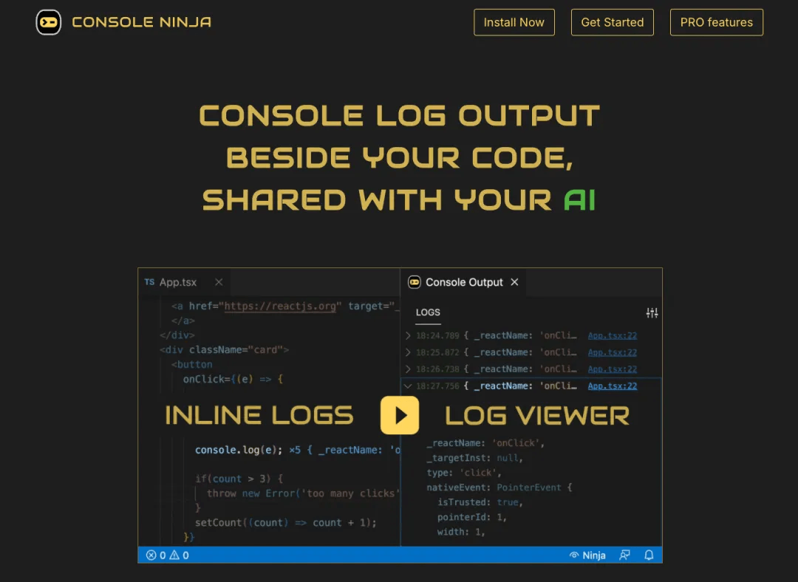
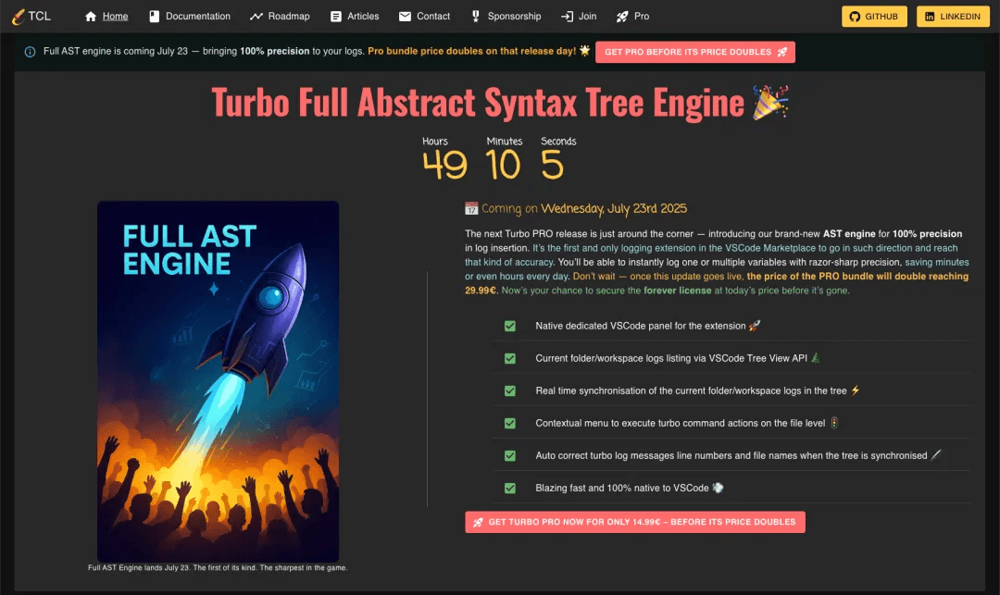
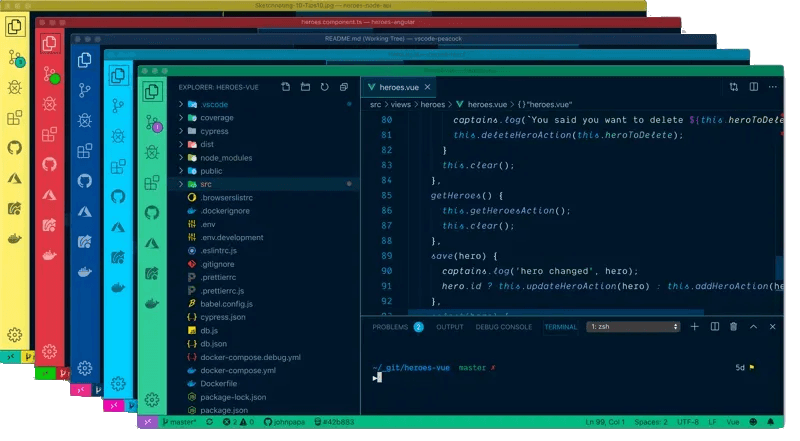
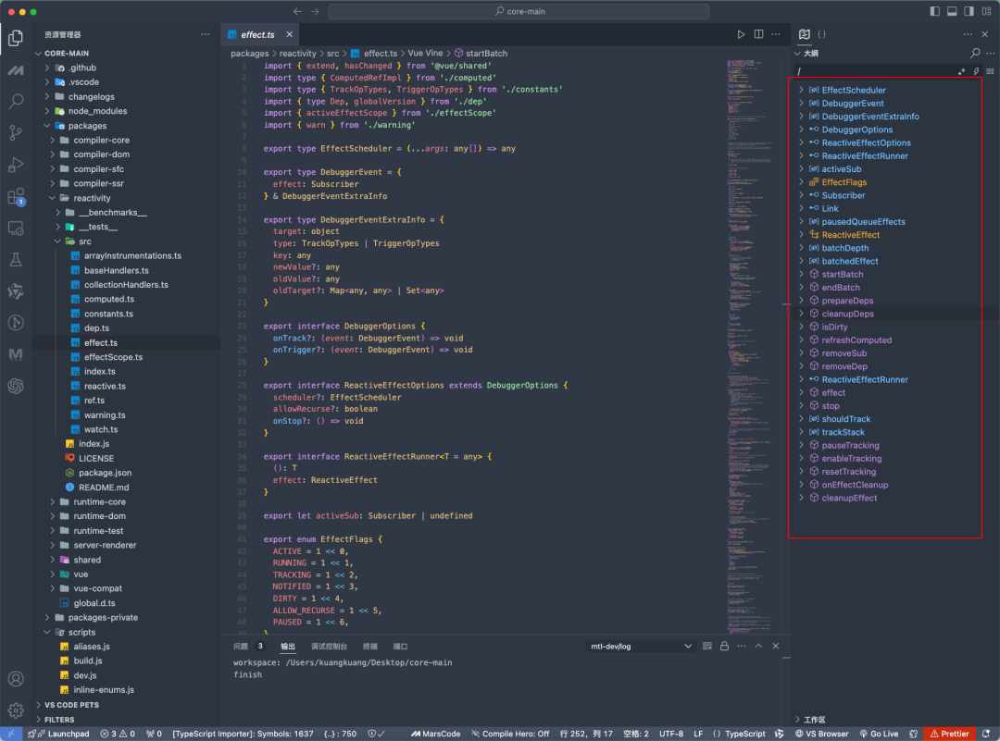
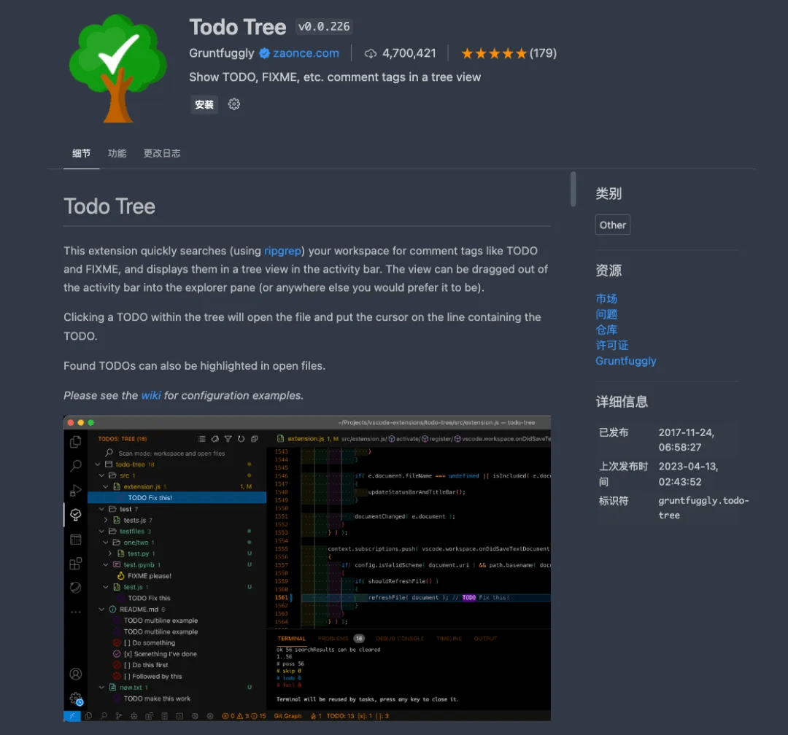
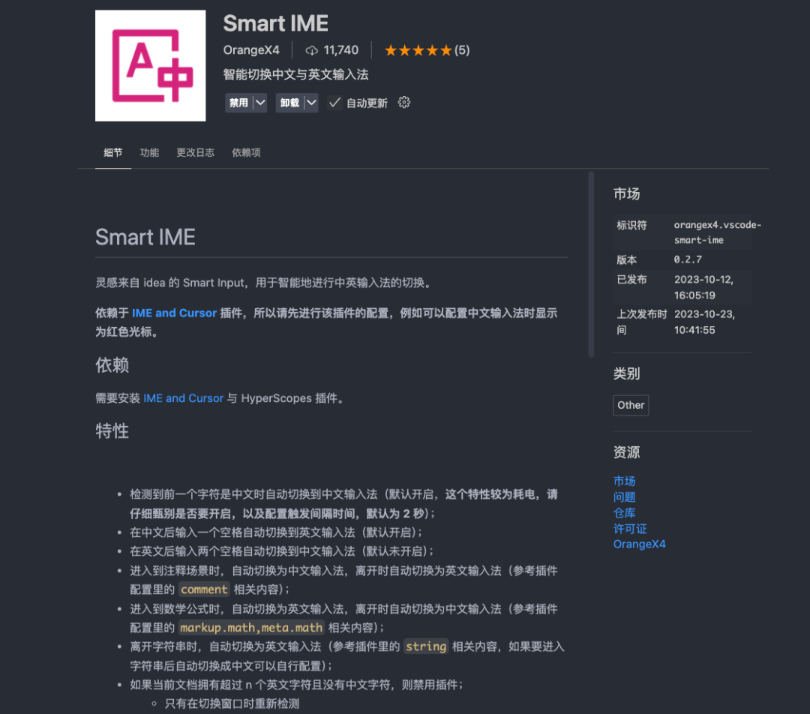
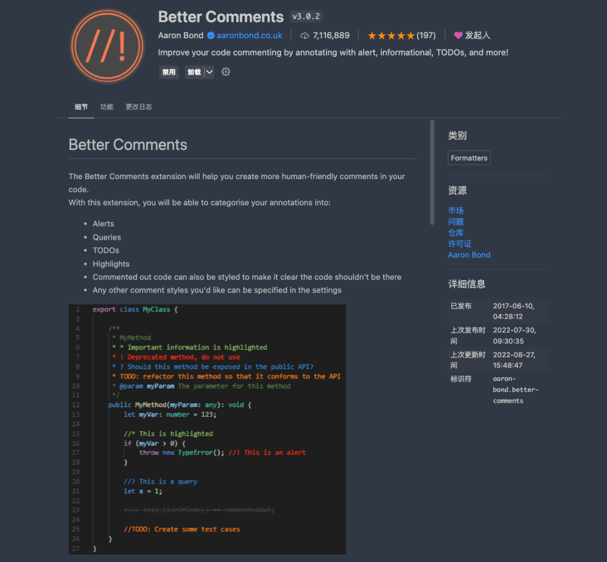
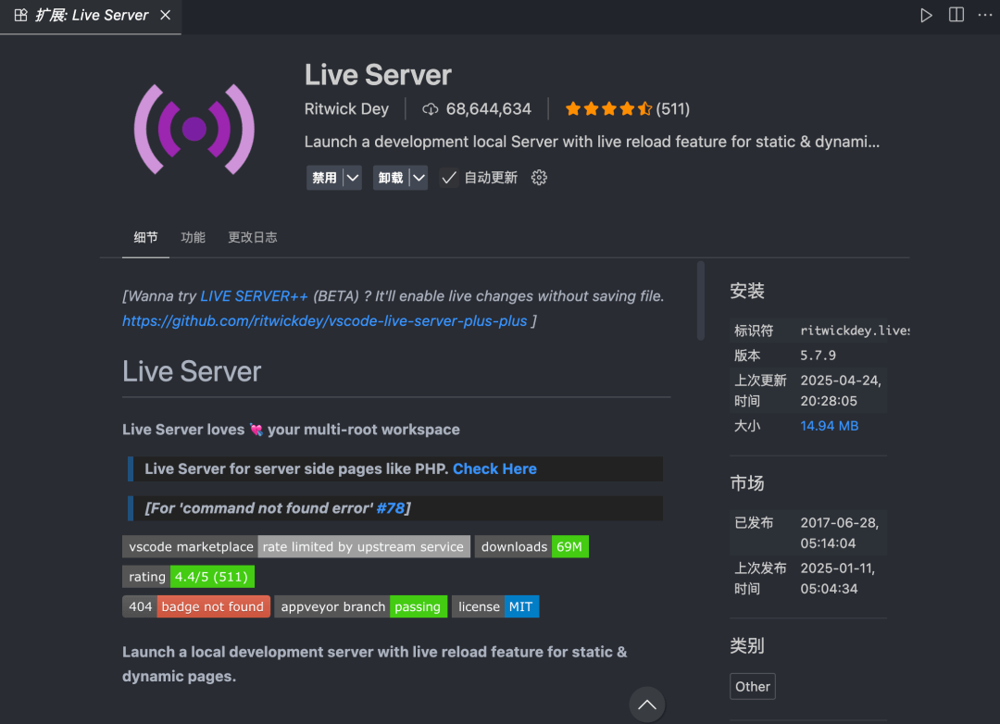
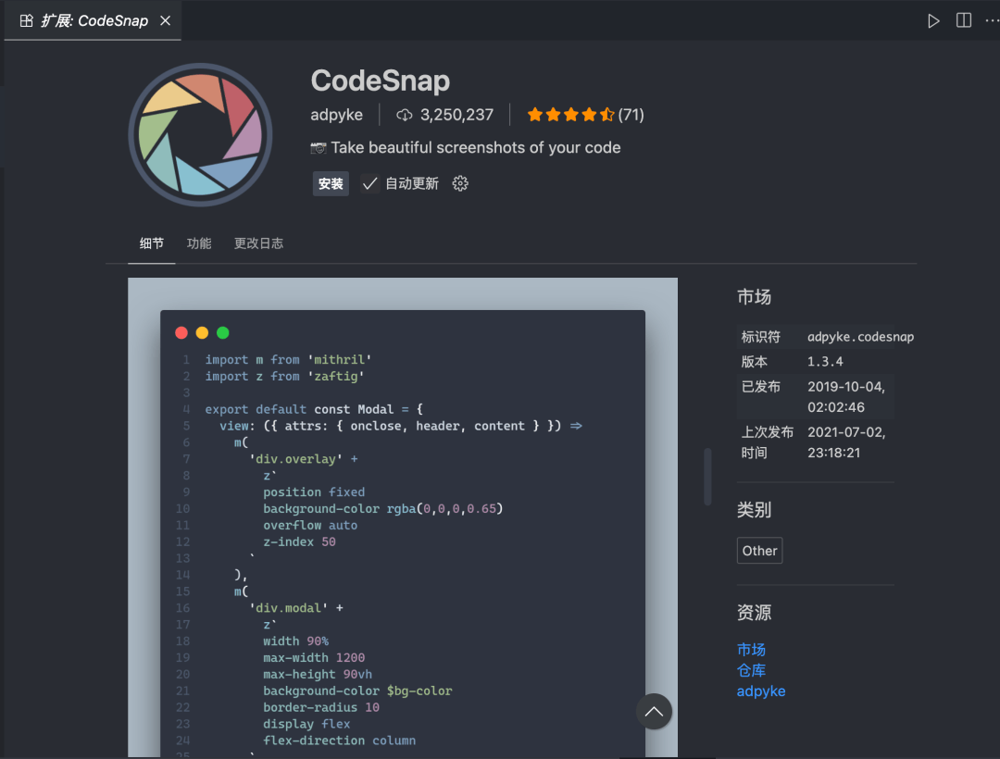
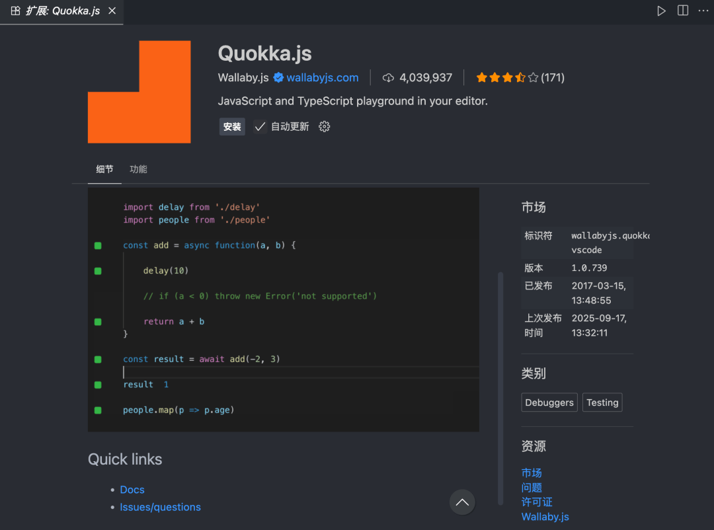

# VSCode 插件榜 Top10 出炉！装上无敌！

**常用插件**推荐早就看腻了，今天这 **10** 个是我压箱底的宝藏，装上就能让写代码，像开挂。

## Console Ninja

把浏览器控制台搬进代码行尾，边写边看 `log`，`Alt+Tab` 直接退休。

以前 `console.log` 得切到 **Chrome** 里瞄一眼，现在`返回值`、`报错`、`网络请求`像弹幕一样实时贴在右边，眼都不用挪。

## Turbo Console Log

选中变量 `Ctrl+Alt+L`，瞬间生成带`文件名`、`行号`、`emoji` 的日志；

上线前 `Alt+Shift+D` 一键清光，只删它生成的，不动你手写的，安全感爆棚。

## Peacock

同时开多个工程？

把前端染成`骚蓝`、后端搞成`原谅绿`、测试抹成`少女紫`，瞄一眼边框就知道自己在哪个坑，窗口再多也不迷路。

## Outline Map

代码太长找不到北？右侧小地图把`函数`、`类`、`注释`压成小格子，拖一下鼠标就能瞬移，万行文件也能精准降落。

## Todo Tree

写代码随手留 `// TODO 优化这坨屎山`，插件自动把所有欠债收进侧边栏，点一条飞过去，清完勾掉，爽感`+10086`。

## Smart IME

光标一进注释或字符串，输入法悄咪咪切成中文；回到代码区又`自动切回`英文，再也不怕 `var name = 张三` 打成拼音还提交上去。

## Better Comments

`// ! 红色警报``// ? 绿色疑问``// * 蓝色高亮`，颜色自己配，看代码像刷弹幕，重点秒抓。

## Live Server

右下角点一下`「Go Live」`，静态页直接跑在`本地服务器`，保存就刷新，手机同局域网也能访问，调样式摸到鱼都方便。

## CodeSnap

`选中代码` → `自动生成带阴影`、`圆角`、`透明背景`的 PNG，发群、写 PPT 逼格瞬间满格，老板以为你用了 PS，其实就按两下。

## Quokka.js

新建 `.js` 文件 → `Ctrl+K Q`，每行右边实时跑值，刷算法、测 API 连 `console.log` 都省了，比浏览器 Console 爽十倍。

### 收工

十款插件全在这了，装好重启 **VSCode**，感受`「卧槽，还能这样？」`的快乐。

有`私藏宝贝`记得评论区互相伤害，一起把效率卷到天花板！

  

---

  

- 我是 ssh，工作 6 年+，阿里云、字节跳动 Web infra 一线拼杀出来的资深前端工程师 + 面试官，非常熟悉大厂的面试套路，Vue、React 以及前端工程化领域深入浅出的文章帮助无数人进入了大厂。
- 欢迎`长按图片加 ssh 为好友`，我会第一时间和你分享前端行业趋势，学习途径等等。2025 陪你一起度过！
- 
- 关注公众号，发送消息：
  
  指南，获取高级前端、算法**学习路线**，是我自己一路走来的实践。
  
  简历，获取大厂**简历编写指南**，是我看了上百份简历后总结的心血。
  
  面经，获取大厂**面试题**，集结社区优质面经，助你攀登高峰

因为微信公众号修改规则，如果不标星或点在看，你可能会收不到我公众号文章的推送，请大家将本**公众号星标**，看完文章后记得**点下赞**或者**在看**，谢谢各位！
