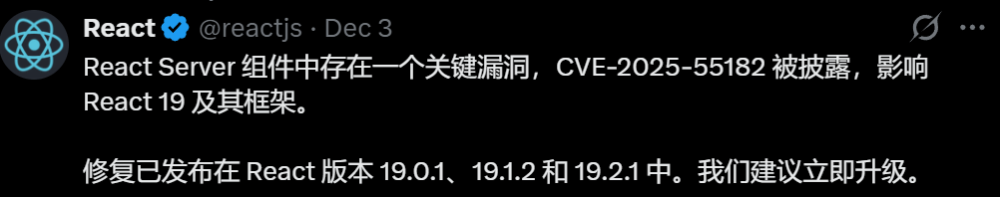
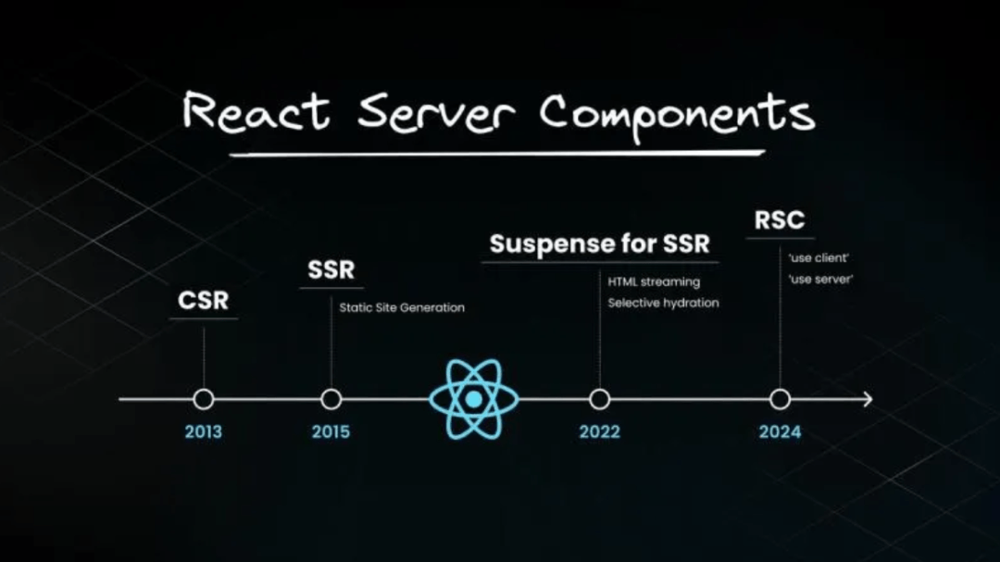
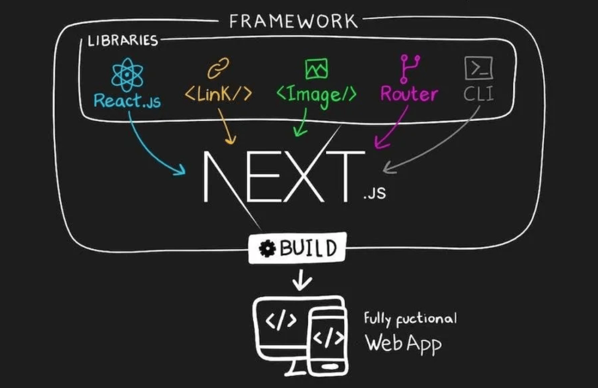

# 灾难性 BUG！React 团队正在连夜修复！

React团队今天凌晨紧急发布了一个**最高危漏洞**。如果你项目里使用了React的**“服务器组件”（RSC）**功能，攻击者可以直接利用这个漏洞，在你的服务器上执行任意代码。

这个**高危漏洞（CVE-2025-55182）**，CVSS评分高达**10.0分**。是最高级的漏洞！！！



**🛠 什么是“服务器组件”（React Server Component）？**

简单说，这是一种让React组件在**服务器端提前渲染**的技术。它能让页面加载更快，但这次出问题的正是处理“服务端-客户端”通信的底层代码。



**⚠️ 漏洞影响谁？**

几乎**所有使用React服务器组件的项目**都受影响，包括：

- 使用 Next.js 13.3+ 或 14.x、15.x 的项目
- 使用 React Router 并开启了RSC功能的项目
- 使用 Waku、Vite RSC插件等框架的项目



**🚨 必须立即行动**

官方已发布修复版本，你需要升级相关依赖：

**Next.js项目**（大多数人的情况）：

```
# 根据你的主版本号选择执行
npm install next@14.2.35    # Next.js 14 用户
npm install next@15.0.7     # Next.js 15.0.x 用户
npm install next@15.1.11    # Next.js 15.1.x 用户
# ...（其他版本见上面详细列表）
```
**直接使用RSC包的项目**：

```
npm install react@latest react-dom@latest
npm install react-server-dom-webpack@latest
# 或你正在使用的其他 react-server-dom-* 包
```
**⏰ 时间线**

- 11月29日 - 漏洞被报告
- 12月3日 - 修复版本发布
- **现在 - 你需要立即升级**

**📢 特别提醒**

即使你的云服务商说“已提供防护”，也**必须自己升级依赖**。这个漏洞的危险程度相当于让黑客能远程给你的服务器装木马，不要抱有侥幸心理。

**👉 现在该做什么？**

1. 打开你的项目
2. 检查 `package.json` 里是否有相关依赖
3. 运行对应的升级命令
4. 重新部署

今晚就处理，别拖到明天。

## 结语

我是林三心，一个待过**小型toG型外包公司、大型外包公司、小公司、潜力型创业公司、大公司**的作死型前端选手

我建了一些**前端学习群**，如果大家想进群交流前端知识，可以关注我，回复**加群**


