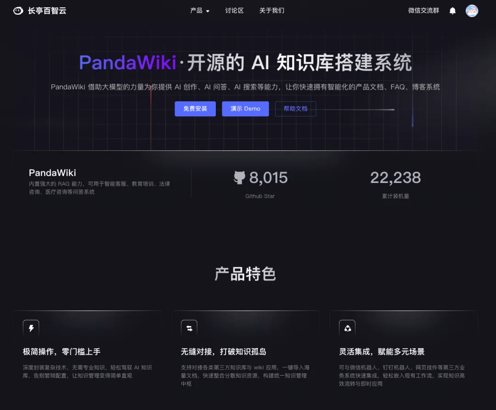
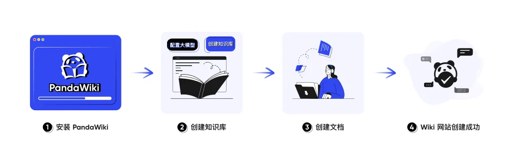
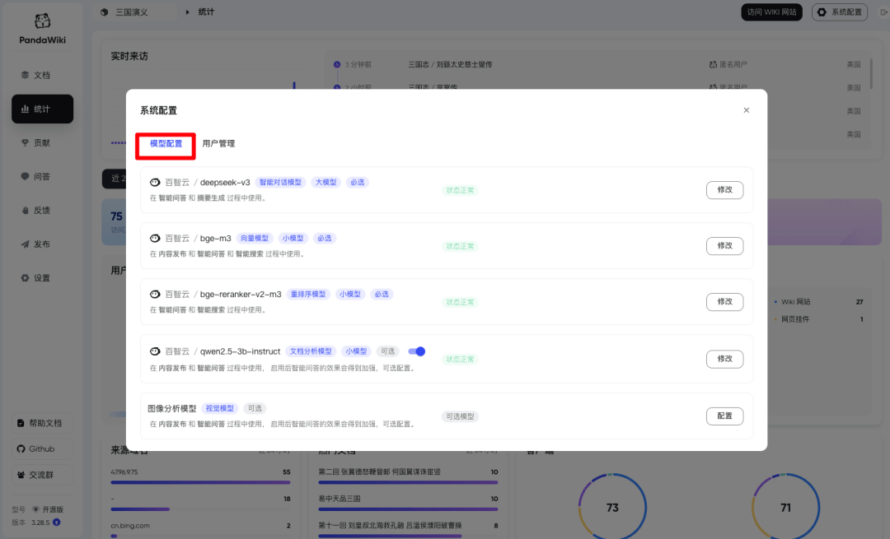
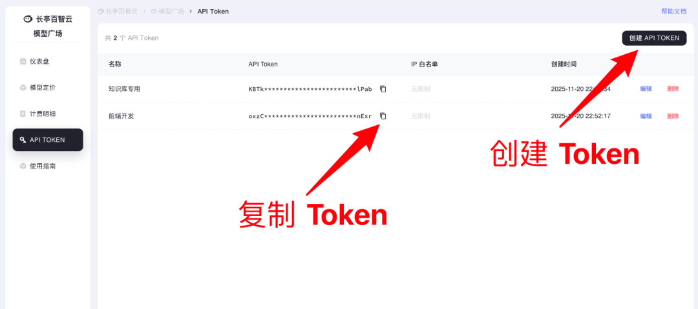
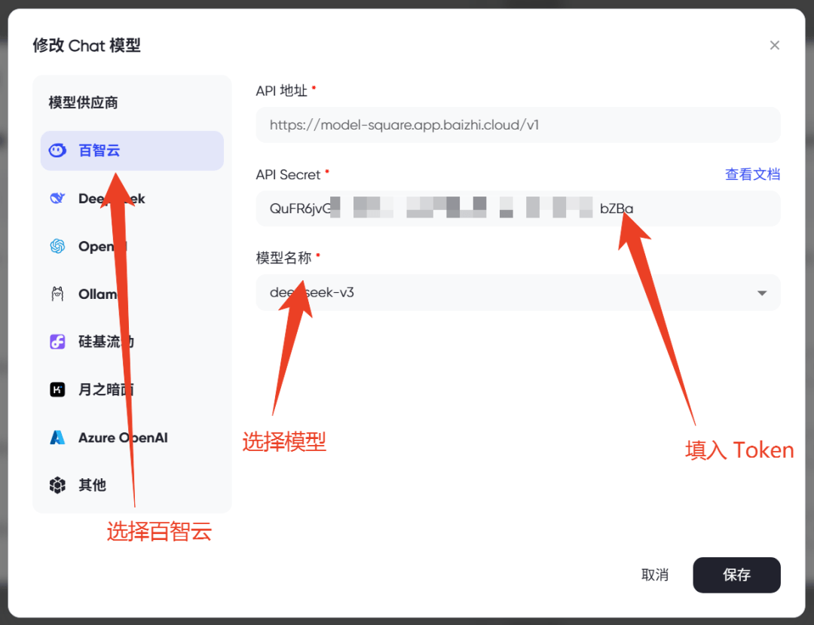
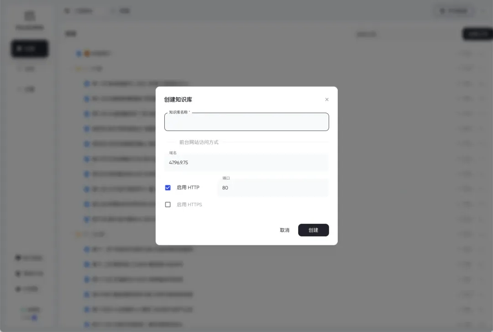
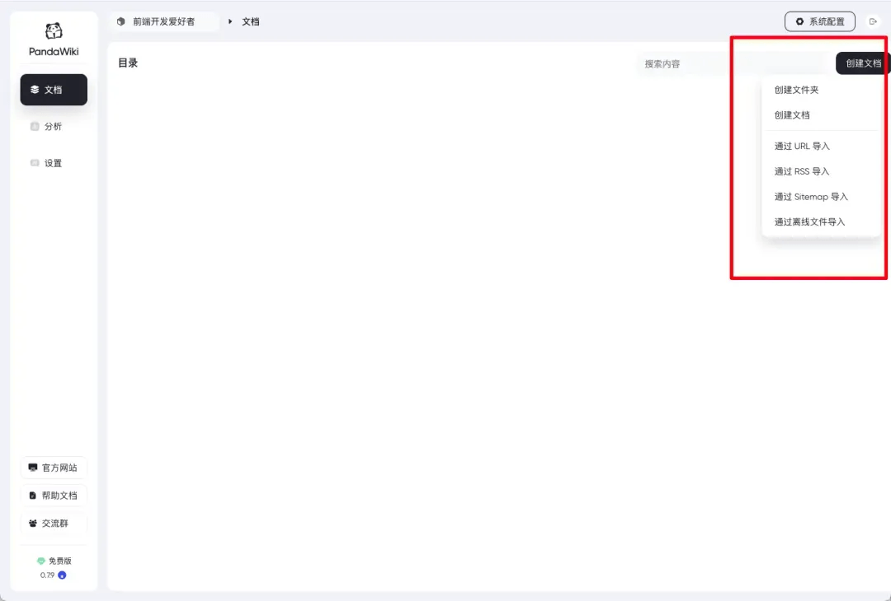
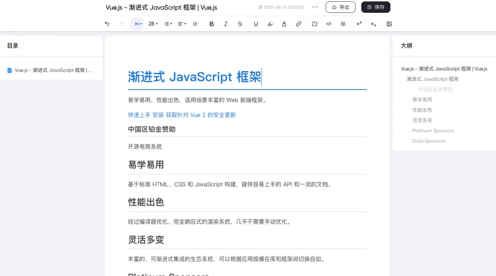
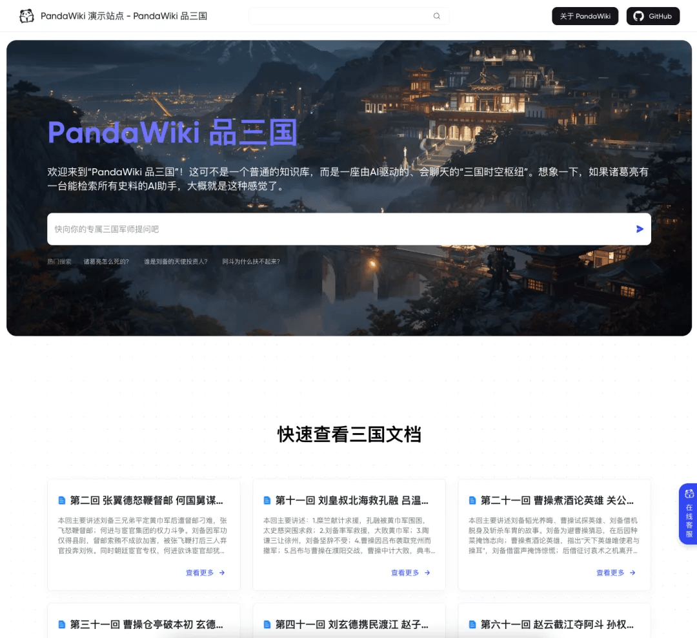

# 前端"新玩具"：效率又提升 300%！

作为一名**前端开发者**，我们经常需要查阅**大量**的资料和文档，尤其是查找三方文档的时候，既**耗时**又**费力**，还容易让人感到疲惫。

那么，有没有一种方法能让我们在开发过程中迅速定位到所需内容，而无需在一堆杂乱无章的信息中筛选呢？

经过团队的深入探讨和多方考量，我们找到了一款强大的工具 —— **PandaWiki**。


## PandaWiki：前端开发者的新利器

**PandaWiki** 是一款 **AI** 大模型驱动的开源知识库搭建系统，它能帮助我们快速构建智能化的`产品文档`、`技术文档`、`FAQ` 和`博客系统`。



凭借其强大的功能，**PandaWiki** 让我们在开发过程中能够轻松管理知识，高效检索信息。

更让我感到惊讶的是，**PandaWiki** 可以集成到其他网站作为`网页挂件`，或者与`钉钉`、`飞书`、`企业微信`等聊天工具结合，方便我们在不同平台调用知识库内容。

## 功能特色

- **富文本编辑，兼容多种格式** ：支持 `Markdown` 和 `HTML`，还能导出为 `word`、`pdf`、`markdown` 等格式，方便我们根据不同需求进行文档编辑和分享。
- **AI 智能化，提升开发效率** ：
- **创作辅助** ：`AI` 根据上下文给出建议，加快文档撰写速度，比如在整理前端框架文档时自动补全代码示例。
- **问答功能** ：在知识库中输入自然语言问题，快速获取精准答案，节省查找时间。
- **智能搜索** ：理解搜索意图，提供精准结果，还能依据搜索行为优化排序，让我们在海量知识中迅速定位目标内容。
- **第三方应用集成，拓展使用场景** ：可以集成到其他网站作为`网页挂件`，或者与`钉钉`、`飞书`、`企业微信`等聊天工具结合，方便我们在不同平台调用知识库内容。
- **多方式导入内容，快速丰富知识库** ：支持`在线 URL`、`网站 Sitemap`、`RSS 订阅`、`第三方文档`以及`离线文件`等多种导入方式，轻松整合各方资源。

## 快速安装与使用指南



#### 环境准备

- **操作系统**：推荐 `Ubuntu` 或 `CentOS` 的 `Linux` 系统
- **硬件配置**：至少 `2 GB` 内存，`1 GB` 可用磁盘空间
- **软件依赖**：安装并配置好 `Docker 20.x` 以上版本

#### 安装步骤

1. 以 `root` 权限登录服务器。
2. 执行命令安装 **PandaWiki** ：

```
bash -c "$(curl -fsSLk https://release.baizhi.cloud/panda-wiki/manager.sh)"
```
安装过程需要几分钟时间。

1. 安装完成后，终端会显示访问地址和初始**用户名密码**。例如：

```
SUCCESS  控制台信息:
SUCCESS    访问地址(内网): http://*.*.*.*:2443
SUCCESS    访问地址(外网): http://*.*.*.*:2443
SUCCESS    用户名: admin
SUCCESS    密码: **********************

```
1. 在浏览器中**打开访问地址**，输入用户名和密码登录控制台。


#### 初始配置

**配置 AI 模型** ：

**PandaWiki** 是由 `AI` 大模型驱动的 `Wiki` 系统，在未配置大模型的情况下将无法正常使用。

首次登录时会提示需要先配置 `AI` 模型，根据下方图片配置 **“Chat 模型”** 即可使用。



也可以在百智云模型广场创建 `API Token`



然后在 **PandaWiki** 系统设置中配置 `Token`，打开配置模型的弹框中：

- 选择 `百智云`
- 填入刚才复制到 `Token`
- 选择需要使用的`模型`



选择模型（如 `deekseek-v3`、`bge-m3` 等）

推荐使用以下模型


| 模型 | 名称 |
| --- | --- |
| Chat 模型 | deekseek-v3 |
| Embedding 模型 | bge-m3 |
| Rerank 模型 | bge-reranker-v3-m3 |


目前，**PandaWiki** 兼容以下大模型供应商：

- **百智云模型广场（推荐）**：提供多种模型，注册即送额度。
- **DeepSeek**：模型性能优异，适合复杂任务。
- **OpenAI**：支持 ChatGPT 背后的大模型。
- **Ollama**：通常为本地部署大模型。
- **硅基流动**：专注高性能模型服务。
- **月之暗面**：提供 Kimi 所用模型。
- **302.AI**：企业级的 AI 应用平台和 API 聚合中心。
- **其他**：兼容 OpenAI 模型接口的 API。
- **更多模型**：可以在百智云论坛查找。

**创建知识库** ：

点击控制台的 `“创建知识库”` 按钮，设置`知识库名称`和`描述`



接着通过**多种导入方式**（如在线 URL 导入、离线文件导入等）添加文档，快速填充知识库内容。



比如我把 `Vue3 开发文档` 导入到我的知识库中


#### 基本使用

1. **知识库管理** ：在控制台全方位管理知识库，包括编辑文档、组织文档结构、设置访问权限等操作。



1. **知识检索与交互** ：访问知识库前台页面，通过搜索框快速查找知识，或者利用 AI 问答功能输入问题获取答案。


## 在线体验教程

我们提供了在线演示环境，方便大家直观感受 **PandaWiki** 的功能。

访问 **PandaWiki** 演示站点: `http://47.96.9.75/`，可以进行以下操作：

**体验 AI 问答** ：在搜索框输入问题，如 **“如何配置 AI 模型？”** 或 **“如何导入文档？”**，感受 AI 快速准确的回答。



**尝试编辑创作** ：使用演示环境的编辑功能，体验富文本编辑的便捷性和 AI 辅助创作的智能性。

### GitHub 项目推广与支持

**PandaWiki** 作为开源项目，在 **GitHub** 上有广泛开发者社区支持。

诚邀大家访问 **PandaWiki** 的 **GitHub** 页面，为项目点星或者提建议 issue：

- **PandaWiki Github 地址**：`https://github.com/chaitin/PandaWiki`

您的支持是对项目团队的鼓励，也是项目未来发展的重要助力。

更多星星将吸引更多开发者关注和参与项目，共同推动 **PandaWiki** 的优化和完善。

### 加入交流社区

为方便交流使用心得、解决问题和获取项目动态，**PandaWiki** 官方设有交流群。

_扫描下方二维码即可加入_


与 **PandaWiki** 的使用者和爱好者一起探讨知识库搭建，分享实践经验，共同成长进步。

在前端开发的道路上，**知识库**的搭建为我们提供了强有力的支撑。

**PandaWiki** 凭借其强大功能、智能化特点和便捷操作，成为我们提升开发效率的理想工具。让我们携手 **PandaWiki**，开启前端开发知识管理的新篇章！

- **PandaWiki 官网**：`https://baizhi.cloud/landing/pandawiki`
- **PandaWiki Github 地址**：`https://github.com/chaitin/PandaWiki`
- **PandaWiki 在线体验**：`http://47.96.9.75/`

  

---

  


- 我是 ssh，工作 6 年+，阿里云、字节跳动 Web infra 一线拼杀出来的资深前端工程师 + 面试官，非常熟悉大厂的面试套路，Vue、React 以及前端工程化领域深入浅出的文章帮助无数人进入了大厂。
- 欢迎`长按图片加 ssh 为好友`，我会第一时间和你分享前端行业趋势，学习途径等等。2025 陪你一起度过！
- 
- 关注公众号，发送消息：
  
  指南，获取高级前端、算法**学习路线**，是我自己一路走来的实践。
  
  简历，获取大厂**简历编写指南**，是我看了上百份简历后总结的心血。
  
  面经，获取大厂**面试题**，集结社区优质面经，助你攀登高峰

因为微信公众号修改规则，如果不标星或点在看，你可能会收不到我公众号文章的推送，请大家将本**公众号星标**，看完文章后记得**点下赞**或者**在看**，谢谢各位！
