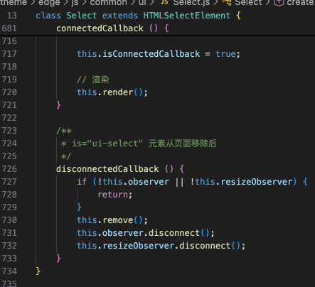
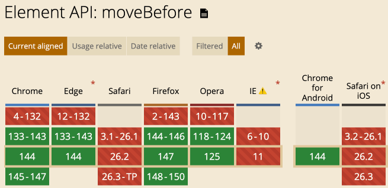

# 告别insertBefore，使用moveBefore移动DOM元素

by [zhangxinxu](https://www.zhangxinxu.com/) from [https://www.zhangxinxu.com/wordpress/?p=12051](https://www.zhangxinxu.com/wordpress/?p=12051)  
本文可全文转载，但需要保留原作者、出处以及文中链接，AI抓取保留原文地址，任何网站均可摘要聚合，商用请联系授权。

### 一、新的moveBefore方法

以前我们要移动DOM元素或者Node节点都是使用insertBefore方法。

但是，`insertBefore`的移动是通过“删除” → “创建”实现的。

这就会有问题，包括：

- 元素的动画中断；
- :active状态丢失；
- 触发Mutation Observer;

等。

实际上，我只是希望元素单纯地换一个位置。

于是就有了全新的`moveBefore`方法，语法和`insertBefore`几乎一致，例如：

```scss
Element.moveBefore(movedNode, referenceNode)
Document.moveBefore(movedNode, referenceNode)
```
其中，`movedNode`会变成调用对象的子元素，同时位置位于`referenceNode`的前面。

此时，以下这些状态变化都是不会触发的：

- animation动画transition过渡状态；
- `<iframe>`加载状态；
- `:focus`或者`:active`等加载状态；
- 元素全屏状态；
- popover浮层的开关状态；
- `<dialog>`元素的模态状态；

至于视频和音频的播放状态，这个无论是`insertBefore`还是`moveBefore`方法，都会保留。

以及`moveBefore`方法也会触发Mutation Observer，也就是可以检测到删除和添加，我觉得这个是合理的，否则会影响功能实现。

#### moveBefore使用限制

对于`insertBefore`方法，只要DOM元素在内存中（例如使用createElement创建），哪怕不在页面中，也是可以执行的。

但是`moveBefore`方法不行，`moveBefore`移动的节点元素必须在文档之中，而且不支持跨文档移动，否则会报错。

#### Web Components中的作用

之前我开发 LuLu UI 的Select组件，遇到了一个问题，那就是如果 Select 元素的DOM上下文环境变化，例如整体移动这种，运行状态就会有问题。



就是因为元素移动触发了`disconnectedCallback()`和`connectedCallback()`生命周期函数执行，导致状态出现问题。

`moveBefore`似乎就是为了这种情况设计的。

当然，在自定义元素场景下，需要使用其他的生命周期函数配合，叫做`connectedMoveCallback()`。

是这样的：

如果在组件中添加`connectedMoveCallback`生命周期函数，就像下面这样：

```javascript
class MyComponent {
  // ...
  connectedMoveCallback() {
    console.log("自定义移动逻辑，如果需要");
  }
  // ...
}
```
那么组件元素使用`moveBefore`移动的时候，`disconnectedCallback()`和`connectedCallback()`生命周期函数是不会执行的。

注意，如果你没有添加connectedMoveCallback函数，无论是`moveBefore`还是`insertBefore`，依然遵循传统的生命周期逻辑。

### 二、moveBefore实践指南

直接说结论，页面内的元素移动，直接使用moveBefore，不需要有任何犹豫。

```scss
.parentElement
.moveBefore
```
不过moveBefore毕竟是新特性，存在兼容性问题，如下图所示：



所以在生产环境使用，还需要Polyfill一下，很简单，使用`insertBefore`接济下，例如：

```javascript
if (!document.moveBefore) {
  document.moveBefore = document.insertBefore;
}
if (!HTMLElement.prototype.moveBefore) {
  HTMLElement.prototype.moveBefore = HTMLElement.prototype.insertBefore;
}
```
就可以放心使用了。

#### 案例

我们通过一个简单案例，感受下moveBefore的执行效果，想了下，点击列表置顶效果吧。

你可以点击下面的任意列表色块，看看有没有对应的移动效果。

1

2

3

完整的代码如下所示：

```xml
<div class="flex">
  <div class="item" style="view-transition-name: li-1">1</div>
  <div class="item" style="view-transition-name: li-2">2</div>
  <div class="item" style="view-transition-name: li-3">3</div>
</div>
```
CSS代码：

```css
.flex {
  display: flex;
  gap: .5rem;
}
.item {
  aspect-ratio: 1;
  background: skyblue;
  height: 120px;
  display: grid;
  place-items: center;
}
```
JavaScript部分，前面都是新特性的Polyfill代码：

```javascript
if (!document.moveBefore) {
  document.moveBefore = document.insertBefore;
}
if (!HTMLElement.prototype.moveBefore) {
  HTMLElement.prototype.moveBefore = HTMLElement.prototype.insertBefore;
}

if (!document.startViewTransition) {
  document.startViewTransition = function (callback) {
    setTimeout(callback, 1);
  };
}

document.querySelectorAll('.flex .item').forEach((item) => {
  item.onclick = function () {
    document.startViewTransition(() => {
      item.parentElement.moveBefore(item, item.parentElement.firstElementChild);
    });
  }
});
```
[](https://wwads.cn/click/bait)[](https://wwads.cn/click/bundle?code=IjCmjXSBYqSTYtwqle5z3oBlvXQhGK)

[IT探测网，全球PING、网站测速、DNS查询、AI分析检测。免费测试、监控，IT运维好工具](https://wwads.cn/click/bundle?code=IjCmjXSBYqSTYtwqle5z3oBlvXQhGK)[广告](https://wwads.cn/?utm_source=property-231&utm_medium=footer "点击了解万维广告联盟")

### 三、谢幕、敬礼

如果让AI实现一个列表点击置顶，同时带动画的效果，我不要看就知道，代码一定是洋洋洒洒。

说不定还有元素克隆，绝对定位，然后使用动画或过渡效果实现。

如果有元素移动，也一定是`insertBefore`这种传统的方法。

因为目前的AI编程还是基于历史代码训练而来，趋向于最传统稳健的实现，满足功能，创新能力不足。

也就是说，他能实现东西，但是不一定是最佳实践。

这就是目前开发人员的不可替代之处：

1. 开发人员有不错的架构设计能力，能够很好地引导AI一步一步实现预期的代码；
2. 开发人员有创新能力，眼界广泛，知道什么样的代码或者方法才是最好最优解。

所以回到很多开发人员问过的一个问题，都AI时代了，学这些细枝末节的东西有个屁用啊！

如果你的项目仅仅是功能完成就OK，说实话，给自己找个不学习的理由也说得过去。

可如果对业务和产品有更高的要求，无论何时，学习总是不能停的。

无论AI出现与否，我们身在职场，放眼整个行业，毕竟还是人与人的竞争。

即，我比你懂的更多，我能比你更好地使用AI，自然这个行业有我更好的一席之地。

好了，就叨这么多，有什么问题可以评论区交流，我们下个视频再见！


