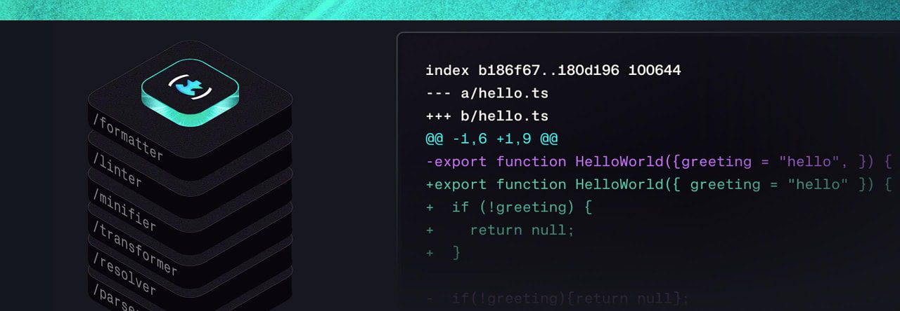
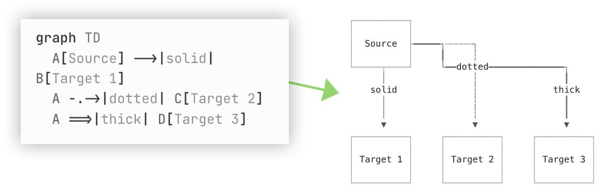
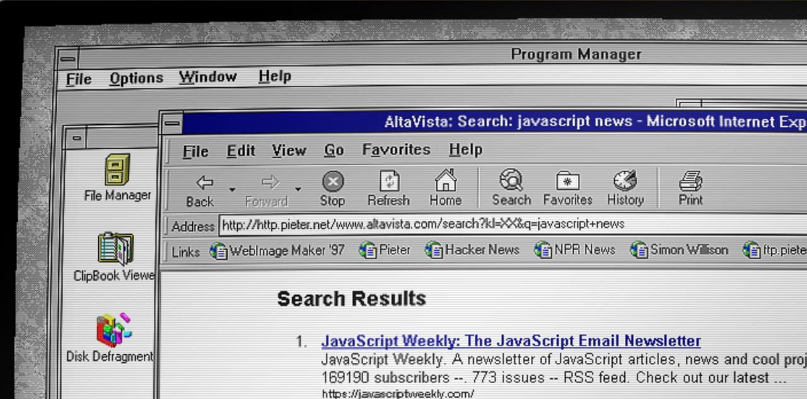

# Oxfmt beta: 30x faster than Prettier, 100% compatible

#​774 — February 24, 2026

[Read on the Web](https://javascriptweekly.com/link/181155/web)

  
- [Oxfmt Beta: A Fast, Rust-Powered JavaScript Code Formatter](https://javascriptweekly.com/link/181088/web "oxc.rs") — A **100% [Prettier](https://javascriptweekly.com/link/181089/web)\-compatible** JavaScript code formatter (and sister project of [Oxlint](https://javascriptweekly.com/link/181090/web)) that boasts being 30x faster than Prettier and 3x faster than [Biome.](https://javascriptweekly.com/link/181091/web) Since the alpha, it now supports embedded language formatting (JSX, YAML, HTML, etc), Tailwind CSS [class sorting](https://javascriptweekly.com/link/181093/web), [import sorting](https://javascriptweekly.com/link/181094/web), and more. **_\--- Boshen, Dunqing, and Sugiura (VoidZero)_**
  
- [FlexGrid by Wijmo: The Industry-Leading JavaScript Datagrid](https://javascriptweekly.com/link/181087/web "developer.mescius.com") — A fast and flexible DataGrid for building modern web apps. Key features and virtualized rendering are included in the core grid module. Pick & choose special features to keep your app small. Built for JavaScript, extended to Angular, React, and Vue. **_\--- Wijmo From MESCIUS sponsor_**

**IN BRIEF:**

- Martin Kleppe, known for his creative experiments like [tixy.land](https://javascriptweekly.com/link/181095/web), has created a [scrolling bitmap quine](https://javascriptweekly.com/link/181096/web) in just 666 characters of HTML and JavaScript. [Here's the annotated source](https://javascriptweekly.com/link/181097/web) so you can see how it works.
- In the Oracle vs Deno JavaScript trademark case, Oracle has asked [for a two month extension to proceedings](https://javascriptweekly.com/link/181157/web), which [Deno has agreed to.](https://javascriptweekly.com/link/181099/web)
- Patrick Brosset notes that, as of last month's release of Firefox 147, [you can now use JS modules in service workers](https://javascriptweekly.com/link/181100/web) on all major browsers.
- A cute technical trick for [using the browser's `canvas` element to compress textual data from JavaScript.](https://javascriptweekly.com/link/181101/web)

**RELEASES:**

- [Vuetify 4.0](https://javascriptweekly.com/link/181102/web) – Vue framework for building responsive UIs. ([Upgrade docs.](https://javascriptweekly.com/link/181103/web))
- [npm v11.10.0](https://javascriptweekly.com/link/181104/web) – Maintainers can now add/update trusted publishing configs across multiple packages simultaneously. There's also a new `--min-release-age` option.
- [Node.js v25.7.0 (Current)](https://javascriptweekly.com/link/181105/web) and [v24.14.0 (LTS)](https://javascriptweekly.com/link/181106/web)
- [ESLint 10.0.2](https://javascriptweekly.com/link/181107/web), [Hono 4.12](https://javascriptweekly.com/link/181109/web), [Deno 2.6.10](https://javascriptweekly.com/link/181110/web), [Electron 40.6](https://javascriptweekly.com/link/181111/web), [Three.js r183](https://javascriptweekly.com/link/181112/web)

## 📖  Articles and Videos

  
- [The Fastest Frontend Tooling for Humans and AI](https://javascriptweekly.com/link/181113/web "cpojer.net") — Christoph (of Jest fame) covers his preferred tools for getting your JavaScript tool stack running as fast as possible. It’s also intended for LLMs to process via [this Markdown version.](https://javascriptweekly.com/link/181114/web) **_\--- Christoph Nakazawa_**
  
- [Goodbye `innerHTML`, Hello `setHTML` for Stronger XSS Protection](https://javascriptweekly.com/link/181115/web "hacks.mozilla.org") — As of v148, Firefox [supports](https://javascriptweekly.com/link/181116/web) the [Sanitizer API.](https://javascriptweekly.com/link/181117/web) Rather than assigning HTML to DOM nodes with `innerHTML`, you can use [`setHTML`](https://javascriptweekly.com/link/181118/web) for safety by default. It’s a cutting-edge feature, with Chrome 146 (beta) also adding support, but nothing in Safari yet, so [DOMPurify](https://javascriptweekly.com/link/181119/web) will remain useful for a while. **_\--- Mozilla Hacks_**
  
- [Clerk's Free Tier Now Covers 50,000 MRUs](https://javascriptweekly.com/link/181120/web "go.clerk.com") — Up from 10K. MFA included in Pro. Unlimited apps on all plans. No per-app upgrades anymore. **_\--- Clerk sponsor_**
  
- [Halving Node.js Memory Usage with Pointer Compression](https://javascriptweekly.com/link/181121/web "blog.platformatic.dev") — Cloudflare, Igalia, and the Node project have collaborated on `node-caged`, a Node.js 25 Docker image with V8 pointer compression enabled, yielding up to 50% memory savings. Matteo digs into all the details. **_\--- Matteo Collina_**
  

- 📺 [My Angular Stack in 2026](https://javascriptweekly.com/link/181122/web) – An opinionated walk through tools the author would pick if starting a new Angular project now. **_\--- Rainer Hahnekamp_**
- 📄 [How to Publish to npm from GitHub Actions](https://javascriptweekly.com/link/181123/web) – Using the new npm OIDC trusted publishing workflow. **_\--- Gleb Bahmutov_**
- 📄 [Building an Endless Procedural Snake with Three.js and WebGL](https://javascriptweekly.com/link/181124/web) **_\--- Sujen Phea_**

## 🛠 Code & Tools

  
- [OpenSeadragon 6.0: A Web Viewer for High Resolution Images](https://javascriptweekly.com/link/181125/web "openseadragon.github.io") — A big step forward for a project that’s almost 15 years old, and one of few stable, trusty options for rendering ultra-high resolution images for users to zoom into and pan around. [Version 6](https://javascriptweekly.com/link/181126/web) introduces a new async and cache-managed pipeline, making it _far_ more efficient at scale. **_\--- OpenSeadragon Contributors_**

> 💡 OpenSeadragon was recently used as the basis for the [Isometric NYC](https://javascriptweekly.com/link/181127/web) (well worth reading about in its own right!) project.

  
- [SurveyJS: JavaScript Libraries for Dynamic Web Forms](https://javascriptweekly.com/link/181128/web "surveyjs.io") — Build JSON-driven forms in your app (React/Angular/Vue) without SaaS limitations. Keep full ownership of your data. **_\--- SurveyJS sponsor_**
  
- [bignumber.js 10.0: Library for Arbitrary-Precision Arithmetic](https://javascriptweekly.com/link/181129/web "mikemcl.github.io") — Works around limitations of JavaScript’s `Number` and `BigInt` types, such as if you need to work with very large non-integers. Usefully, the library is included on the page so you can play with it in the JS console. **_\--- Michael Mclaughlin_**
  
- ⏳ [Slowmo: Slow Down, Pause, or Speed Up Time](https://javascriptweekly.com/link/181130/web "slowmo.dev") — A tool you can use either as a library or browser extension that slows down time in the browser for debugging and testing purposes. It slows down [numerous things](https://javascriptweekly.com/link/181131/web) including CSS animations, transitions, and `requestAnimationFrame`. **_\--- Francois Laberge_**
  
- [React Doctor: Give Your React Code a Quick Check-Up](https://javascriptweekly.com/link/181132/web "www.react.doctor") — Fresh from the creator of [React Scan](https://javascriptweekly.com/link/181133/web) and [React Grab](https://javascriptweekly.com/link/181134/web), a new tool that scans your codebase and gives you a 0-100 score. ([GitHub repo.](https://javascriptweekly.com/link/181135/web)) **_\--- Aiden Bai_**

> 💡 [Angular Doctor](https://javascriptweekly.com/link/181136/web) is a similar project for Angular apps inspired by _React Doctor._

  
- [Vue Scrollama 3.0: Vue Component for Scroll-Driven Interactions](https://javascriptweekly.com/link/181137/web "vue-scrollama.pages.dev") — [Scrollama](https://javascriptweekly.com/link/181138/web) is a library for doing so called ‘scrollytelling’ where scroll position affects the presence of certain elements in the viewport. This project makes it easier to use with Vue. **_\--- Vignesh Shenoy_**

- [Beautiful Mermaid 1.0](https://javascriptweekly.com/link/181139/web) – Render Mermaid diagram markup to SVG or ASCII/Unicode outputs _(above)_ from JavaScript.
- 📊 [Plotly.js 3.4](https://javascriptweekly.com/link/181140/web) – Standalone data visualization library covering charts, graphs, maps, and more. [Examples.](https://javascriptweekly.com/link/181141/web)
- [pnpm v10.30.0](https://javascriptweekly.com/link/181156/web) – [`pnpm why`](https://javascriptweekly.com/link/181143/web) now shows a _reverse_ dependency tree.
- 📄 [DOCX 9.6.0](https://javascriptweekly.com/link/181144/web) – Generate/modify `.docx` files from JavaScript.

📰 Classifieds

💛 [JSNation](https://javascriptweekly.com/link/181145/web) | the key web dev conference | June 11 & 15. [Don’t miss out](https://javascriptweekly.com/link/181145/web) - 50+ talks, 1.5K devs to connect, Amsterdam vibes, & global access.

---

Ex‑Palantir engineers built [Meticulous](https://javascriptweekly.com/link/181146/web), an E2E UI testing tool that automatically covers every edge case, boosting product quality and development speed.

## 📢  Elsewhere in the ecosystem

- Play with a complete [Windows 3.11 environment in your browser.](https://javascriptweekly.com/link/181147/web) A lot of fun! There's a recreation of 90s search engine _Altavista_ _(above)_, a version of mIRC that connects to an actual IRC server, and a variety of classic games.
- Andrew Nesbitt shares [some useful pointers on Git's 'magic' files](https://javascriptweekly.com/link/181148/web) including `.gitignore`, `.gitmessage`, and other files that affect Git's behavior.
- It used to be cool to emulate CPUs and consoles in JavaScript. But now [someone's made an x86 CPU emulator in CSS!](https://javascriptweekly.com/link/181149/web)
- [Hologram](https://javascriptweekly.com/link/181150/web) is an interesting web framework for the Elixir language that compiles Elixir front-end code to JavaScript with [a striking level of success.](https://javascriptweekly.com/link/181151/web)
- [Tailwind CSS v4.2](https://javascriptweekly.com/link/181152/web) introduces new mauve, olive, mist and taupe color palettes to the default theme.
- 🎉 [Angular has just passed 100K GitHub stars!](https://javascriptweekly.com/link/181153/web)
