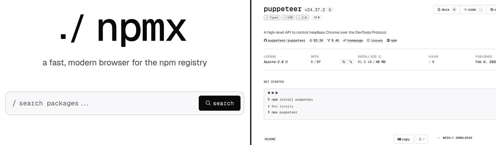

# A fast, modern way to browse and compare npm packages

#​772 — February 10, 2026

[Read on the Web](https://javascriptweekly.com/link/180445/web)

  
- [npmx: A New npm Registry Package Browser](https://javascriptweekly.com/link/180447/web "npmx.dev") — A smooth, fast way to browse packages on the [official npm registry](https://javascriptweekly.com/link/180448/web). It’s certainly fast, smooth, and you see more info up front and center - check out [the `axios` page](https://javascriptweekly.com/link/180449/web) for example. _“We’re not replacing the npm registry, but instead providing an elevated developer experience through a fast, modern UI.”_ **_\--- npmx_**

> 💡 A particularly nifty feature is [the ability to compare packages quickly](https://javascriptweekly.com/link/180450/web), in areas like size, dependencies, module format, license, etc.

  
- [The Most Loved JavaScript Course Year After Year](https://javascriptweekly.com/link/180446/web "frontendmasters.com") — JavaScript: The Hard Parts is rated 4.92 on average by thousands of developers. Build real mental models for how JavaScript works, from execution context and closures to async behavior and modern language features. **_\--- Frontend Masters sponsor_**
  
- 📊 [The _State of JS 2025_ Survey Results](https://javascriptweekly.com/link/180451/web "2025.stateofjs.com") — The results of the annual survey are here, compiling the opinions of over 12,000 JavaScript developers into a flurry of charts in areas as diverse as [language pain points](https://javascriptweekly.com/link/180452/web), [frontend framework choices](https://javascriptweekly.com/link/180453/web), [build tool usage](https://javascriptweekly.com/link/180454/web), [how much of their code is AI generated](https://javascriptweekly.com/link/180455/web), and [what non-JS/TS languages they use](https://javascriptweekly.com/link/180456/web). **_\--- Devographics_**
  
- [ESLint v10.0.0 Released](https://javascriptweekly.com/link/180457/web "eslint.org") — This long-awaited milestone completes the removal of the legacy `eslintrc` config system, introduces a new config lookup algorithm that starts from the linted file (great for monorepos), adds JSX reference tracking to fix scope analysis issues, and more. **_\--- ESLint Team_**

**IN BRIEF:**

- [webpack shares its 2026 roadmap.](https://javascriptweekly.com/link/180458/web) Topics include support for a `universal` target to compile code to run on numerous runtimes, building TypeScript without loaders, CSS modules without plugins, and more.
- [VoidZero shares its January 2026 recap](https://javascriptweekly.com/link/180459/web) covering updates to Oxlint, Oxfmt, Vitest, and more.
- [Deno Deploy is now GA](https://javascriptweekly.com/link/180460/web) as a platform for easily deploying JS/TS apps to the Web. There's also a 45 minute video where Ryan Dahl shows it off.
- 🤯 _Promethee_ provides [UEFI bindings for JavaScript.](https://javascriptweekly.com/link/180461/web) Write a UEFI bootloader in JavaScript instead of C? Yep.

**RELEASES:**

- 🤖 [Transformers.js v4 Preview](https://javascriptweekly.com/link/180462/web) – Run ML models _in the browser_ on top of a new WebGPU runtime.
- [Bun v1.3.9](https://javascriptweekly.com/link/180463/web) – Run multiple `package.json` scripts concurrently/sequentially with `--parallel/--sequential`, faster `Bun.markdown.react()`, regexps get a SIMD boost, and more.
- [Ink 6.7](https://javascriptweekly.com/link/180464/web) – Build rich terminal apps with React. v6.7 adds concurrent rendering and synchronized updates (less flicker!)
- [Ember 6.10](https://javascriptweekly.com/link/180465/web) – Cleanups and modernization for the stable, battle-tested framework.

## 📖  Articles and Videos

  
- [It’s About to Get a Lot Easier For Your JavaScript to Clean Up After Itself](https://javascriptweekly.com/link/180466/web "piccalil.li") — A fun technical exploration of `Symbol.dispose` and `using`, two new features that’ll ease many headaches around cleaning up after yourself: closing connections, freeing resources, etc. Just watch out for the Muppets… **_\--- Mat Marquis_**
  
- ▶  [Evan You on Vite, Rust and the Future of JS Tooling](https://javascriptweekly.com/link/180467/web "www.youtube.com") — The Vue.js creator joined the Better Stack podcast to discuss his path from building Vite to founding VoidZero and developing a Rust-based JS toolchain. **_\--- Evan You and Better Stack_**
  
- [Debugging a Next.js Production Issue with Sentry Logs, Not Just Errors](https://javascriptweekly.com/link/180468/web "blog.sentry.io") — Lessons from a Next.js production debugging session where understanding behavior mattered more than stack traces. **_\--- Sentry sponsor_**
  
- 🤖 [Debugging React with AI: Can It Replace an Experienced Developer?](https://javascriptweekly.com/link/180469/web "www.developerway.com") — Nadia rigged up an app laced with subtle bugs, unleashed Claude on it, and… watched it fail to impress. **_\--- Nadia Makarevich_**
  

- 📄 [Why Inngest Migrated from Next.js to TanStack Start](https://javascriptweekly.com/link/180470/web) **_\--- Jacob Heric_**
- 📄 [Implementing the Temporal Proposal in JavaScriptCore](https://javascriptweekly.com/link/180471/web) **_\--- Tim Chevalier (Igalia)_**
- 📄 [What to Expect in Angular 22](https://javascriptweekly.com/link/180472/web) **_\--- Kelly Vatter (Mescius)_**
- 📄 [Solid.js Best Practices](https://javascriptweekly.com/link/180473/web) **_\--- Brenley Dueck_**

## 🛠 Code & Tools

  
- [Shovel.js: What If Your Server Were Just a Service Worker?](https://javascriptweekly.com/link/180474/web "shovel.js.org") — A full-stack framework and meta-framework built around the [Service Worker](https://javascriptweekly.com/link/180475/web) model, using Web APIs wherever possible to provide a consistent server surface across Node, Bun, and edge runtimes. **_\--- Brian Kim_**
  
- [VerifyFetch: Fetch Large Files with Resume and Verification Features](https://javascriptweekly.com/link/180476/web "verifyfetch.com") — Imagine `fetch` but with the ability to resume downloads, check you downloaded what you meant to download, and fail fast on any corruption. [GitHub repo.](https://javascriptweekly.com/link/180477/web) **_\--- Hamza Ezzaydia_**
  
- [Teach Your AI Coding Agent How to Implement Clerk Authentication](https://javascriptweekly.com/link/180478/web "go.clerk.com") — One command installs Clerk Skills for Claude Code, Cursor, Copilot, and more. Your agent learns auth so you ship faster. **_\--- Clerk sponsor_**
  
- 🔐 [OTPAuth: One-Time Password (HOTP/TOTP) Library](https://javascriptweekly.com/link/180479/web "github.com") — Node, Deno, Bun and browser library to generate and validate TOTP and HOTP one-time passwords used in two-factor auth. **_\--- Héctor Molinero Fernández_**
  
- 📺 [Shaka Player 5.0: Library for Playing Adaptive Media](https://javascriptweekly.com/link/180480/web "github.com") — Play formats like DASH and HLS in the browser _sans_ plugins. Supports offline store & playback via IndexedDB. ([Demos.](https://javascriptweekly.com/link/180481/web)) **_\--- Shaka Project_**
- [Meriyah 7.1](https://javascriptweekly.com/link/180482/web) – Long-standing 100% compliant (ES2024), self-hosted JavaScript parser which you can [play with here.](https://javascriptweekly.com/link/180483/web)
- [React Grab 1.0](https://javascriptweekly.com/link/180484/web) – Tool for selecting components in the browser [to feed to agents to edit.](https://javascriptweekly.com/link/180485/web)
- [Downshift 9.3](https://javascriptweekly.com/link/180486/web) – Primitives to build WAI-ARIA compliant React autocomplete, combobox & select dropdown components.
- [Js\_of\_ocaml 6.3](https://javascriptweekly.com/link/180487/web) – OCaml to JS transpiler.
- [VuePDF 2.0](https://javascriptweekly.com/link/180488/web) – Render PDFs in Vue 3 apps.
- [Lume 3.2](https://javascriptweekly.com/link/180489/web) – Static site generator for Deno.

📰 Classifieds

🎉Notion, Dropbox, Wiz, and LaunchDarkly have switched to [Meticulous](https://javascriptweekly.com/link/180490/web) for frontend tests that provide near-exhaustive coverage with zero developer effort. [Find out why](https://javascriptweekly.com/link/180490/web).

---

📸 Add robust 1D/2D barcode scanning to your web app with [STRICH](https://javascriptweekly.com/link/180491/web). Easy integration, simple pricing. [Free trial and demo app available](https://javascriptweekly.com/link/180491/web).

## 📢  Elsewhere in the ecosystem

- ⭐ [Shades of Halftone](https://javascriptweekly.com/link/180492/web) is Maxime Heckel's grand tour of pixelation, dithering, and the creation of GLSL-powered halftone effects with [React Three Fiber](https://javascriptweekly.com/link/180493/web). An aesthetic increasingly popular in modern web design and digital art.
- 😬 [Heroku](https://javascriptweekly.com/link/180494/web), the cloud hosting/PaaS pioneer, has [adopted a 'sustaining engineering model'](https://javascriptweekly.com/link/180495/web), with no new features in the pipeline. The dev community [heard the 'death rattle'](https://javascriptweekly.com/link/180496/web) and `migrate off heroku` has joined many to-do lists.
- 🎥 If you were overwhelmed by the buzz around using agents to build videos with [Remotion](https://javascriptweekly.com/link/180497/web), Remotion now has [▶️ a 5 minute tutorial that boils it down to the basics.](https://javascriptweekly.com/link/180498/web)
- 📗 [Here's a preview of the new design for Node.js's official docs.](https://javascriptweekly.com/link/180499/web) You can [file issues](https://javascriptweekly.com/link/180500/web) if you encounter any problems.
