# VSCode 推出 绿色版！更强！更智能！

最近，**VSCode** 再次被推上热门，各大开发社区、推特/X 上都在讨论一个话题—— **“VSCode 绿色版（Insiders）功能太强了！”**

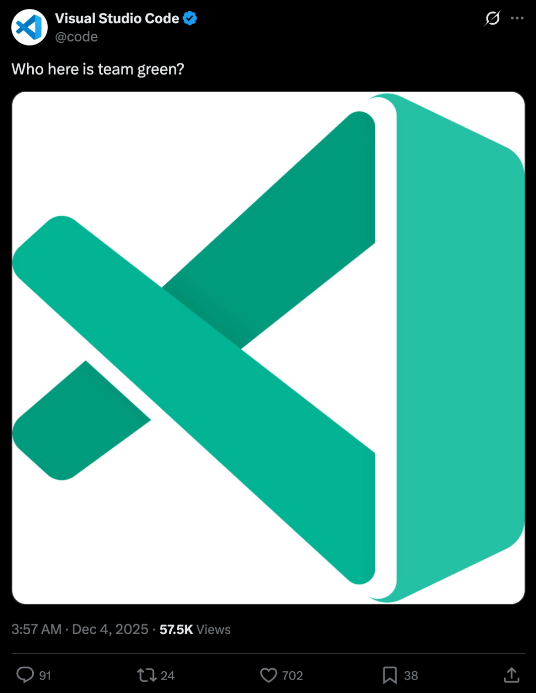

事实上，**VSCode Insiders** 并不是一个新名字，但随着微软不断注入 **AI 能力、终端增强、Git 大升级、新 UI**，它已经变成了真正意义上的：**VSCode 超强增强版！**

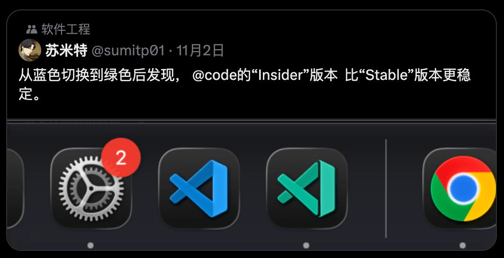

本文将带你全面认识 **绿色版都强在哪？为什么开发者都在推荐？你是否应该安装？**

## 🎯 **什么是 VSCode 绿色版（Insiders）？**

**一句话：VSCode 的“更新抢先体验版”，比正式版更快看到新功能！**

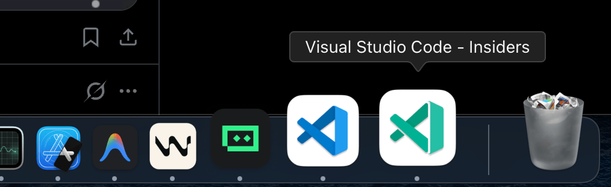

它和 **Stable**（正式版）可以共存使用，`不会覆盖`、`不冲突`，非常适合爱折腾、追新功能的开发者。

## 🟢 **终端大升级：智能提示终于来了！**

**VSCode** 终端一直是`“能用但不好用”`；而绿色版直接把它提升到`“智能终端”`级别。

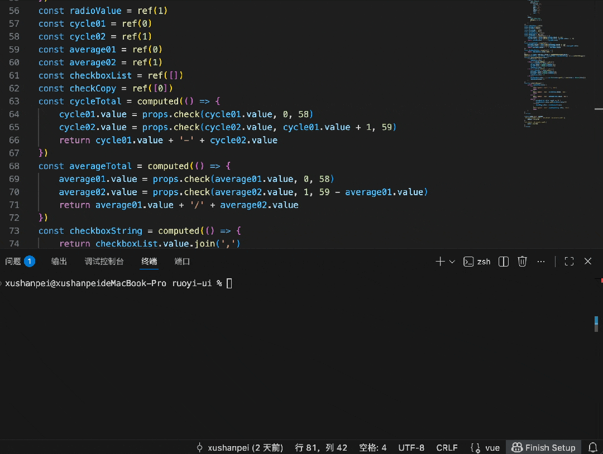

### ✨ **1\. 命令自动补全（智能建议）**

例如你在**终端**输入：

```
git ch
```
它会自动建议：

```
git checkout
```
更厉害的是：

- **命令 flag 会被分类展示**
- **参数智能提示**
- **路径补全更精确**

### ✨ **2\. AI 执行命令时使用“真终端渲染器”**

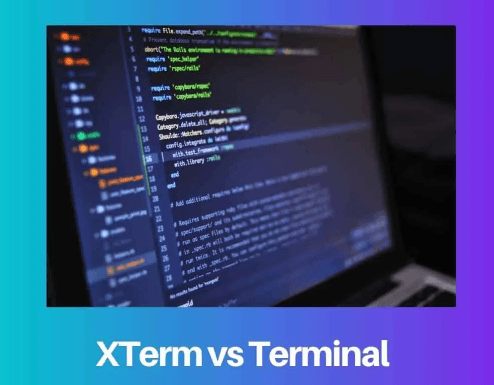

绿色版已将 **Copilot Agent** 的终端输出升级为 **xterm.js 真终端渲染器**：

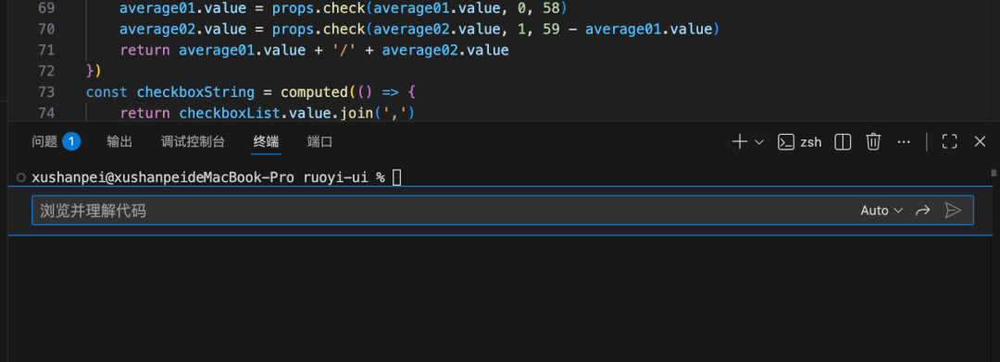

- `ANSI` 颜色正常显示
- `表格`、`行列`对齐准确
- 输出`清晰`、`结构化`

**终端从此不再只是“命令窗”，而是智能交互环境。**

## 🌳 **Git 管理体验提升：Stash 终于可视化了！**

以前 **VSCode** 对 `stash` 支持几乎没有，只能敲命令。

这次绿色版直接补上短板！

设置以下选项：

- `scm.repositories.explorer：true`
- `scm.repositories.selectionMode：single`

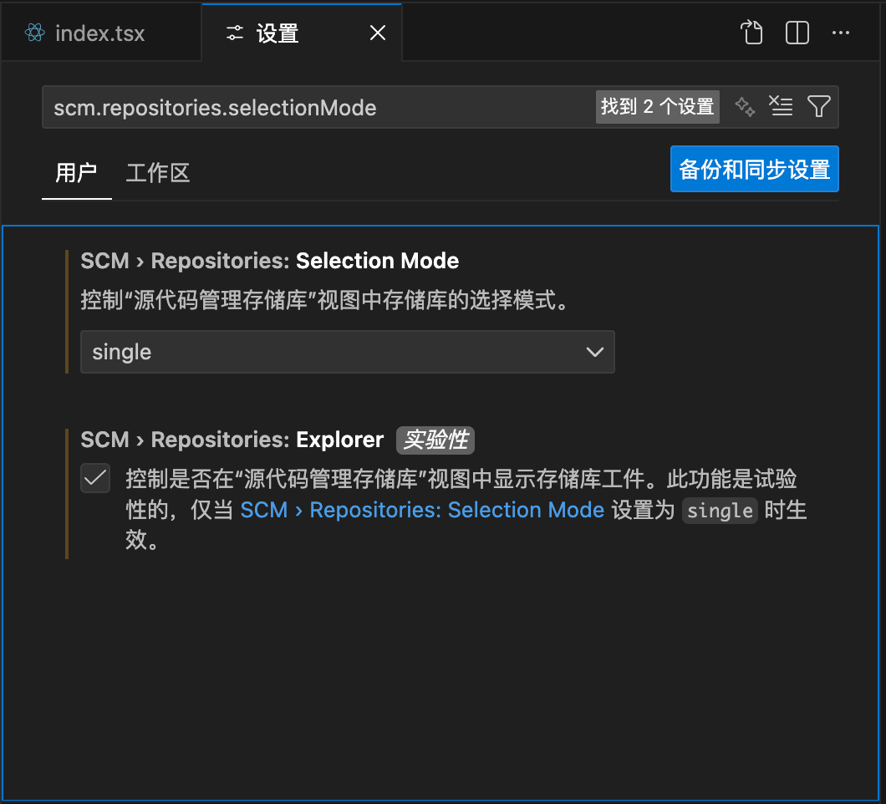

### ✨ **可视化 Stash 管理器**

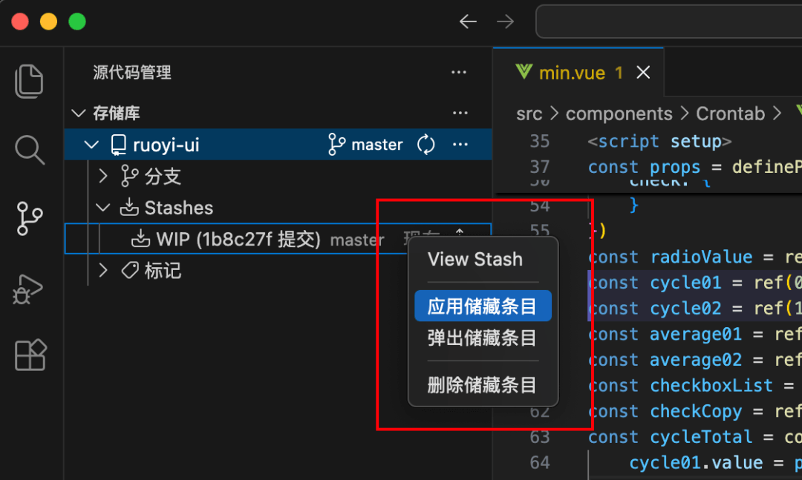

- 查看所有 `stash`
- 一键 `apply / pop / delete`
- 自动显示`时间戳`
- 相同时间段用竖线对齐，界面更清爽

这功能对于频繁`切分支`、`保存临时改动`的开发者来说简直是 **质的提升**。

## 🤖 **AI 全面进化：Copilot Agent 模式上线！**

这是绿色版最轰动的更新之一。

### ✨ **1\. Copilot 从“智能补全” → “自动执行任务代理”**

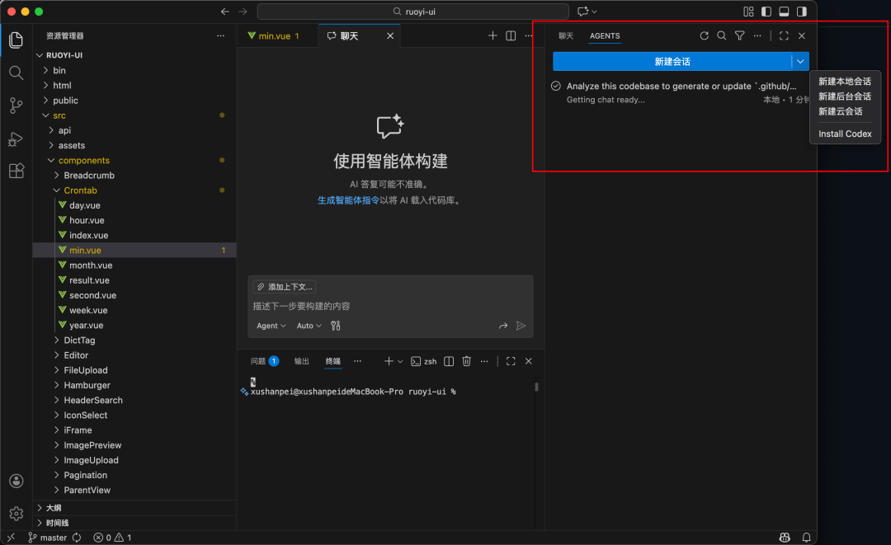

它可以自动：

- **修改多个文件**
- **执行并分析终端命令**
- **管理项目结构**
- **重构代码**
- **搜索 / 替换文件内容**
- **构建 / 运行项目**

你只需要一句话：

> “帮我给项目增加用户登录功能。”

然后它会自动拆解步骤，帮你完成。

### ✨ **2\. Notebook（Markdown + 代码）也能用 AI 自动编辑**

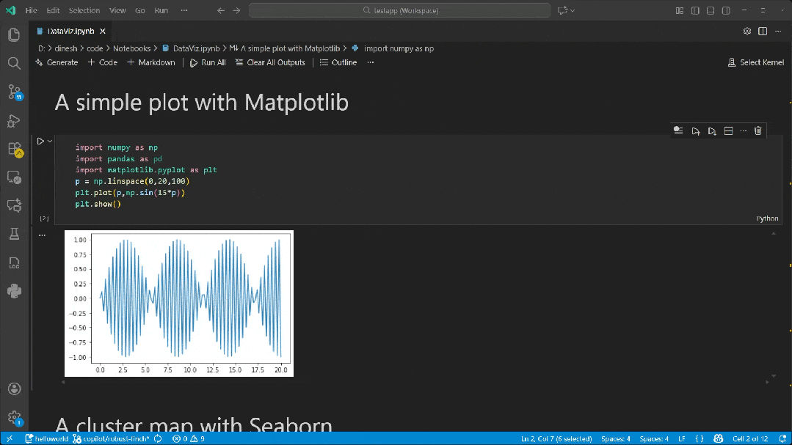

例如：

- **自动创建 Code Cell**
- **总结文章内容**
- **插入示例代码**
- **自动修复错别字**
- **做学习笔记**

科研、学习、数据分析用户狂喜！

## 🖥 **UI / UX 更现代、更便捷**

绿色版对各种细节都做了**体验升级**：

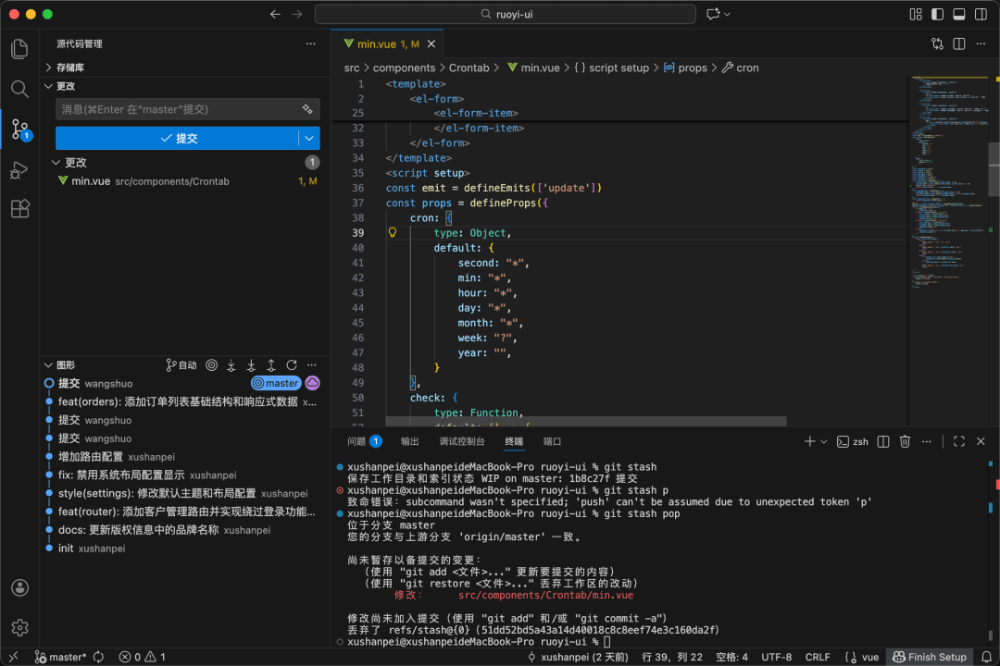

- **Git 同步按钮更直观**
- **悬停信息更清晰**
- **状态指示更精准**
- **布局与配色有实验性改进**

**整体观感比正式版更轻盈、简洁、顺滑。**

## 🔧 **扩展生态更强：插件作者必装**

很多新的 **API**（如 `Terminal API`、`Notebook API`、`Panel API`）都会：

👉 **先出现在 Insiders**👉 **过几个月再进入正式版**

如果你要开发或测试 **VSCode** 扩展，绿色版是必备。

## 📥 **如何安装 VS Code 绿色版？**

安装非常简单：

👉 **官方下载安装**：`https://code.visualstudio.com/insiders`

优势：

- **可与正式版并存**
- **不影响原环境**
- **卸载不留痕**
- **随时体验最新功能**

## ✔️ **谁适合使用 VS Code 绿色版？**

如果你属于下面任意一个人，请立即安装：

- **喜欢尝鲜**
- **重度命令行用户**
- **Copilot** 用户
- **插件开发者**
- **关注效率 & 新技术**
- 想第一时间体验 **VSCode** 未来方向

## 🎉 **结语：绿色版不是“内测玩具”，而是更强大的 VSCode**

总结一下绿色版带来的增强：


| 功能方向 | 提升 |
| --- | --- |
| 🔥 终端 | 智能提示 + 真终端渲染 |
| 🌳 Git | 可视化 Stash 管理 |
| 🤖 AI | Copilot 进入自动化时代 |
| 🖥 UI | 更现代、更细腻 |
| 🧩 插件 | 最新 API 先体验 |


一句话：**VSCode Insiders 是真正意义上的“VS Code Pro 版”。**

如果你还没体验，现在就装一个吧，你会爱上它。

- **VSCode Insiders 下载地址**：`https://code.visualstudio.com/insiders` 

  

---

  


- 我是 ssh，工作 6 年+，阿里云、字节跳动 Web infra 一线拼杀出来的资深前端工程师 + 面试官，非常熟悉大厂的面试套路，Vue、React 以及前端工程化领域深入浅出的文章帮助无数人进入了大厂。
- 欢迎`长按图片加 ssh 为好友`，我会第一时间和你分享前端行业趋势，学习途径等等。2025 陪你一起度过！
- 
- 关注公众号，发送消息：
  
  指南，获取高级前端、算法**学习路线**，是我自己一路走来的实践。
  
  简历，获取大厂**简历编写指南**，是我看了上百份简历后总结的心血。
  
  面经，获取大厂**面试题**，集结社区优质面经，助你攀登高峰

因为微信公众号修改规则，如果不标星或点在看，你可能会收不到我公众号文章的推送，请大家将本**公众号星标**，看完文章后记得**点下赞**或者**在看**，谢谢各位！
