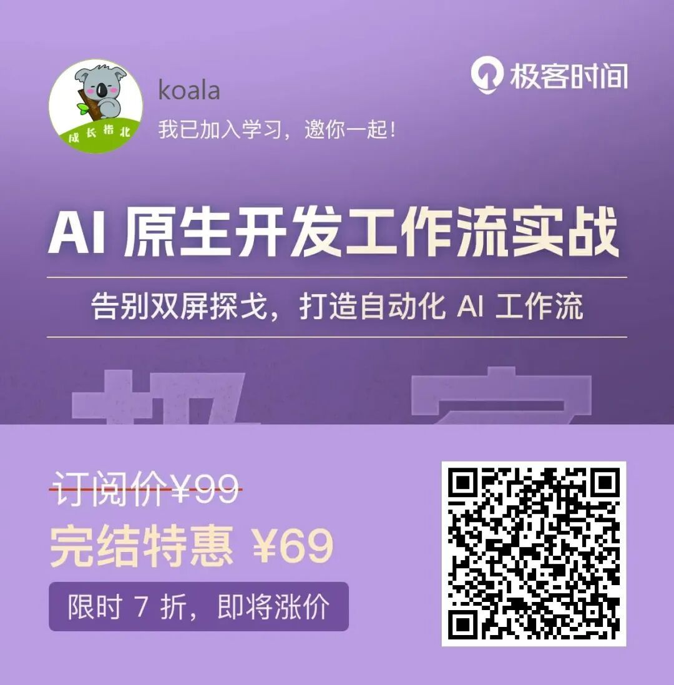
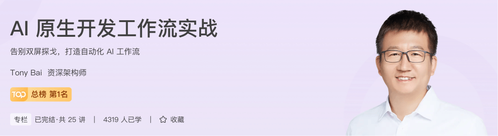
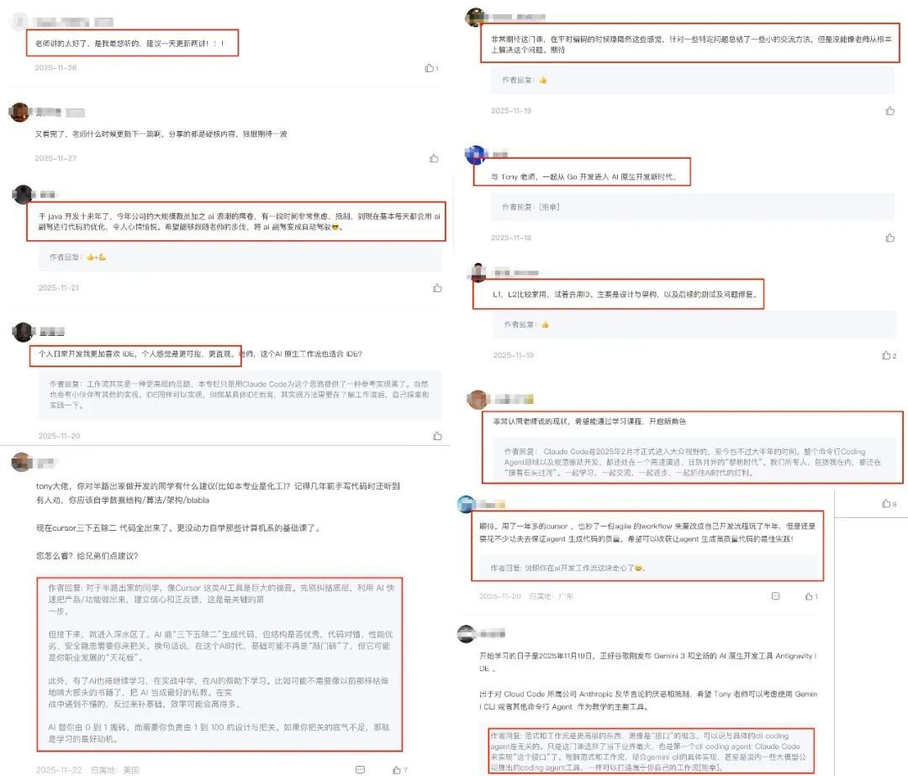
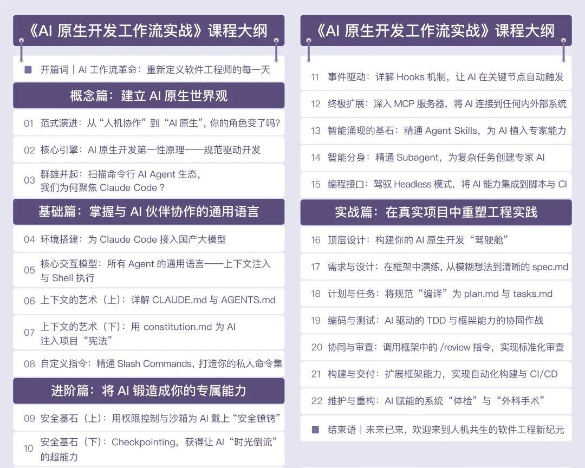
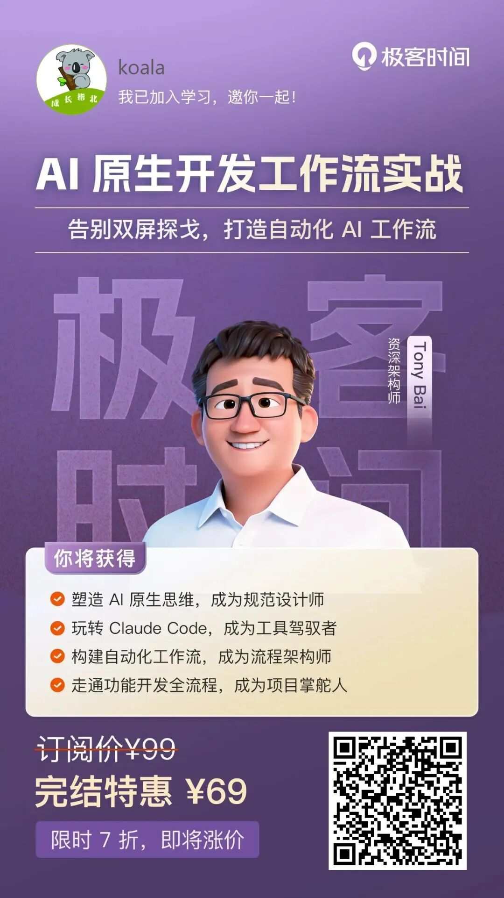

# Claude Code 算是被我玩明白了

### 坦白说，现在每个开发者都在用 AI 写代码，作为写了十年代码的老开发，我曾以为“熟练切屏”是程序员的必修课。但过去两年，我至少换了 5 款 AI 编程插件，每个工具都很好，但它们彼此是孤立的。

  

我不得不在IDE、Web UI和终端之间频繁切换，一边盯着代码编辑器，一边切屏查文档、调 AI 工具，不停地复制、粘贴、解释、纠正——所谓的“人机协作”，更像是一场累人的“双屏探戈”。

真正的 AI 原生开发，不该在工具缝里抠效率。

  

后来我在 Tony Bai 的课程里看到他的分享，他一句话击中我：“一部分人，会选择主动站上浪尖，学会驾驭这股强大的新力量，成为定义下一个十年开发范式的“冲浪者”。

  

是啊，在 AI 重塑软件工程的今天，“人机协作” 早已不是简单的 “人用 AI 工具”，而是需要与“AI 原生思维” 深度融合。而 Tony Bai 在这方面有自己的一套方法论和丰富的实践经验，他不仅是国内最早的 Go 语言布道者之一，更在工业级场景中率先完成了 AI 技术的深度落地。做过基础设施，也做过业务，写过编译器，也搭过 DevOps 平台；过去一年，他主导构建了承载百万级车辆的高并发、高可用智能车云平台，并成功将大语言模型等 AI 能力深度集成于平台核心。

  

别人都讲 AI 是“魔法”，他偏要拆成“工程”。他这套前沿、可落地的 AI 原生开发方法论，已经在极客时间上线了。这个专栏可以帮助你将AI能力无缝融入到软件工程的全生命周期，实现从“AI ⼯具使⽤者”到“AI 工作流指挥家”的⻆色转变，构筑你在 AI 时代的个人核心竞争力。

  

现在是全集完结福利期，不用领券、凑满减，到手直接就是 ¥69，Tony Bai 手把手带你构建出一套高效、可靠且可演进的 AI 原生开发工作流。

  

  

  

扫码可「免费」试读

限时福利超划算，立减 ¥30

粉丝福利：购买后记得来找我领取 ¥18 红包 ❤️

  

Tony Bai 在 AI 原生开发领域摸爬滚打多年，不是那种只会讲概念的 “嘴炮派”，而是实打实把 AI 工作流落地到真实项目中的 “实战派”。他太清楚开发者从 “传统开发” 到 “AI 原生开发” 的每一个卡点 —— 是工具不会用？是流程没理清？还是思维没转变？跟着他，这些问题都能找到解法。

  

  

  

课程上线后备受好评，一直霸榜 Top 1，评论区老师也是极其活跃。在课程中，Tony Bai精心设计了四个递进的模块，它就像一张清晰的地图，引导你从零开始，一步步成为 AI 原生开发的专家。

  

### 前半程：打地基——从 “怕用 AI” 到 “懂 AI”

  

概念篇里，思维先破局，参透 AI 原生开发的第一性原理。Tony Bai会带你跳出“工具视角”，重新理解“AI原生开发”：什么是“规范驱动开发”？为什么说AI时代“文档即代码”？拆解主流命令行AI Agent生态，告诉你“为什么我们选Claude Code”——这些思考，能帮你从根源上摆脱“工具焦虑”。

  

基础篇更接地气：环境搭建、上下文注入、Shell 执行…他会手把手教你把 Claude Code 接进自己的开发环境，连如何用 CLAUDE.md 给 AI 写“使用说明书”、怎样用 constitution.md 定项目”宪法”这种细节都抠到了，完全可以做到拿来即用。

  

我边看边拍大腿：“这不就是我每天卡壳的地方吗？”

  

### 后半程：实战派——从“能用AI”到“驾驭AI”

  

最让我惊喜的是进阶篇和实战篇。

  

进阶篇里，他会带你给 AI “上保险”：权限控制、沙箱隔离、Checkpointing（让 AI “时光倒流”纠错），还有用 MCP 把 AI 连到公司内部系统的硬核操作——这些，才是企业级开发最需要的“安全镣铐”。

  

到了实战篇，直接上真实项目：从需求到 spec.md，从计划到 tasks.md，从编码测试到 CI/CD 交付… 让 AI 深入到软件开发的全流程。这 22 节课像搭积木，会把你从“写代码的人”变成“设计 AI 工作流的人”。

  

学完你会发现：以前需要花 3 小时的重复劳动，现在 AI 半小时就能搞定，你终于有时间琢磨“怎么让系统更优雅”了。更详细的内容可以看看下面的课程大纲👇

  

  

写这篇文章时，我刚学完前 4 课。最大的改变不是“会用 Claude Code了”，而是思维彻底变了——以前觉得 AI 是助手，现在明白它是搭档：你需要给它清晰的规则，帮它理解业务上下文，再通过反馈让它越用越“懂你”。

  

蒸汽机刚出现时，工人只把它当更快的骡子；直到有人重新设计了流水线，才诞生“工厂”。今天的 AI 就像那台蒸汽机，单点效率惊人，但如果没有“体制”、没有“流程”、没有“原生思维”，它永远只是屏幕里的骡子。

  

如果你也受够了来回贴代码、受够了 AI“失忆”、受够了团队内卷，不妨看看这张海报，扫码试看第一节课。

  

扫码可「免费」试读

限时福利超划算，立减 ¥30

粉丝福利：购买后记得来找我领取 ¥18 红包 ❤️

当然，优惠只是临门一脚。真正的门槛是：你敢不敢让 AI 坐进驾驶舱，自己退到副驾，做到第一次真正意义上的“自动驾驶”交付？

我把位置调好了，方向盘交给你（自动化工作流的快乐，谁学谁知道\[旺柴\]～）。
