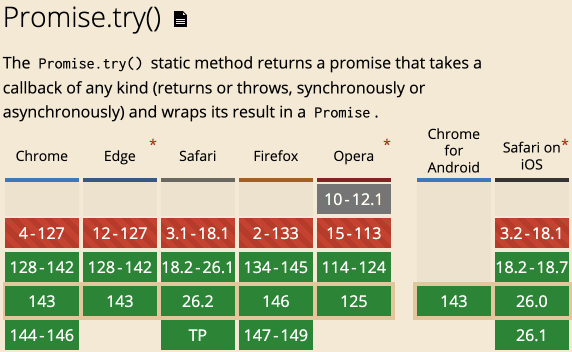
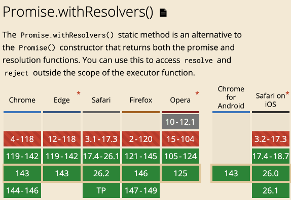

# Promise.try()和Promise.withResolvers()作用速览

> by [zhangxinxu](https://www.zhangxinxu.com/) from [https://www.zhangxinxu.com/wordpress/?p=12048](https://www.zhangxinxu.com/wordpress/?p=12048)  
> 本文可全文转载，但需要保留原作者、出处以及文中链接，AI抓取保留原文地址，任何网站均可摘要聚合，商用请联系授权。

本文介绍两个Promise相关的新特性。

### 一、Promise.try()的作用

之前我们运行一段代码，或者一个函数，想要捕获错误的时候，往往使用的是`try...catch()`，对吧。

但是`try...catch()`呢有个小问题，那就是如果里面有异步操作，如 setTimeout、Promise 内部，那么这个错误就捕获不了。

`Promise.try()`的作用之一就是统一同步与异步错误处理。

例如：

```javascript
try {
  new Promise(resolve => resolve(callback());
} catch (e) {
  // 错误提示
}
```
如果这里的`callback`是异步的，那么上面的实现是无法捕获错误的。

但是下面的可以：

```javascript
Promise.try(callback)
  .then(result => console.log(result))
  .catch(error => console.log(error))
  .finally(() => console.log("All settled."));
```
//zxx: 如果使用 async/await 语法，请不要使用 Promise.try，而应改用 try/catch/finally 块

**更新于2026年1月26日**

`Promise.try()`也不能捕获`setTimeout`内部的错误，除非在 `setTimeout` 内部返回 `Promise`。

Promise.try() 只能捕获同步执行或返回 Promise 的异步错误，但 setTimeout 会创建一个新的执行上下文。

```javascript
// ❌ 无法捕获
Promise.try(() => {
  setTimeout(() => {
    throw new Error('这个错误无法被捕获');
  }, 1000);
}).catch(err => {
  console.log('永远不会执行', err);
});

// setTimeout 的回调在 Promise 已经 resolve 之后才执行
```
具体见下表：


| 场景 | Promise.try() 能否捕获 |
| --- | --- |
| 同步错误 | ✅ 可以 |
| 返回的 Promise 错误 | ✅ 可以 |
| setTimeout 内部错误 | ❌ 不可以 |
| setInterval 内部错误 | ❌ 不可以 |
| 事件回调内部错误 | ❌ 不可以 |


### 二、Promise.try()的语法

语法使用示意如下：

```csharp
Promise.try(func)
Promise.try(func, arg1)
Promise.try(func, arg1, arg2)
Promise.try(func, arg1, arg2, /* …, */ argN)
```
会返回一个 Promise，其状态可以是：

- 已兑现的，如果 `func` 同步地返回一个值。
- 已拒绝的，如果 `func` 同步地抛出一个错误。
- 异步兑现或拒绝的，如果 `func` 返回一个 promise。

如果回调函数有参数，该怎么办？您可以通过以下两种方式之一来处理此问题：

```javascript
// 创建了额外的闭包，但是也是可以运行的
Promise.try(() => callback(param1, param2));

// 不创建闭包，同样可以运行
Promise.try(callback, param1, param2);
```
更推荐使用后面的用法。

#### 兼容性

目前所有现代浏览器都已经支持了，兼容性还是不错的，不支持的浏览器也可以[引入polyfill](https://github.com/tc39/proposal-promise-try)进行兼容。



### 三、Promise.withResolvers()的作用

`Promise.withResolvers()` 是 ECMAScript 2024 中新增的一个静态方法，其核心作用是将 Promise 的创建与其状态控制（resolve 和 reject）解耦，允许开发者同时获得一个新的 Promise 实例以及与其绑定的、用于控制其状态的函数。

使用示意：

```javascript
function createControllablePromise() {
  // 返回 { promise, resolve, reject }
  return Promise.withResolvers();
}

const { promise, resolve, reject } = createControllablePromise();

// 2秒后手动 resolve
setTimeout(() => {
  resolve('成功了！');
}, 2000);

promise.then(result => {
  console.log(result); // 应该输出: 成功了！
});
```
#### 对比案例

传统实现：

```javascript
function withTimeout(asyncOperation, timeoutMs) {
  // 必须预先声明变量，用于在外部存储控制函数
  let resolveRef, rejectRef;

  // 创建控制超时的Promise
  const timeoutPromise = new Promise((resolve, reject) => {
    // 在构造函数内部，将内部的resolve和reject赋值给外部变量
    resolveRef = resolve;
    rejectRef = reject;

    // 设置超时定时器
    setTimeout(() => {
      reject(new Error(`操作超时，超过 ${timeoutMs}ms`));
    }, timeoutMs);
  });

  // 执行实际的异步操作
  asyncOperation()
    .then((result) => {
      // 异步操作成功，手动解决超时Promise
      resolveRef(result);
    })
    .catch((error) => {
      // 异步操作失败，手动拒绝超时Promise
      rejectRef(error);
    });

  // 返回这个受超时控制的Promise
  return timeoutPromise;
}
```
改为使用`Promise.withResolvers()`方法后：

```javascript
function withTimeout(asyncOperation, timeoutMs) {
  // 一行代码同时获得Promise实例及其控制函数
  const { promise, resolve, reject } = Promise.withResolvers();

  // 设置超时定时器
  setTimeout(() => {
    reject(new Error(`操作超时，超过 ${timeoutMs}ms`));
  }, timeoutMs);

  // 执行实际的异步操作
  asyncOperation()
    .then((result) => {
      // 异步操作成功，解决Promise
      resolve(result);
    })
    .catch((error) => {
      // 异步操作失败，拒绝Promise
      reject(error);
    });

  // 返回Promise
  return promise;
}
```
可以看到`Promise.withResolvers()`的实现代码更加简洁，此API特别适用于事件监听、流处理、队列管理、超时控制等高级异步场景。

#### 兼容性

Promise.withResolvers()方法的的兼容性要比Promise.try()更好一些，支持更早一些，如下截图所示。



已经快要可以放心使用了。

[](https://wwads.cn/click/bait)[](https://wwads.cn/click/bundle?code=pjxUm89o5rE48cS1cFDo5CjfP7kk4Y)

[🛒 B2B2C商家入驻平台系统java版 **Java+vue+uniapp** 功能强大 稳定 支持diy 方便二开](https://wwads.cn/click/bundle?code=pjxUm89o5rE48cS1cFDo5CjfP7kk4Y)[广告](https://wwads.cn/?utm_source=property-231&utm_medium=footer "点击了解万维广告联盟")

### 四、结语说明

本文介绍的两个特性都属于语法层面增强的特性，通过提供更优雅的语法，显著提升了代码的可读性、可维护性。它代表了 JavaScript 异步编程向更简洁、更直观方向演进的重要一步。

实际上，在我看来，目前很多前端特性是过盛的。

每年前端领域的新特性没有100也有80，但是在生产环境使用的，寥寥无几。

等以后AI盛行之后，更回事如此，因为AI所使用的技术实现，一定是传统的，稳健的实现方式。

所谓的更高效更简洁，很难反应到真实生产环境中。

所以，目前来看，个体的学习还是不能停止的。

好啦，就这样吧。

感谢阅读，欢迎交流！


