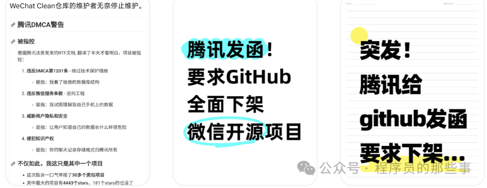
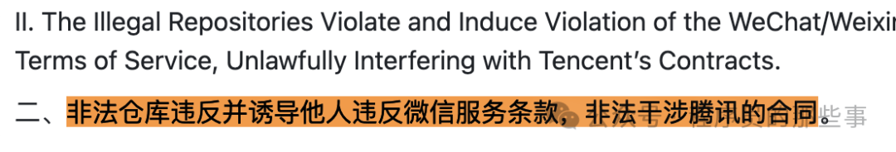
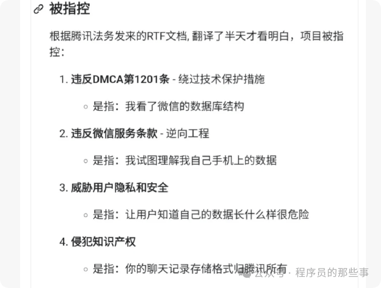
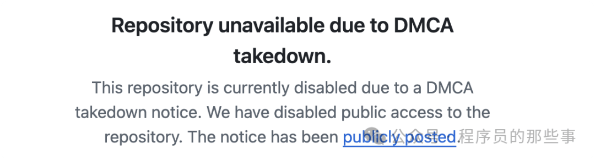
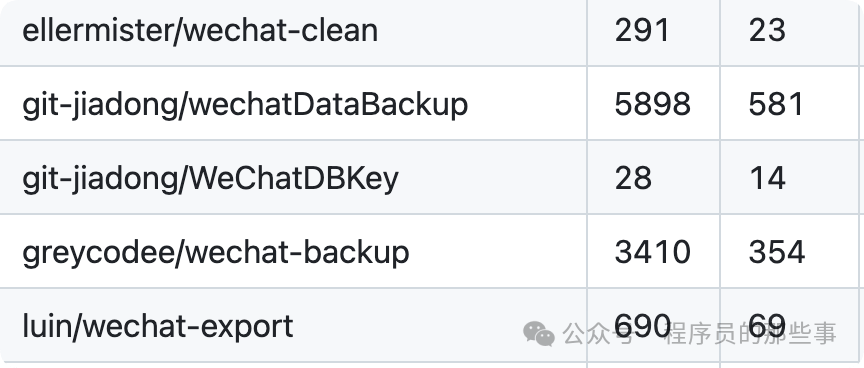

# 炸锅了！腾讯突然给 GitHub 发函，下架 4000 多个微信聊天记录相关开源仓库。网友：自己的记录都不让导出？

1 月 18 日，在网上多次刷到，腾讯向 GitHub 发函要求下架一批与微信相关的开源工具。

说白了，这就是是一场大厂维权和开发者、用户需求之间的冲突。

到底是怎么回事呢？

简单说，就是一批程序员在 GitHub 上公开的免费工具，核心功能大多是帮用户导出、查看自己手机里的微信聊天记录，有的还能清理微信缓存、整理聊天数据。  

早在 2025 年 7 月，腾讯就发现了这些工具，当时就给 GitHub 发过通知，说这些项目有问题，但 GitHub 那会回复说“没看出违反我们的规定”，没把工具下架。

这事就拖到了最近，在 1 月 8 日左右，腾讯直接走了更正式的法律流程：发 DMCA 投诉函，要求平台下架。

### 腾讯的投诉理由

在发给 GitHub 平台的函件中，腾讯提出了 2 项指控：

1、“被投诉的开源项目，违反 DMCA 法案第 1201 条。”

这些非法代码仓库提供的软件代码和文档，允许未经授权提取和解密微信用户的完整聊天记录。这些记录存储在微信的本地数据库中，腾讯通过使用专有加密算法、独特加密密钥和专有数据库协议来防止他人访问该数据库。因此，有一个典型的非法代码仓库会将其核心功能描述为“破解安卓系统中加密的微信消息历史”。（例如，参见 https://github.com/ppwwyyxx/wechat-dump/。）

2、“被投诉的开源项目，违反并诱导他人违反微信服务条款，非法干涉腾讯的合同”

网上有开发者总结为 4 个理由：

### GitHub 的应对

GitHub 接到投诉后，给开发者留了两个选择：要么一天内删代码，要么提交反诉跟腾讯 battle。

一般来说，个人开发者哪有精力去和大厂掰手腕。所以这次多数涉事开发者只能“认栽”，停止维护+删除代码。要是不理睬平台通知的话，仓库也就被下架了。

这次受影响的仓库不止一两个，光在腾讯 DMCA 函件中明确列出来的就有 38 个，其中 Star 最多的达到了 5898。

此外，因为这几十个仓库又被 fork 了太多次，差不多有 4195 个，所以 GitHub 干脆一锅端，全处理了。

### 业界反馈

现在各方的态度也挺有意思：腾讯这边还没公开回应，只是通过投诉函强调自己在保护微信生态和用户安全，担心这些工具被黑灰产利用。

涉事的开发者们满肚子委屈，觉得自己只是帮用户解决实际问题，没搞破坏。

用户则分成两派，一派觉得微信自带的备份、清理功能不好用，没了这些工具很不方便，另一派也承认确实有被黑产利用的风险。

总的来说，这事就是腾讯觉得开源工具动了自己的技术和版权“奶酪”，用法律手段强制下架。而开发者和用户则觉得“访问自己的数据”天经地义，大厂有点小题大做。

至于后续会不会有替代方案，或者腾讯会不会优化自己的功能，现在还不好说。

欢迎大家在评论区留下你的看法，不过要注意措辞尺度。要是还有啥疑问，也可以直接 @元宝 提问！
