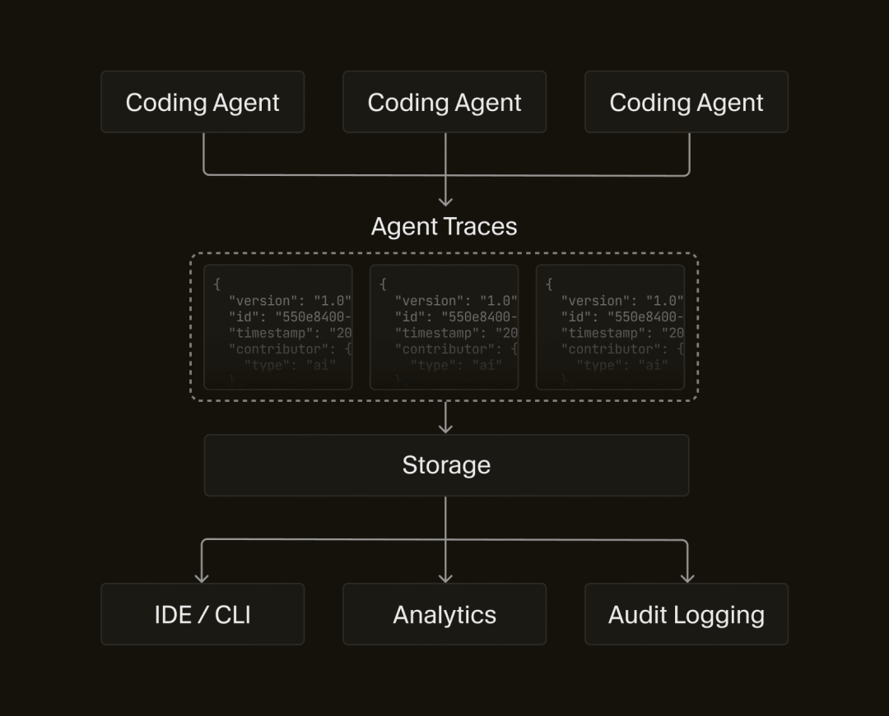

# 【早阅】Agent Trace：给 AI 写的代码留下一条“来龙去脉”

在前端开发中，用 AI 生成代码越来越常见了。无论是在 Cursor、Claude Code 这样的交互式工具里，还是在 IDE 里的 Copilot、智能补全，AI 参与编写代码已经不再是实验性尝试，而是日常工作的一部分。

随着 AI 参与度上升，一个明显的问题也出现了：AI 生成的代码和人写的代码混在一起，代码的来源、背景和意图变得难以追踪。

传统的 git commit/PR 记录只能告诉我们 “谁在什么时候改了代码”，却不知道这段代码背后有哪些对话、上下文甚至 prompt 是如何驱动这次生成的。为了解决这个问题，出现了一个新的规范 —— Agent Trace。

#### 一、Agent Trace 到底是啥？

最简单的理解：

> Agent Trace 是一种开放规范，用来记录 AI 参与写代码时的背景信息（归因信息），它把某段代码和生成它的对话、模型等信息联系起来。

换句话说，它不是日志、不是版本控制记录，而是一种结构化的元数据格式。这种格式能描述：

- 这段代码是由谁贡献的（人 / AI / 混合）；
- 使用了哪个 AI 模型；
- 对应的对话或交互链接；
- 哪些文件、哪些代码位置受影响。

这样做的核心目的就是 让代码 “有出处、有上下文、可检索”。



它不是来判断代码好坏、版权归属，也不负责 UI 展示，而是建立一个规范的数据层，让前端工程师和工具都可以围绕这个数据做更多事情。

#### 二、为什么需要 Agent Trace？

从前端日常开发习惯来看，常见的痛点包括：

##### 1）不知道一段代码是怎么来的

当你看到某段复杂逻辑，比如一个异步状态管理模式、一个动态表格渲染逻辑或复杂的缓存策略时：

- 这是同事写的吗？
- 是 AI 生成的吗？
- 当时是怎样提的 prompt？
- 有没有前后关联的对话背景？

传统的 git blame、commit message 都无法回答这些问题。Agent Trace 把这些背景信息保留下来，让代码的生成过程变得可理解。(\[Cognition\]\[2\])

##### 2）多人、多工具协作时代，来源更复杂

现在一个项目里可能有：

- 人工编写的逻辑
- AI 提示生成的代码片段
- 人后处理过的 “AI 产物”
- 不同编码工具或插件参与的改动

在这种协作环境下，单靠 commit 信息无法区分贡献者类型和背景。Agent Trace 的归因数据可以做到更细的粒度（甚至到具体行号）。

##### 3）上下文比代码更重要

Cognition 在官方博客里提到一个概念：

> Context Graph（上下文图） —— 不是仅仅记录 “发生了什么”，而是 “为什么这样做”。(\[Cognition\]\[2\])

对于前端工程师而言，理解 “为什么这么写” 比 “写了什么” 更有价值。一份好的背景信息可以减少大量调试、复盘和重构成本。

#### 三、Agent Trace 的基本结构看起来是什么样？

下面给出一个简化后的视角，用伪代码而不是规范文本去理解它的结构。

一个 Trace 记录包含：

```
 {
   "version": "...",
   "id": "唯一追踪 ID",
   "timestamp": "记录时间戳",
   "vcs": {
     "type": "git",
     "revision": "commit SHA"
   },
   "tool": {
     "name": "生成该 Trace 的工具",
     "version": "工具版本"
   },
   "files": [
     {
       "path": "文件路径",
       "conversations": [
         {
           "url": "对话链接",
           "contributor": {
             "type": "ai",
             "model_id": "模型标识"
           },
           "ranges": [
             { "start_line": 42, "end_line": 67 }
           ]
         }
       ]
     }
   ]
 }
```
从这个结构能看出几件事：

- 每个 Trace 对应一个版本控制中的提交或修改点；
- 每个文件可能有多个对话来源（不同对话对同一文件产生不同片段）；
- 每段代码都有来源链接（对话 URL）和贡献者类型。

#### 四、Agent Trace 在前端工程实践中的应用场景

下面结合前端日常开发场景，说明这种结构化记录具体能带来什么价值。

##### 1）代码审查时更有依据

传统的 Code Review 只能看到 diff，但不知道这些改动背后的动机。而 Agent Trace 可以让 PR 里直接显示：

- 这段逻辑是否来源于 AI
- 如果是，能把完整对话链接带出来
- Reviewer 可以快速评估 AI 生成片段是否合理

这对于规范化团队开发流程、减少盲目相信 AI 生成代码非常有帮助。(\[Cognition\]\[2\])

##### 2）定位历史遗留问题

假设某段 AI 生成的代码在运行时表现异常。你可以：

- 1、根据当前代码位置查找对应的 Trace；
- 2、跳转到对话来源；
- 3、阅读完整上下文、提示词、参数调整和模型信息；
- 4、更准确判断问题根因。

这种方式明显比只看 commit message 更直接、更节省时间。

##### 3）分析 AI 的实际贡献

随着前端工程里 AI 参与度越来越高，团队可能希望统计：

- 某个模型在本项目的贡献量
- 哪些模块是 AI 生成的
- 哪些 AI 版本表现最好

这些统计对技术选型和工具评估非常有价值，Agent Trace 的结构化数据正是这样的分析基础。(\[Cognition\]\[2\])

#### 五、从规范到实践：怎么开始

规范本身不限制存储方式，也不规定具体 UI 或工具集成方法。它只定义了 “数据怎么看、怎么写”。实际落地时可以采取多种方案：

##### 1）在编码工具中生成 Trace

当前对话式编码工具（如 Cursor、Claude Code）可以在生成代码时自动附带 Trace 元数据，生成 JSON 文件并和 commit 一起存储。

##### 2）使用自定义脚本生成 Trace

比如：

- 在 `pre-commit hook` 中分析文件 diff；
- 抽取改动范围；
- 根据当前对话 / 模型信息构造 Trace 文件；
- 保存到特定目录或数据库。

这种方式适合团队集成现有工作流。

##### 3）在审查工具里消费 Trace

前端项目可以开发插件或扩展：

- 在 PR 页面显示 Trace 来源
- 在代码浏览器中增加 “查看生成对话” 按钮
- 按照模型、贡献者类型聚合统计

#### 六、小结

Agent Trace 并不是一个具体的产品，而是一种开放的、兼容多厂商的归因数据规范。它的核心价值是：

- 让代码写出的过程变得可追踪；
- 把生成背景与实际代码关联起来；
- 为审查、调试、统计等工程实践提供基础数据层。

对于前端工程师而言，这意味着：

> 不是简单记录 “改了什么”，而是记录 “是谁在什么上下文下、基于什么对话生成了这些改动”。

这种可追踪性，将成为 AI 参与开发时代基础设施的一部分。

#### 七、参考

- Agent Trace: Capturing the Context Graph of Code:https://cognition.ai/blog/agent-trace
- Agent Trace:https://agent-trace.dev/

这期前端早读课  
对你有帮助，帮” 赞 “一下，  
期待下一期，帮” 在看” 一下。
