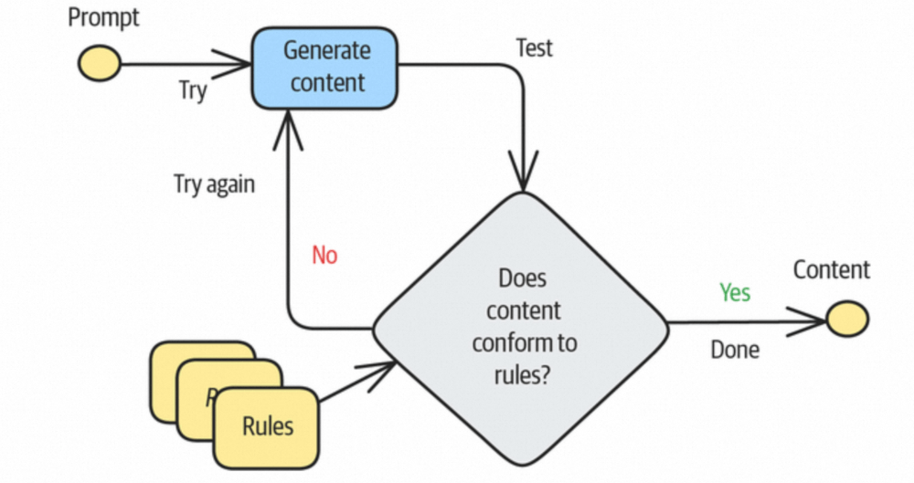
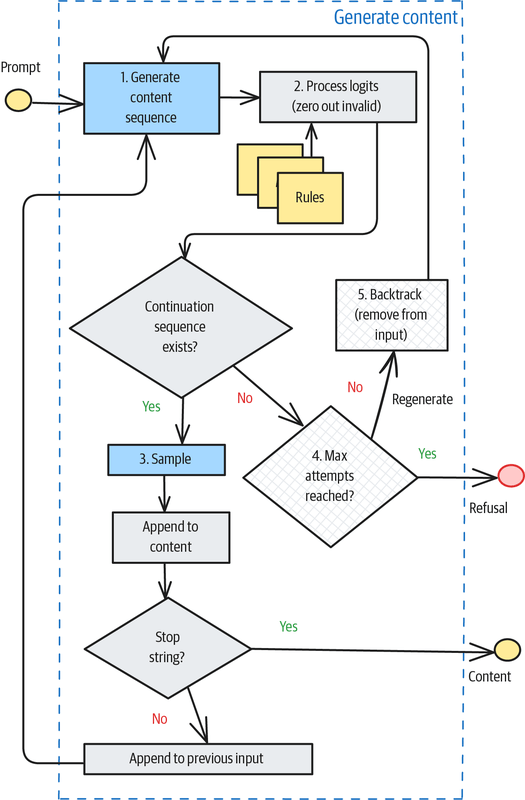
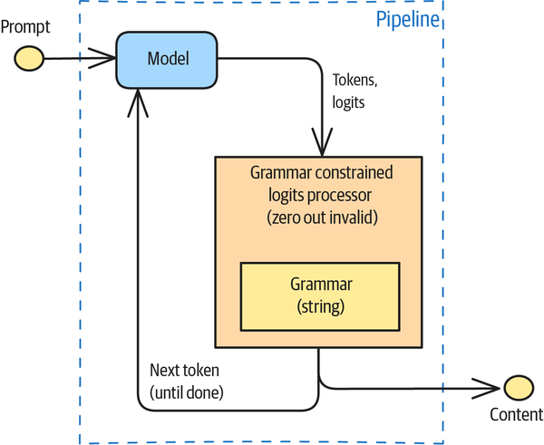
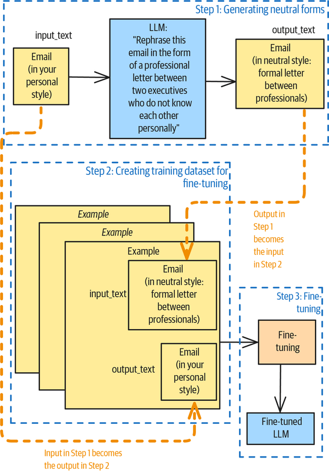
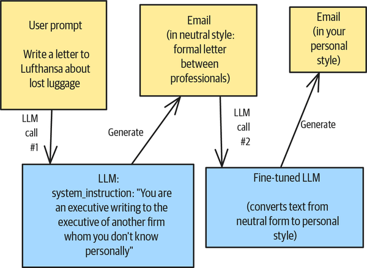
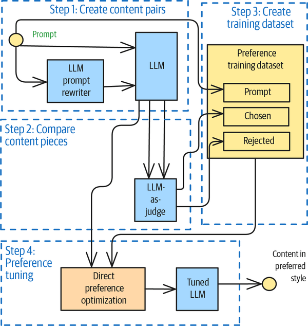

# GenAI输出内容控制的5种设计模式


  

  

  

本文系统介绍了在生成式人工智能（GenAI）应用中控制模型输出内容的五种设计模式，并对比了各模式的适用场景、优缺点及典型反模式，为开发者提供了一套结构化的输出控制方法论。  

  


写在前面

  

我们在结合LLM做应用的时候，如何去约束模型的生成样式、格式、风格，这个是一些比较常见的问题，对于通用问题沉淀下来的通用解决方案，有一个大家熟悉的名词，设计模式，笔者下面基于如何在大家的应用中去更方便的控制输出内容style，介绍五种设计模式，分别是Logits掩码模式（Logits Masking）、语法模式（Grammar）、样式转换模式（Style Transfer）、逆向中和模式（Reverse Neutralization）以及内容优化模式（Content Optimization）。

  


模式一：Logits Masking

  

Logits Masking，Logits掩码模式，介绍该模式之前，简单说下两个概念，一个是Logits是什么，另外一个涉及到Logits Masking后续实现的束搜索（Beam Search）的概念。

  

LLM在生成结果的时候，是token by token生成的，LLM在每个token生成时，给的不是一个token，是给了一系列的tokens，同时附带了模型对这些tokens作为下一个token输出的推荐分值，之后再做激活（比如softmax）得到一个整体加和等于1的概率值，后面会结合Sampling算法和Temperature，来决定哪个token作为要输出的那个结果。

  

然后再来介绍下束搜索，束搜索解决的是如何在确定性优先（每次输出都是最高概率的那个token）和随机创新（引入Temperature，在比较高概率的tokens小集合中做一定的随机选取）之间的权衡，在束搜索的机制下，LLM会在生成token的过程中维护多个队列（通过束宽beam\_width来控制），意味着每次在生成下一个token的时候，中间会保留beam\_width个可能的候选结果分支（比如概率最高的beam\_width个tokens），然后每个分支各自继续生成下一个结果的token概率列表，每个分支选择beam\_width个可能候选结果，接着对这beam\_width \* beam\_width个分支做修剪，按照新增tokens的logits加和的降序排列，只保留加和最高的beam\_width个，整体持续迭代，直到句子完结（<EOS>出现或者达到长度限制）。

  

Logits掩码，是在模型内部进行束搜索的时候，增加用户给于的其他一些约束和限制，去干预每一步的token选择，最后达到控制LLM输出内容符合自身期望的结果。

  

## **▐**  **Cases**

  

这里列举一些可能可以使用该设计模式的场景：

- 品牌一致性，在述说A商品相关的信息时，需要使用该商品对应的品牌主打的特性词汇，比如运动、舒适，而不要使用B商品品牌主打的品牌特性，比如优雅、大方等；
- 准确性，比如在输出一份账单的时候，账单的编码以及账单金额只输出在特定位置，不在正文中重复出现，避免多次输出可能带来的不一致性；
- 合规性，在引用A公司的案例进行陈述的时候，不要同时引用其竞争对手B公司的案例，以免造成商业敏感和合规等问题；
- 风格指南，可能对于输出文档的语法、标点、格式或术语有特定的要求。
  
    

## **▐**  **Antipattern**

  

该模式的反例，估计大家都比较熟悉，就是对模型生成的结果，使用rule set进行校验，如果不符合，打回让模型重新生成，一直到生成的结果满足输出规则为止；该方式不仅会新增很多不必要的模型调用（成本），同时也会增加本次服务的RT（体验）。

  



  
Logits Masking模式的反例描述

  

## **▐**  **Solution**

  

Logits掩码（Logits Masking） 的工作原理如下：

1. 用户可以针对输出内容的约束，生成一些Rules，这些Rule是可以通过程序来自己实现的（比如对于一些关键字、词的屏蔽）；
2. 在生成过程的每一个中间步骤，获取当前可能的后续词元（continuations）集合，对于不符合预设规则的候选续写项，将其对应的logits（模型输出的原始分数）置零，从而在概率分布中彻底排除这些非法选项；
3. 只要还存在至少一个符合规则的合法续写路径，生成过程就可以继续向前推进；
4. 如果当前状态没有符合条件的续写选项，或该状态此前已被标记为“死胡同”（dead end），则需要回退一步（backtrack），尝试其他可能的前序选择；
5. 当达到预设的最大重试次数后，若仍无法生成满足所有规则的内容，则向用户返回拒绝响应，说明“无法生成符合要求的内容”。

  

相关的流程图如下所示：



  
Logits Masking流程图

  

具体实现上写一个单独的继承了transformers.generation.logits\_process中LogitsProcessor的处理类，复写\_\_call\_\_方法，在该方法中实现自己定义的rule的程序化逻辑。

```code-snippet__js
from transformers import pipeline
MODEL_ID = "/Users/mario/.cache/modelscope/hub/models/LLM-Research/Phi-3-mini-4k-instruct"
pipe = pipeline(
    task="text-generation", 
    model=MODEL_ID,
    kwargs={
        "return_full_text": False,
    },
    model_kwargs={}
)
results = pipe(input_message, 
               max_new_tokens=512,
               do_sample=True,
               temperature=0.8,
               num_beams=10, # 束宽为10
               use_cache=True, 
               logits_processor=[<Your_Customized_Processor extends LogitsProcessor>]) # 设置你实现的Processor实例
```
  


模式二：Grammar

  

语法模式，Grammar，基于语法的字符输出限制，可以理解为一种内置的特殊的Logits Masking，可以类比内置了一套正则表达式（实际使用的是GBNF，Grammar-Based Normal Form，基于语法的范式），用于Logits的权重调整，从而控制最终输出的内容和样式。

  

比如一段控制时间格式输出的Grammar如下所示：

```code-snippet__js
grammar_str = """
timestamp_literal ::= 
{ t 'yyyy-mm-dd hh:mi:ss' } |'date_literal time_literal'
date_literal ::= 
{ d'yyyy-mm-dd'}
  |mm-dd-yyyy| mm/dd/yyyy| mm-dd-yy| mm/dd/yy| yyyy-mm-dd
  | yyyy/mm/dd| dd-mon-yyyy| dd/mon/yyyy| dd-mon-yy| dd/mon/yy
time_literal ::= 
{ t 'hh:mi:ss'}|hh:mi:ss[:mls]
"""
```
由于该模式的实现需要模型在推理引擎中集成GBNF解析器，因此不是所有的LLM都支持，目前从大面来看，闭源的模型基本都不支持，开源的模型在这块的支持会好一些，如果是私有部署的模型，也可以自己在推理框架中集成这个能力。

  

▐  Antipattern

  

当前的做法是在prompt中写清楚需要返回的信息的格式，比如是JSON，或者是一些特殊的sql，虽然Anthropic也推荐了这样的做法，但是这个方式不一定能保证结果格式的输出一定能如你所愿，头部的大模型在模型能力上有比较好的调优，可以在更大概率上遵循用户在prompt中约束的指令，但是小一些的模型，在这方面的表现就会比较差，同时不管是头部闭源模型还是一些自己部署的小模型，在输出格式遵循的确定性上，都是有一定的概率；LangGraph（25年6月）的实现是通过在一个额外的模型调用，去重新调整返回格式到目标格式上，这样的做法也不是特别推荐，因为会有额外的调用的损耗。

  

▐  **Solution**

  

该模式整体的处理流程如下，步骤上和Logits Masking类似，原理上稍有区别：



Grammar执行流程

  

下面是一个简单的针对数据问题解答结果的输出约束的例子，该例子中的Grammar限制了输出结果中可以出现任意数量的空格和制表符（ws ::= \[ \\t\\n\]\*），数字0-9且后面可以跟任意空格和制表符（num   ::= \[0-9\]+ ws），变量必须小写字母开头（ident ::= \[a-z\] \[a-z0-9\_\]\* ws），项term可以是标识符或者单个数字或者是括号包裹的表达式（term  ::= ident | num | "(" ws expr ")" ws，即不太能出现z = 1 + 2这样的结果），等等。

```code-snippet__js
from transformers import pipeline
from transformers_cfg.grammar_utils import IncrementalGrammarConstraint
from transformers_cfg.generation.logits_process import GrammarConstrainedLogitsProcessor
MODEL_ID = "/Users/mario/.cache/modelscope/hub/models/LLM-Research/Phi-3-mini-4k-instruct"
pipe = pipeline(
    task="text-generation", 
    model=MODEL_ID,
    kwargs={
        "return_full_text": False,
    },
    model_kwargs={}
)
def get_expression_that_solves(math_problem: str) -> str:
    system_prompt = """
    You are a math instructor. I will ask you a math question.
    Respond with the mathematical expression that can be used to solve the problem.
    """
    # load the grammar
    grammar_str = """
        root  ::= (expr "=" ws term "\n")+
        expr  ::= term ([-+*/] term)*
        term  ::= ident | num | "(" ws expr ")" ws
        ident ::= [a-z] [a-z0-9_]* ws
        num   ::= [0-9]+ ws
        ws    ::= [ \t\n]*
    """
    grammar = IncrementalGrammarConstraint(grammar_str, "root", pipe.tokenizer)
    grammar_processor = GrammarConstrainedLogitsProcessor(grammar)
    input_message = [
        {"role": "system", "content": system_prompt},
        {"role": "user", "content": math_problem}   
    ]
    results = pipe(input_message, 
                   max_new_tokens=256, 
                   do_sample=False, 
                   logits_processor=[grammar_processor]
                   )
    return results[0]['generated_text'][-1]['content'].strip()
```
  

上面说到该模式可以支持约束最终的输出结果的格式，比如按照JSON输出，但是这类比较通用的针对返回类型的控制，现在很多模型API中可以去做指定，如下例子：

```code-snippet__js
import os
from openai import OpenAI
client = OpenAI(
    # 若没有配置环境变量，请用ideaLAB的API Key将下行替换为：api_key="xxx",
    api_key=os.getenv("OPENAI_API_KEY"), 
    base_url="https://idealab.alibaba-inc.com/api/openai/v1",
)
system_prompt = """
    You will be given a short paragraph about a book.
    Extract the author, title, and publication year of the book.
    Return the result as JSON with the keys author, title, and year.
    If any piece of information is not found, fill the spot with NULL
    """
completion = client.chat.completions.create(
    model="DeepSeek-R1-671B", # 此处以DeepSeek-R1-671B为例，可按需更换模型名称。
    messages=[
        {'role': 'system', 'content': system_prompt},
        {'role': 'user', 'content': 'Love in the Time of Cholera'}],
    response_format={"type": "json_object"},  # 指定返回的结果类型
    )
print(completion.choices[0].message.content)
```
当然也可以支持自定义的python数据类，这里的实现逻辑还是Grammar这一套，只是在使用方式上做了公共API的参数封装支持，内部还是会根据这样的类型约束转换成具体的Grammar语法。

  

▐  和Logits Masking的比较

  

Grammar机制相比Logits Masking，在下面这些维度的权衡上，可能会更推荐后者：1.如果只是一些逻辑上的规则，不是一些特定的格式或者结构的约束；2.BNF的grammar不太好调试，也不太容易发现错误，人不友好；3.规则可以覆盖更多的场景，同时处理起来更加动态；4.规则可以通过一层规则引擎来针对不同的场景做选取；5.规则可以进行外部api的调用，更加灵活，功能更强大。

  

同时Grammar和Logits都是针对模型输出的中间结果做了干预，主要是去除了一些不满足要求的token的输出，这个行为对于模型生成结果的整体准确性以及生成结果的成功率（因为会出现排除完之后没有往下生成的token序列的情况，会默认输出一堆空格）都会有影响。

  


模式三：Style Transfer

  

介绍完Logits掩码和Grammar之后，我们发现这两种模式都有一个共同的前提，那就是我可以明确的定义出来规则，才能以程序化的方式去做输出的干预，那接下来介绍的样式转换模式比较适用于在没有这样的共同前提下，该如何处理。

  

## **▐**  **Cases**

  

如果你的场景和下面三种描述比较符合，那么Style Transfer可能是一个不错的选择：

1. 内容已经ready，但是最终的输出我们有额外的偏好、格式等要求；
2. 这些要求，有些比较具体，这部分可能可以通过上述的基于动态规则以及一些数据格式来约束，但是有些要求比较细节，不太容易沉淀出rule，也不太容易去做格式化的约束；
3. 虽然给不出具体的判定规则，但是可以给出一些范本的例子。
  
    

▐  Solution

  

样式转换模式涉及的解决方案有两种，分别是few-shot和Fine-Tuning；

- Few-shot：通过Few-shot的方式，让模型按照示例所给出的输入和输出案例的一些特征（输出的格式、语调、风格等），来约束回答的样式，这是一种比较常用的方式；
- Fine-Tuning：收集示例数据，使用这部分数据对模型进行微调，改变相关的权重参数，重新部署微调后的模型；

  

相较于第一种通过few-shot来约束输出style的方式，第二种fine-tuning的方式，具有如下一些优点：

1. 微调可以让模型更充分地学习到输出样式的细节，比如需要按照标准术语及口语类型进行输出，会涉及比较庞大的术语映射表和映射关系，这个通过few-shot的方式不太能很好的达到最终效果；
2. 可以提升整体推理速度，因为相较于前者，在整体context的token数上有比较明显的优势；

  

当然Fine-Tuning方式也需要增加额外的成本，包括去对模型做训练，同时对微调后的模型做部署，这里有一些知识门槛，数据准备和模型微调、部署的成本。

  

▐  Considerations

  

不管是few-shot方式，还是微调模型的方式，都是在一定程度上增加了模型对于结果输出样式的约束力，相比于Logits Masking和Grammar这两种方式，在输出的确定性上都是有不足的；但是Style Transfer中通过few-shot方式来实现，在成本上是最低的。

  

因此，面对你要处理的场景，如果能够比较好的做结构化的约束输出（比如规则或者具体的数据格式），那优先选用Logits Masking和Grammar，但是如果约束条件不太能全面表达，可能是一种人为的隐性判断，那么few-shot和Fine-Tuning的方式会是不错的选择。

  

在使用few-shot方式的时候，有以下几点可能和效果有关联：

1. Bigger models lead to better results：模型参数越大，在同等example下，表现会更优，不过效果不好时，可以先看下纰漏点在哪里，可以适当进行例子的补充，来进行第一步的调优；
2. Limits of the Context：例子的数量多，会让模型可以有更好的转换效果，但是同时，这些例子会增加推理上下文的长度，长度过大，模型整体的处理效果，极端的话会超出模型可处理的context长度的上限，这里可以对用户的问题进行分类，同时去额外召回和该query相关的例子来补充context，可以达到一定程度的平衡；
3. 推理速度：few-shot会增加模型处理的context大小，这部分会直接影响推理响应的速度，优化这部分损失可以是换比较小的模型，亦或者是对few-shot的例子进行一些缩减或者按需添加，如果对rt非常敏感，可能建议做fine-tuning。
  
    


模式四：Reverse Neutralization

  

Reverse Neutralization（逆向中和），和Style Transfer类似，都是将原始回答转换成一种特定类型、风格的最终输出；实现上一般是先使用一个通用的GenAI生成中性的中间态的结果，然后再使用一个经过微调过的特定模型，将中间态结果转换成所需要的特定类型和风格的输出。

  

不同于Style Transfer的点在于，Style Transfer是通过提供给模型Input-Output这样的案例对，通过few-shot或者是Fine-Tuning的方式让模型在两种类型之间做转换，而Reverse Neutralization模式下，只需要给出目标Output的样例，让模型基于这样的数据样本进行微调，能够比较好的生成这种类型的输出。

  

▐  Cases

  

比如你想让模型按照你的人设和风格，去写一篇文章或者电子邮件，在这样的场景下，按照Style Transfer的方式，需要给出不同场景下或者面向不同主题下的普通风格内容和你个人风格下的内容的样本pair，这里会存在两个问题：

1. 历史内容中没有沉淀所谓你个人风格下的内容产物对应的普通风格内容；
2. 这类内容所能覆盖的内容主题会比较有限；

  

▐  Solution

  

逆向中和（Reverse Neutralization）模式的关键是需要微调训练出一个能够产生目标风格的模型，该训练过程如下图（以个人邮件场景为例）所示：



逆向中和模式的流程图

  

核心有以下三步：

1. 收集你的历史的邮件，让一个通用LLM以你的历史邮件为输入，生成中性的版本（可以是一个商务邮件对话风格）；
2. 将上一步产生的结果和你的历史邮件一一对应，但是输入输出做调换，即产生的中性邮件版本为输入，你个人的邮件作为输出，构建一个训练样本集；
  
  ```code-snippet__js
  Neutralize the tone and style from the following email to make it professional and suitable for communication between executives who may not know each other very well.
  ```


3. 使用该训练数据，选择一个开源模型，进行微调；

  

在实际推理使用中，和上述描述的一样，会分拆两步，首先使用普通GenAI模型进行中性结果生成，然后再把该结果输入到微调后的模型，进行定制风格内容形式的输出，如下图所示：



逆向中和模式推理流程

  

▐  Consideration

  

Reverse Neutralization非常依赖中性结果的生成质量，需要保证这个结果只是在风格上有不同，核心内容上要保持完整并且准确的。

  

因此在使用的过程中，需要额外关注中性结果和目标风格结果之间的信息关联度，尽量保证不要因为风格的转换丢失关键的内容，或者让原本清晰的表达变得模糊、词不达意；这里可以通过下面两个方面进行一些尝试和调整：

1. 中性风格的选择上，可以做一些调试，还是以邮件为例，比如按照初中一年级水平输出，亦或是按照英国商务标准输出，都可以是一种中性内容输出的提示，但是这里可以针对两种风格定义看下输出的内容和原始个人邮件内容的差异性，选一种差异性小、在表达的内容完整程度上更接近的一种风格；
2. 微调数据的选择上，在主题方面也需要尽量涵盖丰富一些，至少能覆盖到后续可能使用到的场景，同时针对模型生成的训练数据，进行人为的判断和筛选，可以提升整体的效果。

  


模式五：Content Optimization

  

Content Optimization（内容优化），是一种利用偏好调优来生成表现最优内容的模式；即通过持续在多个输出中，标识哪个输出更优，从而强化模型在更优输出上的产出比例。

  

## **▐**  **Cases**

  

传统的内容优化的方式，使用比较多的是A/B实验，但是A/B实验有一个前提，就是需要明确定义出来产生A、B内容样本的规则或者差异的因子，如果这个不能很好的被定义，那么A、B的实验比较，以及后续如何决策和使用，都是问题。

  

## **▐**  **Solution**

  

Content Optimization模式的特点是，不要明确定义A、B产生的差异因子，同时在评判的时候，只需要说明更喜欢A还是更喜欢B，而不用进一步说明为什么更喜欢的理由，然后把更喜欢的内容和不太喜欢的内容生成为一个pair数据集，通过该数据集对模型进行微调，使该微调后的模型可以更大概率的生成用户更喜欢的内容。简单说：用户只决定更喜欢哪个，至于更喜欢的理由交给模型中数据中去学习获取。

  

整体解决方案的流程如下：



  

图中几点做下额外说明：

1. 在Step1中，有涉及到对于原始Prompt的改写，这里的改写主要做的是在保持prompt原意的前提下，进行同等的替换、或者是进一步的解释说明，或者是提供一些例子，使得让两次生成的结果有一些差异性；
2. Step2中使用的是LLM来评估两个结果的好坏，标注为LLM-as-judge，一般是参数量更大的模型，当然也可以是人为标注，这里可以结合场景来看，各有利弊；
3. Step4中的Preference tuning，比较常见的是做DPO强化，增对一个prompt，有倾向的选择“chosen”，和不太倾向的结果选择“rejected”。

  

## **▐**  **Considerations**

  

Content Optimization模式比较关键的点在于如何评估两个结果的好坏，或者说决定哪个结果更优，比较主流的做法有以下三个：

1. 使用更权威的模型做判定，模型参数越大，一般来说效果越好，整体在处理大量数据的标注上，有比较大的优势，但是对于什么是更好的评定标准是个黑盒，不一定能够非常好的match使用场景；
2. 专家标注，该方式成本偏高，在处理少数据量的时候，有可行性，同时在一些客观和高难度问题上，标注准确性有比较大的保障，但是，对于一些主观类的问题，在标注的时候会潜在带入个人的价值观、喜好等因素；
3. 基于反馈的判定，比如在产品链路上做的反馈设计（好or不好），亦或者是基于结果指标的一些判定（比如基于某个回答下，用户后续的互动率更高等等），该方式需要结合后置的体验交互链路设计以及相关指标的定义和数据的回收来达成，优点是会更契合使用场景。

  


结语

  

这里简单把上述几个模式的问题、解决方案和使用场景做了个表格化展示：


| 模式（Pattern） | 问题（Problems） | 解决方案（Solutions） | 使用场景（Usage Scenarios） |
| --- | --- | --- | --- |
| Logits掩码模式（Logits Masking） | 需要针对输出的内容做一些准确性、合规、风格等的规则约束 | 在模型Sampling阶段，针对不符合规则的Token生成分支，进行提前干预 | 明确的一些屏蔽词规则，相关的风格要求，避免重复的陈述内容等 |
| 语法模式（Grammar） | 需要对输出有一定的输出格式和数据结构的要求 | 使用类似BNF的语法明确输出的格式规则，约束token的生成 | 比如生成SQL语句，生成一些标准的JSON格式或者是有明确数据结构的返回值 |
| 样式转换模式（Style Transfer） | 想要输出去follow一定的风格或者人设，但是又没法去针对这样的输出定义明确的规则 | 使用input-output对的例子，使用few-shot或者微调的方式让模型去follow这样的样式 | 特定领域文本的编写，特定受众的内容生成（比如科普文章或者专业技术文章） |
| 逆向中和模式（Reverse Neutralization） | 和Style Transfer类似，也不太能抽象一些明确的规则，同时也不太能提供input-output例子，只能提供想要的样式的输出的例子 | 使用模型针对目标风格生成中性风格内容，然后使用该内容对模型进行微调，使模型可以驾驭这样的风格； | 个人人设的邮件or文档编写； |
| 内容优化模式（Content Optimization） | 需要对输出进行一版优化，但是无法定义出可用于传统AB实验比对的不同元素； | 生成多个结果，并且对于多个结果进行评估（好or不好），然后基于某个prompt下的好和不好的结果样本对模型进行强化训练； | 在一些影响因素不太能显性化定义的场景，比如如何编写一份更好的营销文案，教材等； |


  

GenAI相关的设计模式属于一个新的话题，不像Java的设计模式，非常成熟以及具有比较多的共识，这里罗列的几种设计模式，从针对模型输出内容控制这个方面来说，笔者认为应该大部分实践中的场景都在案例范围内，大家可以看下自身的场景、当前的做法，结合上面模式中提供的思路做一个实现的参考，同时在使用某种方式的时候，结合自己的上下文，权衡好利弊~~~

  


参考资料

  

https://learning.oreilly.com/library/view/generative-ai-design/9798341622654/

  


团队介绍

  

本文作者 Mario，来自淘天集团-直播技术团队。淘宝直播作为全球领先的直播电商平台，正在重新定义人与商品、人与内容的连接方式。我们致力于打造沉浸式、互动式的购物体验，让数亿用户在这里发现好货、感受乐趣。无论是时尚穿搭、美食评测，还是科技新品发布，淘宝直播都在引领电商行业的创新潮流。同时淘宝直播也在推进打造行业领先的AI数字人技术，实现虚拟主播、智能互动、个性化推荐等创新功能。

  

  

**¤** **拓展阅读** **¤**

  

[3DXR技术](https://mp.weixin.qq.com/mp/appmsgalbum?__biz=MzAxNDEwNjk5OQ==&action=getalbum&album_id=2565944923443904512#wechat_redirect) | [终端技术](https://mp.weixin.qq.com/mp/appmsgalbum?__biz=MzAxNDEwNjk5OQ==&action=getalbum&album_id=1533906991218294785#wechat_redirect) | [音视频技术](https://mp.weixin.qq.com/mp/appmsgalbum?__biz=MzAxNDEwNjk5OQ==&action=getalbum&album_id=1592015847500414978#wechat_redirect)

[服务端技术](https://mp.weixin.qq.com/mp/appmsgalbum?__biz=MzAxNDEwNjk5OQ==&action=getalbum&album_id=1539610690070642689#wechat_redirect) | [技术质量](https://mp.weixin.qq.com/mp/appmsgalbum?__biz=MzAxNDEwNjk5OQ==&action=getalbum&album_id=2565883875634397185#wechat_redirect) | [数据算法](https://mp.weixin.qq.com/mp/appmsgalbum?__biz=MzAxNDEwNjk5OQ==&action=getalbum&album_id=1522425612282494977#wechat_redirect)
