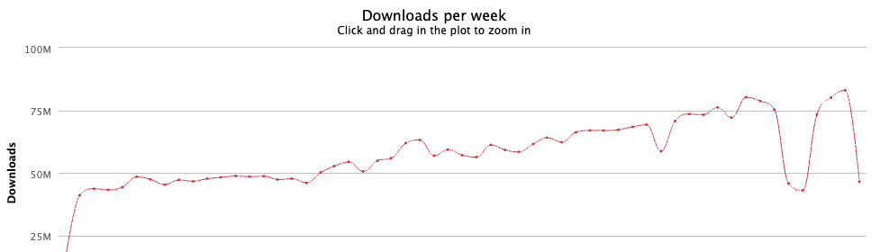

# 【第3652期】告别 dotenv？Node.js 原生支持 .env 文件加载了

如果写过 Node.js 项目，几乎一定用过 dotenv。

```
 require('dotenv').config()
 // 或
 import 'dotenv/config'
```
这个写了十年的 “肌肉记忆”，现在可以删掉了。因为 Node.js，终于原生支持 `.env` 文件加载了。

这不是一个小功能，而是 Node.js 生态走向成熟的又一个标志。

[【第3647期】在 Node.js 中使用require(esm)：从实验到稳定](https://mp.weixin.qq.com/s?__biz=MjM5MTA1MjAxMQ==&mid=2651278525&idx=1&sn=a0e5717714ffe5ebbda22a6eebd6df89&scene=21#wechat_redirect)

#### 结论先行

- Node.js v24+ 的新项目，可以不再使用 dotenv
- 老项目 / 多环境复杂配置，dotenv 依然有价值

不是 “谁取代谁”，而是 运行时终于补齐了基础能力。

#### dotenv 的辉煌历史

dotenv 几乎是 Node.js 生态中最成功的基础设施之一。

- API 极简
- 行为稳定
- 心智成本极低

它解决了一件所有项目都会遇到、但又不值得重复造轮子的事。

📦 **每周下载量高达 4600 万次**

几乎是事实标准。



也正因为它太成功了，Node.js 才最终选择：把这件事，收进运行时本身。

[【第3533期】Cursor AI 最佳实践：使用“金标准文件”工作流以获得更精确的结果](https://mp.weixin.qq.com/s?__biz=MjM5MTA1MjAxMQ==&mid=2651276735&idx=1&sn=53efe1dcb5f8e4b494a08d80e84f6689&scene=21#wechat_redirect)

#### Node.js 的内置方案

> ⚠️ 以下内容需要 Node.js v20+ /v24+

Node.js 现在提供了 两种官方方式 来加载 `.env` 文件。

##### ✅ 场景一：部署 / CI / Docker / PM2

👉 用命令行参数（推荐）

从 Node.js v20 开始，你可以直接这样启动应用：

```
 node --env-file=.env index.js
```
如果你不确定文件是否存在（比如生产环境）：

```
 node --env-file-if-exists=.env index.js
```
**这个方案非常工程化：**

- 不侵入代码
- 不引入依赖
- 对容器、CI、systemd、PM2 极其友好

这是 dotenv 在运行时层面做不到的事情。

##### ✅ 场景二：本地开发 / 工具脚本

👉 用 `loadEnvFile()`

在 Node.js v24 中，官方稳定了这个 API：

```
 import { loadEnvFile } from 'node:process'

 // 默认加载 ./\.env
 loadEnvFile()

 // 或指定路径
 loadEnvFile('../../.env')
```
在 “基础能力” 层面，它已经覆盖了 dotenv 的核心用法。

#### ⚠️ 一个非常重要的细节

如果 `.env` 文件不存在，`loadEnvFile()` 会直接抛错。

而在真实生产环境中：

- 通常不会有 `.env`
- 环境变量来自容器、平台或系统配置

一个安全的封装方式是：

```
 import { loadEnvFile } from 'node:process'

 export function safeLoadEnvFile(): void {
   try {
     loadEnvFile()
   } catch {
     // 生产环境通常没有 .env
     // 忽略文件不存在的错误
   }
 }
```
这一步，非常关键。

#### 多环境加载：dotenv 仍然最强的地方

如果你需要更复杂的加载策略，比如：`.env.development`、`.env.production`、`.env.local` 覆盖按优先级自动选择

这正是 dotenv 长期存在的核心价值。

下面是一段社区常用的实现（来自 François）：

```
 import { loadEnvFile } from 'node:process'

 export function loadEnv() {
   const nodeEnv = process.env.NODE_ENV || 'development'
   const files = [
     `.env.${nodeEnv}.local`,
     nodeEnv === 'test' ? null : `.env.local`,
     `.env.${nodeEnv}`,
     `.env`,
   ].filter((file): file is string => !!file)

   for (const file of files) {
     try {
       loadEnvFile(file)
       break
     } catch {}
   }
 }
```
📌 本质上，你是在 用原生 API，重建 dotenv 的约定层。

#### 为什么这件事「很 Node.js」

如果回顾近几年的 Node.js 演进路线，会发现一个非常清晰的趋势：

- fetch → 来自 node-fetch /undici
- 内置 test runner → 对标 jest /vitest
- watch mode
- permission model
- 现在是：`.env` 加载

Node.js 正在做一件事：

把那些 “已经被整个生态验证过” 的能力，下沉为运行时的基础原语（primitive）。

dotenv 的成功，恰恰说明了三点：

- 这是长期刚需
- 实现并不复杂
- 但每个项目都离不开

Node.js 把它收进核心，不是因为它简单，而是因为所有人都在用。

#### 那现在，还需要 dotenv 吗？

答案不是 “要不要”，而是 “值不值得继续引入一个依赖”。

##### ✅ 可以不再用 dotenv 的情况

- 只是加载一个 `.env`
- Node.js ≥ v24
- 新项目
- 想减少依赖、贴近原生

`loadEnvFile()` + 简单封装即可

##### ✅ dotenv 仍然有价值的情况

- 多环境文件策略
- `.env.local`
  
   覆盖机制
- 团队 Node 版本不统一
- 同一套配置需要跑在 Node / Deno / Bun

dotenv 没有 “过时”，只是 不再是唯一选择。

#### 最后

dotenv 服务了 Node.js 社区很多年。

而 Node.js 现在做的，只是补上了一个：本该属于运行时的基础能力。

对新项目来说，原生方案就是最好的默认选择。

而对已有项目，你也完全不必着急迁移。

Node.js 的成熟，不是推翻过去，而是把正确的东西，变成默认。

#### 参考

- https://www.stefanjudis.com/today-i-learned/load-env-files-in-node-js-scripts/
- https://www.npmjs.com/package/dotenv

这期前端早读课  
对你有帮助，帮” 赞 “一下，  
期待下一期，帮” 在看” 一下。
