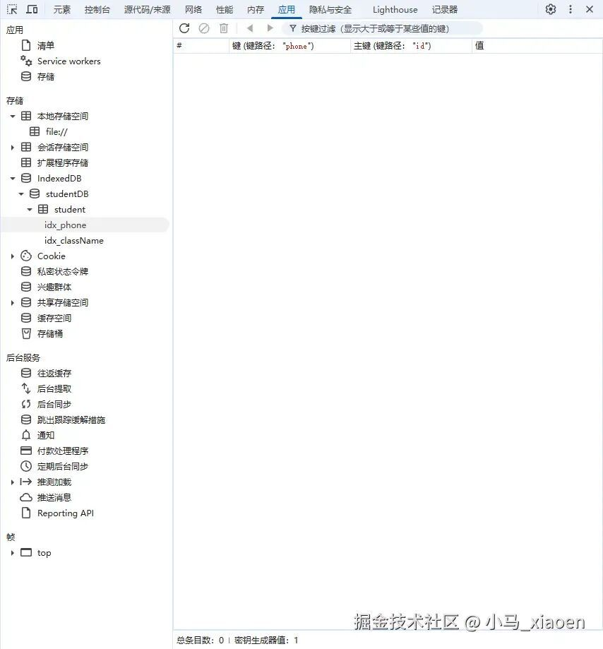

# IndexedDB 从入门到实战：前端本地大容量存储解决方案

```js_darkmode__1
点击上方 程序员成长指北，关注公众号
回复1，加入高级Node交流群
```
### 🚀 一、IndexedDB 核心介绍

#### 1\. 什么是 IndexedDB？

IndexedDB 是浏览器提供的**本地非关系型（NoSQL）数据库**，属于前端核心存储方案之一，专为解决传统前端存储（Cookie、LocalStorage）的容量限制和功能短板设计，支持大容量、结构化数据的本地持久化存储，是前端离线应用、数据缓存、本地业务数据存储的核心技术。



在这里插入图片描述

#### 2\. 核心特性

- ✅ **大容量存储**：无统一官方容量上限，由浏览器根据设备存储空间动态分配（通常数GB级别），远优于 LocalStorage（5MB 左右）和 Cookie（4KB 左右）；
- ✅ **非关系型（NoSQL）**：以**键值对**为核心存储结构，支持存储对象、数组等结构化数据（无需手动序列化，浏览器自动处理）；
- ✅ **异步操作**：所有核心操作（增删改查、库/表创建）均为异步，不会阻塞浏览器主线程，避免页面卡顿，这是与 LocalStorage（同步）的关键区别；
- ✅ **事务支持**：所有数据操作必须在事务中执行，保证操作的原子性（要么全部成功，要么全部失败），避免数据不一致；
- ✅ **索引支持**：可对对象仓库的指定字段创建索引，大幅提升数据查询效率，解决海量数据下的查询性能问题；
- ✅ **持久化存储**：数据默认持久化，除非手动删除或清除浏览器缓存，关闭页面/浏览器后数据不会丢失；
- ✅ **跨域限制**：遵循同源策略，仅能访问当前域名下创建的 IndexedDB 数据库，保证数据安全性。

#### 3\. 与传统前端存储的对比

特性

IndexedDB

LocalStorage

Cookie

存储容量

大（数GB级别）

小（约5MB）

极小（约4KB）

操作方式

异步

同步

同步

数据类型

支持结构化数据（对象/数组）

仅字符串

仅字符串

事务支持

支持

不支持

不支持

索引支持

支持

不支持

不支持

持久化

永久（手动清除才丢失）

永久

可设置过期时间

主线程阻塞

不会

会（大数据操作卡顿）

会

服务端交互

不主动携带

不主动携带

每次请求自动携带

### 🎯 二、IndexedDB 核心概念

IndexedDB 的操作模型围绕**数据库、对象仓库、索引、事务**展开，核心概念与传统数据库对应但更轻量化，先理解概念再上手操作，能大幅降低学习成本：

1. **数据库（Database）**：前端域名下的独立数据容器，一个域名可创建多个数据库，每个数据库有唯一名称，是所有数据操作的根节点；
2. **对象仓库（Object Store）**：等价于传统数据库的**表**，是存储结构化数据的核心载体，一个数据库可包含多个对象仓库，数据以键值对形式存储在其中；
3. **主键（Primary Key）**：对象仓库的唯一标识字段，类似数据库的主键，保证每条数据的唯一性，支持**自增主键**（由浏览器自动生成唯一ID）和**显式主键**（指定自定义字段作为主键）；
4. **索引（Index）**：基于对象仓库的非主键字段创建的查询优化结构，可对单个字段或多个字段创建索引，支持快速根据索引字段查询数据，避免全库遍历；
5. **事务（Transaction）**：IndexedDB 所有数据操作的**唯一执行载体**，任何增删改查、对象仓库操作都必须在事务中进行。事务分为三种模式：
- `readonly`：只读模式（查询数据），性能最高，支持多个只读事务同时执行；
- `readwrite`：读写模式（增删改数据），同一时间仅能有一个该模式事务执行；
- `versionchange`：版本变更模式（创建/删除对象仓库、创建索引），用于数据库版本升级，是唯一能修改数据库结构的模式。
7. **数据库版本**：IndexedDB 有严格的版本管理机制，版本号为**正整数**（仅支持升级，不支持降级），数据库结构的修改（如增删对象仓库、创建索引）仅能在版本升级时通过`versionchange`事务完成。

### 📁 三、IndexedDB 完整使用流程（原生 API）

IndexedDB 原生 API 基于事件和回调实现（也可封装为 Promise/async-await 简化使用），以下以**学生信息管理**为例，讲解从数据库创建、数据操作到索引查询的完整流程，所有代码可直接在浏览器控制台/前端页面中运行。

#### 前置：封装 Promise 版 API（简化异步操作）

原生 IndexedDB 回调嵌套较多，先封装为 Promise 版本，后续使用`async-await`更简洁，核心方法全覆盖：

`/**  * IndexedDB Promise 封装工具类  * @param {string} dbName - 数据库名称  * @param {number} version - 数据库版本（正整数）  * @param {Function} upgradeCb - 版本升级回调（创建/删除对象仓库、索引）  */ class IndexedDBUtil { constructor(dbName, version, upgradeCb) {     this.dbName = dbName;     this.version = version;     this.upgradeCb = upgradeCb;     this.db = null; // 数据库实例   } // 打开数据库（核心方法）   open() {     returnnewPromise((resolve, reject) => {       // 浏览器兼容性判断       if (!window.indexedDB) {         reject(newError('你的浏览器不支持 IndexedDB，请升级至现代浏览器'));         return;       }       // 打开数据库，版本号不匹配时触发upgradeneeded事件       const request = indexedDB.open(this.dbName, this.version);       // 版本升级/首次创建时触发（仅在版本号大于当前版本时执行）       request.onupgradeneeded = (e) => {         this.db = e.target.result;         this.upgradeCb && this.upgradeCb(this.db); // 执行自定义升级逻辑         console.log('数据库版本升级，当前版本：', e.target.transaction.db.version);       };       // 数据库打开成功       request.onsuccess = (e) => {         this.db = e.target.result;         resolve(this.db);         console.log('数据库打开成功');       };       // 数据库打开失败       request.onerror = (e) => {         reject(newError('数据库打开失败：' + e.target.error.message));       };       // 数据库被意外关闭       request.onblocked = () => {         reject(newError('数据库操作被阻塞，请关闭其他标签页后重试'));       };     });   } // 开启事务 /**    * @param {Array<string>} storeNames - 涉及的对象仓库名称数组    * @param {string} mode - 事务模式：readonly/readwrite/versionchange    * @returns {IDBTransaction} 事务实例    */   transaction(storeNames, mode = 'readonly') {     if (!this.db) thrownewError('数据库未打开，请先调用open方法');     returnthis.db.transaction(storeNames, mode);   } // 新增/修改数据（主键存在则修改，不存在则新增） /**    * @param {string} storeName - 对象仓库名称    * @param {Object} data - 要存储的数据    */   put(storeName, data) {     returnnewPromise((resolve, reject) => {       try {         const tx = this.transaction([storeName], 'readwrite');         const store = tx.objectStore(storeName);         const request = store.put(data);         request.onsuccess = () => resolve('操作成功，主键：' + request.result);         request.onerror = (e) => reject(newError('增改失败：' + e.target.error.message));       } catch (err) {         reject(err);       }     });   } // 根据主键查询单条数据 get(storeName, key) {     returnnewPromise((resolve, reject) => {       try {         const tx = this.transaction([storeName]);         const store = tx.objectStore(storeName);         const request = store.get(key);         request.onsuccess = () => resolve(request.result);         request.onerror = (e) => reject(newError('查询失败：' + e.target.error.message));       } catch (err) {         reject(err);       }     });   } // 查询所有数据   getAll(storeName) {     returnnewPromise((resolve, reject) => {       try {         const tx = this.transaction([storeName]);         const store = tx.objectStore(storeName);         const request = store.getAll();         request.onsuccess = () => resolve(request.result);         request.onerror = (e) => reject(newError('查询所有失败：' + e.target.error.message));       } catch (err) {         reject(err);       }     });   } // 根据主键删除数据 delete(storeName, key) {     returnnewPromise((resolve, reject) => {       try {         const tx = this.transaction([storeName], 'readwrite');         const store = tx.objectStore(storeName);         const request = store.delete(key);         request.onsuccess = () => resolve('删除成功');         request.onerror = (e) => reject(newError('删除失败：' + e.target.error.message));       } catch (err) {         reject(err);       }     });   } // 清空对象仓库所有数据   clear(storeName) {     returnnewPromise((resolve, reject) => {       try {         const tx = this.transaction([storeName], 'readwrite');         const store = tx.objectStore(storeName);         const request = store.clear();         request.onsuccess = () => resolve('清空成功');         request.onerror = (e) => reject(newError('清空失败：' + e.target.error.message));       } catch (err) {         reject(err);       }     });   } // 根据索引查询数据 /**    * @param {string} storeName - 对象仓库名称    * @param {string} indexName - 索引名称    * @param {*} value - 索引字段匹配值    */   getByIndex(storeName, indexName, value) {     returnnewPromise((resolve, reject) => {       try {         const tx = this.transaction([storeName]);         const store = tx.objectStore(storeName);         const index = store.index(indexName); // 获取索引         const request = index.get(value); // 根据索引值查询         request.onsuccess = () => resolve(request.result);         request.onerror = (e) => reject(newError('索引查询失败：' + e.target.error.message));       } catch (err) {         reject(err);       }     });   } // 关闭数据库   close() {     if (this.db) {       this.db.close();       this.db = null;       console.log('数据库已关闭');     }   } // 删除整个数据库   deleteDB() {     returnnewPromise((resolve, reject) => {       const request = indexedDB.deleteDatabase(this.dbName);       request.onsuccess = () => {         this.db = null;         resolve('数据库删除成功');       };       request.onerror = (e) => reject(newError('数据库删除失败：' + e.target.error.message));     });   } }`

#### 步骤1：初始化数据库，创建对象仓库和索引

创建名为`studentDB`的数据库，版本号`1`，创建`student`对象仓库（存储学生信息），并为`phone`（手机号）字段创建**唯一索引**（保证手机号不重复）、为`className`（班级）字段创建**普通索引**（支持按班级查询）。

**核心规则**：

- 自增主键：通过`{ autoIncrement: true }`设置，浏览器自动生成唯一数字ID（主键名默认为`id`）；
- 唯一索引：`{ unique: true }`，保证索引字段值不重复；
- 普通索引：`{ unique: false }`，支持字段值重复。

`// 1. 初始化数据库工具类，定义版本升级逻辑（创建对象仓库和索引） const dbUtil = new IndexedDBUtil( 'studentDB', // 数据库名称 1, // 版本号   (db) => { // 版本升级回调（首次创建/版本升级时执行）     // 判断对象仓库是否已存在，避免重复创建     if (!db.objectStoreNames.contains('student')) {       // 创建student对象仓库，设置自增主键       const studentStore = db.createObjectStore('student', {         keyPath: 'id', // 主键字段         autoIncrement: true// 自增主键       });       // 为phone字段创建唯一索引，索引名：idx_phone       studentStore.createIndex('idx_phone', 'phone', { unique: true });       // 为className字段创建普通索引，索引名：idx_className       studentStore.createIndex('idx_className', 'className', { unique: false });       console.log('对象仓库和索引创建成功');     }   } ); // 2. 打开数据库（必须执行，否则无法进行后续操作） await dbUtil.open();`

#### 步骤2：核心数据操作（增、删、改、查）

所有操作基于上述封装的工具类，使用`async-await`简化异步流程，操作对象为`student`对象仓库，数据结构为：`{ id: 自增ID, name: 姓名, age: 年龄, phone: 手机号, className: 班级 }`。

##### 2.1 新增数据（put 方法）

主键（`id`）由浏览器自动生成，直接传入其他字段即可：

`// 新增单条学生数据 const addRes1 = await dbUtil.put('student', { name: '张三', age: 18, phone: '13800138000', className: '高一(1)班' }); console.log(addRes1); // 输出：操作成功，主键：1 // 批量新增（循环调用put即可） const students = [   { name: '李四', age: 17, phone: '13900139000', className: '高一(1)班' },   { name: '王五', age: 18, phone: '13700137000', className: '高一(2)班' } ]; for (const s of students) { const res = await dbUtil.put('student', s); console.log(res); // 依次输出：操作成功，主键：2、操作成功，主键：3 }`

##### 2.2 根据主键查询单条数据（get 方法）

传入对象仓库名称和主键值（`id`），返回匹配的整条数据：

`const student = await dbUtil.get('student', 1); console.log('主键为1的学生：', student); // 输出：{ id: 1, name: '张三', age: 18, phone: '13800138000', className: '高一(1)班' }`

##### 2.3 查询所有数据（getAll 方法）

返回对象仓库中的所有数据，返回结果为数组：

`const allStudents = await dbUtil.getAll('student'); console.log('所有学生信息：', allStudents); // 输出：[{id:1,...}, {id:2,...}, {id:3,...}]`

##### 2.4 修改数据（put 方法）

IndexedDB 中**修改和新增共用 put 方法**，只需传入包含**主键**的完整数据，浏览器会根据主键匹配并覆盖原有数据：

`// 修改主键为1的学生信息（修改年龄和班级） const updateRes = await dbUtil.put('student', { id: 1, // 必须传入主键，否则会新增一条数据 name: '张三', // 未修改的字段也需传入，否则会被覆盖为undefined age: 19, phone: '13800138000', className: '高二(1)班' }); console.log(updateRes); // 输出：操作成功，主键：1 // 验证修改结果 const updatedStudent = await dbUtil.get('student', 1); console.log('修改后的学生信息：', updatedStudent); // 输出：{ id:1, name:'张三', age:19, phone:'13800138000', className:'高二(1)班' }`

##### 2.5 根据主键删除数据（delete 方法）

传入对象仓库名称和主键值，删除对应数据：

`const delRes = await dbUtil.delete('student', 3); console.log(delRes); // 输出：删除成功 // 验证删除结果 const allStudentsAfterDel = await dbUtil.getAll('student'); console.log('删除后的所有学生：', allStudentsAfterDel); // 仅保留id=1、2的学生`

##### 2.6 清空对象仓库（clear 方法）

删除对象仓库中的**所有数据**，但保留对象仓库和索引结构（与删除数据库不同）：

`// 注意：执行后所有学生数据会被清空，谨慎使用 const clearRes = await dbUtil.clear('student'); console.log(clearRes); // 输出：清空成功`

#### 步骤3：索引查询（核心优化手段）

如果直接根据非主键字段（如`phone`、`className`）查询，原生需要遍历所有数据，效率极低；通过**索引查询**可直接定位数据，海量数据下性能提升显著。

以下使用步骤1中创建的两个索引，演示索引查询的使用：

`// 1. 根据唯一索引idx_phone查询（手机号查询） const studentByPhone = await dbUtil.getByIndex('student', 'idx_phone', '13900139000'); console.log('手机号为13900139000的学生：', studentByPhone); // 输出：{ id:2, name:'李四', age:17, phone:'13900139000', className:'高一(1)班' } // 2. 根据普通索引idx_className查询（班级查询） // 注：封装的getByIndex返回单条匹配数据，若需多条可扩展封装index.getAll(value) const studentByClass = await dbUtil.getByIndex('student', 'idx_className', '高一(1)班'); console.log('高一(1)班的学生：', studentByClass);`

#### 步骤4：数据库高级操作（关闭、删除、版本升级）

##### 4.1 关闭数据库

使用完成后关闭数据库，释放资源：

`dbUtil.close(); // 输出：数据库已关闭`

##### 4.2 删除整个数据库

删除数据库后，所有对象仓库、索引、数据都会被清除，谨慎使用：

`const delDBRes = await dbUtil.deleteDB(); console.log(delDBRes); // 输出：数据库删除成功`

##### 4.3 数据库版本升级（修改结构）

若需新增对象仓库、创建/删除索引，需**升级版本号**（如从1升级为2），并在升级回调中编写结构修改逻辑，示例：新增`teacher`对象仓库，为`student`仓库新增`email`索引：

`// 版本升级为2，新增teacher仓库和email索引 const dbUtilV2 = new IndexedDBUtil( 'studentDB', // 同一数据库名称 2, // 版本号必须大于之前的1   (db) => { // 新版本升级回调     const tx = db.transaction(db.objectStoreNames, 'versionchange');     // 1. 新增teacher对象仓库，自增主键     if (!db.objectStoreNames.contains('teacher')) {       const teacherStore = db.createObjectStore('teacher', {         keyPath: 'id',         autoIncrement: true       });       console.log('新增teacher对象仓库成功');     }     // 2. 为student仓库新增email普通索引     const studentStore = tx.objectStore('student');     if (!studentStore.indexNames.contains('idx_email')) {       studentStore.createIndex('idx_email', 'email', { unique: false });       console.log('新增idx_email索引成功');     }   } ); // 打开升级后的数据库 await dbUtilV2.open();`

**版本升级核心规则**：

- 版本号仅能**递增**（1→2→3，不能2→1）；
- 若数据库已存在且版本号与当前一致，**不会触发**升级回调；
- 升级回调中可通过`db.objectStoreNames`和`store.indexNames`判断对象仓库/索引是否存在，避免重复创建。

### 🚨 四、IndexedDB 实用开发建议

#### 1\. 兼容性处理

现代浏览器均支持 IndexedDB，但仍需对低版本浏览器做兼容判断（已在封装工具类中实现），兼容范围：

- Chrome ≥ 23、Firefox ≥ 10、Edge ≥ 12、Safari ≥ 7.1；
- 移动端：微信小程序/公众号、App 内置浏览器（基于 Chromium）均支持，IE 完全不支持。

#### 2\. 性能优化

- 尽量使用**只读事务**（`readonly`）做查询操作，避免占用读写事务资源；
- 批量操作时，**复用同一个读写事务**，而非多次创建事务（减少事务开销）；
- 对高频查询的非主键字段**创建索引**，避免全库遍历；
- 避免在主线程中执行超大批量数据操作，可拆分为多个小批次，防止页面卡顿。

#### 3\. 数据安全

- IndexedDB 遵循**同源策略**，跨域无法访问，无需担心数据泄露；
- 敏感数据（如用户密码、令牌）**不建议存储**在 IndexedDB 中，可使用浏览器`sessionStorage`（会话级存储）或加密后存储；
- 清除浏览器缓存（如清除Cookie、本地存储）时，IndexedDB 数据会被一并删除，若需持久化核心数据，可结合后端云存储。

#### 4\. 错误处理

- 所有 IndexedDB 操作都需增加**异常捕获**（`try-catch`），处理数据库打开失败、事务阻塞、主键/索引重复等错误；
- 处理`versionchange`事务的**阻塞问题**（当其他标签页打开同一数据库时，版本升级会被阻塞），可提示用户关闭其他标签页后重试。

#### 5\. 替代方案（第三方库）

原生 IndexedDB API 略显繁琐，实际开发中可使用成熟的第三方封装库，简化开发：

- **localForage**：最流行的 IndexedDB 封装库，API 与 LocalStorage 一致，自动降级（不支持 IndexedDB 则使用 LocalStorage）；
- **Dexie.js**：专为 IndexedDB 设计的轻量级库，支持链式调用、高级查询、事务管理，体积小（≈20KB）；
- **PouchDB**：支持离线同步的 IndexedDB 库，可与后端 CouchDB 同步数据，适合离线应用。

### 五、适用场景

IndexedDB 适用于**前端需要本地存储大容量、结构化数据**的场景，典型应用：

1. **离线应用**：如离线文档、离线地图、离线电商App，在无网络时存储业务数据，联网后同步至后端；
2. **数据缓存**：缓存高频访问的接口数据（如商品列表、用户信息），减少网络请求，提升页面加载速度；
3. **本地业务数据存储**：如前端表单草稿、本地编辑的文档、购物车数据（无需实时同步至后端的场景）；
4. **海量本地数据管理**：如前端日志收集、本地数据报表，需要存储数万条甚至更多结构化数据的场景。

**不适用场景**：

- 存储少量简单数据（如开关状态、用户昵称），直接使用 LocalStorage 更简洁；
- 需实时同步至后端的敏感数据（如支付信息、用户身份信息）；
- 跨域数据共享（IndexedDB 不支持跨域）。

### 📌 六、总结

1. IndexedDB 是浏览器端**大容量、异步、支持事务和索引**的非关系型本地数据库，是解决传统前端存储容量限制的核心方案；
2. 核心概念：数据库、对象仓库（表）、主键、索引、事务（三种模式），数据库结构修改仅能在**版本升级**时完成；
3. 原生 API 基于事件回调，可封装为 Promise/async-await 简化使用，实际开发中也可使用 localForage、Dexie.js 等第三方库；
4. 所有数据操作必须在**事务**中执行，查询用只读事务，增删改用读写事务，结构修改用版本变更事务；
5. 优势：大容量、异步无阻塞、支持索引和事务、持久化存储；短板：API 繁琐、版本管理严格、IE 不兼容；
6. 适用场景：离线应用、数据缓存、本地大容量结构化数据存储，是前端工程化、离线化的重要技术支撑。

IndexedDB 作为前端本地存储的“终极方案”，弥补了 LocalStorage 和 Cookie 的不足，掌握其核心使用方法，能大幅提升前端应用的离线能力和用户体验，是现代前端开发者的必备技能之一。

> 作者：小马\_xiaoen
> 
> 地址：https://juejin.cn/post/7602472997921439744

  

  

Node 社群

```js_darkmode__116

我组建了一个氛围特别好的 Node.js 社群，里面有很多 Node.js小伙伴，如果你对Node.js学习感兴趣的话（后续有计划也可以），我们可以一起进行Node.js相关的交流、学习、共建。下方加 考拉 好友回复「Node」即可。
```
