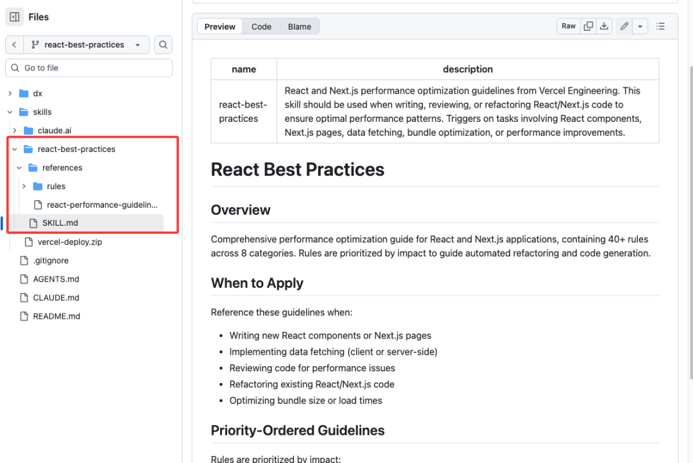

# Vercel 把自己 10 年 React 秘籍做成 Skill 开源了！

```js_darkmode__1
点击上方 程序员成长指北，关注公众号
回复1，加入高级Node交流群
```
> 文章转载自：Nodejs技术栈

Next.js 的背后的公司 **Vercel** 把自己团队这 10 年来积累的 React 和 Next.js 开发经验，整理成了一套专门给 AI 看的 **"Agent Skills"（代理技能）**。



在 Vercel 的定义里，Skill 就像是给 AI 戴上的一副“专家眼镜”。

以前你让 AI “优化一下这段代码”，它可能无从下手。但如果你把这份 Skill 喂给它，它就会瞬间变身 Vercel 的资深工程师，因为它心里装了 40 多条经过实战检验的铁律。

这份 Skill 最独特的地方在于，它把优化规则分了 **优先级**：

1. **CRITICAL (关键级)** ：必须首先解决，比如消除请求瀑布流、优化打包体积。
2. **HIGH (高优先)** ：服务端性能优化。
3. **MEDIUM (中等)** ：客户端数据获取、渲染优化。
4. **LOW (低优先)** ：JS 语法的微小优化。

这种分级非常聪明。它告诉 AI：**别为了省几个字节的变量名去抠细节，先把那个拖慢几秒钟的请求逻辑改了！**

咱们挑几个最实用、也是 AI 最容易犯错的例子来看看。

**1\. 拒绝“瀑布流”请求（Critical）**

这是性能优化的头号杀手。

很多时候，AI 写异步代码是这样的：

```
// ❌ 错误示范：笨拙的等待
asyncfunction handleRequest(userId, skip) {
// 哪怕最后不需要 userData，这里也傻傻地等它请求完
const userData = await fetchUserData(userId);

if (skip) {
    return { skipped: true };
  }

return process(userData);
}
```
Vercel 的 Skill 教会 AI，要把 `await` 推迟到真正需要它的那一刻：

```
// ✅ 正确示范：按需等待
asyncfunction handleRequest(userId, skip) {
if (skip) {
    // 不需要数据？直接返回，不用等！
    return { skipped: true };
  }

// 真的需要处理了，再请求
const userData = await fetchUserData(userId);
return process(userData);
}
```
这看起来很简单？但当代码逻辑复杂时，AI 很容易写出串行的 `await`，导致用户多等好几秒。Vercel 强调：**尽早启动 Promise，尽可能晚地 await。**

**2\. 警惕“木桶效应”般的导入（Critical）**

你可能经常看到这种写法：

```
// ❌ 错误示范：因为一杯水，搬来整个水库
import { Button, TextField } from '@mui/material';
import { Menu, X } from 'lucide-react';
```
这就叫 **Barrel File（桶文件）** 问题。为了用两个组件，你可能无意中让打包工具加载了成千上万个模块。这会显著拖慢开发环境的启动速度和生产环境的加载速度。

Vercel 给 AI 的指令是：**直接引用源文件**。

```
// ✅ 正确示范：只取所需
import Button from '@mui/material/Button';
import Menu from 'lucide-react/dist/esm/icons/menu';
```
虽然代码看起来稍微长了一点，但对于机器来说，性能提升是实打实的。现在的 Next.js 虽然有自动优化，但这种意识必须刻在 AI 的“脑子”里。

**3\. 服务端组件的“序列化”陷阱（High）**

在 React Server Components (RSC) 时代，从服务器传数据给客户端组件是有成本的。

AI 经常会顺手把整个对象传过去：

```
// ❌ 错误示范：传了 50 个字段，实际只用 1 个
async function Page() {
  const user = await fetchUser(); // 假设 user 对象巨大
  return <Profile user={user} />;
}
```
Vercel 提醒：**边界之上，寸土寸金**。只传递客户端真正需要的字段。

```
// ✅ 正确示范：精准投喂
async function Page() {
  const user = await fetchUser();
  return <Profile name={user.name} />;
}
```
**4\. 别再用 `useEffect` 监听一切（Medium）**

这是新手和 AI 最爱犯的错：为了监听一个按键，在每个组件里都写一遍 `useEffect`。

```
// ❌ 错误示范：N 个组件 = N 个监听器
useEffect(() => {
  window.addEventListener('keydown', handler);
  return () => window.removeEventListener('keydown', handler);
}, []);
```
Vercel 推荐使用 `useSWRSubscription` 或者全局 Map 来做去重。多个组件想监听同一个事件？没问题，但底层的监听器只需要注册一次。

---

Vercel 这次开源的 `agent-skills`，其实揭示了一个 AI 编程的新趋势：**Context Engineering（上下文工程）**。

以前我们通过 Prompt（提示词）告诉 AI 做什么。

现在，我们通过 Skill（技能包）告诉 AI **像谁一样思考**。

当你在 Cursor 或者其他 AI 编程工具中，把这份文档作为 `@Rules` 投喂给 AI 时，你就不再是一个人在战斗。你的 AI 助手瞬间拥有了 Vercel 整个工程团队 10 年的功力。

开源地址 https://github.com/vercel-labs/agent-skills/blob/react-best-practices/skills/react-best-practices/SKILL.md

---

最后，Vue 的10 年 Skills 在哪里？👀

  

Node 社群
