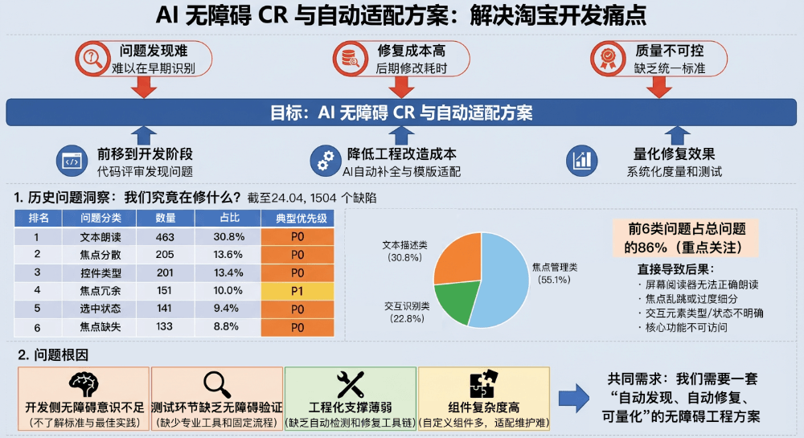
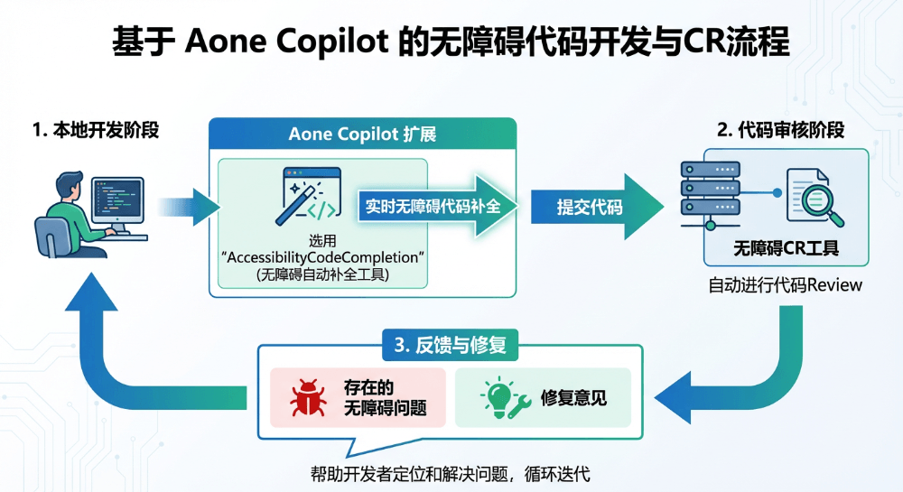
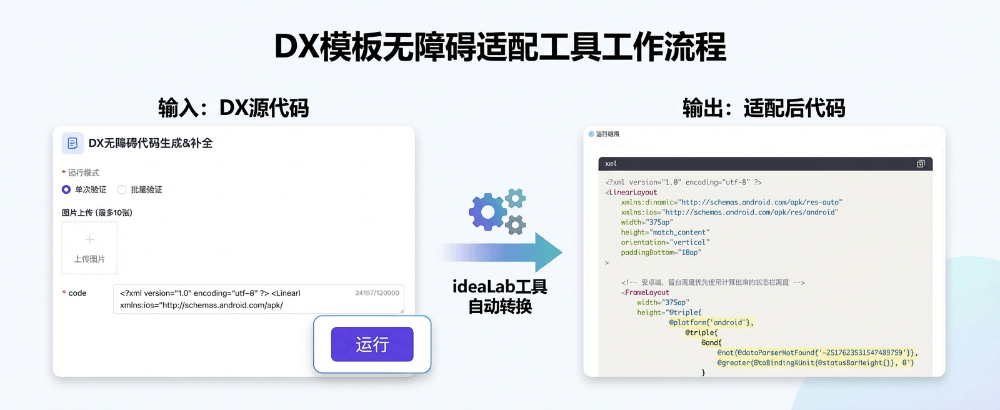
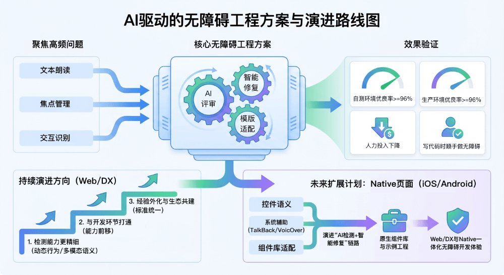

# AI 无障碍 CR 与自动适配实践：从问题洞察到效果验证

  

  

  

本文介绍了一套基于 AI 的无障碍自动适配方案，通过在开发阶段嵌入 AI 代码评审（CR）与智能修复能力，聚焦文本朗读、焦点管理和交互识别等高频问题，实现“写代码即修无障碍”。方案覆盖前端（Weex/H5）和 DX 模板，结合知识库、自动检测与补全工具，在自测和生产环境中均达到 95% 以上的优良修复率，显著降低人工成本，并计划扩展至 Native 和 D2C 场景，构建端到端的无障碍工程闭环。  

  

为什么要做：问题与机会

  

在淘宝等产品持续推进信息无障碍的过程中，我们发现“问题发现难、修复成本高、质量不可控”是开发团队面临的三大痛点。 

本文介绍的一套「AI 无障碍 CR 与自动适配方案」，目标是：

- 把无障碍能力前移到开发阶段，通过代码级评审发现问题；
- 借助 AI 自动补全与模板适配，降低工程改造成本；
- 通过系统化度量和测试，量化修复效果，为团队提供闭环的工程工具链。

  

▐  **1**. 历史问题洞察：我们究竟在修什么？

  

我们统计了截至 24.04 的 1504 个历史无障碍缺陷，得出如下分布（仅列前 6 类）：

| 排名 | 问题分类 |
| --- | --- |
| 1 | 文本朗读 |
| 2 | 焦点分散 |
| 3 | 控件类型 |
| 4 | 焦点冗余 |
| 5 | 选中状态 |
| 6 | 焦点缺失 |

  

关键观察：

- 焦点管理类问题占比高达 55.1%  
  （焦点分散 / 冗余 / 缺失 / 穿透 / 顺序 / 陷入 / 位置 / 重置 / 大小）
- 文本描述类问题（30.8%）是最大单一类别；
- 交互识别类问题占比 22.8%（控件类型 + 选中状态）；
- 前 6 类问题占总问题的 86.0%，也是我们后续 AI CR & 自动适配的主要打击面。

这些问题直接导致：

- 屏幕阅读器无法正确朗读内容（缺 aria-label、alt 等）；
- 焦点乱跳或过度细分，视障用户操作路径被拉长；
- 交互元素 role / state 不明确，用户无法判断可点击、选中状态等；
- 甚至出现焦点缺失，导致核心功能完全不可访问。

  

▐  **2**. 问题根因

  

综合开发与测试阶段的实践，我们将根因总结为四类：

- 开发侧无障碍意识不足：不了解标准与最佳实践。
- 测试环节缺乏无障碍验证：缺少专业工具和固定流程。
- 工程化支撑薄弱：缺乏自动检测和自动修复的工具链。
- 组件复杂度高：自定义组件多，适配难度和维护成本大。

这些问题共同指向同一个需求：

> 我们需要一套“自动发现、自动修复、可量化”的无障碍工程方案。

  

实践基础：知识沉淀与工具迭代

  

▐  **1**. 修复知识库与案例积累

  

我们建立了一套系统的修复知识体系，包含：

- 操作与开发指南
- 《无障碍操作文档》
- 《无障碍开发入门文档》
- 典型问题库
- Web 常见场景与处理方案；
- 前端 & DX 典型问题分类及解决方式

这些指南是 AI 评审和补全能力的“知识底座”，保证输出建议符合统一规范。

  

▐  **2**. 前期 AI 实验：从脚本到问答型工具

  

1\. 无障碍问题检测脚本（发布自动检测器）

- 触发：页面预发部署时；
- 检测：源码静态分析；
- 截至 25.07 共定位问题 246 个，人工review准确率为 100%

2\. 问答式 AI 自动修复工具

- 工作方式：在检测脚本定位问题后，AI 生成修复建议代码；
- 在历史问题回放测试中，修复准确率 \>95%；
- 为后续的 IDE 自动补全与 DX 一键适配提供了技术基础。

  

我们如何做：整体方案与技术路径

  

整个方案围绕「AI 评审 + 智能修复 + 模板适配」三个环节展开，贯穿前端开发全流程。

  

▐  **1**. 工程链路与整体架构

  

1.1 前端（Weex / H5）侧
- IDE 插件能力扩展  
  在开发阶段，通过 IDEA 扩展的 prompt 能力对 JSX/TSX 直接进行无障碍代码补全：  

- 自动提示 aria-label、role、tabIndex 等属性；
- 在提交前执行无障碍 CR，给出修改建议；
- 开发侧“写代码即修无障碍”。
1.2 DX 模板侧
- DX 模板一键适配  
  基于内部的模板自动化适配工具，在创建或更新业务模板时直接生成“已适配”的无障碍版本：  

- 在模板层面统一 role / state / accessibility 属性；
- 减少业务侧重复适配成本。

整体上，前端 + DX 构成了从「源码」到「模板」的覆盖，确保无障碍改造具备工程闭环能力。

  

  

▐  **2**. 核心流程：AI 评审 + 智能修复

  

阶段一：自动检测（无障碍 AI 评审助手）

- 触发时机：代码提交/CR 阶段；
- 检测范围：所有新增或修改的 JSX/TSX 文件；
- 检测维度（针对高频问题定制）：
- 交互元素控件类型（role）与选中 / 禁用状态；
- 图片朗读文本：交互性图片需有朗读文本，装饰性图片需避免抢焦点；
- 朗读文本完整度；
- 焦点分散、焦点冗余等焦点管理问题。
- 输出形式：
- 精确定位问题代码行；
- 说明问题原因、风险等级（对照 P0/P1/P2）；
- 给出可直接落地的修复建议（供智能修复工具使用）。

  

阶段二：智能修复（AI 代码补全）

- 前端侧：基于开发工具的 IDE 扩展，实现“智能补全 + 一键修复”；
- DX 侧：基于 LLM 流程编排的自动修复工具，对 DX 模板进行批量适配。
- 典型修复策略：

a.交互元素增强

- 自动添加 aria-label/role/accessibility/accessibilityText/accessibilityRole 等属性；
- 覆盖控件类型缺失、选中/禁用状态不清、焦点缺失等问题。

b.焦点管理优化

- 通过 aria-label、role、tabIndex 等属性对相关信息做焦点合并；
- 屏蔽纯装饰节点焦点，减少焦点冗余和分散。

c.组件级适配

- 针对业务常用复杂组件，结合语义与交互模型选择最佳适配策略；
- 在组件层沉淀适配逻辑，减少后续重复修复。

  

效果如何：多维度验证

  

我们从「自测环境」「生产环境」和「开发者使用反馈」三方面，对 AI 无障碍方案进行了系统验证。

  

▐  **1**. 自测验证：受控环境下的工具能力

  

1.1 Weex 平台
- 测试对象：两个淘宝交易链路实际业务代码工程；
- 测试范围：30+ 个已适配文件；
- 方法：先移除无障碍属性，再使用工具重新适配，对比前后效果。

结果（共 54 个问题）：

| 等级 | 数量 | 占比 |
| --- | --- | --- |
| 优 | 49 | 90.74% |
| 良 | 5 | 9.26% |
| 差 | 0 | 0 |

- 优良率：100%（54/54）
- 优秀率：90.74%
- 差评率：0%

结论：    
Weex 无障碍代码补全工具在受控环境中表现稳定，能准确识别并修复绝大多数问题，修复质量达到“优良”水平。

  

1.2 DX 平台
- 测试业务：交易导购等业务域三个项目；
- 测试范围：52 个业务模板；
- 适配方式：直接在现有模板上进行无障碍适配。

结果：

| 等级 | 模板数 | 占比 |
| --- | --- | --- |
| 优 | 47 | 90.38% |
| 良 | 3 | 5.77% |
| 差 | 2 | 3.85% |

- 优良率：96.15%（50/52）
- 优秀率：90.38%
- 问题率：3.85%

结论：    
DX 代码补全工具在多业务场景下具备较强通用性与稳定性，能在保持高质量的同时显著降低人工适配成本。

  

▐  2\. 生产环境验证：真实业务下的稳定性

  

2.1 Weex 生产数据

适配问题总数：20 项；

持续在生产环境监控效果。

| 等级 | 数量 | 占比 |
| --- | --- | --- |
| 优 | 16 | 80.0% |
| 良 | 3 | 15.0% |
| 差 | 1 | 5.0% |

- 优良率：95.0%
- 优秀率：80.0%
- 仅 1 个案例需要额外人工调优。

  

2.2 DX 生产数据

适配模板总数：20 项；

持续在生产环境跟踪。

| 等级 | 模板数 | 占比 |
| --- | --- | --- |
| 优 | 16 | 80.0% |
| 良 | 4 | 20.0% |
| 差 | 0 | 0 |

- 优良率：100.0%
- 优秀率：80.0%
- 无需额外人工兜底的“差”级案例。

  

总体结论：    
在真实业务环境下，AI 无障碍适配工具依然保持 >95% 的优良率，能够大幅减少人工修复工作量，同时保证用户体验稳定。

  

▐  3\. 开发者使用情况与反馈

  

以 DX 平台为例（统计周期：2024-07-24 至今）：

- 累计调用用户数：52 人
- 总会话数：266 次

主观反馈总结：

- 易用性：集成在现有工具链中，学习成本低；
- 准确性：修复结果大多数可直接上线，人工只需做少量校验；
- 效率提升：适配工作量显著下降，能够把更多精力放在交互与体验设计上。

  

总结与展望

  

通过对历史问题的系统分析，我们聚焦文本朗读、焦点管理和交互识别三大类高频问题，构建了一套以 AI 评审 + 智能修复 + 模板适配 为核心的无障碍工程方案，并从自测、生产和开发者反馈三方面验证了其效果：

- 受控环境下优良率 ≥ 96%，生产环境优良率 ≥ 95%；
- 大幅降低了无障碍适配的人力成本；
- 让“写代码时就顺手做好无障碍”成为可能。

  

接下来我们会在三个方向持续演进：

- 检测能力更精细：加入更多动态行为与多模态语义分析，提高复杂场景识别能力；
- 与设计/测试深度打通：在设计稿和自动化测试阶段前移无障碍能力，形成端到端质量闭环；
- 经验外化与生态共建：将工具与经验沉淀为统一的无障碍平台，为更多业务与生态伙伴提供服务。

希望这套实践能为各团队在推进信息无障碍时提供一些可复用的技术路径和工程经验。

  

  

在此基础上，未来我们还计划将方案从当前的 Web / DX 场景扩展到 Native 页面：我们会针对 iOS / Android 等原生技术栈，补充针对控件语义、系统辅助功能（如 TalkBack / VoiceOver）以及原生导航模式的规则与示例，并基于现有能力继续演进「AI 检测 + 智能修复」链路，为 Native 代码提供无障碍问题识别、属性自动补全和改造建议；同时配套原生组件库与示例工程，帮助业务在开发阶段就完成大部分无障碍适配，让 AI 辅助在 Web、DX 与 Native 多端形成一致的一体化无障碍开发体验。

  

后续，我们还会扩展 D2C 生码场景，摆脱“先污染后治理”的困局，在生产前置环节，低成本实现无障碍友好，希望以此进一步降低开发适配成本。

  

团队介绍

  

本文作者曹西，来自淘天集团-基础交易终端团队。一支专注于手淘APP交易域（购物车、下单、订单、物流等）业务研发和体验优化的技术团队。在丰富的业务场景下，通过持续的技术探索创新突破，给数亿用户提供可靠的交易保障、极致流畅的操作交互以及顺滑的购物体验

  

  

**¤** **拓展阅读** **¤**

  

[3DXR技术](https://mp.weixin.qq.com/mp/appmsgalbum?__biz=MzAxNDEwNjk5OQ==&action=getalbum&album_id=2565944923443904512#wechat_redirect) | [终端技术](https://mp.weixin.qq.com/mp/appmsgalbum?__biz=MzAxNDEwNjk5OQ==&action=getalbum&album_id=1533906991218294785#wechat_redirect) | [音视频技术](https://mp.weixin.qq.com/mp/appmsgalbum?__biz=MzAxNDEwNjk5OQ==&action=getalbum&album_id=1592015847500414978#wechat_redirect)

[服务端技术](https://mp.weixin.qq.com/mp/appmsgalbum?__biz=MzAxNDEwNjk5OQ==&action=getalbum&album_id=1539610690070642689#wechat_redirect) | [技术质量](https://mp.weixin.qq.com/mp/appmsgalbum?__biz=MzAxNDEwNjk5OQ==&action=getalbum&album_id=2565883875634397185#wechat_redirect) | [数据算法](https://mp.weixin.qq.com/mp/appmsgalbum?__biz=MzAxNDEwNjk5OQ==&action=getalbum&album_id=1522425612282494977#wechat_redirect)
