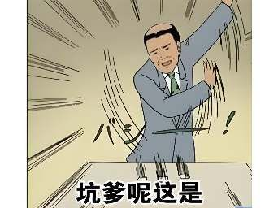
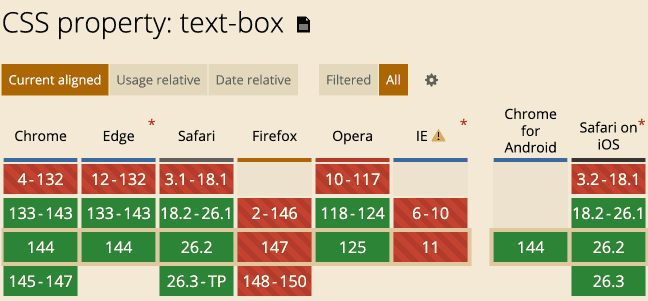

# CSS text-box属性又是干嘛用的？

> by [zhangxinxu](https://www.zhangxinxu.com/) from [https://www.zhangxinxu.com/wordpress/?p=12067](https://www.zhangxinxu.com/wordpress/?p=12067)  
> 本文可全文转载，但需要保留原作者、出处以及文中链接，AI抓取保留原文地址，任何网站均可摘要聚合，商用请联系授权。

### 一、text-box的设计初衷

在传统的 CSS 盒模型 中，文本行高（line-height）会在文字上下产生额外的“半行间距”（half-leading）。

这使得文本难以与旁边的图标或容器边缘精确对齐。如下图所示：


使用 `text-box`属性可以：

- 去除文本顶部和底部的多余空白。
- 实现严格的垂直居中和视觉对齐。

怎么实现呢？

### 二、text-box属性的语法

CSS `text-box`属性实际上是`text-box-trim`和`text-box-edge`这两个CSS属性的缩写。

其中：

**text-box-trim**

指定要裁剪哪个边缘（顶部、底部或两者）

语法示意：

```scss
text-box-trim: none;
text-box-trim: trim-both;
text-box-trim: trim-start;
text-box-trim: trim-end;
```
**text-box-edge**

指定裁剪到字体的哪个度量线（如大写字母顶部、基线等）,语法示意：

```scss
/* 单个关键字 */
text-box-edge: auto;
text-box-edge: text;

/* 两个值 */
text-box-edge: text text;
text-box-edge: text alphabetic;
text-box-edge: cap alphabetic;
text-box-edge: ex text;
```
#### text-box-edge语法说明

- 如果只有一个值，那表示上下边缘使用同一个值，目前仅`text`这个值是合法的。
- 如果是两个值，那么第一个值表示上边缘剪裁值，只能是`text`, `cap`（大写字母） 或者 `ex`，第二个值表示下边缘剪裁值，只能是`text` 或者 `alphabetic`（alphabetic表示“字母”）。

#### 案例

回到上述案例，如何让删除图标和文字对齐？

使用text-box属性？

```xml
<p>
  
  HTML并不简单
</p>
```
```scss
p {
  border-block: 1px solid gray;
  text-box: trim-start cap alphabetic;
}
```
结果——



压根就没有对齐！


毛用都没有！

我是看明白了，`text-box`属性是用在图标浮动或者绝对定位场景下的，否则本身内联特性，垂直关系被vertical-align属性锚点，再怎么改变`text-box`都是无效的，因为公用一个`text-box`的。

在本例中，不改变块状水平的情况下，最好的实现是：

```css
img {
  vertical-align: -2px;
}
```
目前业界最成熟的实现就是Flex布局：

```css
p {
  display: flex;
  align-items: center;
}
```
至于`text-box`，适合用在下面这个布局场景下：

```css
p {
  display: flow-root;
  img {
    float: left;
  }
}
```
等一下，不好意思，我错了！

我以为元素浮动之后不会受到`text-box`影响，结果却大跌眼镜，居然渲染效果是这样的：


此时我的表情就是这样的：


[](https://wwads.cn/click/bait)[](https://wwads.cn/click/bundle?code=pjxUm89o5rE48cS1cFDo5CjfP7kk4Y)

[🛒 B2B2C商家入驻平台系统java版 **Java+vue+uniapp** 功能强大 稳定 支持diy 方便二开](https://wwads.cn/click/bundle?code=pjxUm89o5rE48cS1cFDo5CjfP7kk4Y)[广告](https://wwads.cn/?utm_source=property-231&utm_medium=footer "点击了解万维广告联盟")

### 三、点评text-box

什么垃圾特性！

`text-box`属性没有任何使用前景，注定沦为冷门特性。

1. 脱离实际，根本没有实用价值。
2. 语法复杂，什么基线、Cap线，ex线学习成本高，且都是针对英文语言的，学习成本高，现在的小年轻谁愿意学！
3. 兼容性差，生产环境不敢实用啊
4. 有更好的替代实现方式，完全没有实用的理由！



唉，抱歉，没想到这个CSS属性如此拉胯，浪费了大家这么多时间。

早知道如此，我就一笔带过的，😭😭


