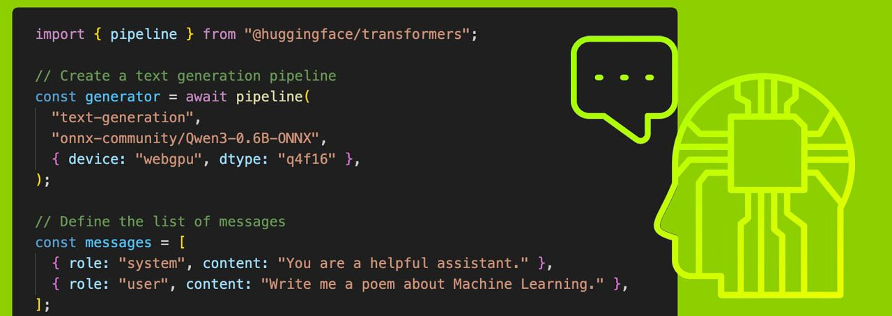
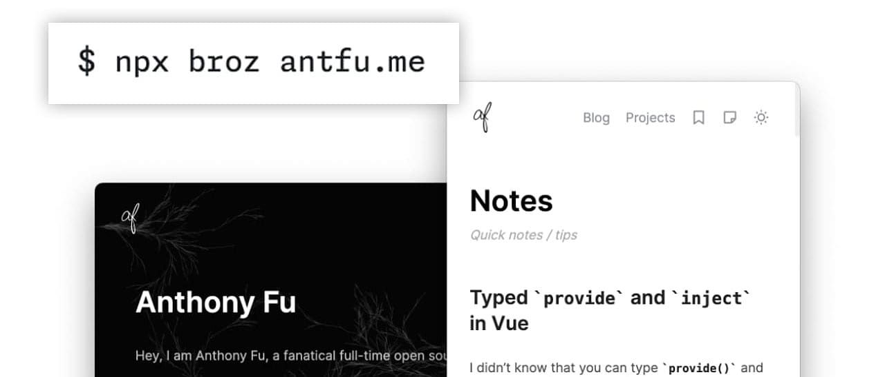

# An experimental Node environment in the browser

 

TypeScript 6.0 enters beta, but what does it mean for Node developers?

[TypeScript 6.0 is now in beta.](https://nodeweekly.com/link/180632/web) It's a _"clean up your tsconfig"_ release, not meant to wow but to make sense as a _bridge_ to the eventual [Go-powered 'native' TypeScript 7 compiler.](https://nodeweekly.com/link/180633/web)

There are, however, several notable updates for Node developers:

- [`--strict` is now true by default.](https://nodeweekly.com/link/180674/web) Projects that relied on the previous default of `false` will need to set it explicitly.
- [`types` now defaults to `[]`](https://nodeweekly.com/link/180669/web) which will affect many projects. `rootDir` now defaults to `.` too, which can silently change your output directory structure.
- [Subpath import starting with `#/`](https://nodeweekly.com/link/180670/web), so packages can use a simple prefix for subpath imports without needing an extra segment.
- [The inclusion of types for Temporal.](https://nodeweekly.com/link/180671/web)
- `--esModuleInterop` and `allowSyntheticDefaultImports` can [no longer be set to `false`.](https://nodeweekly.com/link/180672/web) If you have imports that rely on the old behavior, you may need to adjust them.
- And, unsurprisingly, a lot more, though here are the [breaking changes and deprecations](https://nodeweekly.com/link/180673/web) to be aware of.

  
- [Memetria K/V: Efficient Redis & Valkey Hosting](https://nodeweekly.com/link/180631/web "dashboard.memetria.com") — Memetria K/V hosts Redis OSS and Valkey for Node.js apps, featuring large key tracking and detailed analytics. **_\--- Memetria sponsor_**
  
- [npmx: A Better npm Registry Package Browser](https://nodeweekly.com/link/180634/web "npmx.dev") — A new, fast way to browse the [official npm registry](https://nodeweekly.com/link/180635/web). The search works well, and you see more data on package pages (e.g. [`axios`](https://nodeweekly.com/link/180636/web)). It's not a replacement for the registry, but makes browsing `npmjs․com` feel outdated. The [package comparison tool](https://nodeweekly.com/link/180637/web) is neat too. **_\--- npmx_**
  
- [How to Make an HTTP Request in Node.js](https://nodeweekly.com/link/180638/web "nodejsdesignpatterns.com") — Easy. Just use `fetch`, right? Okay, how do we use it, how do we set timeouts, how do we stream requests and responses? Retries. Concurrent requests. Mocking. There’s a lot involved and Luciano does a fantastic job of boiling down the techniques, as well as when to consider using Undici or `http`/`https` directly. **_\--- Luciano Mammino_**

**IN BRIEF:**

- 👀 Matteo Collina is [working on a first-class virtual file system module](https://nodeweekly.com/link/180639/web) for Node that integrates with `fs`.
- [Node.js 25.6.1 (Current)](https://nodeweekly.com/link/180640/web) has been released. It brings the new [`merve`](https://nodeweekly.com/link/180641/web) lexer for extracting named exports from CommonJS modules into play (it's [25% faster](https://nodeweekly.com/link/180642/web) than [`cjs-module-lexer`](https://nodeweekly.com/link/180643/web)).
- [Node.js 24.13.1 (LTS)](https://nodeweekly.com/link/180644/web) has been released with Unicode 17 URL parsing support, `crypto.hash` and `--build-snapshot` marked as stable, plus dependency updates and bug fixes.
- [ESLint 10.0 has been released](https://nodeweekly.com/link/180645/web) completing the removal of the `eslintrc` config system and introducing a new config lookup algorithm starting from the linted file (nice for monorepos).
- [Bun 1.3.9](https://nodeweekly.com/link/180646/web) adds the ability to run multiple `package.json` scripts concurrently/sequentially, `Bun.markdown.react()` gets faster, and regexes get a SIMD boost.

  
- [almostnode: Run a Node Environment in the Browser](https://nodeweekly.com/link/180647/web "almostnode.dev") — A _very_ experimental attempt to bring a Node.js (v20) runtime environment into the browser, complete with npm package support. Not ready for prime time, but an interesting idea with a neat live demo on the homepage. **_\--- Macaly_**
  
- [It’s About to Get a Lot Easier For Your JavaScript to Clean Up After Itself](https://nodeweekly.com/link/180648/web "piccalil.li") — A fun exploration of `Symbol.dispose` and `using`, two features available in Node 22.4+ that can ease many headaches around cleaning things up: closing connections, freeing resources, etc. **_\--- Mat Marquis_**
  
- [The Second Database Tax Is Real. Skip It](https://nodeweekly.com/link/180649/web "www.tigerdata.com") — Pipelines, lag, and drift - that's the tax of split infrastructure. Use Postgres for analytics on live data. [Try free](https://nodeweekly.com/link/180649/web). **_\--- Tiger Data sponsor_**
  

- 📄 [Is Node.js Single-Threaded… Or Not?](https://nodeweekly.com/link/180650/web) – A basic, diagrammed introduction to how some of Node’s internals work. **_\--- Estefany Aguilar_**

## 🛠 Code & Tools

  
- [Transformers.js v4 Preview Released](https://nodeweekly.com/link/180651/web "huggingface.co") — Transformers.js brings Hugging Face’s transformer models directly to the JavaScript world, meaning you can run numerous NLP, vision, and audio models right from Node.js. v4 is WebGPU powered and is now installable with `npm`. **_\--- Hugging Face_**
  
- [Ink 6.7: Build Rich Terminal Apps with React](https://nodeweekly.com/link/180652/web "github.com") — Used by Claude Code, Gemini CLI, Gatsby, Prisma, and others, Ink lets you use React’s component-based model for building terminal apps. v6.7 is notable for adding support for concurrent rendering and synchronized updates (less flicker!) **_\--- Vadim Demedes et al._**
  
- [VineJS 4.3: Form Data Validation Library for Node Apps](https://nodeweekly.com/link/180653/web "vinejs.dev") — A fast validation library for data received by your backend app, providing both runtime and static type safety, and handling form data and JSON payloads. [v4.3](https://nodeweekly.com/link/180654/web) supports converting validation schemas to JSON Schema. **_\--- VineJS Contributors_**
  
- [Shovel.js: What If Your Server Were Just a Service Worker?](https://nodeweekly.com/link/180655/web "shovel.js.org") — A full-stack framework and meta-framework built around the [Service Worker](https://nodeweekly.com/link/180656/web) model, where you use Web APIs for the server abstractions for a consistent experience across runtimes, whether Node, Bun, or edge platforms. **_\--- Brian Kim_**

> **📰 CLASSIFIEDS**
> 
> [Clerk's MCP Server](https://nodeweekly.com/link/180663/web) gives your AI coding assistant accurate auth snippets and patterns. [Now in public beta](https://nodeweekly.com/link/180663/web).

- 📄 [DOCX 9.5.2](https://nodeweekly.com/link/180657/web) – The popular `.docx` creation and manipulation library gets its first update in some time.
- [Prisma 7.4.0](https://nodeweekly.com/link/180658/web) – Gains a new caching layer and support for partial indexes.
- [Aedes 1.0](https://nodeweekly.com/link/180659/web) – Barebone MQTT server that can run on any stream server.
- [Awilix 12.1](https://nodeweekly.com/link/180660/web) – Inversion of Control (IoC) container for Node.
- [pnpm v10.29.3](https://nodeweekly.com/link/180661/web) – Fast, efficient package manager.
- [Orange ORM 5.0](https://nodeweekly.com/link/180662/web)

## 📢  Elsewhere in the ecosystem

- [broz](https://nodeweekly.com/link/180664/web) _(above)_ is a simple Node/Electron tool you can use via `npx` if you're tired of fidgeting around to get a screenshot of a site with a clean look. From the maintainer of [Shiki.](https://nodeweekly.com/link/180665/web)
- 🤯 _Promethee_ provides [UEFI bindings for JavaScript](https://nodeweekly.com/link/180666/web) so, yes, you can write a UEFI bootloader in JavaScript and play with it in QEMU! [Duktape](https://nodeweekly.com/link/180667/web) is the JavaScript engine behind the scenes.
- [webpack has shared its 2026 roadmap.](https://nodeweekly.com/link/180668/web) It includes support for a `universal` target to compile code to run on numerous runtimes, building TypeScript without loaders, CSS modules without plugins, and more.
