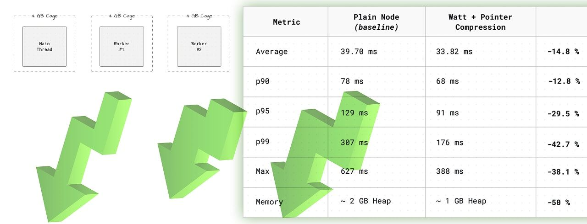

# Halving Node.js memory usage with pointer compression

#​612 — February 19, 2026

[Read on the Web](https://nodeweekly.com/link/180906/web)

  
- [Halving Node.js Memory Usage with Pointer Compression](https://nodeweekly.com/link/180908/web "blog.platformatic.dev") — Does 50% memory savings in production sound good? Cloudflare, Igalia, and the Node project have collaborated on `node-caged`, a Docker image containing Node 25 with V8 pointer compression enabled. Matteo digs into all the details here – this is neat work, though there are tradeoffs to consider. **_\--- Matteo Collina_**
  
- [Foundations of Agent Development](https://nodeweekly.com/link/180909/web "frontendmasters.com") — Create an AI agent from scratch in this detailed video course, hosted by Scott Moss. You'll learn tool calling, agent loops, evals, token usage monitoring, and more — including which agent framework might be right for you. **_\--- Frontend Masters sponsor_**
  
- [npm v11.10.0 Released](https://nodeweekly.com/link/180910/web "github.blog") — `npm install` gains a `--allow-git` flag that defaults to `all` for now, but is expected to become `none` in npm 12+. Maintainers can also now add/update trusted publishing configs across multiple packages in a single operation. Also, and curiously not covered in the release post, is [`--min-release-age`](https://nodeweekly.com/link/180911/web). **_\--- GitHub_**

**IN BRIEF:**

- [Node.js 25.6.1 (Current)](https://nodeweekly.com/link/180912/web) has been released replacing `cjs-module-lexer` with `merv`. [v24.13.1 (LTS)](https://nodeweekly.com/link/180913/web) has also been released.
- ⭐ [The Temporal API is close to being enabled by default](https://nodeweekly.com/link/180914/web) in a future Node.js release.
- Joyee Cheung has added the ability for Node [single executable applications (SEA)](https://nodeweekly.com/link/180915/web) to [support ESM entrypoints](https://nodeweekly.com/link/180916/web) (non-builtin access is not supported, but Matteo Collina's [work on a virtual file system module](https://nodeweekly.com/link/180917/web) may enable that).
- 🔒 npm package pages [now link directly to Socket's security analysis](https://nodeweekly.com/link/180918/web) for each package. Here's [the one for `express`](https://nodeweekly.com/link/180919/web), for example.
- Node's `zlib` is also about to get [support for custom Brotli compression dictionaries.](https://nodeweekly.com/link/180920/web)

  
- 📊 [Node.js vs Deno vs Bun Performance Benchmarks](https://nodeweekly.com/link/180921/web "www.repoflow.io") — A few weeks ago, RepoFlow did a handy [version-by-version Node benchmark](https://nodeweekly.com/link/180922/web) and now they’re back with some micro-benchmarks comparing Node, Deno and Bun. As always with benchmarks, apply a critical eye! **_\--- RepoFlow Team_**

## 🛠 Code & Tools

  
- [Introducing `@stoolap/node`: Fast Bindings to an Embedded SQL Database](https://nodeweekly.com/link/180923/web "stoolap.io") — [Stoolap](https://nodeweekly.com/link/180924/web) is a high-performance, pure-Rust embedded SQL database that compiles to WebAssembly ([play with it here](https://nodeweekly.com/link/180925/web)). It now includes NAPI-RS powered Node.js bindings. In this post, Semih tackles the inevitable _“Why not just use SQLite?”_ question: chiefly, lock-free MVCC means readers never block writers. **_\--- Semih Alev_**
  
- [fetch-network-simulator: Intercept `fetch` to Simulate Poor Network Conditions](https://nodeweekly.com/link/180926/web "github.com") — Intercepts `fetch` and applies rules to drop random requests, delay them, slow them down, etc. Or you could just switch to my mobile provider. **_\--- Karn Pratap Singh_**
  
- [Clerk Just Made Auth More Affordable — 50,000 MRUs Now Free](https://nodeweekly.com/link/180927/web "go.clerk.com") — MFA, device tracking, and satellite domains included in Pro. Unlimited apps on every plan. Automatic volume discounts. **_\--- Clerk sponsor_**
  
- [BrowserPod 1.0: Universal WASM-Powered In-Browser Sandboxes](https://nodeweekly.com/link/180928/web "labs.leaningtech.com") — From the team behind [CheerpX](https://nodeweekly.com/link/180929/web) comes a new browser-based code sandbox, launching with Node.js and with Python, Ruby, Go, and Rust planned next. Target use cases include in-browser agentic coding, web IDEs, and interactive docs, with the option to expose virtual services via public URLs. **_\--- Alessandro Pignotti_**
  
- [npm-check-updates 19.5: Find Newer Versions of Your Dependencies](https://nodeweekly.com/link/180930/web "github.com") — Specifically, newer versions than your `package.json` allows. Includes a `-i` interactive mode so you can look at potential upgrades and then opt in to them one by one. You can also specify ‘cooldown’ strings like “7d” or “12h” to limit suggestions to libraries that have been published for a certain amount of time. **_\--- Raine Revere_**
  
- [Tangerine: DNS over HTTPS for Node Apps](https://nodeweekly.com/link/180931/web "github.com") — A drop-in replacement for `dns.promises.Resolver` that performs DNS lookups over HTTPS (so-called [“DoH”](https://nodeweekly.com/link/180932/web)) with built-in retries, timeouts, smart server rotation, and more. **_\--- Forward Email_**
- [pnpm v10.30.0](https://nodeweekly.com/link/180933/web) – The [`pnpm why`](https://nodeweekly.com/link/180934/web) command now shows a reverse dependency tree.
- [jsdom 28.1](https://nodeweekly.com/link/180935/web) – Pure JS implementation of various web standards for testing and scraping web apps.
- [google-spreadsheet 5.2](https://nodeweekly.com/link/180936/web) – Wrapper for the Google Sheets API.
- [Mineflayer 4.35](https://nodeweekly.com/link/180937/web) – Create Minecraft bots with JavaScript.
- [qs 6.15.0](https://nodeweekly.com/link/180938/web) – Query string parsing and stringifying library.
- [typescript-eslint 8.56.0](https://nodeweekly.com/link/180939/web) – Now with ESLint 10 support.

📰 Classifieds

🚀 [HTML to PDF made easy.](https://nodeweekly.com/link/180940/web) One simple API that scales. PrinceXML under the hood for full CSS & JS support. EU-hosted, free to start.

---

🔥[JSNation 2026 lineup:](https://nodeweekly.com/link/180941/web) Matt Pocock, Luca Mezzalira & more speakers revealed! [Let’s talk modern web dev in beautiful Amsterdam this June](https://nodeweekly.com/link/180941/web).

## 📢  Elsewhere in the ecosystem

A few stories in the broader landscape:

- We're digging the newest member to Vercel's _Geist_ font family: [Geist Pixel](https://nodeweekly.com/link/180942/web) is an aliased/bitmap-style font that slots in nicely alongside [their existing sans and monospaced variants.](https://nodeweekly.com/link/180943/web)
- [Electrobun v1](https://nodeweekly.com/link/180944/web) is an interesting development in the Bun ecosystem - think Electron/NeutralinoJS, but for building cross-platform desktop apps on top of the system webview, Bun, and Zig. The big win is app bundle sizes as low as 12 megabytes. [More info here.](https://nodeweekly.com/link/180945/web)
- 🕹️ Not content to just [port Quake to run in the browser](https://nodeweekly.com/link/180946/web), the creator of Three.js has now [attempted a _Descent_ port too](https://nodeweekly.com/link/180947/web) ([source](https://nodeweekly.com/link/180948/web)).
- [Deno 2.6.10](https://nodeweekly.com/link/180949/web) has been released introducing [`deno install --compile`](https://nodeweekly.com/link/180950/web) for installing scripts as compiled executables.
