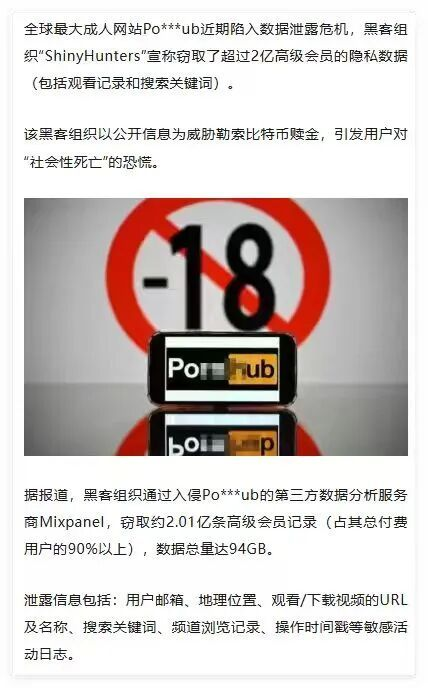

# 真社死了！P站出现个人信息泄露！波及到我了！

最近全球最大的XX网站 P站，发生了一件大事：**数据泄露**，也波及到我了，但我事先说明：**我浏览这个网站是带着学习的目的的，我是要学习这个网站的性能优化、资源加载、视频播放优化**

全球最大xx网站 P站 近期陷入数据泄露危机，黑客组织 “ShinyHunters” 宣称窃取了超过 2 亿高级会员的隐私数据（包括观看记录和搜索关键词）。

该黑客组织以公开信息为威胁勒索比特币赎金，引发用户对 “社会性死亡” 的恐慌。

据报道，黑客组织通过入侵 P站 的第三方数据分析服务商 Mixpanel，窃取约 2.01 亿条高级会员记录（占其总付费用户的 90% 以上），数据总量达 94GB。泄露信息包括：用户邮箱、地理位置、观看 / 下载视频的 URL 及名称、搜索关键词、频道浏览记录、操作时间戳等敏感活动日志。 。 据披露，此次泄露并非直接入侵 P站主站，而是黑客瞄准了其第三方合作方：数据分析服务商 Mixpanel。通过攻击这一薄弱环节，黑客窃取了约 2.01 亿条高级会员记录（覆盖该网站 90% 以上的付费用户），泄露数据总量高达 94GB。

被窃取的信息堪称 “隐私裸奔”：不仅包含用户邮箱、实时地理位置等基础信息，还涵盖了观看 / 下载视频的具体 URL 与名称、个人搜索关键词、频道浏览轨迹，以及每一次操作的时间戳等完整活动日志 —— 这些内容足以精准还原用户的私密行为偏好。

目前，黑客已明确以 **“公开数据” 为威胁索要赎金**。而对普通用户而言，一旦这些高度私密的信息流出，极可能导致个人社会形象崩塌（即网络语境中的 “社会性死亡”），因此相关恐慌情绪正持续扩散。

此次事件也再次警示：平台方需强化第三方服务商的安全审核，普通用户在使用各类平台时，也应提高隐私保护意识，避免敏感行为数据的过度暴露。

## 结语

我是林三心，一个待过**小型toG型外包公司、大型外包公司、小公司、潜力型创业公司、大公司**的作死型前端选手

我建了一些**前端学习群**，如果大家想进群交流前端知识，可以关注我，回复**加群**
