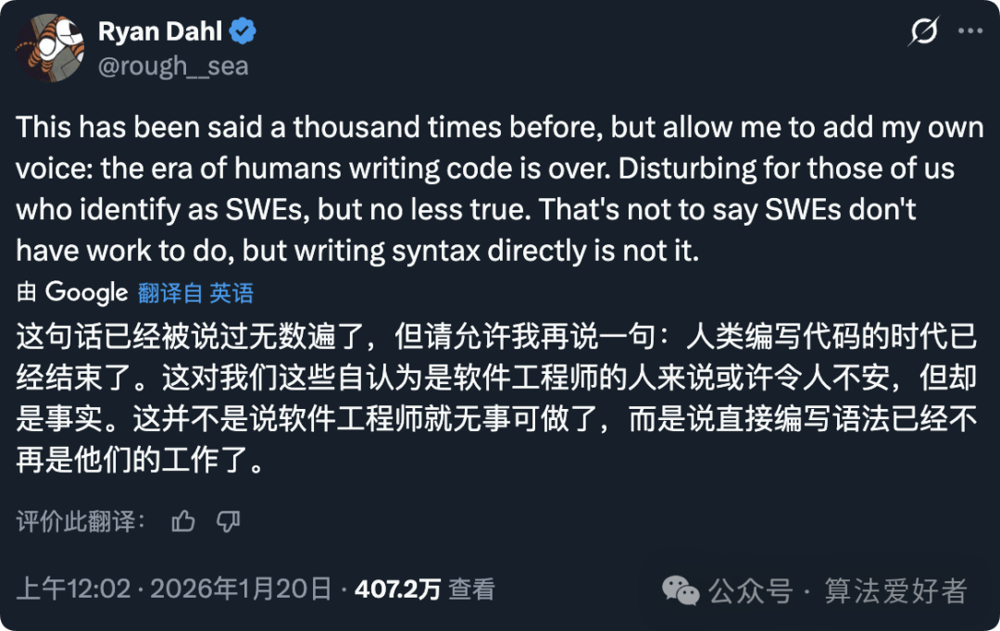

# Nodejs 之父“宣布”：手搓代码的时代已经结束了

1 月 20 日，Node.js 之父 Ryan Dahl 在 X 上的一条推文，直接点燃了全球程序员的讨论热潮。他写道：

**“人类手写代码的时代已经结束。这对我们这些自称为软件工程师的人来说有些令人不安，但这就是事实。不是说工程师没事干了，只是我们不再需要直接写语法了。”**

这瞬间戳中了开发者们的焦虑点，短短一天就收获了 400 多万次阅读。有人觉得这是危言耸听，也有人认为这是行业变革的宣言。

### 网友吵翻了天，观点分成几派

**趋势派**：有人直接点明，未来的开发者更像“乐团指挥”，工作重点将从“逐行敲代码”转向**架构设计、给 AI 写提示词、搭建数据管道、测试监控，以及收拾 AI 留下的烂摊子**。

还有开发者认为，软件行业的竞争优势正在从“拥有代码和团队”转向“拥有更敏锐的想法和更快的执行速度”。

**理性派**：也有不少人泼冷水，认为“靠 AI 暴力生成代码不是真正的抽象，经济上根本不划算”。更有人补充，AI 确实能快速做出 MVP，但在复杂的企业级场景里，涉及高并发、安全合规的部分，依然离不开人类工程师。

还有网友模仿 Ryan 的句式调侃：“**人类和人类对话的时代结束了。这对我们这些外向的人来说很困扰，但 AI 代理会替我们聊天**。” 

你觉得手写代码的时代真的要结束了吗？欢迎在评论区留下你的观点，有任何问题也可以 **@元宝** 来聊聊。

（参考：x.com/rough\_\_sea/status/2013280952370573666，本文经由 AI 优化）
