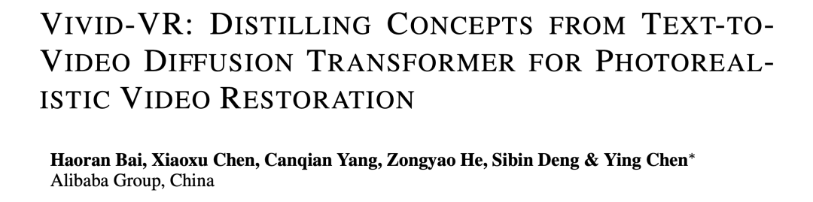
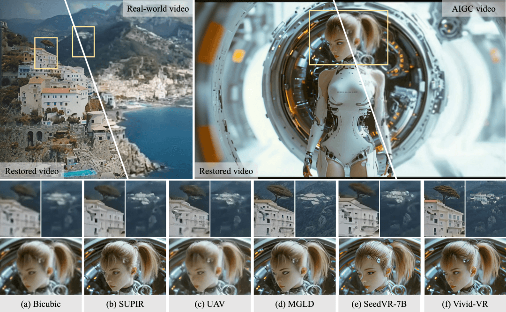
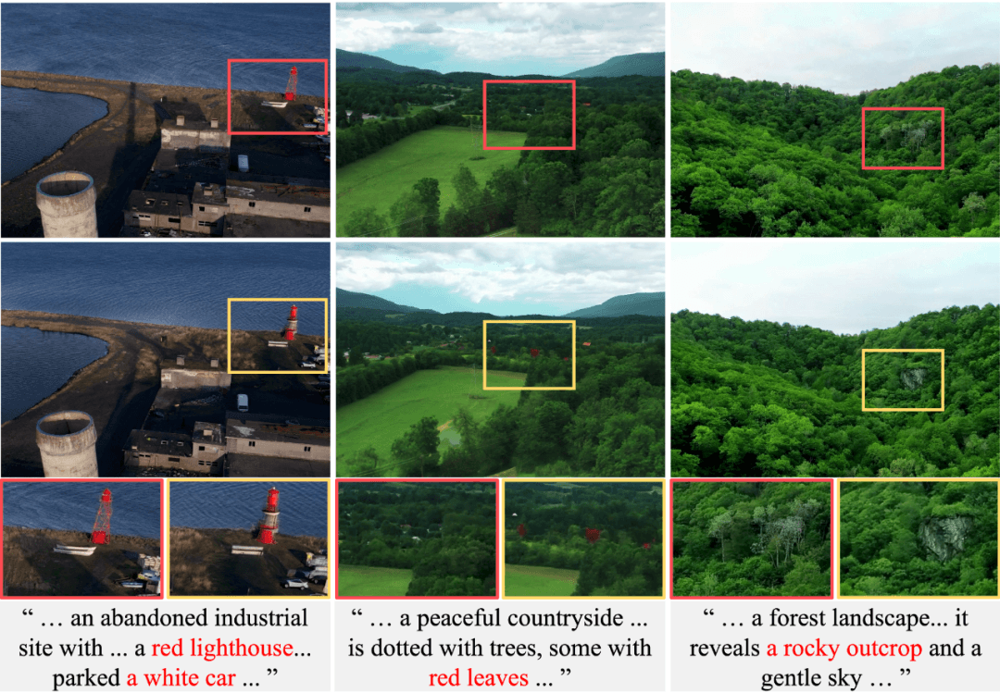
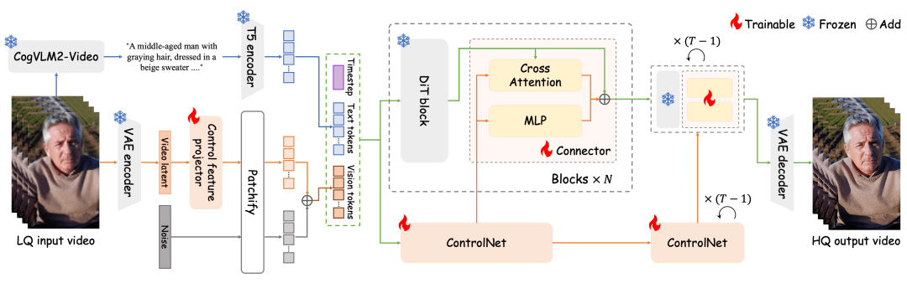
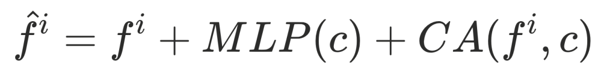
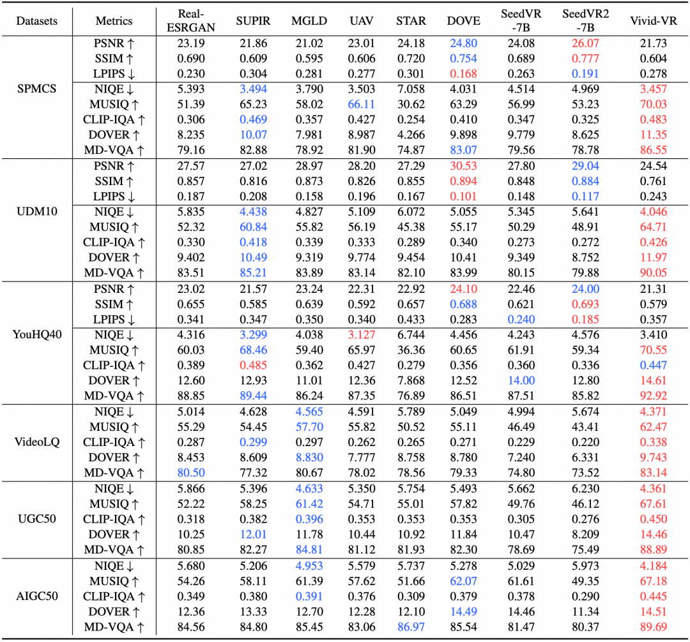
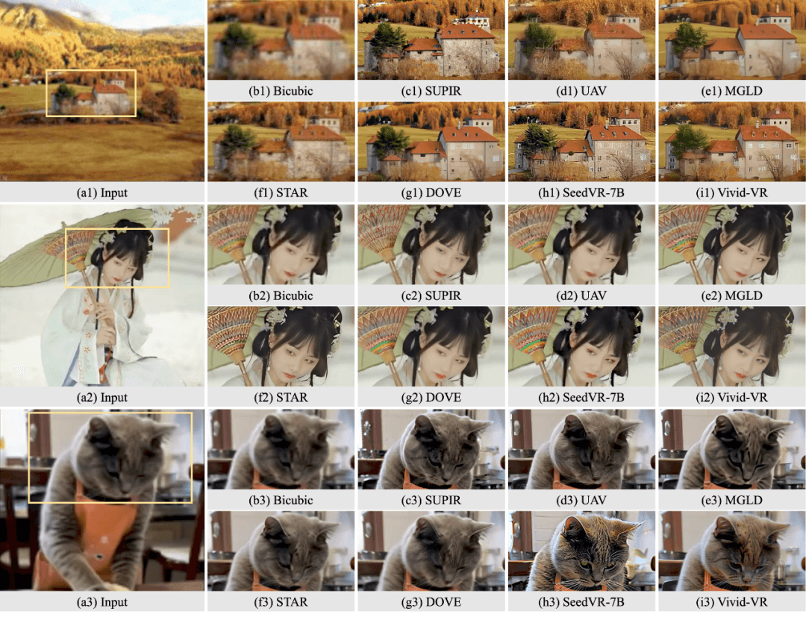
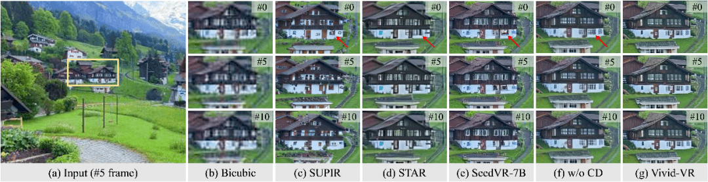
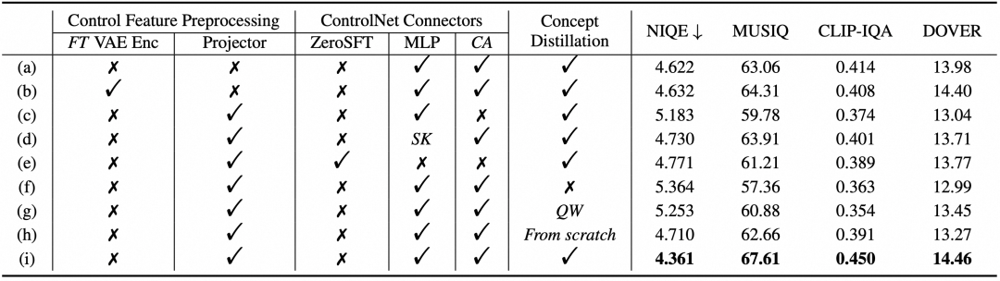
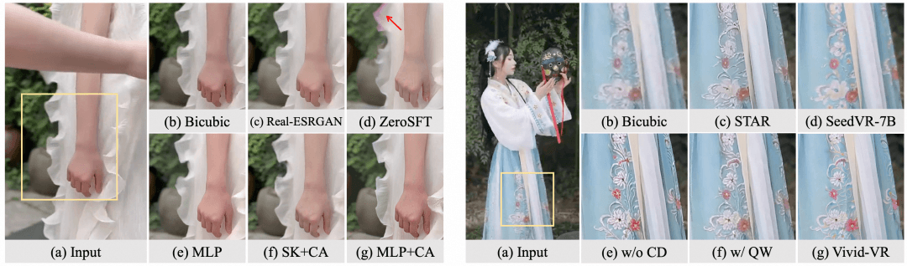

# ICLR 2026 | 基于概念蒸馏的生成式视频复原算法Vivid-VR

  

  

  

本文介绍了由淘天音视频技术团队提出的一种名为**Vivid-VR**的生成式视频复原算法，该成果已被顶级会议ICLR 2026收录。针对现有基于扩散模型的视频复原方法在微调过程中容易出现的“分布漂移”问题（导致纹理失真和时序不一致），Vivid-VR创新性地提出了**“概念蒸馏”**训练策略，利用T2V基座模型自身合成与文本完美对齐的训练数据，将基座模型的概念理解能力迁移至复原任务中。此外，文章还设计了**控制特征投影器**以过滤输入视频的退化伪影，以及**双分支连接器**以动态融合控制特征。实验结果表明，Vivid-VR在真实拍摄视频和AIGC视频上，均在纹理真实感、视觉生动性和时序一致性方面显著优于现有的SOTA方法。  

  

论文背景介绍

  

  

ICLR（International Conference on Learning Representations），又称国际表征学习大会，是机器学习领域全球顶级学术会议之一，重点关注与深度学习相关的前沿研究。该会议每年举办一次，其收录的论文往往代表了未来几年AI技术演进的风向标。 ICLR 2026收到创纪录的近19,000篇有效投稿，整体录用率约28%。此篇被收录论文属于基于生成式大模型的视频复原领域，由淘天音视频技术团队独立完成。

  

在视频复原领域，尽管基于扩散模型的方法已在图像复原上取得了惊人成果，但如何将T2V大模型成功应用至视频复原任务，仍面临巨大挑战。由于微调过程中存在的“分布漂移”问题，现有的生成式视频复原方法往往在纹理真实感和时序一致性上表现欠佳。针对这一痛点，淘天音视频技术团队自研了一种基于概念蒸馏的生成式视频复原模型——Vivid-VR，在真实拍摄视频和AIGC视频上，均显著优于现有方法，表现出令人印象深刻的纹理真实感、视觉生动性和时间一致性。

论文下载链接：https://arxiv.org/abs/2508.14483

项目开源地址：https://github.com/csbhr/Vivid-VR

  

论文摘要

  

此篇论文提出了Vivid-VR，一种基于DiT架构的生成式视频复原方法。该方法基于T2V基础模型构建，并利用ControlNet来控制生成过程以确保内容一致性。然而，传统微调方法由于多模态对齐的不完美，极易导致“分布漂移”，从而降低生成视频的纹理真实感和时序连贯性。为解决这一难题，本文创新性地提出了一种“概念蒸馏”（Concept Distillation）训练策略，利用预训练的T2V模型自身来合成内嵌文本概念的训练样本，从而将其概念理解能力“蒸馏”到复原模型中。此外，为了增强生成的可控性，本文重新设计了控制架构的两个关键组件：（1）控制特征投影器（Control Feature Projector），用于过滤输入视频潜在空间中的退化伪影；（2）双分支连接器（Dual-branch Connector），结合MLP特征映射与交叉注意力机制，实现控制特征的动态检索。大量实验表明，Vivid-VR在合成数据集、真实世界视频以及AIGC视频上的表现均优于现有方法，表现出令人印象深刻的纹理真实感、视觉生动性和时序一致性。

  

图1. 在真实拍摄视频和AIGC视频上的视频复原结果对比

  

具体方法

  

在生成式视频复原的新范式下，如何利用强大的T2V基座模型修复低质视频，同时避免基座模型在微调过程中“遗忘”原有的生成能力，是学术界关注的焦点。淘天音视频技术团队发现，现有的微调方法会导致模型偏离其原始的潜在分布，即“分布漂移”。为了解决这个问题，Vivid-VR从数据策略和模型架构两个维度进行了重构。

  

#### **▐**  **核心痛点**

  

目前基于T2V的视频复原方法，通常需要“低质视频”和对应的“文本描述”作为输入。在构建训练数据时，通常使用视觉语言模型（VLM），根据视频中生成匹配的文本描述。但现有的VLM模型生成的文本描述，往往无法与视频内容完美对齐，如图2所示。在微调过程中，这种“图文不符”的噪声数据会导致模型产生“分布漂移”问题，表现为生成的视频纹理失真以及帧与帧之间的闪烁或形变。

  

#### **▐**  **概念蒸馏训练策略**

  

为了解决分布漂移问题，我们并未盲目追求更昂贵的VLM标注模型，而是提出了一种巧妙的“概念蒸馏”策略。该策略利用T2V基座模型本身的生成能力来构建训练数据。

  

海量高质量训练视频构建

为了满足基于DiT架构方法的训练需求，我们收集了 300 万高清视频（涵盖了广泛的场景，包括人像、自然景观、动植物、城市景观等）。为了确保视频质量，利用多种质量评估算子进行筛选，以删除低质量视频。对于剩余视频，我们进一步使用VLM模型生成对应的文本描述。最终精选的多模态训练数据集包含 50 万个文本-视频对，质量和多样性都非常出色。

  

概念蒸馏样本合成

由于VLM模型的限制，构建的文本-视频数据对并未完美对齐（参见图2第一行），这可能会导致微调期间出现“分布漂移”问题。虽然开发更准确的VLM模型可以提升文本视频对齐，但有两个缺点：成本昂贵；无法消除在T2V模型的潜在空间的差异，仍然可能导致分布漂移。

  

为此，我们采用 T2V 模型本身来执行文本引导的Video-to-Video任务，生成用于蒸馏的训练数据。具体来说，给定一个文本-视频对，我们对源视频施加特定强度的噪声，然后使用T2V基座模型，在文本描述的引导下对噪声视频进行去噪重构。如图 2（第二行）所示，生成的视频很大程度上保留了源内容，但修改了一些概念以更好地与文本描述中的内容保持一致。我们采用上述过程生成 10万 样本对，将其与原始训练数据集混合在一起，用于对我们基于 DiT 的视频复原模型进行微调。

  

这一过程中，生成的视频在T2V模型的潜在空间中与文本描述实现了天然的完美对齐。将这些合成数据混合到训练集中，Vivid-VR成功地将T2V基座模型对文本概念的深刻理解转移到了视频复原模型中，有效缓解了“分布漂移”问题，保留了T2V基座模型的生成质感。

  

图2. 由所提出的概念蒸馏策略生成的示例视频。第一行显示源视频，第二行显示通过 T2V 模型嵌入文本概念后相应生成的视频。由于 VLM 的限制，源视频与其文本描述的对齐不完美，而生成的视频具有更好的模态对齐。

  

#### **▐**  **模型架构**

  

图3给出了所提方法的模型架构示意图，除了数据策略，本文在架构设计上也针对DiT特性进行了两项关键改进：控制特征投影器 (Control Feature Projector)、双分支连接器 (Dual-branch Connector)。

  

图3. 所提方法的模型架构示意图

###   

### 控制特征投影器

直接将低质视频的Latent特征输入ControlNet会引入大量退化信息（如模糊、压缩伪影）。本文设计了一个轻量级的特征投影器，使其在特征进入生成流程前，有效滤除退化伪影，得到更纯净的控制信号。这个控制特征投影器由三个级联的时空残差卷积模块组成，相比于联合微调整个VAE编码器的高昂成本，该方案在极低的计算开销下实现了类似的效果。

###   

### 双分支连接器

当前常用的ControlNet连接器（如ZeroMLP、ZeroSFT）难以充分融合DiT特征。本文设计了全新的双分支连接器结构：，其中：

- MLP分支：负责控制特征的映射；
- Cross-Attention分支：利用注意力机制动态检索相关的控制特征；

这种设计既保留了控制特征的内容结构，又实现了对控制信号的自适应调制，显著提升了生成质量。

  

实验论证与结果

  

为了全面评估Vivid-VR的性能，我们在合成数据集（SPMCS，UDM10，YouHQ40）、真实世界数据集（VideoLQ，UGC50）以及AIGC视频数据集（AIGC50）上进行了广泛测试，并与现有的基于重建的方法（Real-ESRGAN）、生成式图像复原方法（SUPIR）、生成式视频复原方法（MGLD，UAV，STAR，DOVE，SeedVR）进行了对比。

  

#### **▐**  **定量评估**

##   

## 如表1所示，在NIQE/MUSIQ/CLIP-IQA/DOVER/MD-VQA等反映人类视觉感知的无参考质量评价指标上，Vivid-VR取得了压倒性优势。特别是在AIGC视频增强任务中，Vivid-VR展现了极强的泛化能力。

##   

表1. 定量评估结果，包括合成视频（SPMCS、UDM10、YouHQ40）、真实视频（VideoLQ、UGC50）和 AIGC 视频（AIGC50）

##   

#### **▐**  **定性评估**

  

可视化对比（图4、图5）展示了Vivid-VR在纹理真实感、视觉生动性、时序一致性上的出色表现：

- 结构重建：在处理模糊的房屋结构时，Vivid-VR能生成清晰、合理的门窗线条，而其他方法往往出现结构扭曲；
- 纹理质感：在人像和动物毛发处理上，Vivid-VR生成的发丝根根分明，肤质细腻自然，避免了常见的“过度磨皮”或“油画感”；
- 时序一致性：Vivid-VR在视频序列中能保持物体结构的高度稳定（如窗户形状不随时间变形），而SUPIR存在帧间跳变，其他方法则出现纹理闪烁。

  

图4. 定性评估结果，包括合成视频（第一行）、真实世界视频（第二行）和 AIGC 视频（第三行）

  

图5. 在时序一致性上的可视化比较结果

  

## 

#### **▐**  **消融实验**

  

为了探索不同模块对模型性能的贡献，我们进行了消融试验。表2和图6的结果表明：控制特征投影器、双分支连接器、概念蒸馏策略均能有效提升模型性能。

  

表2. 消融实验定量评估结果

  

图6. 消融实验定性评估结果，左图展示双分支连接器的作用，右图展示概念蒸馏的作用

  

总结与展望

  

我们提出了一种基于DiT架构的生成式视频复原模型Vivid-VR。通过创新性的概念蒸馏训练策略，有效解决了微调大模型时的分布漂移难题。配合轻量级的控制特征投影器和双分支连接器，Vivid-VR在纹理细节、视觉生动性和时序连贯性上均显著优于现有SOTA方法。

  

尽管效果拔群，但基于5B参数的T2V基座模型使得Vivid-VR的推理成本较高。未来的工作将致力于提升算法效率，例如探索单步/少步扩散技术，力求在保持高画质的同时实现更快的推理速度，推动该技术在实际工业场景中更广泛的落地。

#   

团队介绍

  

该工作由淘天音视频技术团队独立完成，该团队服务国民app淘宝中直播、逛逛、首页信息流等丰富的视频业务场景，致力于行业领先的音视频技术创新和应用，帮助创造极致的消费者体验。团队成员来自海内外知名高校，先后在在MSU世界编码器大赛，NTIRE视频增强超分竞赛这样的领域强相关权威赛事上夺魁，并重视与学界的合作与交流。

  

值得一提的是，团队主导设立了淘天博士后工作站，进一步强化了我们在前沿技术研发上的实力和人才培养的能力。自成立以来，工作站累计招收十余位博士后研究人员，发表高水平学术论文近20篇，多项研究成果已在淘宝核心业务场景实现规模化落地，切实推动学术研究与商业应用的融合。

  

团队兼顾算法创新与工程应用，为视频生产，直播推流，美颜美化，视频特效互动，视频渲染，视频修复、生成，视频编码，视频传输，视频播放等完整链路提供底层音视频技术，保障视频、语音、图片相关业务的流畅度和音画质体验。

  

团队聚焦多媒体AIGC算法研发，积累多模态内容理解、图像生成与编辑、可控视频生成等技术能力，为直播、首页信息流、搜索与推荐等相关业务场景提供技术支持，赋能内容生产与直播场景的创新体验。

  

  

  

**¤** **拓展阅读** **¤**

  

[3DXR技术](https://mp.weixin.qq.com/mp/appmsgalbum?__biz=MzAxNDEwNjk5OQ==&action=getalbum&album_id=2565944923443904512#wechat_redirect) | [终端技术](https://mp.weixin.qq.com/mp/appmsgalbum?__biz=MzAxNDEwNjk5OQ==&action=getalbum&album_id=1533906991218294785#wechat_redirect) | [音视频技术](https://mp.weixin.qq.com/mp/appmsgalbum?__biz=MzAxNDEwNjk5OQ==&action=getalbum&album_id=1592015847500414978#wechat_redirect)

[服务端技术](https://mp.weixin.qq.com/mp/appmsgalbum?__biz=MzAxNDEwNjk5OQ==&action=getalbum&album_id=1539610690070642689#wechat_redirect) | [技术质量](https://mp.weixin.qq.com/mp/appmsgalbum?__biz=MzAxNDEwNjk5OQ==&action=getalbum&album_id=2565883875634397185#wechat_redirect) | [数据算法](https://mp.weixin.qq.com/mp/appmsgalbum?__biz=MzAxNDEwNjk5OQ==&action=getalbum&album_id=1522425612282494977#wechat_redirect)
