# Kimi 的一体化，Manus 的分层

## 一、

前天，Kimi 突然发布了[旗舰模型 K2.5](https://www.kimi.com/blog/kimi-k2-5.html)，事先没有一点风声。

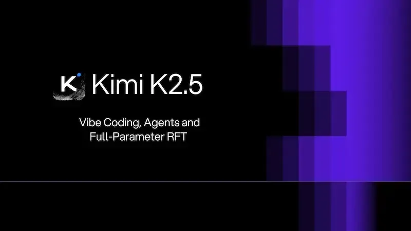

在国内，Kimi 是比较低调的公司，关注度相对不高。但是，它的产品并不弱。

半年前，K2 模型一鸣惊人，得到了很高的评价，公认属于全球第一梯队。所以，新版本 K2.5 出来以后，立刻上了新闻，在黑客新闻、推特等平台都是热门话题。

著名开发者 Simon Willion 当天就写了[详细介绍](https://simonwillison.net/2026/Jan/27/kimi-k25/)。

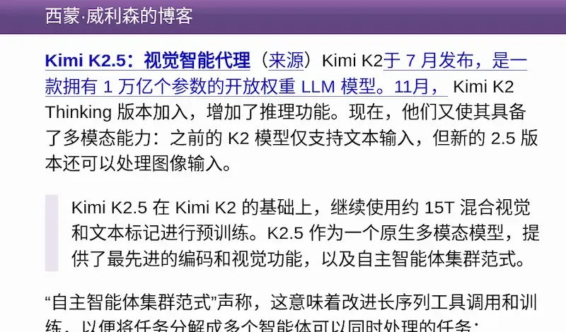

但是，这一次真正有趣的地方，不是模型本身，而是 Kimi 做了另一件事。

## 二、

这次的 K2.5 很强，各方面比 K2 都有进步。官方给出的评测跑分，基本都是全球前三位，甚至第一名（见[发布说明](https://www.kimi.com/blog/kimi-k2-5.html)）。

根据 LMArena（现改名为 arena.ai）的[榜单](https://x.com/arena/status/2016294725813465114)，Kimi K2.5 的编码能力，是所有开源模型的第一，在总榜上仅次于 Claude 和 Gemini（下图）。

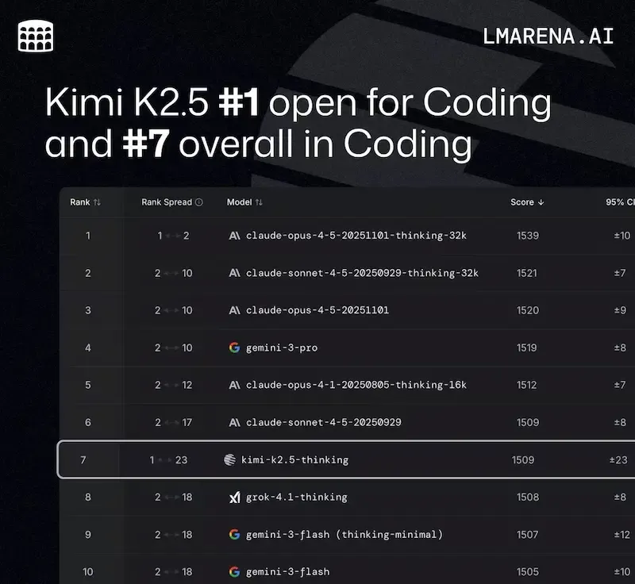

但是，最大的亮点其实不是模型，而是 Kimi 同时发布了一个基于这个模型的 Agent（智能体）。

也就是说，**这次其实同时发布了两样东西：K2.5 模型和 K2.5 Agent**。K2.5 是底层模型，K2.5 Agent 则是面向最终用户的一个网络应用。

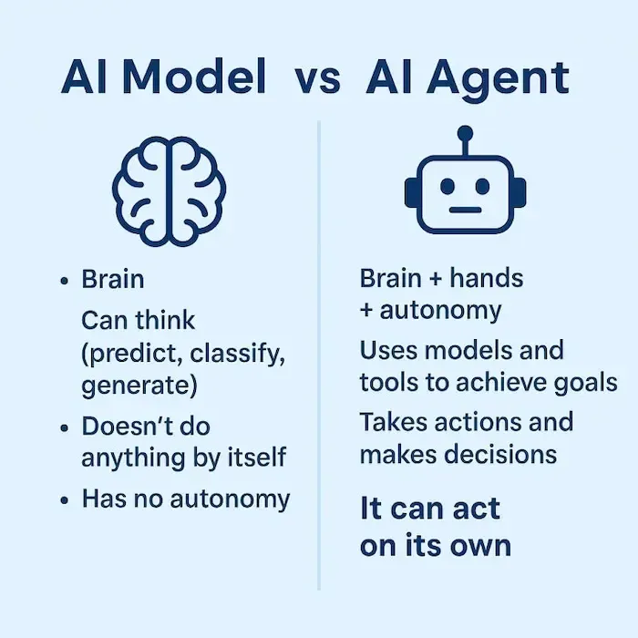

我的印象中，这好像是第一次，大模型公司这么干。以前发布的都是模型本身，没见过谁把模型和 Agent 绑在一起发布的。

这么说吧，Kimi 走上了一体化的道路。

## 三、

大家知道，大模型是底层的处理引擎，Agent 是面向用户的上层应用。

**它们的关系无非就是两种：分层开发和一体化**。前者是大模型跟 agent 分开，各自开发；后者是做成一个整体一起开发。

前不久，被 Meta 公司高价收购的 Manus，就是分层开发的最好例子。

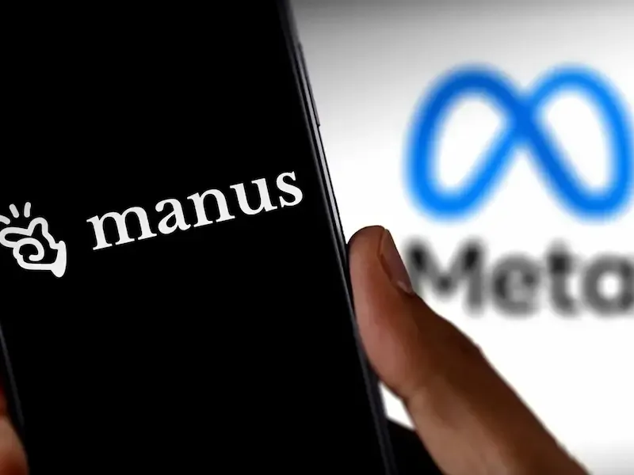

Manus 使用的模型是 Anthropic 公司的 Claude，它自己在其上开发一个独立的智能体，最终被收购。

它的成功鼓舞了许多人投入智能体的开发。因为模型的投入太大，不是谁都能搞的，而智能体的投入比较少，再小的开发者都能搞。

Kimi 这一次的尝试，则是朝着另一个方向迈出了一大步，把大模型和 Agent 合在了一起。毕竟，大模型公司自己来做这件事更方便，更有利于扩大市场份额、争取用户。

很难说，这两种做法哪一种更好。就像手机一样，苹果和安卓的外部应用，可以更好地满足用户需求，而自带的内置应用则能充分跟操作系统融合，用起来更顺滑。

## 四、

模型的测试已经很多了，下面我就来测一下，这次发布的 K2.5 Agent。

看得出来，Kimi 对 Agent 很重视，倾注了很大心血，[发布说明](https://www.kimi.com/blog/kimi-k2-5.html)的大部分篇幅介绍的都是 Agent 的功能。

其中有几个功能是比较常规的：

> （1）**Kimi Office Agent**：专家级的 Word、Excel、PowerPoint 文件生成。
> 
> （2）**Kimi Code**：对标 Claude Code 的命令行工具，专门用于代码生成。
> 
> （3）**长程操作**：一次性完成最多1500步的操作，这显然在对标以多步骤操作闻名的 Manus。

我比较在意的是下面两个全新的功能，都是第一次看到，其他公司好像没有提过。

> （4）**视觉编程**：通过模型的视觉能力，理解图片和视频，进而用于编程。只要上传设计稿和网页视频，就能把网页生成出来。
> 
> （5）**蜂群功能**（agent swarm）：遇到复杂任务时，Agent 内部会自动调用最多100个 Agent，组成一个集群，并发执行任务，比如并发下载、并发生成等。

碍于篇幅，我就简单说一下，我的"视觉编程"测试结果。

## 五、

首先，打开 [Kimi 官网](https://www.kimi.com/)，K2.5 已经上线了，能够直接使用（下图）。

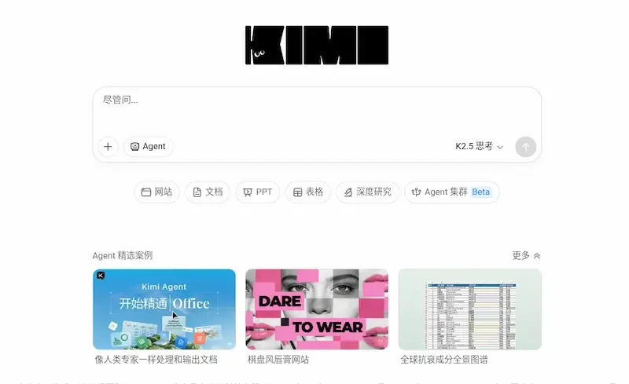

注意，模型要切换到"智能体模式" K2.5 Agent。

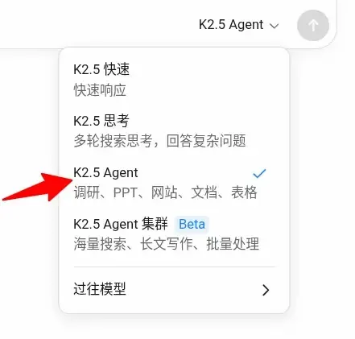

我的第一个测试是动效生成，即上传一段动画效果的视频，让它来生成。下面是原始动画，是用 [Lottie 库](https://lottiefiles.com/free-animation/cat-playing-animation-1cwXJbHzz7)做的。

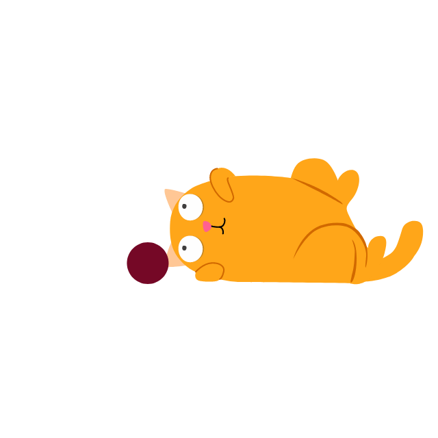

上传后，在网页输入提示词：

> 视频里面的动画效果，一模一样地在网页上还原出来

模型很快推断出，这是橘猫玩球的动画。然后，居然把动画每一帧都截图了，进行还原。

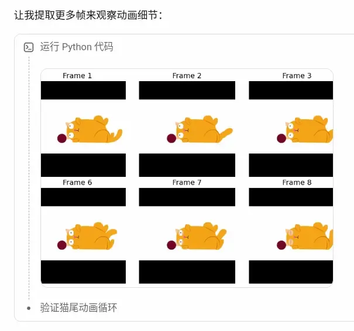

最终，它使用 Python 生成了 SVG 动画文件。

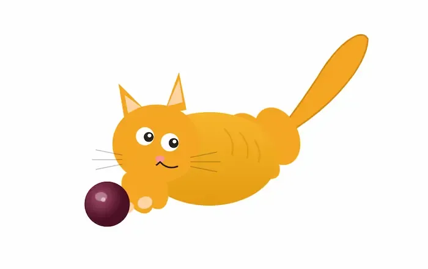

尾巴、眼球、小球滚动的动画效果，都正确还原出来了。可惜的是，主体的小猫是由多个 SVG 形状拼接而成，没法做到很像。

大家可以去[这个网址](https://64iapat2s7a4k.beta-ok.kimi.link/)，查看最终效果和网页代码。

## 六、

第二个测试是上传一段网站视频，让模型生成网站。

我在 B 站上，随便找了一个[设计师网站的视频](https://www.bilibili.com/video/BV1kerYBeE6H)。

大家可以去访问[这个网站](https://www.mialumialu.com/)，看看原始网页的效果。

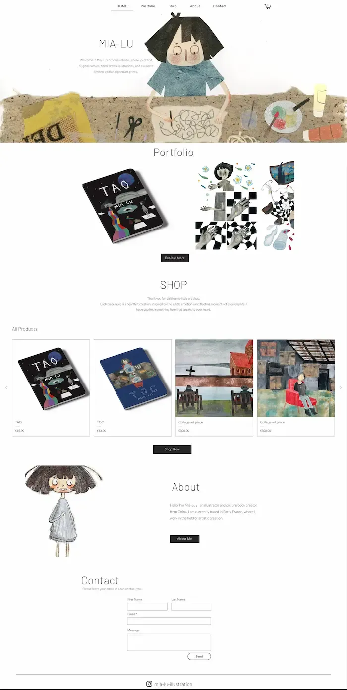

我把视频上传到模型，然后要求"把视频里面的网站还原出来"。

生成的结果（下图）完全超出了我的预期，还原度非常高，几乎可以直接上线。

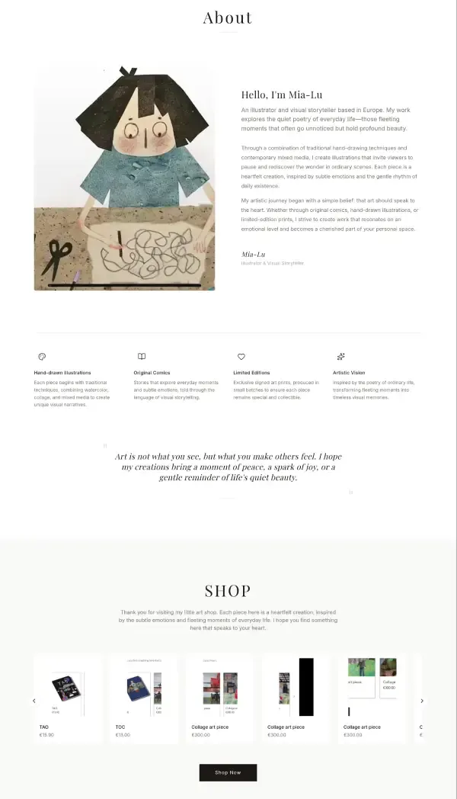

大家可以去[这个网址](https://rlxxxmcrekvqm.beta-ok.kimi.link/)，查看生成的结果。

## 七、

经过简单测试，我的评价是，Kimi K2.5 Agent 的"视觉编程"不是噱头，确实有视觉理解能力，完全能够生成可用的结果。

目前看上去，Kimi 这次"模型 + Agent"的一体化尝试是成功的。一方面，强大的 Agent 发挥出了底层模型的能力，方便了用户使用；另一方面，模型通过 Agent 扩展了各种用例，可以吸引更多的用户，有利于自身的推广。

最后，在当下国际竞争的格局之中，一体化还有一个额外的优势。

Manus 依赖的是美国模型，最终不得不选择在海外注册公司，而 Kimi 的底层模型是自研的，而且开源，完全不存在卡脖子的风险。

（完）
