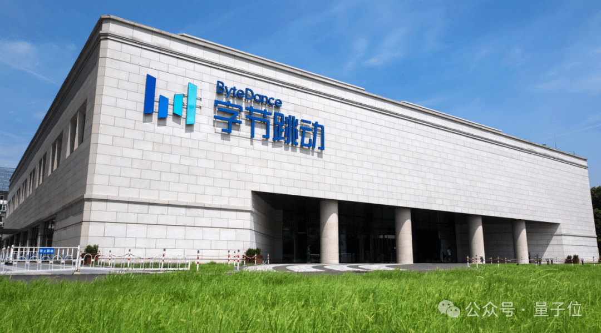

# 1 天净赚 9.6 亿！字节火速给全员涨薪

##### 转自：量子位 | 公众号 QbitAI

**1天净赚9.6亿**，字节火速给全员涨薪。

字节今年的核心财务数据被曝光了，相比去年大幅增长，直逼Meta。

丰富的弹药，给字节提供了AI人才大战的底气，直接就是一波全员涨薪。

谁羡慕了我不说。  

涨薪肯定是咱们打工人喜闻乐见的事情。不过奇怪的是，这一波却还有一些人比较忐忑，因为伴随着涨薪到来的，还有职级体系的变革，虽然变前职级是10档，变后还是10档。但却并不一定会一一对应。

到底咋回事儿？

## 1天净赚9.6亿，字节核心财务数据曝光

据彭博社报道，今年前三个季度字节跳动利润已突破400亿美元，目前已提前完成了内部设定的利润目标，预计今年字节利润将达到**500亿美元**，约合人民币**3520.8亿元**，简单计算一下，平均**每天净赚9.64亿元**，1秒赚1.11万元。

根据此前消息，字节今年营收预计将达到1860亿美元，相比去年增长了20%。结合营收和净利润数据，可进一步算出今年字节的净利润率将达到**26.9%**。预计营收和利润都接近了Meta。

字节业绩增长带动自身估值水涨船高。今年9月，字节跳动被曝以**3300亿美元**的估值，内部回购了部分员工股票。

2个月后，有报道称多家投资机构参与了字节跳动的部分股权竞拍，最初这笔股权定价约为2亿美元，对应的估值为3600亿美元。最终成交价上升至3亿美元，对应的估值为4800亿美元。

几乎在业绩被曝大涨的同一时间，字节发布了一封全员信，引发了更多热议。

## 字节最新全员信：全员涨薪和职级变革

字节发布的最新全员信，核心涉及两项调整：

**员工收入**和**公司职级**。

员工收入方面，全员信透露在今年绩效评估周期中，**字节调薪投入**将上涨1.5倍，用于提高员工薪资总包。

薪资又分为**现金**和**期权**，其中发放的现金占比将提高，总包类期权将从1次发4年（20%-25%-25%-30%），调整为1次发3年（30%-30%-40%）。

**绩效激励**也同步提升，公司总体的**奖金投入**将比上个周期上涨35%，通过**增加**绩效M及以上的**年终奖月数**体现。激励月数在3个月以内的，仍然是发现金。超过3个月的，原来都是发绩效期权，现在调整为25%发现金，75%发绩效期权。

从2026年1月起，**新给的绩效期权，其中有55%可以在拿到后立即参与回购**，剩余部分可在3年内逐步参与回购，每年15%。

总结一下就是，**员工直接能拿到的钱更多了，薪资总包的底薪和上限都提高了**。

与此同时，字节的职级体系也变了，新体系明年1月启用。

大家都听说过，以前字节的职级命名和其他大厂的P级、T级看上去不一样，都是“3-1或者2-2”这种形式，分为5级10档。

以后字节的职级将调整为L1-L10，全员信特别指出，**“目前‘1-1’实际使用率很低”，将和1-2整合为新职级中的L1**。

这也表明，虽然看上去还是10个等级，但不可能直接对应。字节将视目前职级、薪酬总包、能力和绩效情况，明年给员工划分新的职级。

字节在全员信中透露，**新职级体系能给员工提供更大的涨薪空间**。

所以职级体系的改革，仍然是指向了涨薪。

为什么此时此刻要涨薪？字节内部信的官方解释是：

我们所处的行业正面临新的机遇和挑战，公司希望更好地吸引，激励和保留优秀人才。

这里“新的机遇和挑战”，显然缘起大模型。而众所周知，大模型浪潮崛起后，大厂抢人其实并不是一件新鲜事，但这种争夺，过去一般围绕顶尖人才展开。

就在年终岁末的此时此刻，有玩家率先把抢人/留人大战的战火，从金字塔尖烧向全体员工。这体现出新一轮的AI竞争，既需要坐镇指挥的大将，也要有敢拼敢闯的千军万马。

毕竟如今底座成熟，智能涌现，赋能应用，全面落地开花，需要全方位的团队保障。

字节的最新动作，也向行业抛出了一个问题：

**跟吗？**

以下为全员信原文：

大家好，我们所处的行业正面临新的机遇和挑战，公司希望更好地吸引，激励和保留优秀人才，鼓励大家和公司业务一起，再上一个比过去更大的台阶。

为此，2026年，公司将继续加大人才投入，提高薪酬和激励回报的天花板，确保员工薪酬竞争力和激励回报在各个市场都领先于头部水平。基于此，公司将更新薪酬和激励政策，具体包括以下要点:

提高薪酬竞争力，加大调薪投入。

提高所有职级薪酬总包区间的上限和下限为更多同学提供更大的涨薪空间，也提高招聘场景的薪酬竞争力。

2025全年绩效评估周期，公司调薪投入将比上个周期上涨1.5倍，用于提高员工薪酬。

与此同时，薪酬发放将提高现金占比，减少期权/RSU占比，总包类期权/RSU发放将从1次发4年(每年归属节奏为20%-25%-25%-30%)，改为1次发3年(每年归属节奏为30%-30%-40%)。提升绩效激励，加大奖金投入2025全年绩效评估周期，公司奖金投入将比上个周期上涨35%，用于提升全年绩效M及以上的激励月数。

以薪酬总包中目标年终奖为3个月的情况为例:整体激励力度大幅提升。M激励月数下限不变，上限增加1.5个月;M+激励月数下限增加1.5个月，上限增加2.5个月;E激励月数下限增加3.5个月，上限增加3个月。

对于激励月数在3个月以内的部分，仍以现金形式发放。对于激励月数超过3个月的部分，发放形式将从100%发绩效期权/RSU改为25%发现金，75%发绩效期权/RSU(归属节奏不变，两者均按月匀速归属)。

从2026半年绩效评估周期起，半年激励(半年绩效E及以上的同学可获得)将加大激励力度，计算基数将从月薪调整为月总包(月薪+月期权/RSU)。

发放形式将从100%发现金，改为25%发现金，75%发绩效期权/RSU(两者均按月匀速归属)。

从2026年1月起，新授予的绩效期权/RSU，55%可在归属后立即参与回购，其余部分可在3年内逐步参与回购(每年15%)。

以上政策适用于正式员工。公司也将同步提升实习生薪酬标准，相关标准将于2026年1月1日生效。

与此同时，公司将应用新职级体系:

从”L1”到”L10”，共十级。目前职级体系中”1-1”实际使用率很低，将与”1-2”整合为新职级”L1”。

新职级与旧职级并非一一对应，而是以更高的标准重新定义了各职级能力要求，同时提高了所有职级薪酬总包区间上限和下限。在新职级体系下，更多同学有更大的涨薪空间。

新职级体系将在2026年1月1日启用，2025全年绩效评估将在2026年1月15日启动。因此，2025全年绩效评估周期将包含两个事项:

一是根据每位同学在2025年的职级和产出，评定全年绩效和激励；二是根据每位同学目前职级，薪酬总包，能力和绩效情况匹配到新职级。

参考链接：

\[1\]https://www.bloomberg.com/news/articles/2025-12-19/tiktok-owner-bytedance-on-track-for-50-billion-profit-in-2025

\[2\]https://finance.sina.com.cn/tech/discovery/2025-12-19/doc-inhciykf2129590.shtml

推荐阅读  点击标题可跳转

1、[VS Code 重磅更新：新增智能体管理功能，但是下架免费代码补全工具。网友：微软你倒是说清楚](https://mp.weixin.qq.com/s?__biz=MzAxODE2MjM1MA==&mid=2651623546&idx=1&sn=29fb73b4f44ba07213642366500afb4b&scene=21#wechat_redirect)

2、[使用 Chrome DevTools MCP 进行调试：让 AI 在浏览器中“拥有双眼”](https://mp.weixin.qq.com/s?__biz=MzAxODE2MjM1MA==&mid=2651623546&idx=2&sn=77024551ec6cefcbbb14b4c9dec21081&scene=21#wechat_redirect)

3、[JavaScript还能这样写？！ES2025新语法让代码优雅到极致](https://mp.weixin.qq.com/s?__biz=MzAxODE2MjM1MA==&mid=2651623535&idx=1&sn=5af68161cc72150298ed4a84ac721bcc&scene=21#wechat_redirect)
