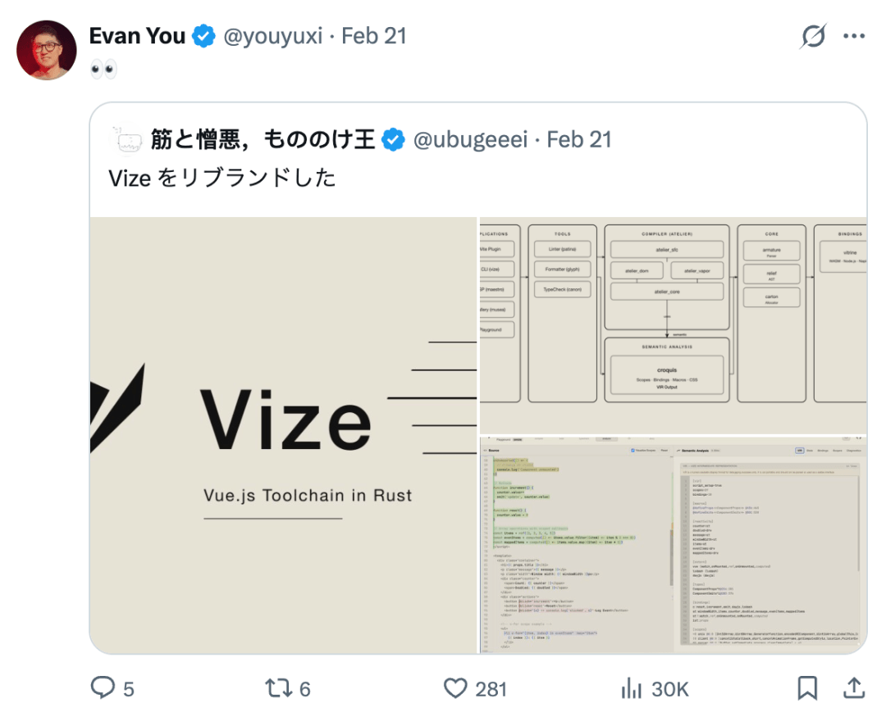
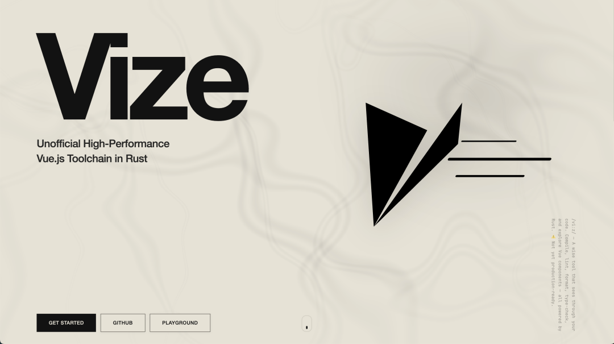
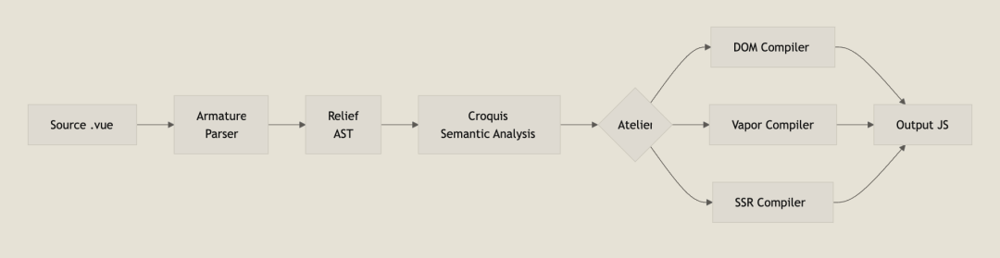
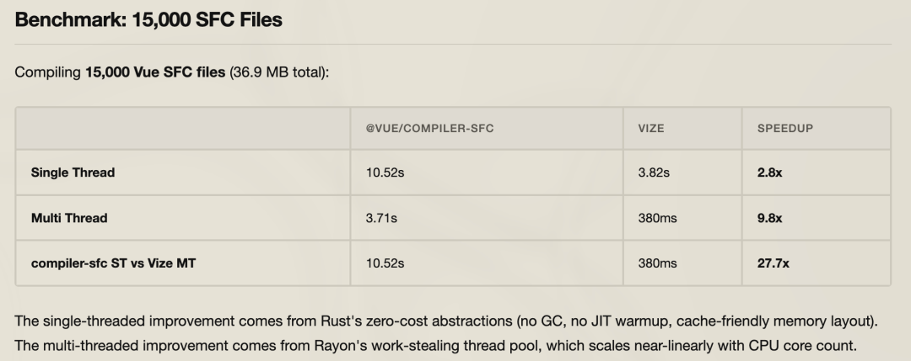
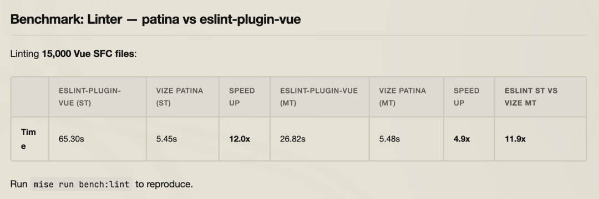
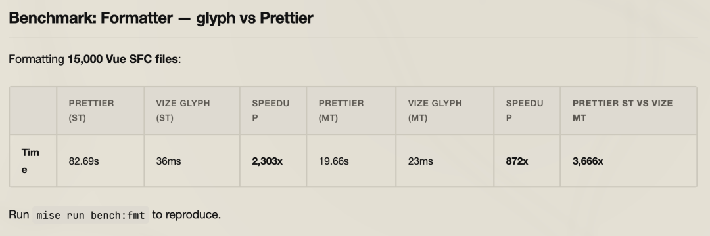
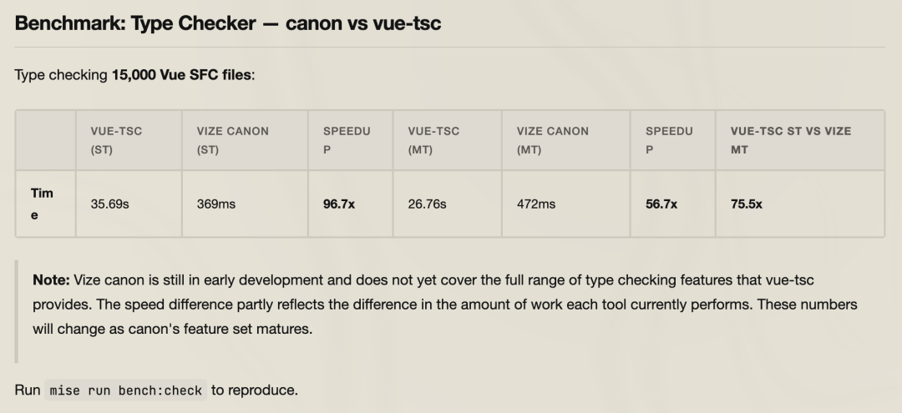

# 干掉 Vite ？尤雨溪开始 "强推" Vize ？

🔥 **Vue** 工具链要被重写了？

**Rust** 打造的 **Vize** 正在掀桌子！

前端这两年有一个明显**趋势**：

> **用 Rust 重写前端工具链。**

从打包器到编译器，从 `Lint` 到格式化，底层正在被全面`“原生化”`。

而这一次，轮到了 `Vue`。

一个正在快速演进的项目 ——**Vize**， 正在尝试用 `Rust` 重构整套 `Vue` 工具体系。

它不仅仅是“更快一点”， 而是想把 **Vue** 的`编译`、`分析`、`格式化`、`类型检查`、`IDE``支持`全部统一进一个高性能内核。

## 🧠 Vize 到底是什么？

> **Vize** = 用 **Rust** 重写 **Vue** 工具链。

它是一个 **非官方的高性能 Vue.js 工具体系**，覆盖：

- `SFC 编译`
- `Lint`
- `Formatter`
- `Type Check`
- `CLI`
- `LSP`
- `组件画廊`（类似 Storybook）
- `Vite 插件`
- `Nuxt 集成`
- `WASM 浏览器运行`
- `MCP / AI 集成`

你没看错—— 它不是一个插件，而是一整套**“Vue 开发底层重构计划”**。

## ⚔️ 它和 Vite 是什么关系？

很多人第一反应：

> 那它是不是要干掉 **Vite**？

答案：**不是同一个层级。**

- **Vite** 是通用构建平台
- **Vize** 是 `Vue` 编译与分析引擎

更准确理解：

`Vite = 构建平台 Vize = Vue 的高性能编译核心`

**Vize** 可以通过 `@vizejs/vite-plugin` 无缝接入 `Vite`， 作为 **Vue** 编译后端替换默认实现。

这更像是：

> 给 **Vite** 换一颗`“性能级引擎”`。

## 🚀 快速安装使用

安装 `CLI`：

`npm install -g vize`

核心`命令`：

`vize build vize lint vize fmt vize check`

它试图替代：

- `@vue/compiler-sfc`
- `eslint-plugin-vue`
- `prettier`
- `vue-tsc`

关键点在于：

> 所有能力共享同一个 `AST` 与解析器。

这意味着`更一致的语义分析`和`更少工具间不一致`问题。

## 🏗 架构设计：它为什么不只是“快一点”？

**Vize** 采用典型的 `Rust crate` 分层架构：

#### 第一层：基础解析层

- `Token 化`
- `Span 位置系统`
- `AST 构建`

#### 第二层：编译与转换核心

- `SFC 解析`
- `模板编译`
- `JS/TS 转换`
- `CSS scoped 处理`
- `Vapor 高级编译模式`

#### 第三层：开发工具层

- `Lint`
- `Formatter`
- `Type Check`
- `LSP`
- `CLI`
- `Musea` 组件画廊

这种结构带来一个巨大优势：

> 统一语义引擎驱动所有工具。

传统 **Vue** 工具链是“拼装车”：

- `编译器一套`
- `ESLint 一套`
- `Prettier 一套`
- `vue-tsc 一套`

而 **Vize** 是`“一体化引擎”`。

## ⚡ 性能：不是优化，是碾压

官方基准测试（`15,000` 个 `SFC` 文件）：

#### 编译速度

- 官方 **compiler**：`10.52s`
- **Vize** 单线程：`3.82s`
- **Vize** 多线程：`0.38s`

👉 多线程下接近 **27× 提升**

#### Lint

- **ESLint**：`65.30s`
- **Vize**：`5.45s`

👉 约 12× 提升

#### 格式化

- **Prettier**：`82.69s`
- **Vize**：`0.036s`

👉 理论上数千倍差距（极端场景）

#### Type Check

- **vue-tsc**：`35.69s`
- **Vize**：`0.369s`

👉 约 `50~90×` 提升

为什么这么快？

- 无 `GC`
- 无 `JIT` 预热
- `Rust` 零成本抽象
- `Rayon` 原生多线程
- `Arena` 内存分配
- `更高缓存命中率`

这不是微调，是底层模型差异。

## 🤖 更疯狂的是：AI 集成

**Vize** 还支持 `MCP（Model Context Protocol）`集成。

这意味着什么？

> **AI** 不再“猜”你的组件 `API`。

通过 **MCP Server**：

- **列出组件**
- **查询 props**
- **获取 slots**
- **获取默认值**
- **生成真实可运行示例**

配合 **Visual Studio Code** 的 `Agent` 模式，`AI` 可以：

- 直接理解你的组件库
- 自动生成准确示例
- 辅助重构
- 理解设计 `token`

## 🧩 与 Nuxt / WASM 的结合

**Vize** 支持：

- `Nuxt` 模块接入
- 浏览器内 `WASM` 编译
- 在线 `Playground` 场景
- `多环境`运行

这意味着它不仅是 `CLI`， 也是一个可嵌入式 `Vue 编译引擎`。

## ❗ 现在能生产使用吗？

还不行。

它仍处于`实验阶段`，`API` 可能变化。

但趋势往往在成熟之前就已经确定方向。

## 📌 总结一句话

如果说：

- **Vite** 解决了`“开发速度”`
- 那 **Vize** 正在解决`“工具链底层重构”`

它可能不会明天取代所有东西，

但它已经说明了一件事：

> **Vue** 的未来，不止是框架升级，而是工具链升级。

如果你是：

- **Vue 深度使用者**
- **工具链爱好者**
- **编译器技术关注者**
- **或对 AI + 前端感兴趣**

这个项目值得关注。

- **GitHub**：`https://github.com/ubugeeei/vize`
- **官网**：`https://vizejs.dev`

  

---

  

-   
- 我是 ssh，工作 6 年+，阿里云、字节跳动 Web infra 一线拼杀出来的资深前端工程师 + 面试官，非常熟悉大厂的面试套路，Vue、React 以及前端工程化领域深入浅出的文章帮助无数人进入了大厂。
- 欢迎`长按图片加 ssh 为好友`，我会第一时间和你分享前端行业趋势，学习途径等等。2025 陪你一起度过！
-   
- 
-   
- 关注公众号，发送消息：
  
  指南，获取高级前端、算法**学习路线**，是我自己一路走来的实践。
  
  简历，获取大厂**简历编写指南**，是我看了上百份简历后总结的心血。
  
  面经，获取大厂**面试题**，集结社区优质面经，助你攀登高峰

因为微信公众号修改规则，如果不标星或点在看，你可能会收不到我公众号文章的推送，请大家将本**公众号星标**，看完文章后记得**点下赞**或者**在看**，谢谢各位！
