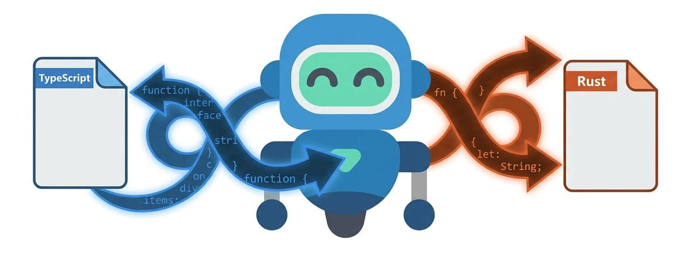
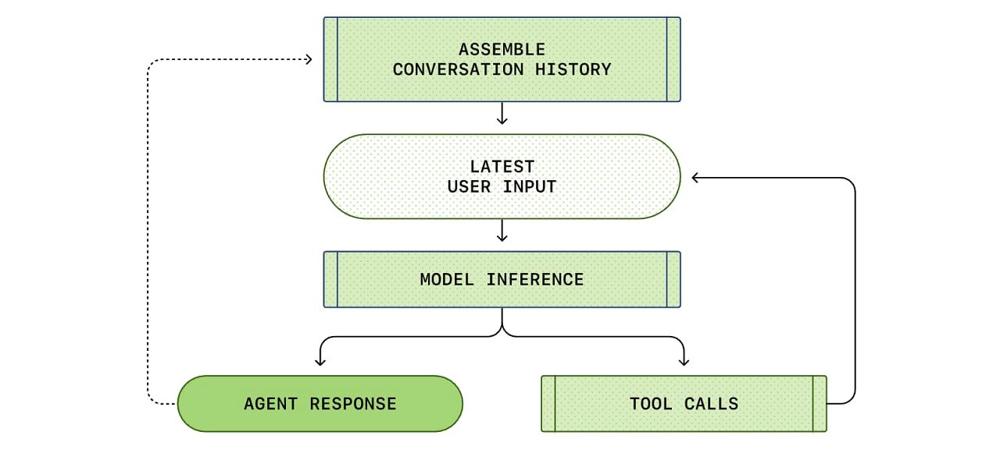

# What's next for JavaScript frameworks in 2026

#​770 — January 27, 2026

[Read on the Web](https://javascriptweekly.com/issues/770)

  
- [Introducing LibPDF: PDF Parsing and Generation from TypeScript](https://documenso.com/blog/introducing-libpdf-the-pdf-library-typescript-deserves "documenso.com") — [LibPDF](https://libpdf.documenso.com/) bills itself as _‘the PDF library TypeScript deserves’_ and supports parsing, modifying, signing and generating PDFs with a modern API in Node, Bun, and the browser. [GitHub repo.](https://github.com/libpdf-js/core) **_\--- Documenso_**
  
- [JavaScript Frameworks – Heading into 2026](https://dev.to/this-is-learning/javascript-frameworks-heading-into-2026-2hel "dev.to") — The creator of [SolidJS](https://www.solidjs.com/) knows more than a thing or two about JS frameworks and has written an annual review of the scene for the past few years. Here, he picks on four areas of evolution, and says it’s _“an incredibly exciting time to be working on JavaScript frameworks.”_ **_\--- Ryan Carniato_**
  
- [Still Writing Tests Manually?](https://www.meticulous.ai?utm_source=jsweekly&utm_medium=newsletter&utm_campaign=26q1&utm_content=primary) — Notion, Dropbox, Wiz, and LaunchDarkly have found a new testing paradigm - and they can't imagine working without it. Built by ex-Palantir engineers, Meticulous autonomously creates a continuously evolving suite of E2E UI tests that delivers near-exhaustive coverage with zero developer effort. **_\--- Meticulous AI sponsor_**

**IN BRIEF:**

- Lea Verou has celebrated getting two ECMAScript proposals she's championed to stage 1 at TC39 this week: [Composable Accessors](https://github.com/tc39/proposal-composable-accessors) and [Alias Accessors](https://github.com/tc39/proposal-alias-accessors). Rob Palmer also shares [more proposal updates from the latest TC39 plenary.](https://bsky.app/profile/robpalmer.bsky.social/post/3mcz334l4ck27)
- 🕹️ The creator of Three.js (known as mrdoob) has created [a Three.js-powered port of 1996's _Quake_](https://mrdoob.github.io/three-quake/) – [here's the source.](https://github.com/mrdoob/three-quake) You can learn more about this project [in this X thread.](https://x.com/mrdoob/status/2015076521531355583)
- 📊 [JSBenchmarks.com](https://jsbenchmarks.com/) is a fresh attempt to benchmark several popular JavaScript frameworks. As always with benchmarks, use a critical eye, but [the example apps](https://github.com/jsbenchmarks/jsbenchmarks) are open to read or contribute to.

**RELEASES:**

- [Node.js 25.5.0 (Current)](https://nodejs.org/en/blog/release/v25.5.0) – Introduces a `--build-sea` option that simplifies the process of building single executable applications.
- [Bun v1.3.7](https://bun.com/blog/bun-v1.3.7) – The popular runtime updates its JavaScriptCore engine, leading to 35% faster `async`/`await` and ARM64 perf improvements. It also lands a new option to generate profiling data in Markdown format for easier sharing, plus native JSON5 and JSONL parsing support.
- [Rolldown 1.0 RC](https://voidzero.dev/posts/announcing-rolldown-rc) – Fast Rust-based bundler with a Rollup-compatible API and esbuild feature parity.
- [npm v11.8.0](https://github.com/npm/cli/releases/tag/v11.8.0), [Emscripten 5.0](https://github.com/emscripten-core/emscripten/blob/main/ChangeLog.md#500---012426), [Neutralinojs 6.5.0](https://neutralino.js.org/docs/release-notes/framework/#v650)

## 📖  Articles and Videos

  
- [Porting 100k Lines from TypeScript to Rust in a Month](https://blog.vjeux.com/2026/analysis/porting-100k-lines-from-typescript-to-rust-using-claude-code-in-a-month.html "blog.vjeux.com") — A prolific JavaScript developer ported a [Pokémon battle simulator](https://github.com/smogon/pokemon-showdown) to Rust and shares his experiences and techniques used to work around issues where Claude Code would get bogged down in such a large task. He notes _“LLM-based coding agents are such a great new tool”_ but require _“engineering expertise and constant babysitting”._ **_\--- Christopher Chedeau_**
  
- [Building a JavaScript Runtime in One Month](https://themackabu.dev/blog/js-in-one-month "themackabu.dev") — _“What if I could build a JavaScript engine small enough to embed in a C program, but complete enough to actually run real code?”_ The end result is [Ant.](https://github.com/themackabu/ant/) **_\--- theMackabu_**
  
- [Clerk MCP Server for AI Coding Assistants](https://go.clerk.com/3D9yCWw "go.clerk.com") — Connect Claude, Cursor, or Copilot to Clerk's docs. Get working auth code instead of outdated patterns. **_\--- Clerk sponsor_**
  
- [Inside Turbopack: Building Faster by Building Less](https://nextjs.org/blog/turbopack-incremental-computation "nextjs.org") — If you’re working on a large codebase, faster hot reloading, better scaling, and persistent caching are all quite desirable. Here’s how these things came about in Turbopack. **_\--- Shew, Woodruff and Koppers (Vercel)_**
  
- ▶  [Bun Explained in 100 Seconds](https://www.youtube.com/watch?v=M4TufsFlv_o "www.youtube.com") — The popular quick dev explainer channel tackles [Bun](https://bun.sh/) at a high level. **_\--- Fireship_**
  

- 📄 [Fixing a 6-Year-Old JavaScript Memory Leak in a Google Cloud Function](https://www.debugbear.com/blog/javascript-memory-leak) **_\--- Matt Zeunert (DebugBear)_**
- 📄 [Build a Dinosaur Runner Game with Deno, Part 4](https://deno.com/blog/build-a-game-with-deno-4) – The fourth part of an ongoing series on the official Deno blog. **_\--- Jo Franchetti_**
- 📄 [Vercel vs Netlify vs Cloudflare: Serverless Cold Starts Compared](https://punits.dev/blog/vercel-netlify-cloudflare-serverless-cold-starts/) **_\--- Punit Sethi_**
- 📄 [SPAs are a Performance Dead End](https://www.yegor256.com/2026/01/25/spa-vs-performance.html) **_\--- Yegor Bugayenko_**

## 🛠 Code & Tools

  
- [Midscene.js: Remote Control for the Web, Mobile and Desktop Using Vision Models](https://midscenejs.com/ "midscenejs.com") — Provides a way to drive numerous platforms from JavaScript ([including iOS](https://midscenejs.com/ios-getting-started.html)) by using various integrations and a vision-capable model so you can write actions in a mixture of JavaScript and natural language and have them performed. **_\--- ByteDance Inc._**
  
- 🔄 [Travels 1.0: A Fast, Framework-Agnostic Undo/Redo Library](https://github.com/mutativejs/travels "github.com") — Allows you to add undo/redo functionality to apps like text editors, drawing tools, or other interactive software. Uses a memory efficient technique only storing changes, rather than full snapshots for each change. **_\--- Mutative_**
  
- [The #1 Time-Series Database Built on Postgres](https://www.tigerdata.com/timescaledb?utm_source=cooperpress&utm_medium=referral&utm_campaign=javascript-weekly-newsletter "www.tigerdata.com") — TimescaleDB extends Postgres with hypertables, 95% compression, and continuous aggregates. [Start building for free](https://www.tigerdata.com/timescaledb?utm_source=cooperpress&utm_medium=referral&utm_campaign=javascript-weekly-newsletter). **_\--- Tiger Data sponsor_**
  
- [SonicJS 2.7: Perf-Focused Edge-Native Headless CMS for Cloudflare Workers](https://sonicjs.com/ "sonicjs.com") — A production-ready CMS built specifically for the edge. [GitHub repo.](https://github.com/lane711/sonicjs) **_\--- SonicJS Team_**
  
- 🤖 [Mastra 1.0: An AI Framework from the Former Gatsby Team](https://mastra.ai/blog/announcing-mastra-1 "mastra.ai") — An all-in-one framework ([homepage](https://mastra.ai/)) for building AI-powered apps and agents. **_\--- Sam Bhagwat_**
- [Storybook 10.2](https://github.com/storybookjs/storybook/releases/tag/v10.2.0) – The frontend workshop for building UI components gets some UI and story authoring improvements.
- 🎥 [Mediabunny 1.31.0](https://github.com/Vanilagy/mediabunny) – Media toolkit for reading, writing, and converting video and audio files, directly in the browser.
- [Cheerio v1.2](https://github.com/cheeriojs/cheerio) – Fast, flexible HTML and XML parser and DOM manipulation library.
- [eslint-plugin-regexp 3.0](https://github.com/ota-meshi/eslint-plugin-regexp) – Plugin for finding regex mistakes and style violations.
- [React Timeline Editor 1.0](https://github.com/xzdarcy/react-timeline-editor) – Component to build timeline-based editors. ([Examples.](https://zdarcy.com/guide/editor/101-basic.html))
- 📊 [Billboard.js 3.18.0](https://netil.medium.com/billboard-js-3-18-0-arc-annotations-per-group-normalization-enhanced-treemap-labels-03518c25af76) – Flexible JavaScript chart library based on D3.js.
- [Feedsmith 2.9](https://feedsmith.dev/) – Feed parser and generator for popular feed formats.
- [Typed.js v3.0](https://github.com/mattboldt/typed.js) – Typing animation library. (GPL licensed.)
- [Regle v1.17](https://reglejs.dev/) – Headless form validation library for Vue.

📰 Classifieds

🎉 [Hear from the minds shaping the web!](https://jsnation.com/?utm_source=partner&utm_medium=jsweekly) Thousands of devs, food trucks & Amsterdam vibes. Don’t miss [JSNation](https://jsnation.com/?utm_source=partner&utm_medium=jsweekly) — 10% off with `JSWEEKLY`.

---

🚀 Auth0 for AI Agents is the complete auth solution for building AI agents more securely. [Start building today](https://auth0.com/signup?onboard_app=auth_for_aa&ocid=701KZ000000cXXxYAM_aPA4z0000008OZeGAM?utm_source=cooperpress&utm_campaign=amer_namer_usa_all_ciam_dev_dg_plg_auth0_native_cooperpress_native_aud_jan_2026_placements_utm2&utm_medium=cpc&utm_id=aNKWR000002m8zp4AA).

---

The Code teaches 150k+ AI & ML engineers how to use AI for coding. [Sign up and get the Ultimate Claude Code Guide](https://codenewsletter.ai/subscribe?utm_source=JavaScript) (100+ hacks) to ship 5X faster.

## 📢  Elsewhere in the ecosystem

Some other interesting tidbits in the broader landscape:

- OpenAI's Michael Bolin wrote a thorough [technical review of how its OpenAI Codex agent works.](https://openai.com/index/unrolling-the-codex-agent-loop/) Invaluable reading for anyone trying to implement their own coding agent or even if you just want to know how they do their thing.
- 🕹️ A group of developers has [ported Super Monkey Ball to the Web.](https://monkeyball-online.pages.dev/) Here's [the source](https://github.com/sndrec/WebMonkeyBall/tree/main) if you're intrigued - it has surprisingly few dependencies.
- [Mystral Native.js](https://github.com/mystralengine/mystralnative) is an early-stage experimental runtime for running JavaScript games natively using WebGPU: _"Think of it as 'Electron for games' but without Chromium."_
- Miss using `telnet` to connect to remote services? [There are still some text-based services you can access.](https://telnet.org/htm/places.htm)
- [How to Favicon in 2026: Three files that fit most needs](https://evilmartians.com/chronicles/how-to-favicon-in-2021-six-files-that-fit-most-needs)
