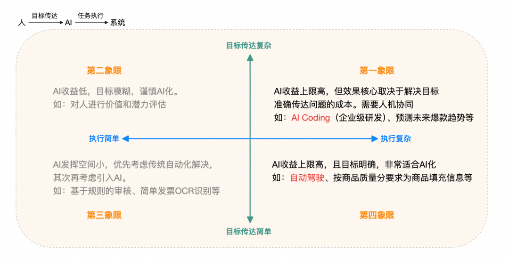
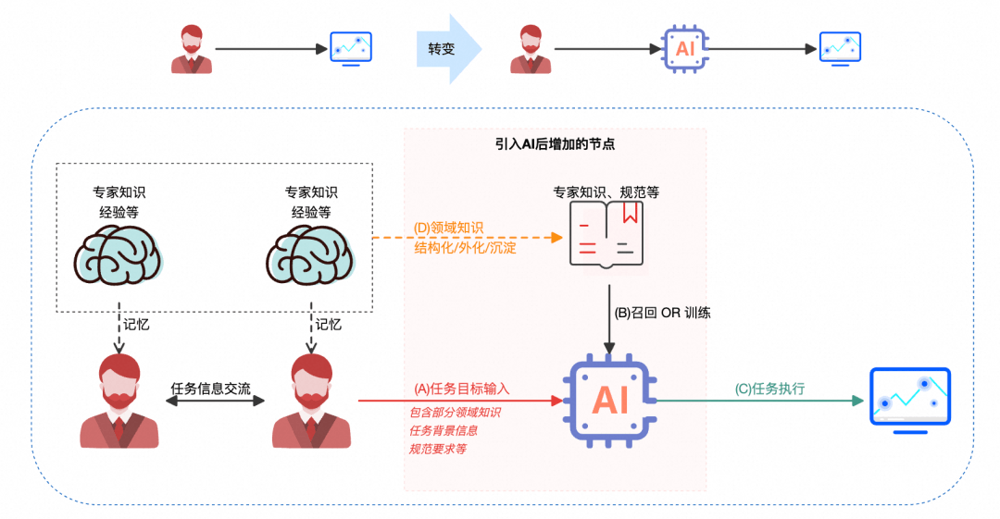
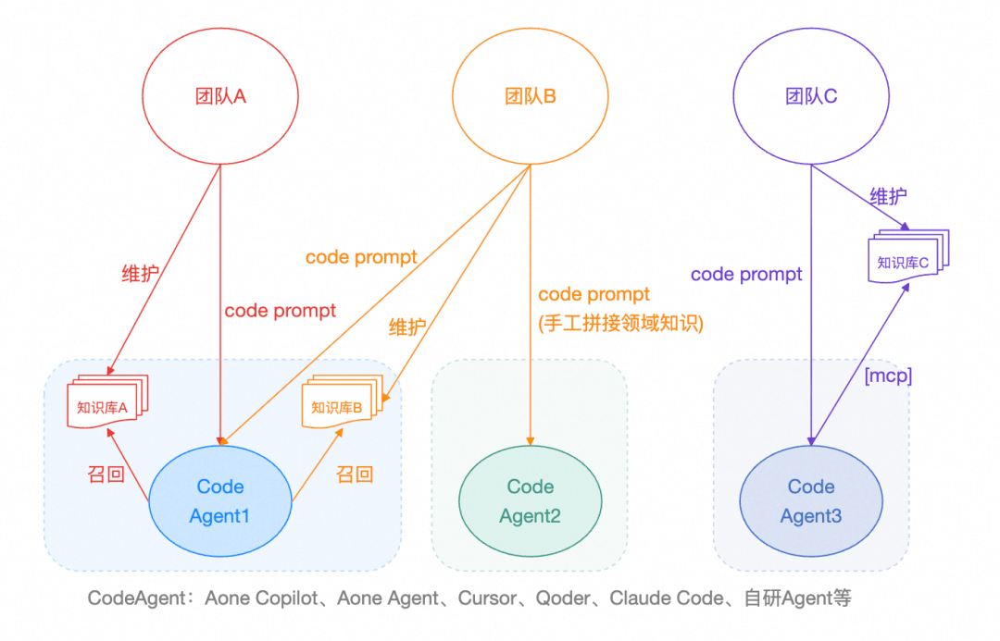
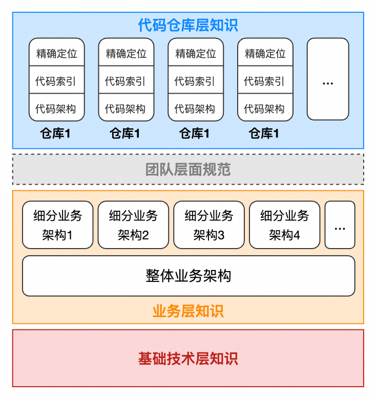
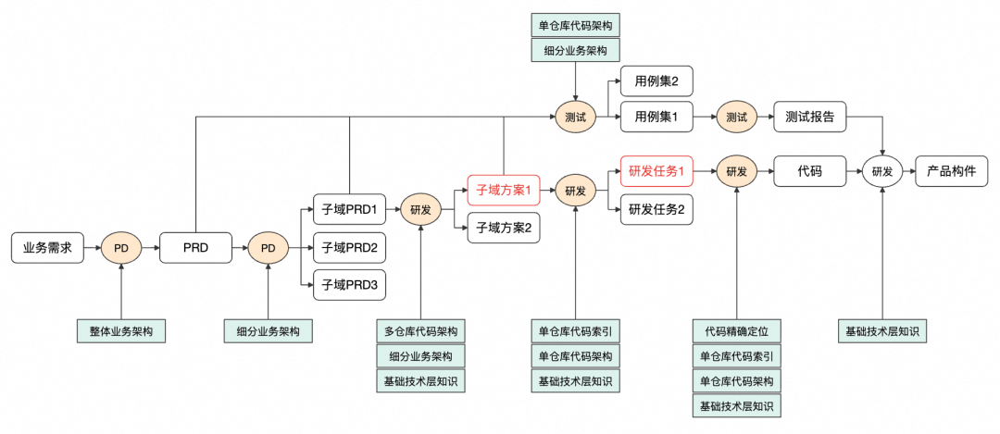
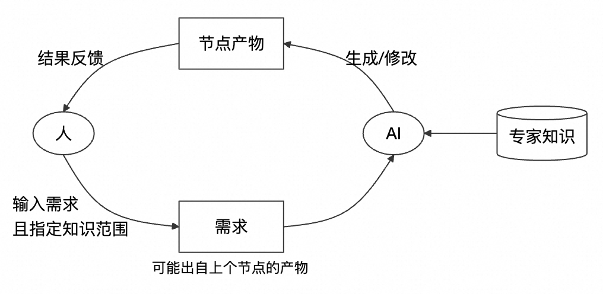

# AI Coding思考：从工具提效到范式变革，我们还缺什么？

  

  

  

本文围绕AI Coding在企业级软件研发场景中的应用展开深度思考，核心观点是：当前AI Coding虽工具繁多、执行能力快速提升，但在真实业务生产中尚未实现“质变式提效”，根本瓶颈不在于AI能否写好代码（执行复杂度），而在于人类如何**准确、高效、规模化地将复杂任务目标准确传达给AI**（目标传达复杂度）。文章指出，这一鸿沟的本质是**专家知识未被体系化、结构化、自动化地沉淀与复用**，导致信息熵过高、上下文工程依赖“人肉手艺”、知识重复建设、难以降本增效。因此，业务研发团队的AI Coding重点不应是自研Agent或追逐IDE新工具，而应转向构建**分层、统一、可自治更新的专家知识库**（覆盖基础技术、业务架构、团队规范、代码仓库等维度），推动从“工具提效”迈向“知识驱动的智能研发范式变革”。最终，程序员角色将从前端编码者升级为“产品工程师”与“业务架构师”，研发流程也将向需求—设计—编码—验收全链路AI协同演进。

  

写在前面

  

基模的不断突破，带动着其上的AI应用高速发展，其中AI Coding的工具更是百花齐放。内部有Aone Copilot、通义灵码、OneDay、Aone Agent、Qwen Code等等，外部呢，年初Cursor爆火，然后Claude Code刷屏，还有Gemini CLI、CodeX等，最近阿里也发布Qoder的独立IDE等等。一会这个最强、那个碾压，一会某某又可以扔了，加上部分团队内部垂直建设的AI Coding工具，可谓琳琅满目、应接不暇，尝鲜都跟不上节奏。

  

这给我们做业务研发的同学，带来了困惑。不过这篇文章不是要对比不同的工具的优劣，而是想从宏观层面看AI Coding研发提效，我们可能的重点方向是什么。下文的观点只是个人理解，不一定正确，欢迎指正。

  

老规矩，作为我思考的背景，依然先抛几个问题：

1. 企业级软件研发场景，AI Coding会发生质变产生颠覆式的研发提效吗？
2. AI Coding场景要实现质变，站在业务研发视角看，我们应该重点发力和投入的工作是什么？
3. AI Coding可预见的未来形态会是什么样的呢？程序员的职责会发生什么样的变化？

  

还没感觉到AI Coding颠覆式研发提效？

  

这个问题，是加了一个场景限定的——指的是企业级的、用于企业自身业务生产的软件研发场景，比如我们电商的业务需求。其他类型需求，尤其长尾需求，比如原型快速落地、员工内部文化活动页面开发、应用JDK升级、小型非业务需求等，实际上已经有明显的效率提升，这点无需多说。差异在于，前者需要大量的专家知识、需要长期可高效运维、要求很高正确性。这并不是指我们的业务需求的AI Coding没有提升效率，实际上我们有不少团队也有大量的实践案例（尤其前端相关），在Coding执行上是有提效的，但似乎还没有看到“质变”发生——生产流程、角色职责都没有变化，同时每个团队都有大量的前置成本和调试成本无法被忽视。所以AI Coding现在的感觉就是，总体蒸蒸日上，但又总觉得还差点意思。

###   

### ▐  期望的质变是什么？

  

从提效工具到智能研发范式的转变。想像一下：“机器/汇编语言升级到高级语言”VS“从C语言升级Java语言”，前者用户的角色从硬件操作员+工程师转变为纯粹的程序员，整个软件研发的流程也发生了巨大的变化，后者没有。我认为，如果某些原本人类才能做的复杂工作被AI代替了，导致流程中的角色职责、流程本身发生了变化并带来巨大提效，那可能就是质变。比如现在PD使用Web形态VibeCoding工具快速生成产品原型，HR用它快速开发一个文化活动的页面，这些场景下程序员的工作完全被代替了，PD的角色职责也发生了变化，这是质变的。但我们现在的企业级生产的研发，似乎还没到这样的变化，大多是工具的提效升级，就好比后端的编码IDE从eclipse升级到idea、Java应用架构从EJB升级到Spring，的确是有效率提升，但本质未变。

  

业务研发，AI Coding建设的重点方向是什么？

  

### ▐  什么样的工作适合用AI代替？

  

我们比较容易想到，规则、重复、繁琐的工作，以及哪些无需负责情感和人际互动的工作适合让AI来做，而那些高度不确定性决策（如危机处理、政策制定）、高度创造性和原创性（比如战略策划、艺术等）不太合适。但是，仔细看这个总结，似乎适用的场景和传统的自动化软件差不多，这说明这里还没有区分出来AI与其的差异。

  

观点：偏实施和执行的（非战略决策的）、和系统打交道的（非人际互动的）工作，未来都是可能被AI代替的，即便该工作执行过程复杂而非简单的规则和重复——这里强调“执行复杂”是区别于传统自动化的地方，现代AI在感知、推理、泛化、执行方面等具备优势，也是AI可发挥空间最大的地方（收益上限高）。即，AI加持下，我们需要从传统自动化的过程驱动，转变为由AI的目标驱动思路上来。

  

  

那么，我们会发现，Coding工作整体来说是在实施和执行业务的决策（并遵循公司整体的技术发展战略和整体架构规范）。“帮我升级jdk11”和“实现百补超链定品功能”这两类需求截然不同，前者在第四象限，而后者属于企业级生产研发，它位于第一象限，收益上限可能高，但如前面所述，似乎还没有发生研发效率质变，它还有重要的“目标传达”问题需要解决。

  

### ▐  2.信息传递视角看AI任务

  

  

- 从“人 -> 系统”，变成“人 -> AI -> 系统”，整个信息传递增加了额外节点，必然导致信息失真的概率变高，这是符合第一性原理的。
- 现阶段，我们大多数的核心关注点都在C动作（AI任务执行）上，也就是技术层面如何解决AI的任务执行问题，包括基模能力的不断提升，Agent感知、规划、记忆、工具等能力升级等。以AI Coding为例，大多重心都投入在Code Agent（含IDE）的建设上，相关的讨论和文章也非常多。但是对于A动作（任务目标输入）关注较少，或者说缺少体系化和方法论。
- 我认为，对于复杂任务，如何“把任务目标准确传递给Agent”是整个系统挑战最大的部分，而不是任务执行。这也是为什么我们总说Prompt和上下文工程非常重要。如果任务很复杂，且有大量的背景信息、领域知识、规范要求等细节需要从人类一侧传递给AI，那么我们整个系统的能力上限就会取决于人类的表达输出能力的上限——这很不稳定，也很不高效。
- 也就是说，我们真正的挑战在于：如何消除人类意图到AI理解的鸿沟。套用信息论里面的信息量和信息熵的概念：单一事件概率越小，信息量越大；系统所有事件发生越不确定，信息熵越大。向AI传达一个任务目标，需要输入的信息量越大，则该任务成功的概率越小，而对系统整体而言，信息熵（平均信息量）越大。我们需要把人类大脑中和任务相关的知识（专家知识），尽可能提前结构化、外化、沉淀成知识库（图中动作D），这样可以降低任务目标输入环节的信息熵，可以理解成这是一个系统性“降熵”的工作。
- 我们常常用自动驾驶来类比我们工作中的AI化建设，从这个角度看，我们很多工作的AI化实际上比自动驾驶的挑战大得多。自动驾驶人类给AI输入任务目标的信息量极少（终点坐标即可），信息熵几乎为0。
- 回应前文的内容，要用AI解决复杂问题，才能有别于传统自动化，使效率提升发生质变；而要解决复杂问题，就需要解决人类准确向AI传达任务目标的问题；要解决目标任务传达问题，就需要通过专家知识的体系化沉淀，对整体AI任务系统实现“降熵”。

####   

- #### 核心观点：

  

1. 在“人 -> AI -> 系统”这条链路上，两个核心环节都需要关注，避免只看到后者的收益（AI执行任务）而忽略了前者（人类向AI传达任务目标）的成本。如果一个场景解决前者的长期成本大于后者的收益，那么该场景就不适合用AI来代替。
2. AI系统最大挑战在于人类如何向Agent准确表达任务目标。这并非说Agent建设提高任务执行能力不重要，它在有些领域现阶段也有很多挑战需要解决，但是基模迭代非常快、工具升级也日新月异，我们已预见到Agent能力上限很高，能完成很复杂的任务规划和执行。
3. 专家知识体系化沉淀做得越好（构建准确完备的上下文），向AI传达任务目标的难度就越小，任务成功的概率就越高。这里强调专家知识“体系化”，是因为现状我们也是在做这部分工作的，只是大多是点状的，没有统一的方法论和标准范式，难以形成规模化效应。所以AI化的成败最终将会取决于这个专家知识构建的成本。
4. AI Coding场景下，业务研发有别于基础设施团队，长远重点应当在专家知识沉淀机制建设上（系统性降熵），让AI的“飞轮”转起来，以此获得竞争优势。这里是限定了AI Coding+业务研发团队，因为在基础设施团队，AI Coding的Agent能力建设依然是重点，而业务研发团队这点上没有优势，但可以不断享受现成的最新技术带来的收益。

  

AI Coding可能的长期方向

  

### ▐  1.AI Coding在公司内的现状

  

  

- 不同团队选择的Code Agent方案不同，不同岗位的倾向估计也不大相同，新手往往比较迷茫。选择什么样的方案由团队习惯决定，当组织变化时，可能带来较大的切换成本。
- 知识库的选择大多跟着对应的Code Agent方案走，也有维护独立知识库并通过mcp暴露给Agent的，也有将知识放在代码仓库中，通过手工拼接进prompt的。
- 知识库可能存在重复（比如阿里基础技术架构，中间件，前端组件，淘天电商基础业务知识等），上图中3个知识库很可能是有大量重叠知识的，缺少全局视角的规划和复用。
- 知识库输入给Code Agent的方式各有不同，很多时候像个手艺活，知识库转化为“Context工程”缺少工程标准。

这些现象，会导致业务研发在实施AI Coding时难以实现规模效应，全局上看，效率提升会大打折扣。

  

### ▐  2.业务研发的AI Coding专家知识分层

  

对于Code Agent，我们可以把他看成一个新入职的基础十分扎实的高级全栈程序员。虽然他基本功、知识面十分扎实，依然无法直接上手一个企业级的需求。想象一下，我们让他完成一个商品审核需求，他知道修改哪个代码仓库、这里可能依赖商品中心、依赖BUC用户中心吗？——肯定不知道。所以，我们可以看看他要能上手这样的业务需求，能写代码需要了解哪些东西，并希望培养成为领域内顶级程序员。

  

1.基础技术层面：
1. 技术栈规范。如后端的Java、Spring，前端框架等（这是内化能力，已经是大模型强项）。
2. 基础设施规范。如公司中间件使用、微服务框架、单元化架构、网关接入（如MTOP）、OA系统基建（BUC\\ACL\\BPMS）等。
3. 应用选型及其分层规范。比如普通单体应用、Serverless、FaaS等分类规范，及其分别对应的代码分层建议等。
4. 代码质量规范。如基本代码规范、单测规范等。
5. CI/CD平台和流程。如Aone、O2、摩天轮等平台及其对应的CI/CD流程。
6. 安全合规规范。如公司的数据安全规范等。
7. 解决方案经验。比如消息重试机制解决最终数据一致性问题、tair version解决分布式并发问题等等经验案例。

  

2.业务层面：
1. 整体业务架构。如电商业务核心领域（商家、商品、会员、交易、营销等）的整体产品架构（包括涉及的应用）、核心领域模型，以及核心业务流程、核心API、技术框架、技术规范等。这条在实际场景中对一线开发也许不是必选，但在AI加持下，我们想要的是顶级的程序员，那么他应该要有所了解。
2. 细分业务架构。该程序员自己所负责的具体细分业务领域（比如百补业务、国补、3C数码行业等细分领域）领域知识、产品架构（包括涉及的应用），以及核心业务流程、核心服务、技术框架、技术规范等。

  

3.团队层面：
1. 团队开发规范。所在团队自己的开发规范、开发习惯等——这点在理想AI Coding情况下也许不再需要，因为开发规范应该跟着公司整体的规范以及业务架构走（即应跟着组织走）。

  

4.代码仓库层面：
1. 仓库代码架构：对代码仓库的熟悉和理解，比如项目概要、项目结构、技术栈、API、功能模块、数据模型、部署配置等一系列关键信息。（对应deepwiki、artifact7等）
2. 仓库代码索引：用于对于需求理解后，需要对项目代码进行粗略的定位。（对应codebase）
3. 精确代码定位：真正进行编码时，需要基于对现有代码进行准确地增删改。（对应抽象语法树等）
  
    

  

这里只是按照经验做的梳理，不一定完备和准确，但至少是这种思路，这些专家知识是需要分层的。一个新入职的程序员，有了上面这些信息，一般就可以开始尝试干活写代码了，而对于AI Coding来说也是如此（主要是加粗的这些部分），对于一些小需求甚至是只需其中部分信息。

  

这里有几点总结：

- 专家知识需要统一管理而非各自建设。专家知识的建设应独立于各个AI Agent的体系，有全局视野、且可以被复用。
- 这些专家知识须要可以被某种结构完备描述。相关的技术资产，无论是生产资料，还是（软件）产品，既有基于物理真相的关系刻画，又有基于架构抽象的、易于人类理解的逻辑表达——本质上是技术资产及其内在关系的语义化、在线化（企业级软件资产图谱），这是企业全局架构视角面临的挑战，在AI时代的研发提效背景下，这件事情变得更为急迫（决定了公司研发效率方面在未来的竞争力）。
- 上述分层知识中，最大的挑战在业务层知识，它是最复杂、最易变、也最隐性（存在于人类大脑中）的部分。这些专家知识必须具备“自治”的能力，不能依赖架构师、研发人员等的人肉更新（历史已经无数次证明这并不可行），而需要通过自动化+人工调整/确认的方式保障——这可能会成为AI时代极其重要的命题。

  

### ▐  3.AI Coding的可能的长期方向

###   

  

从研发流程看专家知识的使用

  

这是一个大致的研发流程（及过程产物）与专家知识之间的关系（示意用，不一定完备）：

- 每个节点都需要不同层次的专家知识作为输入，并且是逐步拆解细化的，每次用到的专家知识并不应该是大而全的。
- 图中橙色节点都应该变成人类+AI协作。复杂企业级研发痛点公认的不在编码，理想的AI Coding，更多的不是“Coding”本身，而在于需求、技术方案等前置节点的AI协作提效。因此，AI Coding长远看，PD也应当参与。
- 这些节点是可以持续多轮迭代的，最后产出经过人类确认的结果。

- 依据需求复杂度不同，节点理应可以裁剪，简单需求直接从靠近右侧的某个节点开始介入，依赖的前置节点的产物直接由人类输入；复杂需求可能跨域、跨系统、跨仓库，这些需要跳出常规AI Coding的Agent方案，前置到需求和技术方案环节。
- 不同节点的AI Agent交互形式可能不同，但背后可以是一套Agent（大脑）。比如PD产出PRD，理想情况可能需要打通钉钉文档、打通钉钉项目群、钉钉会议等。
- 单仓库级别的工作节点（图中红色节点），可采用SDD（Spec-Driven Development，规范驱动开发）模式进行，热门工具如Spec-Kit、OpenSpec、BMad等。
- 需求完成后各个节点的产物，最终需要增量更新到专家知识库中，其中仓库级知识可通过SDD落到仓库中（代码-文档一致性）。

  

这里观点总结：

AI Coding的方向必然是打通需求到Coding、验收的全流程。结合统一的专家知识库能力后，相对于传统模式，就具备了“全局架构理解的一致性，规范执行的一致性”的优势，有望解决当下企业大型复杂系统不同角色、团队间的合作、协同效率低下的问题。且有了通用专家知识库后，可不限制端侧执行Code Agent形态的多样性，岗位、团队、场景不同，多样性会持续存在。当前已经有部分团队开始尝试去落地从需求出发的全流程AI Coding的方案了，目前还是处于探索阶段，但长远看最大的挑战依然是体系化专家知识构建的成本问题。

  

### ▐  4.程序员的职责变化

  

回应前文，效率发生质变，必将需要流程和角色职责的变化。AI Coding对程序员而言，一定是需要发生变化的。

1. 交付物变化：需求 -> 设计 -> 高级代码 -> 符号化机器码 -> 机器码，这条交付物链条，程序员从最初直接交付机器码（打孔卡），已经逐步前移到高级代码，到AI时代开始部分转移到设计（Spec）和需求的交付物了，而AI变成了Spec到代码的“编译器”。
2. 研发重心：从关心代码细节，转变为关心专家知识的构建质量和效率、知识库转Context的质量，以便让AI更加准确产出代码。
3. 角色转变：产物变成自然语言后，不再受限于技术栈，因此会往全栈转变；同时，程序员会更多往设计和需求侧走，从“高效打字员”变成“业务架构师”，甚至会和产品经理角色重叠，变成“产品工程师”。

  

总结

  

1. 当前AI Coding虽然热火朝天，但在企业级业务研发领域还没有产生颠覆式提效（流程、角色职责未变化），大多还是工具本身的升级，很多时候依赖程序员的“手艺”。
2. 从“目标传达复杂度”和“执行复杂度”两个维度构成四象限，来判断适合AI化的场景。执行复杂度高的场景AI更有发挥空间，潜在收益更大，这点需要和传统自动化区别开来（反大多数人直觉）。“人 -> AI -> 系统”这条链路上，两个环节都很重要，不要过于关注后半段和忽视前半段。
3. 企业级研发AI Coding处于第一象限（双高），AI的代码能力上限高、Agent发展快（即后半段已经没有太大瓶颈），避免过于乐观它可能带来的效率提升，相对于执行Coding任务，任务目标准确传达是其最大挑战。
4. AI Coding的目标传达准确性问题，需要构建统一的专家知识解决，而专家知识是需要分层和体系化的、可复用的，而且需要结合AI实现可自治的、半自动化的保鲜能力。
5. AI Coding长期方向一定是需要打通研发全流程的，当前部分团队已经在探索和实践。而体系化的全自动或半自动专家知识沉淀机制建设是业务研发团队在AI Coding上的重大挑战，也应当是重点方向。长期来看，是需要构建“知识驱动的AI Coding生态系统”。

  

企业级软件工程的本质就是沟通，从“人 -> 系统”到“人 -> AI -> 系统”，沟通的链路变了，但依然要解决沟通问题，我们比以往更依赖专家知识的构建——这在AI时代之前就一直是研发效率的痛点（想想为什么我们的文档总是脱离代码、架构大图总是不能反映最新状态？为什么跨团队项目沟通效率低下？），这些不会因为我们用了AI Coding就自动消失——也就是说，目前为止，研发效率的主要矛盾还没得到解决，AI时代，我们应该优先考虑如何用AI去解决这个主要矛盾以获得真正的变革。如果我们还没解决专家知识库自动化或半自动化构建的问题，企业级生产的AI Coding从宏观上看，不会是提效的，甚至可能还是降效的。我们不能指望靠人来搞文档、搞知识库，这是反人性的。

  

需要特别警惕的是，AI代码量占比不代表着提效占比，如果以此作为组织提效的依据，容易让人类产生“喜大普奔”的幻觉~~。

  

团队介绍

  

本文作者书牧，来自淘天集团-天猫技术团队。天猫技术是阿里巴巴旗下专注于电商场景的综合技术团队，不仅服务于自身电商业务增长，也在不断探索如何用AI、大数据、交互技术赋能行业交易、品牌营销与消费者体验，成为全球领先的品质购物平台和技术引擎。

  

  

  

**¤** **拓展阅读** **¤**

  

[3DXR技术](https://mp.weixin.qq.com/mp/appmsgalbum?__biz=MzAxNDEwNjk5OQ==&action=getalbum&album_id=2565944923443904512#wechat_redirect) | [终端技术](https://mp.weixin.qq.com/mp/appmsgalbum?__biz=MzAxNDEwNjk5OQ==&action=getalbum&album_id=1533906991218294785#wechat_redirect) | [音视频技术](https://mp.weixin.qq.com/mp/appmsgalbum?__biz=MzAxNDEwNjk5OQ==&action=getalbum&album_id=1592015847500414978#wechat_redirect)

[服务端技术](https://mp.weixin.qq.com/mp/appmsgalbum?__biz=MzAxNDEwNjk5OQ==&action=getalbum&album_id=1539610690070642689#wechat_redirect) | [技术质量](https://mp.weixin.qq.com/mp/appmsgalbum?__biz=MzAxNDEwNjk5OQ==&action=getalbum&album_id=2565883875634397185#wechat_redirect) | [数据算法](https://mp.weixin.qq.com/mp/appmsgalbum?__biz=MzAxNDEwNjk5OQ==&action=getalbum&album_id=1522425612282494977#wechat_redirect)
