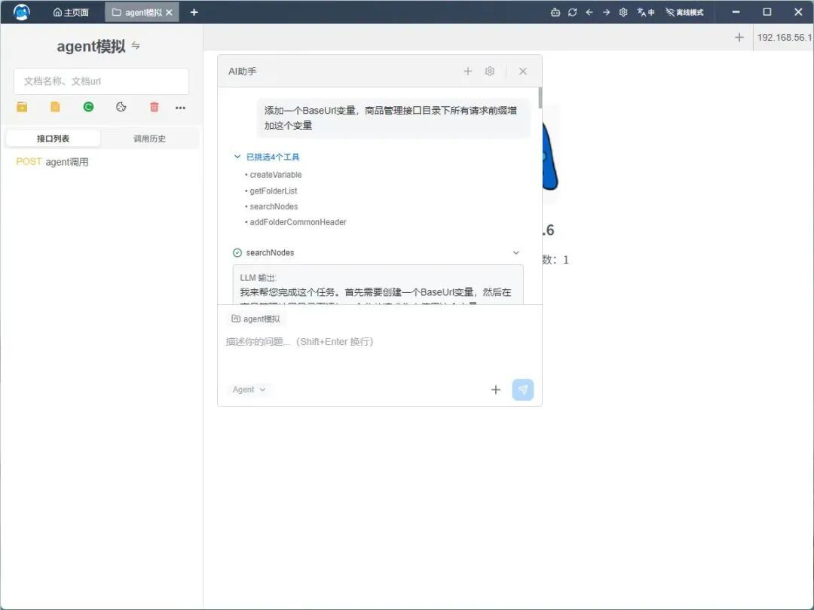
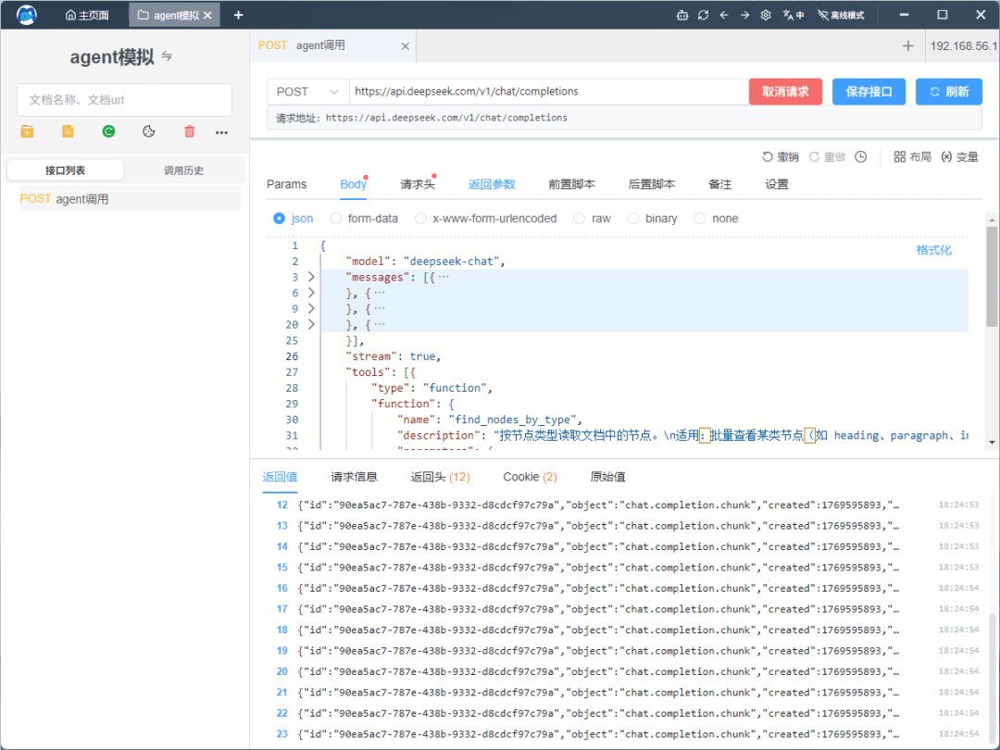

# Apifox 和 Postman 开源平替！新API工具内置 AI agent ，调试效率飙升！

## 介绍

**Apiflow** 是一个 **完全免费**、**内置 AI 能力** 的 API 接口工具，致力于成为**Postman、Apifox 的现代化开源替代方案**。

它集成了 **API 测试、Mock、WebSocket、AI Agent、团队协作、离线使用、本地部署** 等能力，并全面拥抱 **OpenAPI 3.0 生态体系**。

---

## 界面预览

### Agent展示

### SSE与MOCK展示

  

---

## ✨ 核心特性

### ✅ 完全免费

- 所有功能永久免费
- 无付费计划
- 无功能限制
- 一键导出到postman、apifox等工具

### 🤖 内置 AI Agent

- 内置 AI Agent，辅助 API 设计、测试与调试
- 支持配置你自己的大语言模型（LLM）
- 支持 **离线 / 内网环境** 使用

### 👥 团队协作

- 内置团队与工作区管理
- **团队数量、成员数量不限**
- 细粒度权限控制：
- 项目级权限
- 基于角色的权限管理（RBAC）
- 只读 / 编辑 / 管理员角色
- 操作记录与变更历史追踪
- 适用于任何规模的团队

### 📴 离线 & 在线

- Local-First 设计理念
- 完整离线能力，本地数据持久化
- 离线 / 在线数据双向转换
- 从个人使用平滑过渡到团队协作
- 非常适合内网或受限网络环境

### 🏠 自托管 & 本地部署

- Docker 一键部署
- 数据完全由自己掌控
- 适用于企业私有化部署场景

### 🔄 OpenAPI 友好

- 支持 **OpenAPI 3.x** 导入 / 导出
- 可无缝迁移到：
- Postman
- Insomnia
- Hoppscotch
- 任意 OpenAPI 兼容工具

---

## 🧩 核心能力一览

- HTTP API 测试（RESTful）
- WebSocket 测试
- Mock Server（HTTP / WebSocket / SSE）
- 环境变量与变量系统
- 请求前 / 请求后脚本
- 项目与文件夹管理
- 导入 / 导出（Postman / OpenAPI / JSON）
- 国际化支持（英文 / 中文 / 日文）

---

| 平台 | 下载地址 |
| --- | --- |
| 🪟 Windows | https://github.com/trueleaf/apiflow/releases |
| 🍎 macOS | https://github.com/trueleaf/apiflow/releases |
| 🐧 Linux | https://github.com/trueleaf/apiflow/releases |

Github： https://github.com/trueleaf/apiflow

Gitee: https://gitee.com/trueleaf/apiflow

官方网站： https://apiflow.cn
