# 想成为全栈工程师，必下载的 13 个工具

## 前言

大家好，我是林三心，用最通俗易懂的话讲最难的知识点是我的座右铭，基础是进阶的前提是我的初心~

## Visual Studio Code (VSCode)

一款轻量级、开源的IDE，支持多种编程语言，以速度快和通过扩展增强功能而受到欢迎

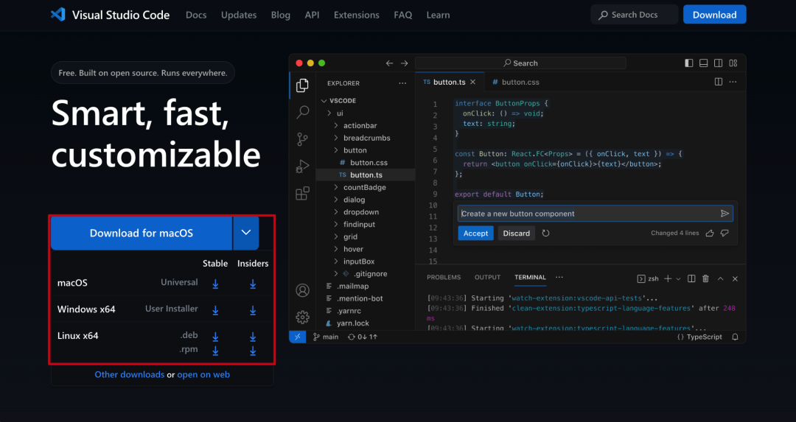

## IntelliJ IDEA (IDEA)

一款领先的Java开发IDE，以智能编码辅助、对Java EE的支持以及与Git、SVN、JUnit等工具的集成而受到赞誉

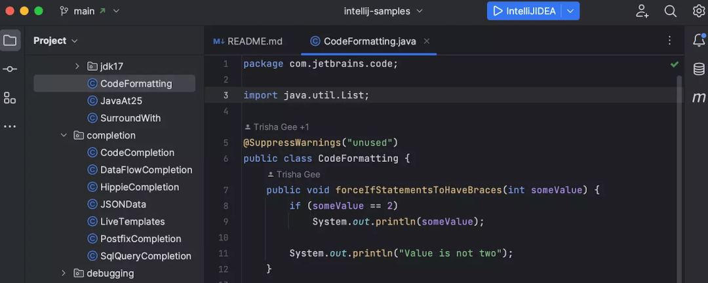

## HBuilderX

一款紧凑、快速的IDE，适用于Web和应用开发，支持Markdown和高效的文本处理

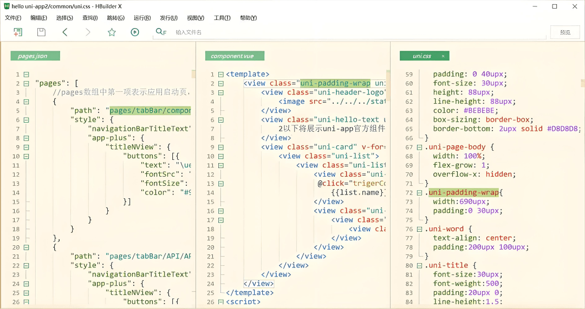

## GoLand

一款专为Go语言开发定制的IDE，具备智能重构、代码分析等功能，支持快速项目迭代

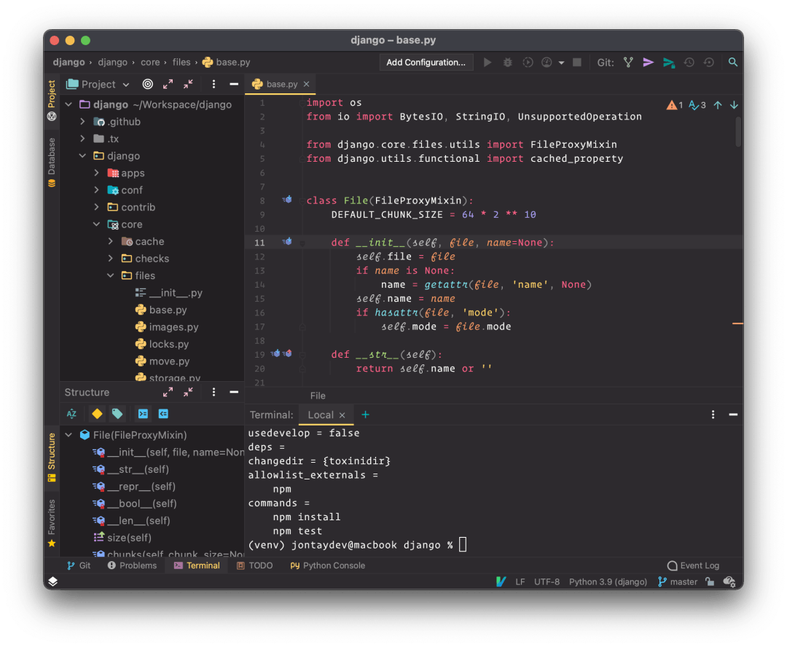

## PyCharm

一款Python开发IDE，提供强大的调试、测试和Web开发支持，特别适用于Django等框架

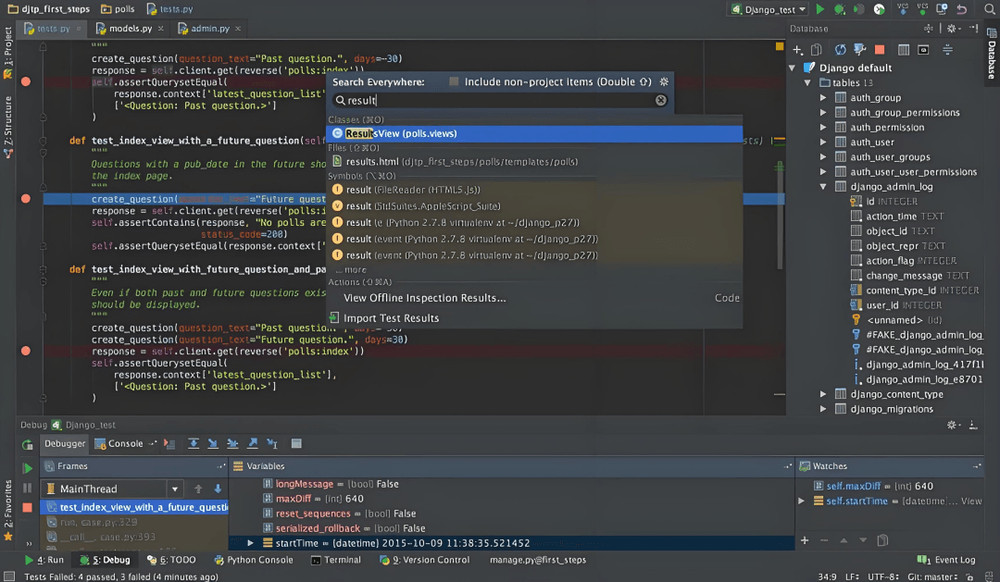

## Postman

一款用于API测试和调试的工具，支持环境管理、请求自动化和模拟服务器功能

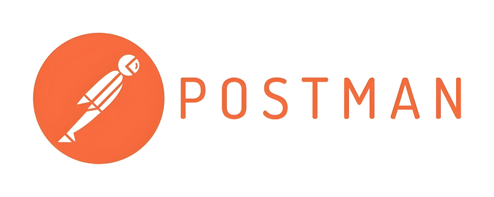

## Navicat

一款强大的数据库管理工具，支持MySQL、PostgreSQL、MongoDB等多种数据库，具有直观的用户界面

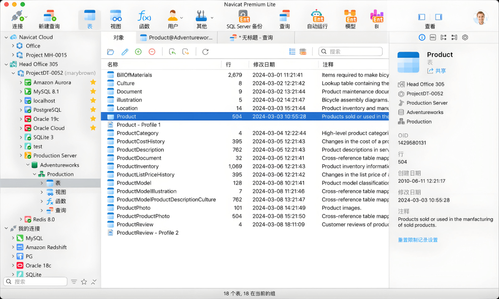

## Android Studio

基于IntelliJ IDEA的Android开发工具，提供集成的开发、调试和优化工具，专门用于开发Android应用

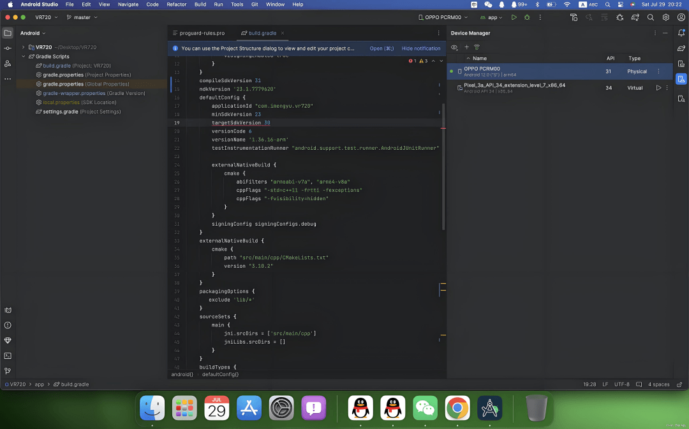

## Xcode

苹果公司推出的IDE，适用于macOS和iOS开发，提供统一的编码、测试和调试界面

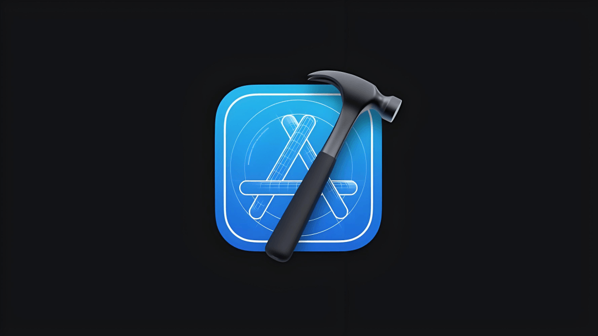

## RedisPlus

一款桌面客户端，用于管理Redis数据库，支持可视化管理、SSH连接和现代UI设计

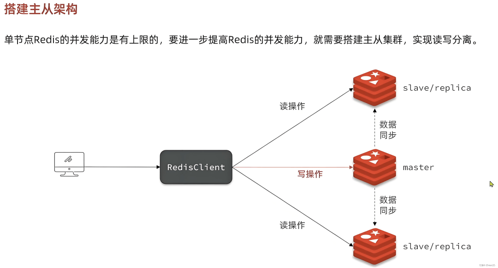

## Xshell

一款终端仿真软件，用于SSH和TELNET的安全连接，广泛应用于网络环境中的远程服务器管理

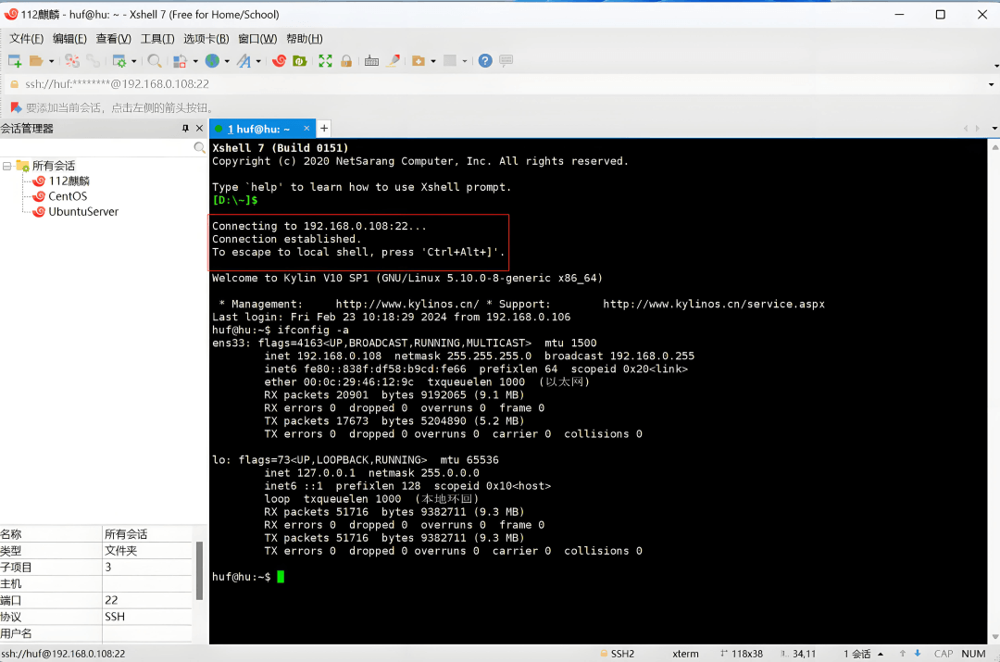

## Photoshop (PS)

一款综合性图像编辑软件，广泛用于图形设计、照片修饰和数字艺术创作

## Charles Proxy

一款代理服务器和HTTP监视工具，可以帮助开发者查看和调试客户端与服务器之间的HTTP通信

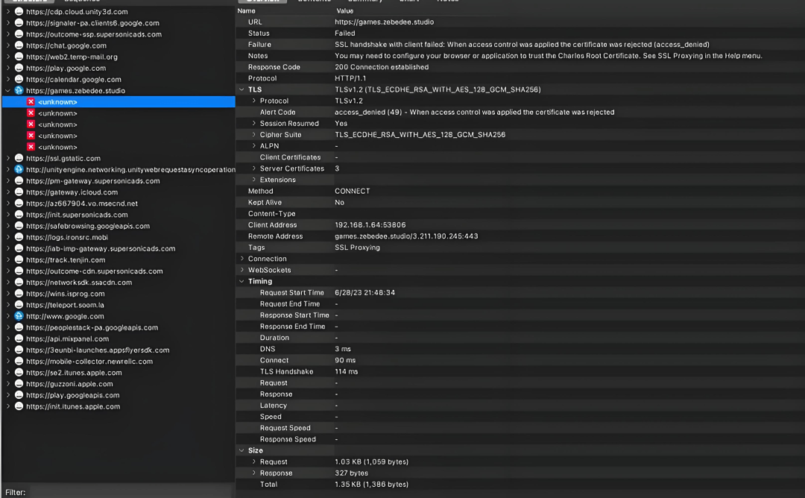

## 结语

我是林三心，一个待过**小型toG型外包公司、大型外包公司、小公司、潜力型创业公司、大公司**的作死型前端选手
