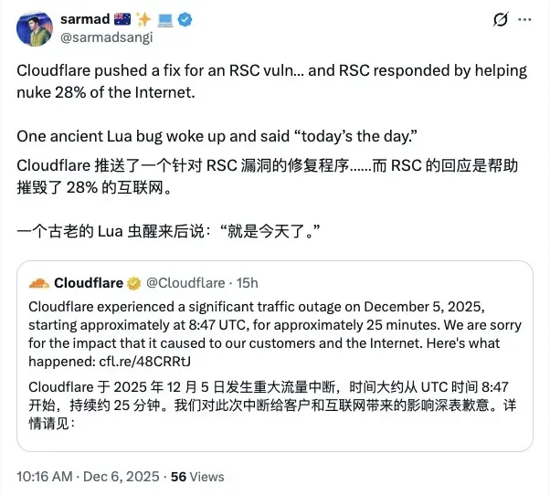
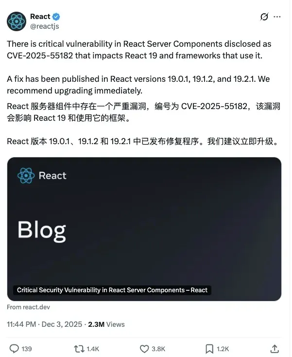

# Cloudflare 被 React 坑了！两周内二次“翻车”

转自：InfoQ

💥 25分钟，全球28%的网站集体“躺平”。  

  

🕵️‍♂️ 没有黑客，没有攻击，是Cloudflare自己“手滑”了。  
  
✨更扎心的是，这已经是Cloudflare两周内第二次“翻车”了 。  
  
12 月 5 日，Cloudflare 节点开始大量返回 HTTP 500。源头不是威胁，而是 Cloudflare 为应对 React Server Components 暴露的严重漏洞所做的加固操作。可以说，这波是 Cloudflare 为替 React“背锅”。团队先把 WAF 缓冲区扩至 1MB，又关闭了一个内部测试工具，本想更快保护开发者，却触发了旧版 FL1 代理中一段“沉睡多年”的 Lua 缺陷：被跳过的规则未生成对象，系统继续访问 nil，直接抛出 500。  
  

Lua 虽在 1993 年发布、2008 年已十分成熟，但 Cloudflare 于 2009 年成立、2010 年上线后，将 Lua 作为早期网络堆栈基石。这也意味着部分历史代码难以完全替换，bug 能在多年后被意外激活。  
  
受影响的仅是使用旧代理＋托管规则集的客户，却占到 28% 流量。更讽刺的是，新版 FL2 已用 Rust 重写，并无此类问题。  
  
💣更不安的是，这次事故与 11 月 18 日高度相似：紧急发版 → 全球同步生效 → 老旧路径被击穿 → 大规模宕机。Cloudflare 虽承诺改造发布体系，但改造尚未完成，新的事故已经发生。  
  
事故后，Cloudflare 宣布冻结全部网络变更，并把发布流程、应急能力与 fail-open 容错机制列为最高优先级。根本问题很清楚：在全球分布式系统中，哪怕一行多年未触发的旧Lua代码，只要搭配一次“全球推送”，就足以拖垮半个互联网。  

两次事故密集曝光了同一个事实——在安全要求越来越高、复杂度不断增加的互联网基础设施中，如何避免“被自己的更新打趴下”，已经成为比抵御攻击更紧迫的工程难题。

\- EOF -

推荐阅读  点击标题可跳转

1、[“豆包手机”使用了锤子科技Smartisan OS祖传代码](https://mp.weixin.qq.com/s?__biz=MzAxODE2MjM1MA==&mid=2651623461&idx=1&sn=171d6a95e21420b9b6fd860aa2046246&scene=21#wechat_redirect)

2、[面试：前端如何应对数百万个 API 请求而不会导致系统崩溃](https://mp.weixin.qq.com/s?__biz=MzAxODE2MjM1MA==&mid=2651623461&idx=2&sn=ac0b16ad89afd9f061bc3c80d6a1666d&scene=21#wechat_redirect)

3、[马斯克又夸微信：“中国之外不存在这种国民级软件”。网友神吐槽：“几乎每个 APP 都有你说的功能，就问吊不吊”](https://mp.weixin.qq.com/s?__biz=MzAxODE2MjM1MA==&mid=2651623449&idx=1&sn=6ed4bdab4d0b06164636b230f3cb9b96&scene=21#wechat_redirect)
