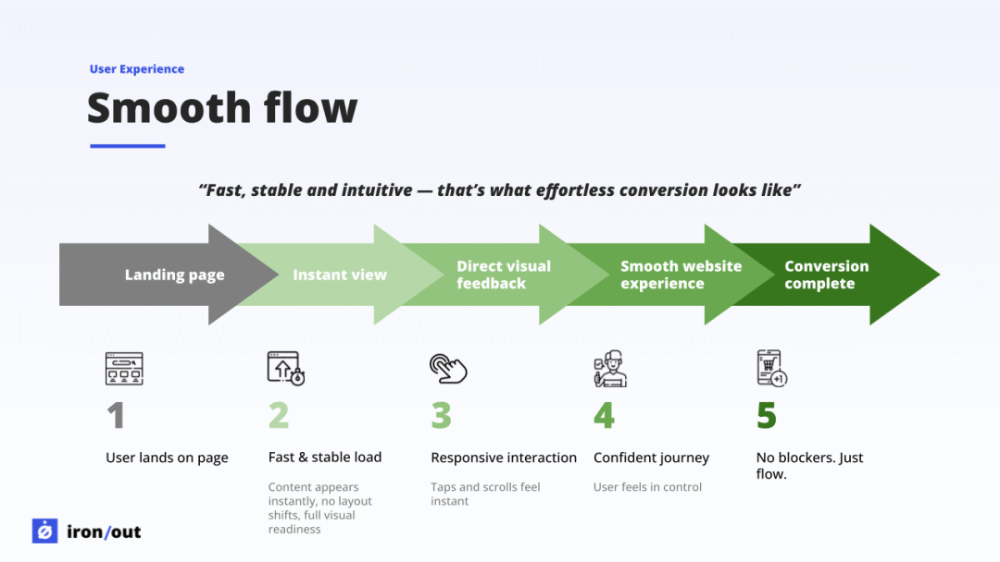
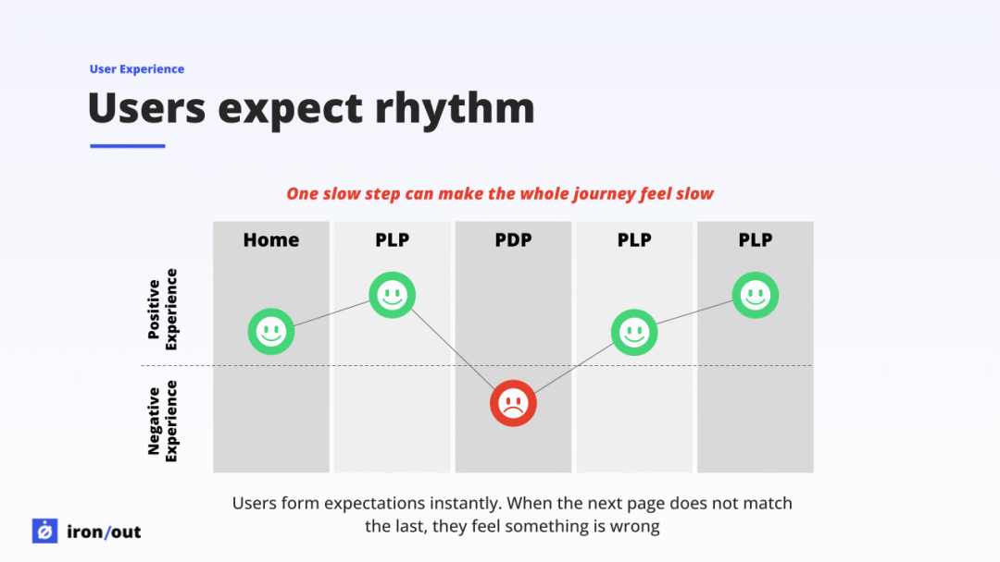
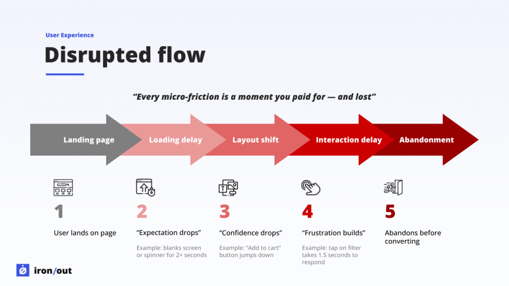

# 【早阅】从技术到体验：用“摩擦与流畅”重新定义网站性能

前言

讲述了如何用 “摩擦（friction）” 与 “流畅（flow）” 的语言，让网站性能从冰冷的技术指标，变成人人都能理解、真正影响用户体验与商业决策的故事。今日前端早读课文章由 @Sander van Surksum 分享，@飘飘编译。

译文从这开始～～

网站性能，就像你在机场走那种会动的人行步道。

当它平稳运行时，你几乎不会注意到它的存在。你感觉自己很快、被支撑着、掌控一切。但只要有一段卡顿 —— 哪怕只是轻微的一下 —— 你的身体立刻会有反应。你会瞬间失去平衡，停顿一下，总觉得哪里不对劲。

网站的表现，其实也是这样。

它并不只是体现在那些整齐的图表、仪表盘，或关键指标（KPI）的术语里，而是存在于用户的真实体验中 —— 一个想完成某件事的人，要么顺畅地被网站推动向前，要么被无意间拖慢了脚步。

而那种 “顺畅”、那种不言而喻的 “这很轻松” 的感觉，才是一切的关键。

奇怪的是，我们每个人在使用网站时都会感受到这种差异，但我们却很少谈论它。我们谈的是速度、数据、预算…… 但就是不谈体验本身。后来我意识到，我需要一种方式来描述网站在帮助用户前进或悄然阻碍用户时，用户实际的感受。

也正是在那时，我开始更有意识地使用 “摩擦”（friction）和 “流畅”（flow）这类语言。像 Tammy Everts 和 Jeroen Tjepkema 这样的人，多年来一直在网页性能的语境下讨论这些概念。他们的研究让我明白，“摩擦” 并不是一个技术问题，而是用户体验的问题。他们的语言，终于让我能准确地表达出用户真正经历了什么。

[【第3614期】常被忽视的 Node.js 功能，彻底改善了日志体验](https://mp.weixin.qq.com/s?__biz=MjM5MTA1MjAxMQ==&mid=2651277957&idx=1&sn=f82c3d371bd6336a7ade9a37849bbe90&scene=21#wechat_redirect)

这种视角的转变非常有价值，但它并没有立刻改变我们日常讨论性能的方式。在随后的许多冲刺回顾会上，这一点尤其明显 —— 工程师们展示了实实在在的成果，比如缩短 TTFB、减小打包体积、修复那些让用户默默困扰了数月的布局偏移。但当话题转到性能指标时，整个会议的热度就突然降了下来。

他们的工作减少了 “摩擦”，但解释的方式，却又把 “摩擦” 带了回来。

就在那一刻，我突然明白了：性能并不是一个纯粹的技术问题，它关乎人。

如果真是这样，那我们讨论它的方式，也该随之改变。

#### 流畅（Flow）：一种人人本能就能感受到的体验

“流畅”，是一切顺其自然的状态。页面加载时毫无卡顿；轻点一下，它立刻响应。没有波折，没有意外，一切都显得自然而然。

那是一种 —— 你几乎没注意到网站存在的感觉。心理学家把 “流畅” 描述为一种 “毫不费力的专注与投入” 状态。  
在网络体验中，当用户无需刻意思考界面就能自然地完成操作时，他们体验到的，正是这种流畅。

“流畅” 不是一个指标，它无法被画成图表，但它能被感受到。

[【第3162期】前端APM指标采集大冒险](https://mp.weixin.qq.com/s?__biz=MjM5MTA1MjAxMQ==&mid=2651268531&idx=1&sn=fd90a8fb274ef52f7bc5f19d81acdaae&scene=21#wechat_redirect)

而一旦用户进入这种节奏，他们会更容易转化、更愿意探索，也更容易产生信任。

网页体验中的流畅状态 —— 顺滑、连续、不被打断的用户旅程

#### 用户期望有节奏 —— 而节奏极易被打破

人们对速度的感知，比我们想象的要敏锐得多。如果首页加载很快，之后的每一步都会以这个 “首印象” 为基准被评判。

一个稍慢的商品详情页（PDP），  
一个闪烁的商品列表页（PLP），  
一个延迟半秒的筛选操作，

只要一个环节的节奏被打断，整个体验都会让人觉得 “慢”。

Nielsen Norman Group 的研究结果非常明确：

- 约 0.1 秒：让人感觉是 “瞬间” 的
- 1 秒以内：还能保持用户的思路连续
- 超过 1 秒：注意力开始分散

这没有商量的余地 —— 而是人类大脑的自然反应。

用户并不在意 “为什么慢”，他们只在意 —— 它确实慢了。

用户对节奏的期待，以及节奏被打断时对体验的影响

#### 摩擦（Friction）：那种悄无声息削弱信任的力量

“摩擦” 并不总是显而易见的问题。更多时候，它是由无数细小问题的叠加造成的：

- 轻点屏幕，反应却略有延迟
- 布局稳定前，按钮突然跳动
- 图片闪烁着逐一加载出来
- 页面空白停留得稍稍有点久

单看每一个，这些似乎都无关紧要；但当它们累积在一起，就会慢慢侵蚀用户的信任。

Google 的研究表明：哪怕 70–100 毫秒 的延迟，也会影响用户的 “掌控感”。其他案例研究也显示，哪怕只是慢了几百毫秒，也足以让转化率受到影响。

[【第3597期】Google Chrome DevTools MCP：AI 代理现在可以在浏览器中调试、测试和修复代码](https://mp.weixin.qq.com/s?__biz=MjM5MTA1MjAxMQ==&mid=2651277543&idx=1&sn=18b092f538b688e06ee1bd09c05cf064&scene=21#wechat_redirect)

“摩擦” 在信任崩塌之前就已经开始作用，只是大多数人直到信任消失时，才意识到它曾经存在。

网页体验中的摩擦点 —— 细微延迟如何逐步削弱用户信任

#### 一个改变我沟通方式的时刻

去年有一次冲刺回顾，我们在讨论产品列表页（PLP）的性能改进。我解释说，移动端的筛选操作（filter interaction）交互延迟指标 INP 大约为 450 毫秒，问题出在 JavaScript 阻塞了主线程。

[【第3372期】在 Node.js 中使用 Atomics 进行多线程编程](https://mp.weixin.qq.com/s?__biz=MjM5MTA1MjAxMQ==&mid=2651272969&idx=1&sn=3f38292f349671bdf06a16a6fb08bd7d&scene=21#wechat_redirect)

但我能感觉到，虽然大家听懂了我的话，却并没有真正 “理解” 这个问题。

于是我打开了一段用户会话回放。

画面里，用户点了一下筛选按钮 —— 什么都没发生。

差不多有半秒的时间，整个列表页都像是 “卡死” 了一样：没有动静、没有反馈，连一点提示都没有让人知道网站收到了操作。然后，所有内容突然一下子全更新了。

一个利益相关者向前探身，说了一句：“啊…… 明白了，这感觉就像坏掉了一样。”

那一刻，比我之前用图表解释十分钟都更有说服力。

指标本身并不重要，重要的是 —— 摩擦感。

#### 一个更广泛的行业难题

这并不只是我遇到的问题。去年在 Google 办公室举办的 WebPerfDays Unconference 上，这个话题又被提了出来：网站性能依然难以在工程之外获得足够的关注。

不是因为它不重要，而是我们讲述它的方式无法让非工程角色产生共鸣。

于是它总停留在专家之间的讨论中，而真正需要听到这个故事的人，却往往从未听说过。

#### 为什么 “摩擦与流畅” 的语言有效，而单靠指标不行

大多数利益相关者其实并不在意 Web Vitals 的具体细节 —— 这完全没问题。

他们在意的是：

- 用户的挫败感
- 操作时的犹豫
- 被打断的使用流程
- 转化率下滑的瞬间
- 品牌感知的变化
- 用户在网站中的信心与流畅度
- 为什么用户明明想完成购买，却中途放弃

“摩擦（friction）” 和 “流畅（flow）” 能把性能转化为这些他们真正关心的结果。

指标用于验证，但指标不该成为故事的主角。指标应该支撑故事，而不是取代故事。

#### 性能语言 vs 商业语言

今天，UX 团队依然在面对类似的问题。就在上周，Vitaly Friedman 分享了一篇文章，谈到为什么设计师常常在组织内部被误解。他的观点很直接：UX 的语言里充满了与商业目标脱节的术语。

但当设计师开始用 “用户忠诚度”“产品采纳率” 或 “客服咨询量减少” 等结果来表达时，一切就变得清晰得多。

性能领域同样如此 —— 我们的语言往往与听众脱节。

当我们一开口就说 LCP、INP、CLS、线程阻塞、JavaScript Hydration 或渲染开销时，听众的注意力瞬间消散。

但当我们谈论：

- 信任（trust）
- 确定感（certainty）
- 轻松（ease）
- 可预测性（predictability）
- 动力（momentum）
- 信心（confidence）
- 努力感（effort）

—— 对话就会发生转变。

因为这些词，领导听得懂；更重要的是，用户也听得懂。

[【第3470期】利用大型语言模型（LLMs）逆向还原 JavaScript 变量名缩写](https://mp.weixin.qq.com/s?__biz=MjM5MTA1MjAxMQ==&mid=2651275955&idx=1&sn=7533685d7e8225d346a40210bb3255e6&scene=21#wechat_redirect)

“摩擦” 与 “流畅” 赋予性能一种能跨团队共鸣的语言，成为性能世界里那座缺失已久的桥梁。

#### 让信息真正落地

技术工作当然重要，但光有技术远远不够。

这些工作值得被理解、被看见，也值得被纳入决策过程。

而这一切，只有当我们不再用数字开头，而是用意义开头时，才会发生。

“摩擦” 与 “流畅”，提供了一种人人都能理解的语言。它把性能从一个 “技术问题”，转化为一个与业务息息相关的故事。它帮助工程师传达他们工作的影响，而不仅仅是工作的机制。

用指标衡量工作。用 “摩擦与流畅” 沟通工作。

我们修复的，不是指标，而是体验的瞬间。

而这些瞬间的故事，才是真正让性能变得重要的原因。

关于本文  
译者：@飘飘  
作者：@Sander van Surksum  
原文：https://calendar.perfplanet.com/2025/why-we-should-stop-talking-performance-metrics-to-business-leaders/

这期前端早读课  
对你有帮助，帮” 赞 “一下，  
期待下一期，帮” 在看” 一下。
