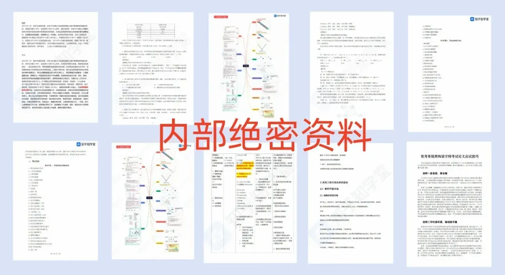
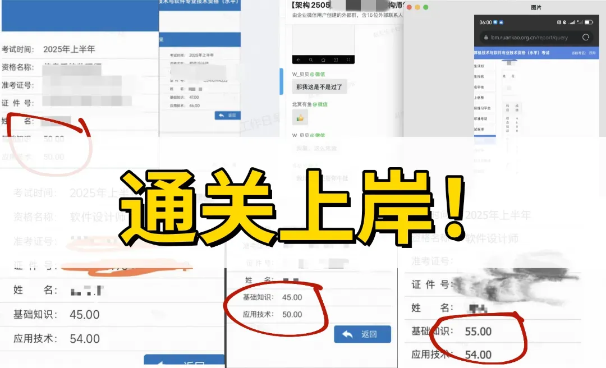
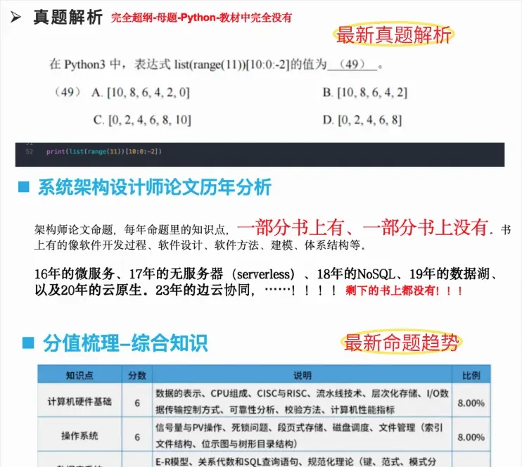
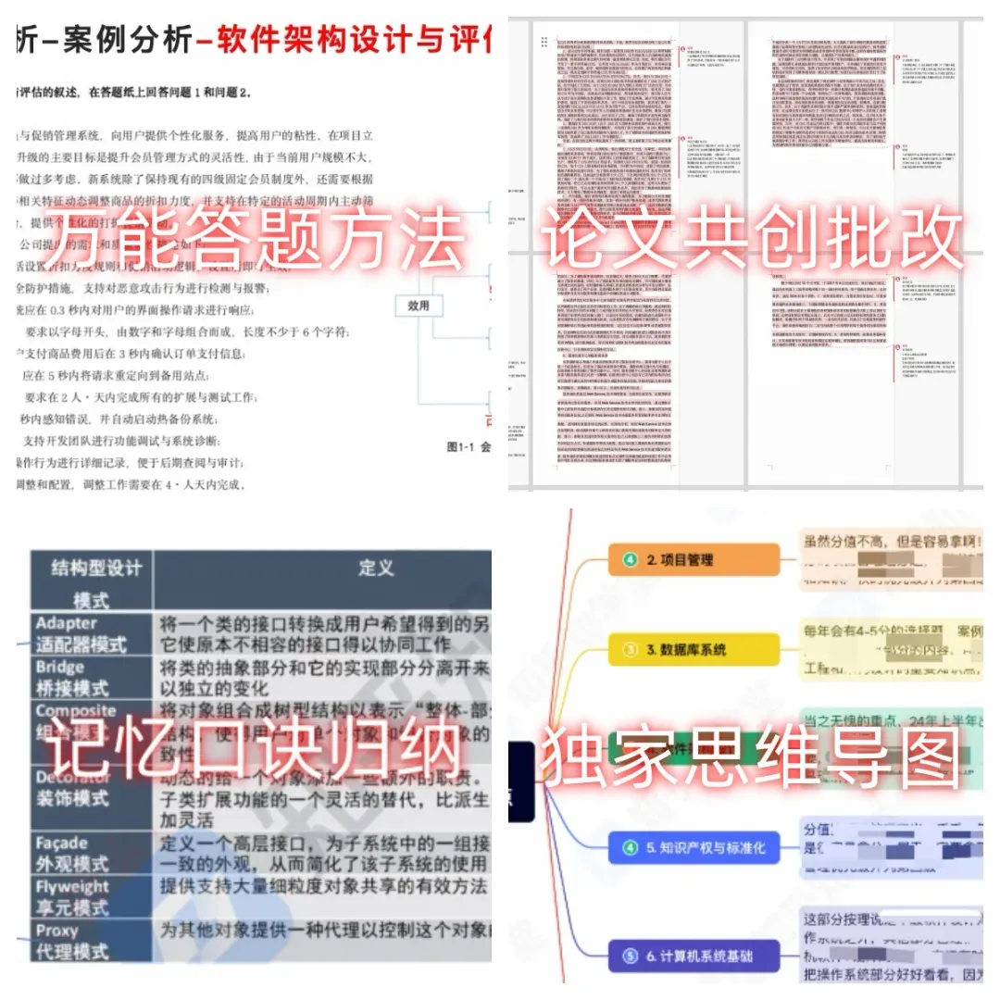
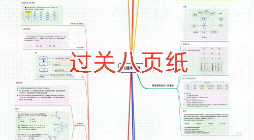
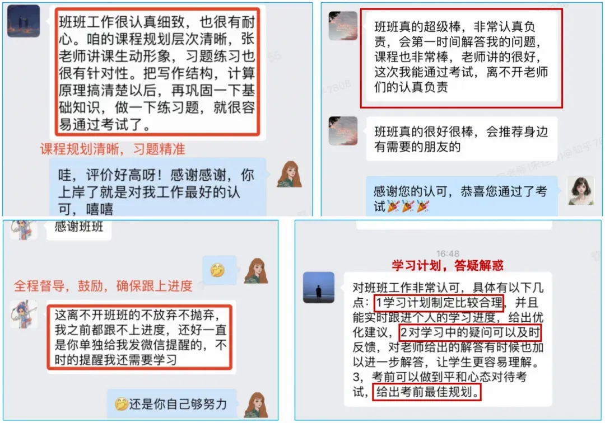
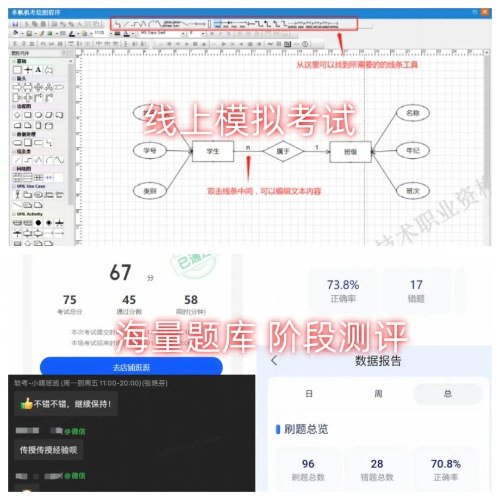

# 强烈建议尽快搞个软考证！（政策风口）

**🔊注意：2026软考生恭喜了！让你一次上岸的机会来了！**

  

「2026软考上岸学习群」正式开放！

  

25年软考已结束！你是不是也踩了这些坑😭：

❎考点又多又杂，复习毫无重点；  

❎_**超纲内容太多，新技术储备不足；**_

_**❎论文太偏，缺乏答题技巧；  
**_

_**❎备考时间零散，复习效率极低；**_

无论你是二/三战、还是初次备考26年的考生，一定不能错过这个学习群！

  

与其他学习群不同，它更适合**基础知识薄弱、复习无时间/无重点、想一次通过考试**的26年备考生，完全可以**闭眼入，全程免费👇**

🔑2天直播课——大咖解密备考趋势、重难点、复习规划；

🔑内部资源——高频考点+海量题库+价值1599内部上岸资料包；

🔑高分技巧——最新真题解析+万能模版+实用备考工具；

  

  

**从25年考试内容看，对于AI大模型、嵌入式等新技术考察会越来越多，范围越来越广，往后只会越来越难，现在就是软考最好拿证的一年！**

**如果你想通过考证实现****升职加薪、跳槽加分，享受落户/购房加分、评职称、入专家库、投标评标、涨退休费、现金补贴**......请现在就开始行动！

  

26年考试趋势分析+超纲揭秘+上岸规划

挑战每科45+一次通关！**💪**

  

  

  

**扫下方二维码进群**

仅限100人，速进待会删

**不集赞、不转发、不花一分钱** 

**揭秘高分技巧，一战通关拿证！**

**👇**👇👇

🎁完课免费领**《软考冲刺通关资料包》**

👆本期**名额有限**，手慢无！

  

  

  

**经上万考生验证、真实有效、上岸必备！**

  

  

🌟软考为什么如此重要？！

  

**「软考」**是计算机行业公认的“**黄金必考证书**”，是研发、测试、产品、运维等岗位人才**精进技术、简历背书、晋升管理**的最佳渠道，选对报考科目，更是如虎添翼！

  

对于2026年几个软考热门科目，备考难点各不相同——

  

**「****架构**」：技术含量最高，光凭经验裸考风险太大；

「**软设**」：程序员入行必备，备考知识面很多；

「高项」：论文难度极大，需要理论与实践结合；

「**网工**」：近50%超纲内容，和实际工作联系不强；

「监理」：记忆量巨大，很多抠字眼的文书与繁琐流程；

  

想顺利通关，自学已经不是明智之举，建议抓紧入群，报名本期**免费福利规划课程**，包你备考不走弯路，一次就顺利拿证👇👇

  

🌟26年备考如何一次通关？

  

✅了解命题趋势，聚焦核心考点、高分方法论！

  

这个学习群最出彩的就是2天直播课，行业大咖带你全程🔥揭秘26年考题趋势+新教材扩展，少走弯路！直接聚焦核心的知识点，补全前沿技术，备考稳准狠。

  

****

学霸的高分备考技巧，一次性无偿分享：**独家记忆口诀、案例逻辑、论文行文万能法、考前押题**......无论你是否有软考基础，都能快速掌握理论要点和案例实操，高效备考一次过关！

  

  

现在就是备考的最好时机！

**早拿证，早受益！**

📢软考特惠福利

**「2026软考上岸学习群」**

**💥通关攻略💥命题趋势 💥避坑指南**

**👇**👇👇

仅限**前100位粉丝免费加入**

****24小时**后关闭免费通道！速进！**

  

✅1V1制定备考规划，拒绝二/三战！  

  

课程期间1V1答疑解惑，科学定制备考计划。按时听课+同步刷题+考前密押冲刺科科过关拿证！

  

  

🌟更有助教团实时在线答疑，保证你的学习质量。**不用担心学不会难坚持！课程开班58期，已为20000+学员服务，口碑爆棚，从**学习方式到学习效果**，收获了超多学员认可！**

✅实用备考工具，海量题库辅助提分！

  

报名听课免费提供【智能刷题平台】**海量真题实时测评，精准有效提分。还有机会解锁【机考全真模拟】提前熟悉机考操作，避免临场丢分。**  

  

  

🌟还有历年软考人总结的超过**5****个G**的软考通关秘籍，**内含他们曾****刷过的题，推荐的模版，看过的资料**......轻松复制前辈的成功，不走弯路！  

  

  

  

✅如果你是：

  

- 有**一二线城市落户需求**的程序员
- 想系统进行**技术提升**的所有IT人
- 想评上**中高级职称**的国央企/事业单位人员
- 想通过考证获得**技能提升/升职加薪**的程序员
- 想领取**技能补贴和定额个税抵扣**的在职人员

......

近些年，软考改革动作频频，证书含金量🔝，往后只会越来越难，强烈建议加入2026软考上岸学习群，节省**70%**备考时间👇

  

🔥**限时24h，人满即关！**

 ****2026软考上岸学习群**** 

**💥最新真题解析  💥在职通关秘籍**

**💥1V1备考指导 💥免费领备考资料**

扫码**免费**入群学习

**节省70%备考时间**

**👇👇**

🎁完课免费领**《软考冲刺通关资料包》**

👆本期**名额有限**，手慢无！

  

备考1次顺利通关软考！

👇点击【**阅读原文**】马上加入！
