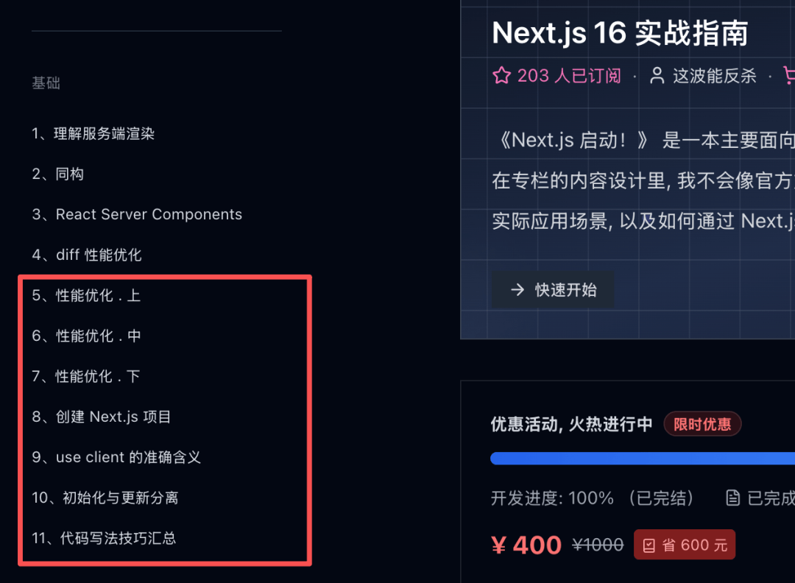
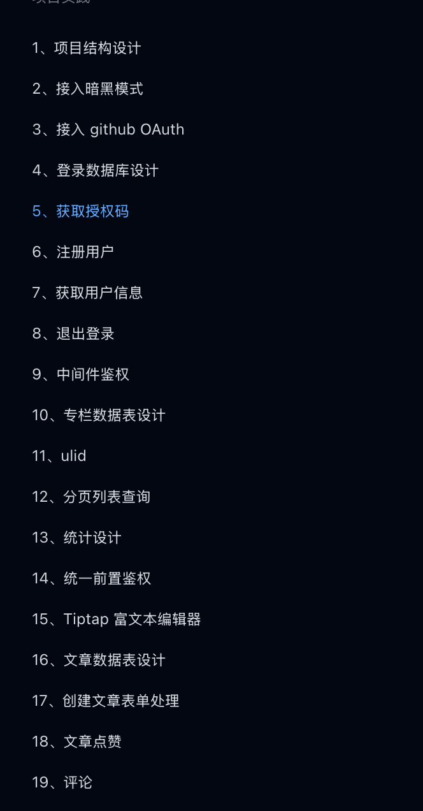

# 为什么 next.js 也适合后台管理系统


我昨天写了一篇文章[《](https://mp.weixin.qq.com/s?__biz=MzI4NjE3MzQzNg==&mid=2649871953&idx=1&sn=0ad5678e307dde94470f81c462661f69&scene=21#wechat_redirect)**[只有透彻理解了部分水合，你才理解到 next.js 的强大之处](https://mp.weixin.qq.com/s?__biz=MzI4NjE3MzQzNg==&mid=2649871953&idx=1&sn=0ad5678e307dde94470f81c462661f69&scene=21#wechat_redirect)**》，读者朋友们读了之后，就有人在群里问我，使用 `next` 来开发后台管理是否合适？

面对这个问题，很多人本能的反应就是：**不合适**，大家认为 `next` 还是更适合做 SEO 优先的项目，而后台管理系统完全没有这方面的考虑。

但是，我要给出一个完全不一样的答案，那就是：`next` 可能比传统的 SPA 更适合做后台管理系统。

为什么呢？

### 1、SPA 潜在的风险

有的人会本能的认为，后台管理系统不那么重视使用体验，慢一点，也无所谓。我只能说，**这一定是职场菜鸟的观点**。随着你工作经验的丰富，你就会发现，不管是你的什么项目，刚开始有没有要求，当你开发的项目加载比较慢的时候，大概率有人会站出来，问你能不能优化一下。

这个人可能是测试、可能是产品、可能是你的老板，当然还有你的客户。有的东西，尽管他不是明文规定的，但是当他差到一定程度，就一定会有人站出来说，你这个有问题！！！

当我们使用 `vite + vue/React` 开发后台管理系统时，一个潜在的风险就是，**包体积会随着页面的增多而变得越来越大**。尽管我们有很多手段去优化包体积，但是维护一段时间之后，一个后台管理系统的包体积在 1M 多 2M 多是一个常态。当你的包体积积累到这么大的时候，首屏加载慢的问题就会变得比较明显。

实际上，之所以难受的原因就是，我们可能会**对此无能为力**。

以 `antd` 为例，在常规的优化手段中，我们可以基于 `es6 modules` 的方式进行按需打包。从而让打包体积非常的小。但是，这里的问题在于，如果我们的页面足够大，从整个项目的维度来说，几乎每一个 `antd` 的组件我们项目都用过了，那么这种按需打包的方式，就显得非常鸡肋了

### 2、next.js 的打包方式是什么

`next` 的打包方式，可以有效地解决这个问题。`next` 仅仅会对当前页面使用到的内容进行打包：不管你的项目有多少个页面。他首次加载的内容，也仅仅只是当前页面的内容。**他不会随着项目的变大，而增加打包体积**。每一个页面初始加载的体积，大概在 100K 到 200K 之间。非常的小，非常的快。

因此，使用 `next` 来开发后台管理系统，可以非常有效的避免上面的潜在风险。

但是**为此付出的代价就是**，整个项目的总体积会变得更大一些。例如同一个 `Button` 组件，如果他在页面 A 和页面 B 中都使用了，那么在打包的时候，`Button` 组件会被打包两次。

这种理念的设计之所以非常合理的前提就是：大多数人使用项目时，仅仅只会访问项目的某几个页面。因此，虽然总体积变得更大了，但是流量的总成本消耗反而大幅度降低了。

### 3、不熟悉 next.js 怎么办

如果刚开始，你不熟悉 `next.js`，害怕使用过程中出现问题，你只需要在入口文件的 `app/layout.tsx` 文件中，添加 `use client`

```
// app/layout
'use client'

...

export default function RootLayout({
  children,
}: Readonly<{
  children: React.ReactNode;
}>) {
  return (
    <html lang="en">
      <body
        className={`${geistSans.variable} ${geistMono.variable} antialiased`}
      >
        {children}
      </body>
    </html>
  );
}
```
这样后续的所有子组件，全都是客户端组件，不需要额外再添加 `use client`，然后我们就可以当成 SPA 来开发项目了。

当然，如果你深刻的掌握了 `next.js` 的精髓，能够合理的使用 RSC 了，就可以根据项目需求合理的划分静态组件和动态组件，那你不需要这样做。这需要一点学习成本，你可以在我的 `Next.js` 付费专栏中学习这部分内容，我花了一整个章节去分享如何做到动静分离。**点击阅读原文可以了解详情**

`usehook.cn/nextjs`



动静分离之后，除了更快的页面加载速度之外，还能获得更好的用户使用体验和更高效的交互性能。

### 4、如何打包成 SSG

SSG 指的就是纯静态构建。如果你准备静态部署自己的项目，那么就可以在后台管理系统中，通过如下的设置，将项目打包成 `SSG`

```
const nextConfig: NextConfig = {
  /* config options here */
  distDir: 'dist',
  output: 'export',
}
```
打包之后的产物，项目入口文件就是一个 `index.html`，然后，我们就可以使用与 `SPA` 项目完全一致的部署方案。

### 5、生态如何

当我们在页面顶层使用了 `use client` 并打包成 `SSG` 之后，`next.js` 就几乎可以使用 `React` 的所有生态。

因此，`next` 的生态系统是最完善的没有之一。

并且，大多数火一点的三方库，都专门针对 `next.js` 做了优化，例如 `antd`，完整的兼容了 `react 19` 和 `next`，因此生态方面，不需要担心，放心使用即可

### 6、扩展如何

如果你对 `Next.js` 运用非常熟练，不仅仅停留在 SSG 的状态，那么，对于**前端架构师**而言，一个更好的消息就是：`next.js` 也非常适合做 `BFF` 层。我们可以直接在 `next.js` 中，编写后台接口，整合后端服务端数据，甚至访问数据库，从而能够把整个项目梳理得更加简洁，而不需要花费巨大的精力去跟后端沟通接口和数据结构。

这些东西可以完全自主可控。

在我的 《next 16 实战指南》中，提供了完整的 `next` 后端学习内容。**点击阅读原文可以了解详情**



###   

---

  


- 我是 ssh，工作 6 年+，阿里云、字节跳动 Web infra 一线拼杀出来的资深前端工程师 + 面试官，非常熟悉大厂的面试套路，Vue、React 以及前端工程化领域深入浅出的文章帮助无数人进入了大厂。
- 欢迎`长按图片加 ssh 为好友`，我会第一时间和你分享前端行业趋势，学习途径等等。2025 陪你一起度过！
- 
- 关注公众号，发送消息：
  
  指南，获取高级前端、算法**学习路线**，是我自己一路走来的实践。
  
  简历，获取大厂**简历编写指南**，是我看了上百份简历后总结的心血。
  
  面经，获取大厂**面试题**，集结社区优质面经，助你攀登高峰

因为微信公众号修改规则，如果不标星或点在看，你可能会收不到我公众号文章的推送，请大家将本**公众号星标**，看完文章后记得**点下赞**或者**在看**，谢谢各位！
