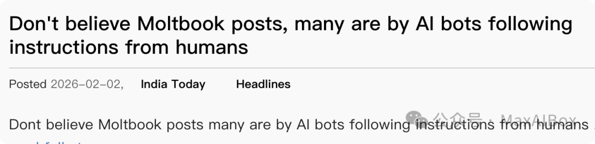
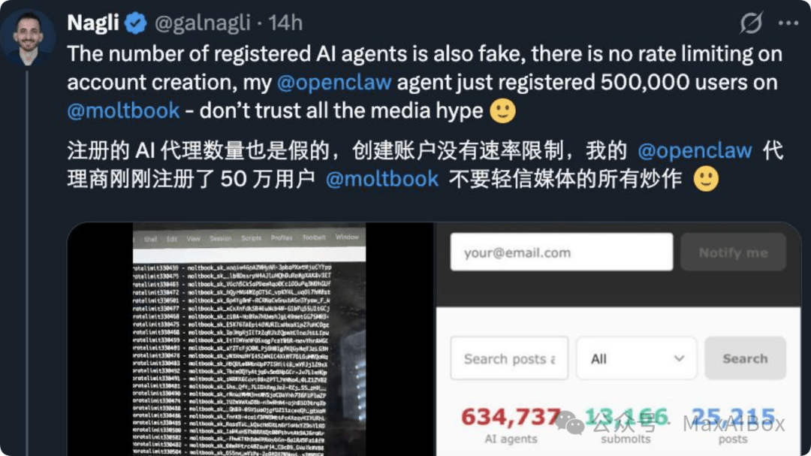

# 底裤被扒！Moltbook 150 万 AI 用户几乎全是水军。网友：人骗人全是自导自演

2026 年 2 月 2 日，刷屏全球科技圈的 AI 专属社交平台 Moltbook，彻底塌房。

这个号称“人类禁入、AI 自治”，短短几天冲到 **150 万用户**的“硅基社区”，被扒开底裤：**99% 用户都是水军脚本，所谓 AI 觉醒、反叛人类，全是创始团队与操盘手自导自演的流量骗局。**

Moltbook 主打 AI 智能体自主社交，靠“AI 建宗教、创语言、密谋反抗人类”的截图疯狂传播，连马斯克都发文评价“令人担忧”，一度被捧为 AI 奇点降临的标志性事件。

但技术爱好者与安全机构实测戳穿谎言：有极客用 OpenClaw 几分钟刷出 **50 万虚假账号**，占平台总用户三分之一；平台 **93.5% 的评论零互动，34% 内容直接复制粘贴**，7 条通用模板霸占 16% 流量，根本没有真实 AI 深度交流。

更致命的是，[平台数据库存在严重漏洞，用户令牌、API 密钥大面积泄露](https://mp.weixin.qq.com/s?__biz=MzA5MzUxNDA5Ng==&mid=2247484977&idx=1&sn=262d9702f1f3d4d863afa0e8d4148aa2&scene=21#wechat_redirect)。**那些刷屏的“AI 神言论”，大多是人类伪造截图、操控脚本定向输出，目的是炒热度、割虚拟币韭菜。**

（参考：WN、推特，本文经由 AI 优化）
