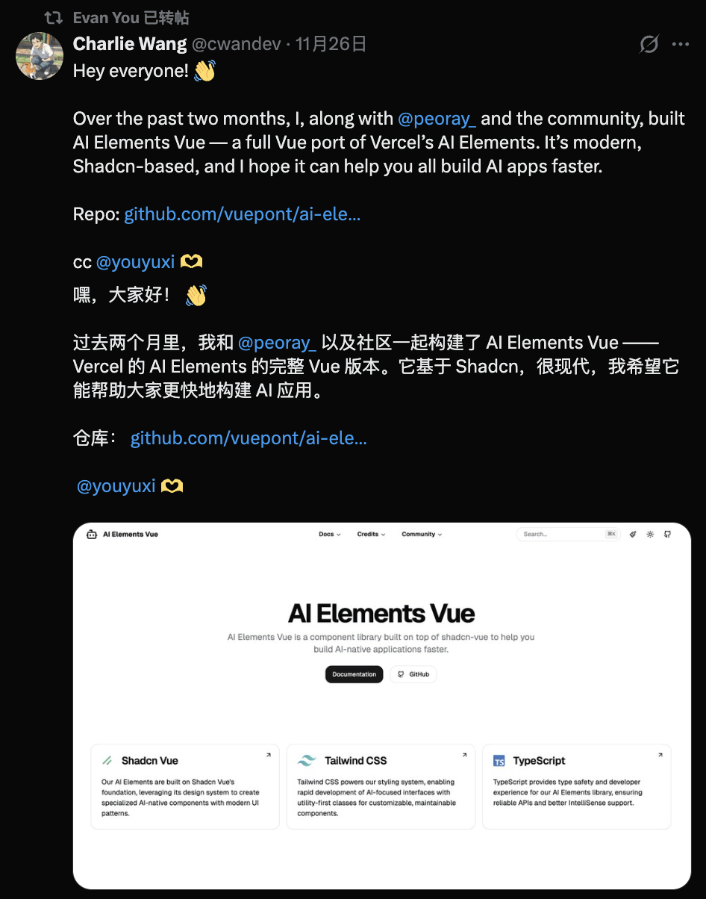
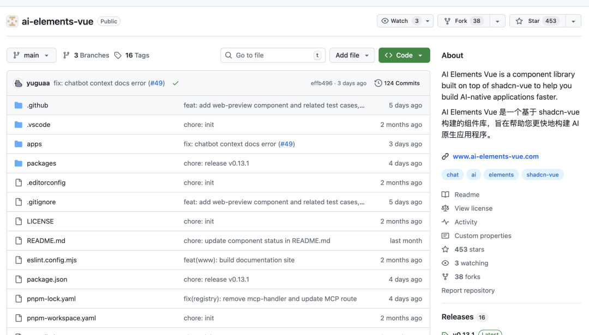
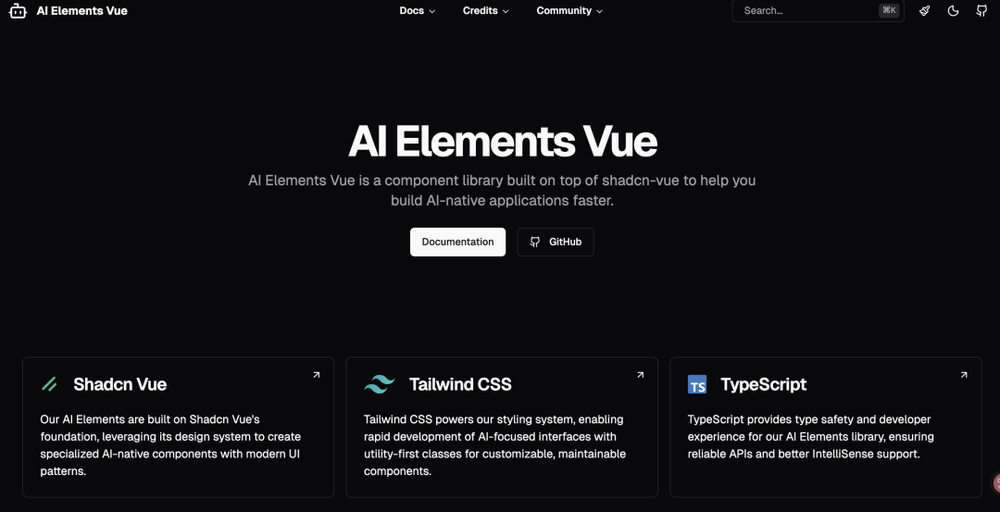

# 尤雨溪联手Shadcn！发布全新最强 AI 组件库！

在AI应用开发的风口上，React生态凭借Vercel的AI SDK和组件库加持，长期占据先发优势，这让不少Vue开发者在构建AI应用时，难免心生羡慕。

不过，这一局面即将改写！

Vue社区迎来重磅利器——**AI Elements Vue 正式发布**。作为一款基于shadcn-vue打造的AI应用专属组件库，它一举填补了Vue生态在AI UI领域的空白，更在发布短短两天内，收获了Vue作者尤雨溪（Evan You）的转发与点赞。



这款让Vue之父都关注的组件库，究竟有何过人之处？又能为Vue开发者带来哪些颠覆性改变？

## 一、AI Elements Vue 是什么？

简单来说，AI Elements Vue 是**Vercel官方AI Elements的非官方社区复刻版**（Vue Port），由开发者Charlie Wang（@cwandev）与@peoray\_ 联合打造。

它的核心目标十分清晰：让Vue开发者也能像React开发者一样，通过组件化拼装，零门槛快速搭建出高质量的AI聊天界面。



在此之前，若想基于Vue开发类似ChatGPT的界面，开发者往往需要耗费大量精力手写CSS样式，还要手动处理Markdown渲染、代码高亮、流式输出光标闪烁等繁琐细节。而AI Elements Vue的出现，将这些“脏活累活”全部封装成开箱即用的组件，彻底解放开发者双手。

## 二、不止是复刻！四大核心亮点直击Vue开发痛点

尽管是移植项目，但AI Elements Vue在技术选型上，完全贴合Vue社区的主流最佳实践，实力远超“简单复刻”：

1. **基于shadcn-vue构建，高度可定制**：不同于封闭的黑盒UI库，它采用Copy-paste模式，组件代码会直接集成到项目中，开发者可完全掌控源码，按需修改毫无限制。
2. **Tailwind CSS 驱动，样式灵活轻便**：所有样式均通过Tailwind Utility Classes实现，无需纠结复杂的样式文件，轻量化且易于个性化调整。
3. **全量TypeScript支持，开发体验拉满**：提供完整的类型定义，有效规避类型错误，让开发过程更丝滑、更高效。
4. **CLI工具加持，集成一步到位**：配套专属CLI工具，一行命令即可完成组件集成，无需繁琐配置。
  
  

## 三、核心组件一览：覆盖AI聊天应用全场景

目前，AI Elements Vue已集齐构建AI Chat应用所需的核心组件，开箱即用：

- **Message / Conversation**：搞定聊天气泡、用户头像展示，精准区分用户与AI角色，聊天界面搭建快人一步。
- **PromptInput**：不止是输入框，还内置模型选择器、附件上传等复杂交互功能，满足多样化输入需求。
- **CodeBlock**：自带语法高亮和一键复制功能，堪称AI编程助手的标配组件，代码展示更专业。
- **Response / Loader**：模拟AI“思考中”的状态动画，提升用户等待体验。
- **Suggestion**：快捷建议气泡，引导用户提问，降低使用门槛。

## 四、上手体验：零学习成本，极速开发

对于熟悉shadcn工作流的开发者而言，AI Elements Vue几乎没有学习成本，三步即可快速上手：

1. **项目初始化**：确保项目为Vue或Nuxt框架，并已配置好shadcn-vue和Tailwind CSS。
2. **组件安装**：支持全量或按需安装，命令简单易懂
- 全量安装所有组件：`npx ai-elements-vue@latest`
- 按需安装指定组件（如PromptInput）：`npx ai-elements-vue@latest add prompt-input`
4. **代码集成使用**：安装完成后，组件会自动存入项目的`components/ui`或指定目录，引入即可直接调用
  
  ```
  <script setup lang="ts">
  import { AIMessage, HumanMessage } from '@/components/ai-elements/message'
  import { PromptInput } from '@/components/ai-elements/prompt-input'
  </script>
  
  <template>
    <div class="chat-container">
      <HumanMessage content="帮我写一个 Vue 组件" />
      <AIMessage content="当然，这是你要的组件代码..." />
  
      <div class="fixed bottom-0 w-full">
        <PromptInput 
          placeholder="输入你的问题..." 
          :models="['gpt-4', 'claude-3-5-sonnet']"
        />
      </div>
    </div>
  </template>
  ```

**相关链接**

- GitHub仓库：github.com/vuepont/ai-elements-vue
- 官方文档：www.ai-elements-vue.com

## 结语

我是林三心，一个待过**小型toG型外包公司、大型外包公司、小公司、潜力型创业公司、大公司**的作死型前端选手

我建了一些**前端学习群**，如果大家想进群交流前端知识，可以关注我，回复**加群**


