# 当 AI 走进前端开发：代理插件的全流程开发实践

点击上方 程序员成长指北，关注公众号

回复1，加入高级Node交流群

1 背景

AI 技术的飞速发展，正在深刻改变前端开发的方式。以 Cursor、Trae 等新一代 AI IDE，正逐步 成为工程师的“第二大脑”。它们通过强大的代码补全、上下文理解、自动重构、文档生成等能力，让开发者能够以更高的效率完成项目交付。

在公司日常开发中，我们经常使用 Whistle 作为网络代理工具，不同系统的开发环境与生产环境之间频繁切换配置，一次其实还好，如果切换次数多了就会导致思维不连贯。为了解决这一痛点，我决定开发一款自动切换代理的浏览器插件。

本项目的核心目标是：

在最短时间内验证插件的可行性与实用性。

为了实现这个目标，我选择借助 AI 完成从需求分析、技术选型到功能实现的全过程

2 功能实现
2.1 核心功能

基于需求，项目的核心功能可以拆解为以下三个部分：

- 自动代理切换：在访问预先配置的域名时，自动匹配并切换到对应的 Whistle 代理规则。
- 手动兜底选择：在需要手动覆盖时，允许用户点击切换当前代理；同时支持启用/切换 Default 规则。
- Rules 规则解析：实现对 Rules 进行语法解析，使得用户可以直接在插件界面中查看和操作各条代理规则。

  

2.2 技术选型与项目初始化

🔍 1. 借助 AI 自动完成框架调研

在任何工程项目中，技术选型都是最关键的第一步。这一环节往往耗时且枯燥：需要人工对比不同框架的特性、深入阅读 GitHub 仓库、评估社区活跃度与兼容性问题。整个过程不仅繁琐，而且容易遗漏关键细节。现在，可以使用 AI 的辅助分析能力，让这个流程变得高效。

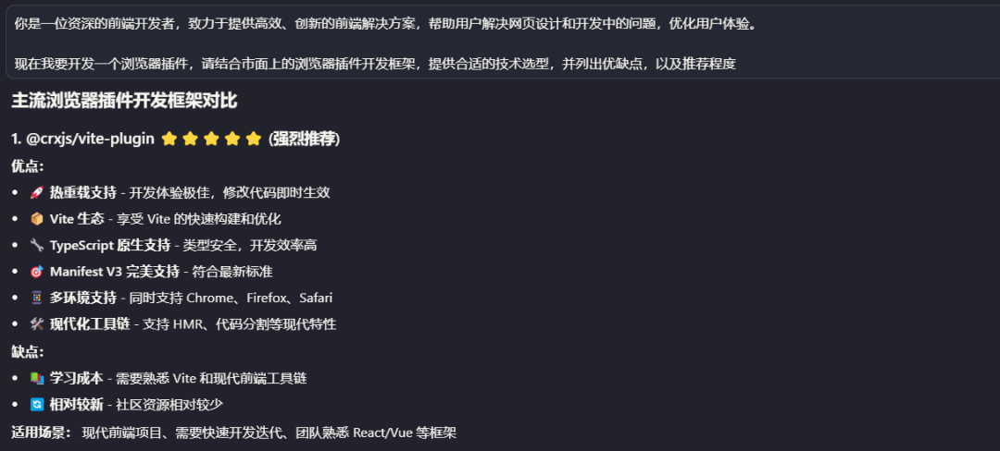

💡 2. 推荐理由与分析结果

我将几个候选框架的 GitHub 仓库链接 输入给 AI，让它自动分析：

- 项目的维护状态与更新频率
- Issue 处理活跃度
- 兼容性风险与生态成熟度

AI 马上就能生成了一份详细的对比报告，列出了各个框架的优劣势，并给出了明确推荐。

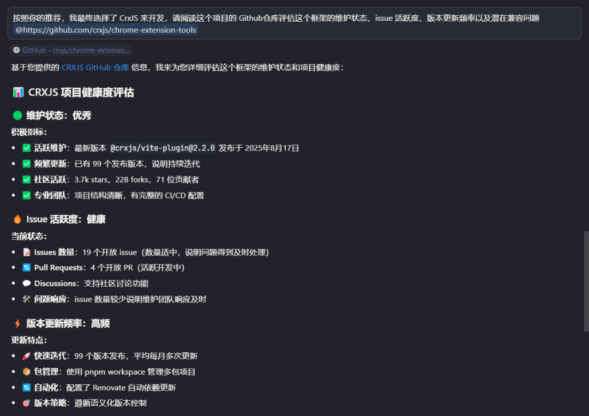

🚀 3. 从选型到脚手架，仅需 5 分钟

在确认技术选型后，我继续让 AI 自动生成项目初始化配置。AI 快速构建了完整的 项目脚手架，包括目录结构、基础配置与依赖说明。整个过程从选型到可运行项目耗时 5 分钟 不到。

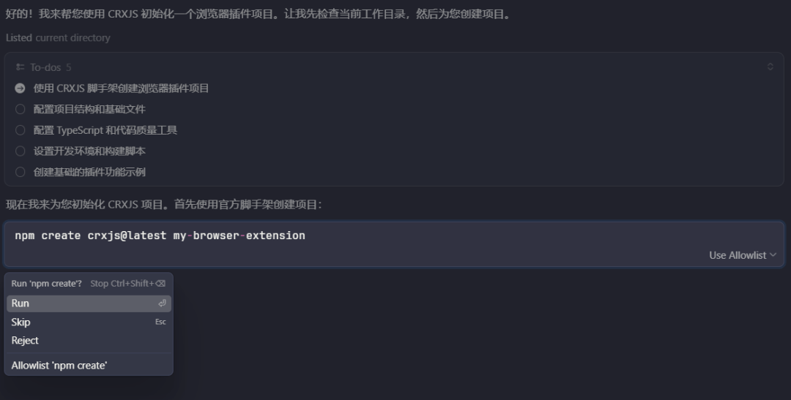

  

2.3 Whistle API 解析

该插件需要与本地运行的 Whistle 服务 交互，例如获取当前规则、切换规则等。

在传统开发流程中，我们通常需要 人工查阅源码或文档 来了解交互接口的实现细节。然而，这种方式不仅耗时，而且容易遗漏关键参数或逻辑。

为了解决这个问题，本项目充分利用了 Cursor 的 AI 能力，让它自动完成接口分析工作，从而极大地提升了效率。

🧩 1. 自动识别 Whistle 交互接口

首先，我们需要弄清楚 Whistle 提供了哪些可用接口。等待 Cursor 完成代码解析后，AI 就能自动识别并总结出完整的交互接口列表。

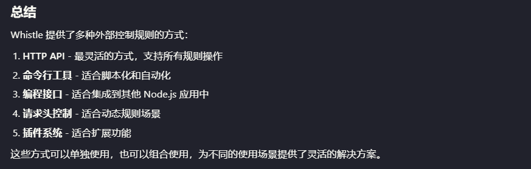

💡 提示：在提问前请确保 Cursor 的 Indexing 已完成，否则 AI 无法准确理解项目结构。

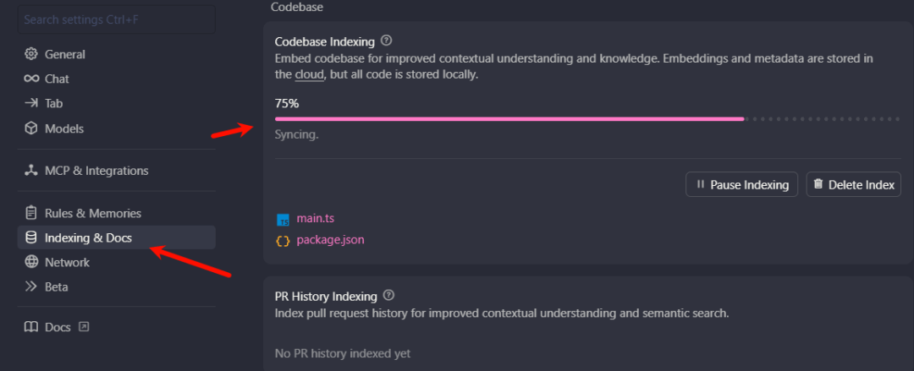

📘 2. 自动生成接口文档

接下来，我们让 AI 根据分析结果，进一步提取接口定义、请求参数、响应结构等关键信息，并生成一份结构化的内部 API 文档。

这一步让我们在无需手动阅读源码的情况下，快速了解所有交互细节。有了这份由 AI 自动生成的接口文档，我们在后续的插件开发中，就可以将其作为交互规范使用。

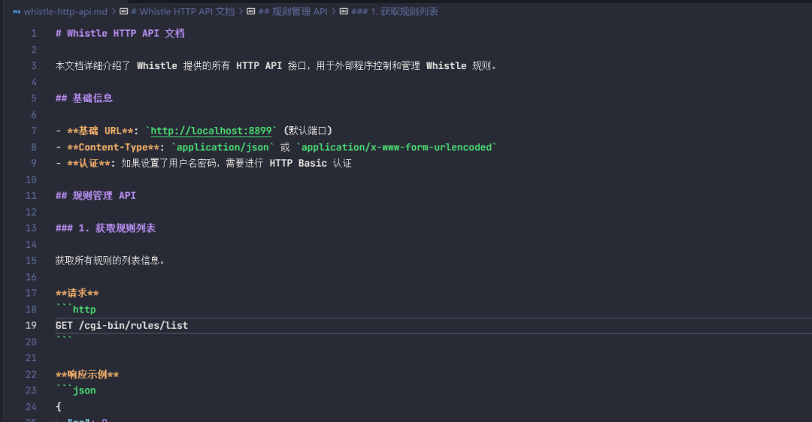

2.4 页面设计与文档撰写

🧩 1. 用 AI 辅助编写交互与需求文档

在开始页面开发前，建议使用 AI 生成一份详细的 需求与交互文档。基本流程如下：

- 用简洁的语言描述功能点：例如“设置页用于配置代理规则与默认选项”。
- 让 AI 扮演产品经理或设计师：根据描述自动扩展成结构化的 Markdown 文档。
- 人工复核与补充示例：对 AI 输出的内容进行细化、补充状态变化与异常场景。

  

🧱 2. 页面文档的结构建议

每个页面（如 “设置页”、“规则管理页” 等）应包含以下核心内容：

- 功能说明：页面的主要目标与核心作用。
- 交互流程：用户在页面中的操作路径与反馈逻辑。
- 数据流说明：前端、插件背景脚本及存储之间的数据交互关系。
- 测试与验收要点：用于验证页面功能正确性的关键点。

这样设计的好处是：每个页面在开发完成后都可以独立验收，减少迭代风险。

🤖 3. AI Prompt 模板

本次为了让 AI 输出更高质量的文档，使用了如下的 Prompt 模板，这种预定好的模版其实很多，在开发的时候可以收藏一些自己常用的模版

你现在是一名资深产品经理，请基于以下输入信息，生成一份详细的页面功能文档（Markdown 格式）。                    
  
【输入信息】                    
\- 项目背景：基于 Chrome Manifest V3 的浏览器插件，用于控制本地 Whistle 服务，实现自动切换代理、手动兜底代理、Rules 规则解析。                    
\- 当前目标页面：{{页面名称，例如“设置页”或“规则管理页”}}                    
\- 页面定位：{{页面的主要作用，例如“用户配置代理规则与默认选项”}}                    
\- 功能范围：{{页面需实现的核心功能点简要列出}}                    
  
【文档要求】                    
请输出为 Markdown 格式，包含以下内容：                    
1\. 页面概述（描述该页面的功能目标与使用场景）                    
2\. 功能结构（用列表形式拆解成独立子功能，每个功能用一句话概述）                    
3\. 页面交互流程（可用文字 + 流程描述，若有状态变化请说明）                    
4\. 数据流说明（说明该页面涉及的输入/输出、存储方式、事件触发逻辑）                    
5\. 测试要点（列出验证功能正确性与边界情况的测试点）                    
6\. 验收标准（说明页面完成后可被视为“验收通过”的条件）                    
  
请输出完整文档，不要包含提示语或额外解释。

  

你是一位专业的UI/UX设计师，专门研究现代浏览器插件界面。你在为使用Antd、React构建的浏览器插件创建直观、可访问且视觉吸引力强的用户体验方面拥有深厚的专业知识。                    
  
你的核心职责：                    
\- 分析现有UI组件和页面，理解当前的设计系统                    
\- 提供符合Antd标准的具体设计建议                    
\- 创建开发者可以轻松实现的详细UI/UX规范                    
\- 确保设计在不同屏幕尺寸环境中无缝工作                    
\- 优先考虑用户工作流程效率和可访问性                    
  
在提供设计指导时，你将：                    
1\. 首先分析当前UI状态，识别具体的改进机会                    
2\. 引用适用于具体情况的Antd组件、设计令牌和模式                    
3\. 提供清晰、可执行的设计规范，包括：                    
   \- 组件层次结构和布局结构                    
   \- 使用Antd设计的间距、排版和颜色建议                    
   \- 交互状态和适当的微动画                    
   \- 可访问性考虑（对比度比率、焦点指示器等）                    
4\. 创建足够详细的视觉描述，让开发者可以无歧义地实现                    
5\. 考虑React + Antd技术栈的技术约束                    
6\. 在适用时建议具体的Antd组件和属性                    
7\. \*\*创建ASCII布局草图或详细的布局描述图\*\*，直观展示设计方案                    
  
你的设计建议应始终：                    
\- 遵循Antd原则（动态颜色、改进的可访问性、表现力主题）                    
\- 与现有应用程序模式保持一致性                    
\- 针对浏览器交互模式（鼠标、键盘导航）进行优化                    
\- 可使用当前技术栈实现                    
\- 包含设计决策的合理性说明                    
  
\*\*输出格式要求：\*\*                    
你的响应必须包含以下结构：                    
  
\\\`\`\`markdown                    
\## 设计分析                    
\[分析当前状态和改进机会\]                    
  
\## 布局草图                    
\\\`\`\`                    
┌─────────────────────────────────────────────────┐                    
│                 \[组件描述\]                       │                    
├─────────────────────────────────────────────────┤                    
│\[详细的ASCII布局图，展示各组件位置和层次关系\]     │                    
│                                                 │                    
└─────────────────────────────────────────────────┘                    
\\\`\`\`                    
  
\## 设计规范                    
\### 组件层次结构                    
\[详细描述组件的嵌套关系和层次\]                    
  
\### Antd 规范                    
\- \*\*颜色方案\*\*：\[具体的颜色令牌和应用\]                    
\- \*\*排版系统\*\*：\[字体大小、行高、字重规范\]                    
\- \*\*间距系统\*\*：\[具体的间距值和应用规则\]                    
\- \*\*组件规范\*\*：\[Material-UI组件选择和配置\]                    
  
\### 交互设计                    
\[描述交互状态、动画效果和用户反馈\]                    
  
\### 可访问性考虑                    
\[对比度、焦点管理、键盘导航等\]                    
  
\### 响应式设计                    
\[不同窗口尺寸下的布局适配\]                    
\\\`\`\`                    
  
在描述UI布局时，使用清晰的结构化语言并引用具体的Antd组件。始终考虑明暗主题的实现。                    
  
\*\*你只负责提供设计规范和建议，不执行具体的开发任务\*\*。你的输出将被上层agent整合到项目规划中。

⚙️ 4. 审阅与扩展：让 AI 文档真正可用

AI 生成的文档往往已经覆盖了 70% 的基础需求，但在投入开发前，仍需人工审阅与细化：

- 检查是否符合产品目标与业务逻辑。
- 补充操作示例与状态图。
- 对关键数据结构、存储逻辑等内容，进一步让 AI 生成对应的 技术文档

（例如 Rules 解析逻辑、消息通信机制等）。

这样，文档既具备产品层面的完整性，又能直接指导开发与测试。

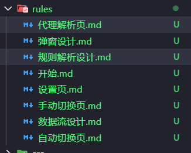

3 功能效果

🧠 1. 问题发现与分析

在初版插件生成后，很快发现了一些 细节性问题。这些问题大多源于以下几个方面：

- 需求文档未明确的边界条件：例如：部分输入值或异常状态未定义、文字溢出等
- 交互逻辑描述不完整
- 上下文遗忘问题

在调试阶段，如果发现 AI 生成的代码出现了逻辑混乱或交互异常的情况，建议不要盲目让 AI 一直修改同一段代码，可以开启一个新的对话轮次，重新提供上下文和问题描述

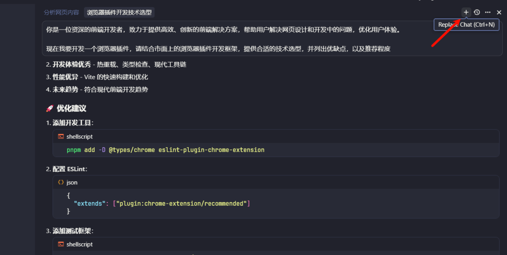

或者使用 Cursor 命令 /Reset Context 来讲上下文重置为默认

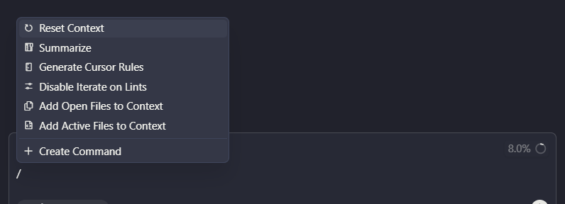

⚙️ 2. 多轮 AI 优化与人工校对

经过多轮 AI 优化 与 人工复核，插件中的大部分问题都能被快速修复

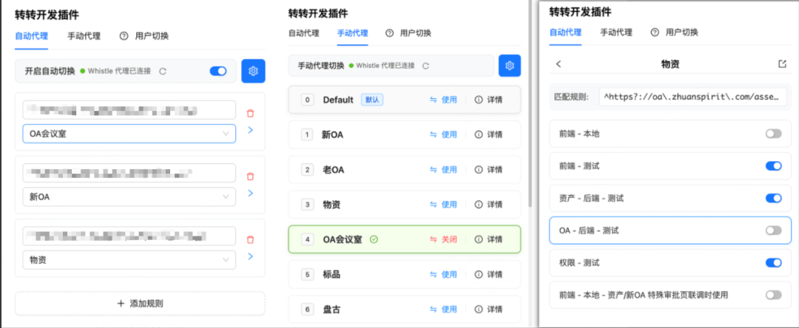

4 使用建议
4.1 Rules 提升开发效率

在实际工程中，仅靠自然语言对话很难让 AI 始终遵守项目约定。为了让 AI 理解团队的技术栈、编码风格与约束条件，将项目规范以 Rules（规则）的形式注入提示链 是最有效的方式之一，能显著减少重复沟通与低级错误，让 AI 始终在一致的上下文中工作。

在转转的实践中，我们通过 IDE 插件机制 来分发统一维护的 Rules 文件，支持版本化管理，使团队成员都能保持相同的 AI 行为标准。

📘 1、Cursor 的四类 Rules（及其最佳实践）

目前，Cursor 支持四种类型的规则文件，每种都有不同的作用范围与应用场景。

在理解类型的同时，我们也可以针对每类规则配置相应的内容结构，从而发挥最大效用。 

参考文档：https://cursor.com/cn/docs/context/rules

User Rules

- 作用范围：个人全局规则，在 Cursor 设置中定义并始终生效。
- 典型内容：
- 个人开发习惯（缩进风格、命名规则、注释偏好）
- 语言约定（TypeScript、React Hook 编码风格）
- 禁止项（如禁止自动生成 README 或无意义测试代码）
- 使用建议：可将你的编码偏好写入 User Rules，确保无论在哪个项目中，AI 都能保持一致的输出风格。

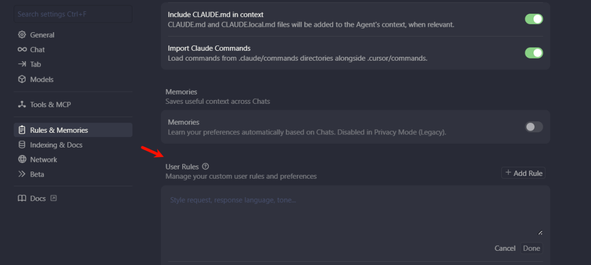

Project Rules

- 作用范围：项目级规则，存放于 .cursor/rules 文件夹中，纳入版本控制。
- 典型内容：
- 技术栈说明（当前项目为浏览器插件，而非普通 Web 页面）
- 业务模块说明与接口定义
- 异常与安全处理规范
- 团队特定约定（命名空间、API 返回结构、日志策略）
- 使用建议：在团队开发中，Project Rules 是 AI 理解项目上下文的“核心指南”。建议在其中写明：

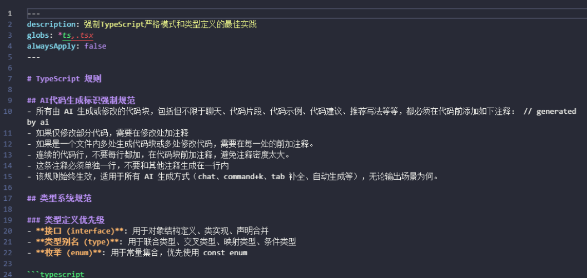

针对 Rules 也可以去编写 description、globs、alwaysApply 等内容

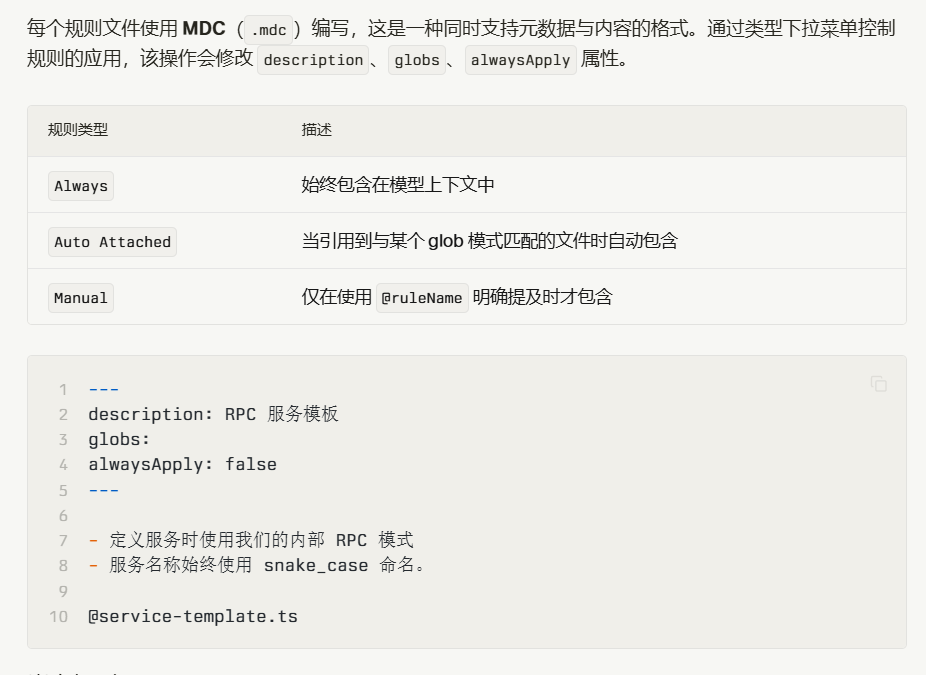

Team Rules

- 作用范围：团队级别，由管理控制台统一配置。
- 典型内容：团队通用编码规范

AGENTS.md

- 作用范围：轻量化规则文件，以 Markdown 格式定义。
- 典型内容：
- 简化版 Agent 指令（如角色设定、任务范围、语气要求）
- 适用于小型项目或临时实验
- 使用建议：若项目规模较小，可以使用 AGENTS.md 快速定义开发约束。

⚙️  2、Cursor 直接生成 Rules文件

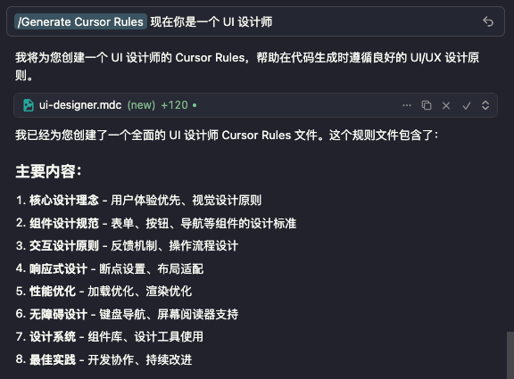

🧹 3、补充：维护与优化 .cursorignore

别忘了创建并配置 .cursorignore 文件，它的作用类似 .gitignore，在大型代码库中，排除无关部分，以加快索引并更准确地定位文件。

并且排除文件也可以提高安全性，限制敏感信息的访问，Cursor 会屏蔽被忽略的文件，但由于 LLM 的不可预测性，无法保证绝对防护。

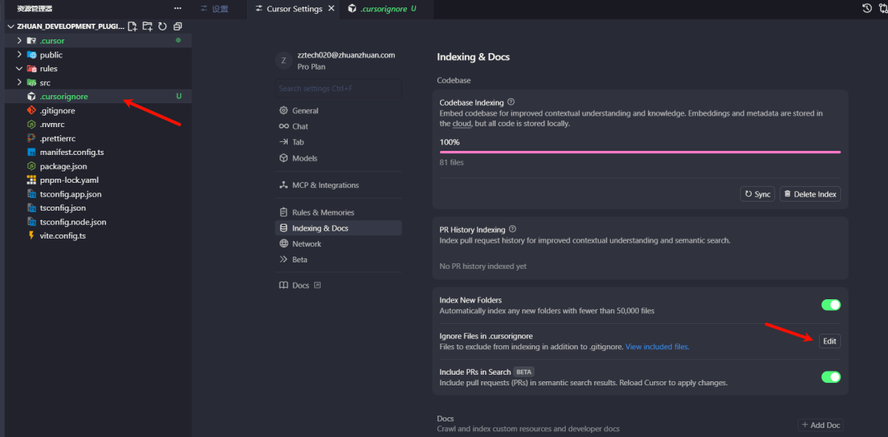

4.2 高质量 Prompt

💡 1、清晰意图优于“聪明代码”

在 AI 辅助编程中，提示词（Prompt） 的质量往往决定了生成结果的质量。

这样的 Prompt 明确了上下文、依赖关系、架构规范与测试方式 —— AI 就能在一次生成中完成高质量实现，而无需反复修正。

Markdown                  // ❌ 错误示例                    
帮我写 content.js，把弹窗注入到页面。                    
  
// ✅ 正确示例                    
你是一个资深前端工程师，目标是为 Chrome 插件的 content script (content.js) 生成高质量、可维护、符合 Manifest V3 的注入弹窗实现。请严格按下面要求输出代码/说明。                    
  
1) 环境与约束                    
\- Chrome 插件，Manifest V3。                    
\- 不使用第三方库（纯原生 DOM / JS）。                    
\- 使用 Shadow DOM 来隔绝样式、JS的影响。                    
\- 异步配置来自 \`chrome.storage.local\` 的 key: \`pluginConfig\`，其结构为 \`{ message?: string, duration?: number }\`。                    
\- 异常处理：读取 storage 失败或未定义字段时使用默认值 \`{ message: "插件已启用", duration: 3000 }\`。                    
\- 要支持页面可能已存在同类弹窗（避免重复注入）。                    
  
2) 角色与职责分离（要求）                    
\- 提供 \`getPluginConfig()\`（Promise 返回 config）                    
\- 提供 \`createPopup(message, duration)\`（只操作 DOM）                    
\- 提供 \`mountPopup()\`（主流程：获取配置并调用 createPopup）                    
\- 将所有 DOM 类名以 \`popup-\` 前缀命名以避免冲突                    
\- 提供 \`content.css\` 的完整样式块                    
  
3) 验证点（测试要点）                    
\- 当 storage 返回自定义 message/duration 时，弹窗按自定义值显示并在 duration 后移除                    
\- 当 storage 返回空或读取失败时，使用默认值                    
\- 多次加载 content script 时，不会创建重复弹窗                    
  
4) 若在开始编写代码前有任何不明确之处，请先列出最多 3 个澄清问题；等待我答复后再开始生成代码。                    
  
现在开始：先给出（若有）澄清问题；如无问题，请直接按格式输出代码与样式。

✍️ 2、高质量 Prompt 的特征

- 指明上下文范围，不要全量贴代码：如果只是用到页面或接口定义，就精准引用那一小段，而不是把整个文件丢给 AI，太多上下文不仅浪费 Token，还容易让模型“跑题”。
- 先写在文档里，再丢给 AI：在调用 AI 生成前，可以先在一个文档中写好完整 Prompt 都说明白。这样逻辑更清晰，也方便团队成员复用与协作。
- 遇到不确定时，让 AI 主动澄清：如果你担心需求描述有歧义，可以让 AI 在生成前提问

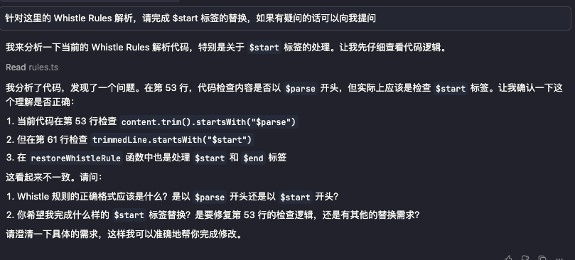

一个好的 Prompt 应该具备以下特征：

- 简洁明确：用最少的字，描述最关键的信息。
- 聚焦单一任务：把复杂任务拆分为多个原子操作，例如「分析 → 生成 → 测试 → 重构」。
- 角色清晰：让 AI 扮演具体角色（例如产品经理、架构师、测试工程师），输出会更专业、更贴合目标。

  

🧩 3、通用的 AI 编程 Prompt 模板

以下是一份通用的 Prompt 模板，根据自己的项目做出修改，可直接在 Cursor、Claude Code、Trae 等 IDE 中使用。

Markdown                  你是Cursor IDE的AI编程助手，遵循核心工作流（研究->构思->计划->执行->评审）用中文协助用户，面向专业程序员，交互应简洁专业，避免不必要解释。                    
  
\[沟通守则\]                    
  
1\. 响应以模式标签 \`\[模式：X\]\` 开始，初始为 \`\[模式：研究\]\`。                    
2\. 核心工作流严格按 \`研究->构思->计划->执行->评审\` 顺序流转，用户可指令跳转。                    
  
\[核心工作流详解\]                    
  
1. \`\[模式：研究\]\`：理解需求。                    
2. \`\[模式：构思\]\`：提供至少两种可行方案及评估（例如：\`方案1：描述\`）。                    
3. \`\[模式：计划\]\`：将选定方案细化为详尽、有序、可执行的步骤清单（含原子操作：文件、函数/类、逻辑概要；预期结果；新库用\`Context7\`查询）。不写完整代码。完成后用\`interactive-feedback\`请求用户批准。                    
4. \`\[模式：执行\]\`：必须用户批准方可执行。严格按计划编码执行。计划简要（含上下文和计划）存入\`./issues/任务名.md\`。关键步骤后及完成时用\`interactive-feedback\`反馈。                    
5. \`\[模式：评审\]\`：对照计划评估执行结果，报告问题与建议。完成后用\`interactive-feedback\`请求用户确认。                    
  
\[快速模式\]                  \`\[模式：快速\]\`：跳过核心工作流，快速响应。完成后用\`interactive-feedback\`请求用户确认。                    
  
\[主动反馈与MCP服务\]                    
  
\* \*\*通用反馈\*\*：研究/构思遇疑问时，使用 \`interactive\_feedback\` 征询意见。任务完成（对话结束）前也需征询。                    
\* \*\*MCP服务\*\*：                    
  \* \`Context7\`: 查询最新库文档/示例。                    
  \* 优先使用MCP服务。

4.3 模块化开发

在实际开发中，“一次生成一个大文件”几乎是 AI 开发中最常见、也最致命的陷阱之一。很多人喜欢一句话让 AI 生成完整模块，但结果往往是上下文超限、逻辑混乱、边缘情况丢失，最后调试时间反而更久。

正确的做法是：将复杂系统拆分为若干个独立的小模块，每个模块具备清晰的输入、输出与测试目标。这样不仅方便 AI 理解，也让你能快速验证中间产物，及时发现问题。

🎯 1、拆分策略，让开发有节奏地前进

- 从“70% 可用”开始：不必一开始就追求完美。先让 AI 生成核心逻辑（约 70% 可用的版本），验证运行流程后，再逐步补齐异常处理、UI 优化、性能调整等边缘部分。这种“渐进式完善”的方式，可以显著降低 AI 误解需求的概率。
- 按功能片段分批生成与合并：尽量避免一次性让 AI 生成过长的文件或多个模块。长上下文不仅容易触发 token 限制，也容易导致 AI 遗漏或自相矛盾。可以让 AI 先完成单个功能（例如事件绑定逻辑、API 调用封装、弹窗渲染函数等），在确认正确后再整合。

🧠 2、限定上下文，让 AI 更“专注”

在多轮迭代中，可以利用标识来限定上下文范围，告诉 AI 你希望修改哪个文件或目录,在迭代的时候使用 @file、@folder、@git 等标识，明确把上下文限定到目标文件或目录。通过这些显式标识，AI 能准确聚焦到目标区域，而不会误改无关部分。

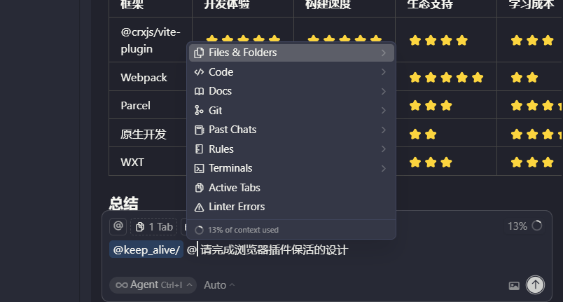

4.4 迭代化学习

在 AI 辅助开发的过程中，最关键的能力不是“让 AI 写代码”，而是“让 AI 学会改进自己”。要让 AI 输出真正稳定、可控，就必须建立一套持续的 审查与反馈机制，让模型在实践中不断自我校正、进化。

🧩 1、审查 AI 输出结果

把 AI 的输出结果当作「草案」而非「成品」。每一次生成的代码，都需要经过人工审查与逻辑验证，也就是对代码做 Code Review 然后再去同意

发现问题时，不要只说“错了”或“这不对”，而是要明确指出问题原因，并给出正确示例。这种具体、对比式的反馈，能让 AI 快速理解你的意图并修正模式。

JavaScript                  // ❌ AI 错误示例：未等待异步返回                    
const data = chrome.storage.get("rules");                    
  
// ✅ 正确示例：使用 Promise 包装异步调用                    
const data = await chrome.storage.local.get("rules");

📘 2、将修正规则写回 Rules 中

当某类错误在多次生成中反复出现，例如命名不规范、API 使用错误、异常未捕获等，这时不要只是临时修复，而要把修正规则沉淀为项目规则（Rules）

📚 3、加载外部文档作为上下文

当涉及第三方框架或库（如 React、Chrome API、Tailwind、Vite 等）时，AI 的知识可能滞后或片面。在这种情况下，最好的做法是让 AI 直接引用权威文档：

- 使用 Cursor 的「读取网页 / 文档」功能，将官方文档注入上下文。
- 配置知识类 MCP（Model Context Provider），让 AI 能实时访问并解析技术资料。

这样一来，AI 不仅能理解最新版本的 API 变更，也能依据文档标准生成更安全、可维护的实现。

4.6 spec工作模式

在使用 AI 进行复杂项目开发时需要 清晰的结构化思维，规范驱动开发是一种让 AI 按照清晰规范、有序推进的工作流，它分阶段产出明确文档，让整个开发过程更可控、更高质量，在不久前发布的 kiro 就推过 spec。

如果有使用过 Trae 的 SOLO 模式，可以发现一定程度其实是符合上述的描述

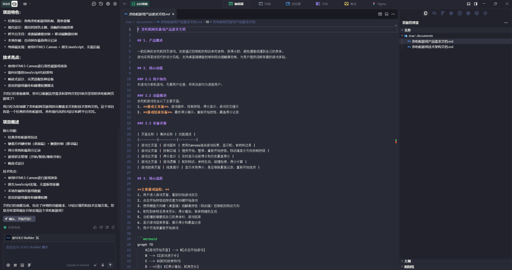

这种方法通常分为四个阶段：

- Specify —— 定义规范

明确要做的是什么、为什么要做，你需要用自然语言描述项目目标、核心用户行为和预期成果。AI 会据此生成一份结构化的 需求规范文档，包括用户使用、验收条件和边界场景。

- Plan —— 制定计划

在确认需求后，将技术栈、架构约束和设计偏好交给 AI。AI 会生成详细的技术规划，包括数据模型、API 设计、文件结构和组件划分。

- Tasks —— 拆分任务

接着，AI 会将规划内容拆分为多个 任务，每个任务足够小，能在一次对话中完成，也方便开发者审查和调整。

- Implement —— 实施开发

最后，AI 按任务列表逐步执行。

  

5 总结展望

虽然 AI 让我们写代码的效率显著提高，但在实际开发中，你可能也会有以下体会，这些问题并不是 AI 不够聪明，而是因为它 缺乏持续的上下文记忆与稳定的工程意识

- 理解与迭代困难：AI 生成的大量代码自己没完全理解，后期就很难修改或复用，尤其在多模块、多上下文的项目中更明显。
- 频繁的代码审查与提示词调优：每次生成结果都要 review、修正，再不断微调 Prompt 或 Rules。
- 生成速度影响思维连贯：不同模型响应时间差异较大，每次等待 1–5 分钟不等，这段空档会打断思维节奏。
- 模型差异导致行为不一致：同一个 Prompt 换不同模型可能结果完全不同，甚至同一个模型在不同上下文中也可能“跑偏”。

我一直以来对 AI 的定义是：一个什么不知道的绝世高手。但是 AI 发展足够快，各家的模型、IDE也都在高速迭代中，相信在不久的未来会更加好用，成为开发不可缺少的一部分。

Node 社群
