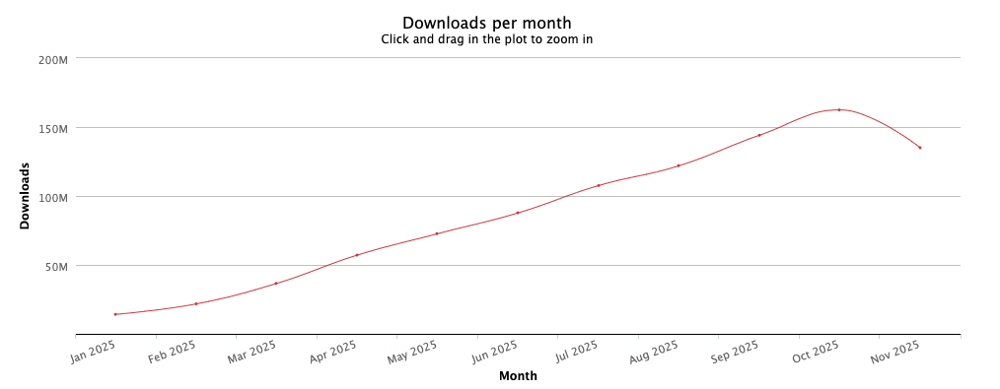

# 【早阅】让依赖更轻，让构建更快：tinyglobby 的演进之路

前言

讲述在 JavaScript 开发中对依赖管理的探索，尤其是对 glob 库的优化。今日前端早读课文章由 @Madeline Gurriarán 分享，@飘飘编译。

译文从这开始～～

我与依赖的故事有点特别。大约六年前，我开始用 JavaScript 编程。随着时间的推移，我发现每次想用一个新库时，lockfile 的体积都在不断增大。很多子依赖看起来和我实际使用的库根本没有关系。我一直用的是一台性能不高的笔记本电脑，每次安装依赖时都能明显感觉到越来越慢。

tinyglobby下载量：961,123,160

于是我开始检查项目中到底添加了哪些子依赖，以及它们在现代 JavaScript 生态中是否真的必要。经过几个月的零星优化，我偶尔减少了一些库的依赖数量。就在这时，我发现了一个刚公开的项目 ——e18e，在那里我学到了许多以前从未想到过的优化方法。

[【第3505期】依赖分类](https://mp.weixin.qq.com/s?__biz=MjM5MTA1MjAxMQ==&mid=2651276356&idx=1&sn=8a9821492e67075b2a8119c15e14bdde&scene=21#wechat_redirect)

其中一个我想替换的库是 tsup 中的 globby。有人建议我试试 fdir 和 picomatch 来替代它。我提交了一个 PR，几天后就被合并了。结果第二天一早醒来，发现用户都无法正常使用 tsup 了。原来，处理文件匹配（glob）的逻辑比我想象的复杂得多！我完全没料到，自己接下来一整年都会和 “globs” 打交道。

因为 e18e 的一些人也在研究轻量级的 glob 实现，我们决定把我在 tsup 里那不到 100 行的小改动独立成一个新库，让更多人受益于它的轻量特性。

#### 依赖节省情况

我们来看几个同类库的对比：

- globby：由 14 位维护者维护，共 24 个包，安装体积为 637KB
- fast-glob：由 12 位维护者维护，共 18 个包，安装体积为 513KB
- tinyglobby：由 6 位维护者维护，仅 3 个包，安装体积为 179KB

包数量更少意味着维护者更少、发布流程更集中，也就能显著降低供应链攻击的风险。npm 生态中过去发生过不少相关事件。例如最近，“glob” 库（拥有 26 个依赖）受到了供应链攻击，因为其中的一个依赖包 strip-ansi 被入侵。而 tinyglobby 的用户不会受到这种攻击的影响，未来面临类似风险的概率也更低。

#### 高采用率带来的去重效应

当然，globby 和 fast-glob 使用范围广泛，有人可能会担心：如果改用 tinyglobby，会不会因为依赖去重机制而反而增加总体依赖？

幸运的是，社区正在积极整合资源，推动统一使用 tinyglobby，从而减少这种问题。

现在，许多流行的构建工具都已完全依赖 tinyglobby 提供的 glob 功能：

- Vite
- SWC
- copy-webpack-plugin
- tsup
- tsdown
- unbuild
- nx
- lerna
- …… 以及更多项目

这些工具都没有再深度依赖其他 glob 库，全都自上而下地使用 tinyglobby 🎉

同时，很多主流框架也完成了迁移：

- React Router
- Preact
- Angular
- SvelteKit
- Astro
- Starlight
- Eleventy

新的应用如果使用这些框架，将不再深层依赖多个 glob 库。

[【早阅】Vue 的演进：从框架到生态系统](https://mp.weixin.qq.com/s?__biz=MjM5MTA1MjAxMQ==&mid=2651277385&idx=1&sn=e1f1bd391b25cc3ec8120e8752c9ace2&scene=21#wechat_redirect)

对于 Nuxt、SolidStart 和 TanStack Start 这类框架，它们的依赖已经全面切换到 tinyglobby，只要更新依赖后，也将只使用 tinyglobby。剩下的少数框架目前同时使用 tinyglobby 和 fast-glob。

有些生态甚至几乎完全依赖 tinyglobby —— 例如 Svelte 的维护者 benmccann 已将大部分 Svelte 生态迁移到了 tinyglobby。一旦 typescript-eslint 的相关 PR 被合并，你就能用 SvelteKit 创建一个全新项目，所有集成都将只使用 tinyglobby。此外，pnpm、node-gyp、eslint-import-resolver-typescript 等知名项目也已经完成迁移。

对于新项目或最近更新依赖的项目来说，tinyglobby 的使用率已明显高于 fast-glob 或 globby。从相对和绝对角度看，tinyglobby 的增长速度都更快。值得注意的是，tinyglobby 的所有使用都集中在同一个主版本线上，而其他库的使用则分散在多个版本上。比如 globby 的下载量分布在 10 个主版本（v5–v14，每个版本每周下载量都超过 100 万）。这意味着，tinyglobby 在新项目中的实际采用速度比表面上的下载数据还要更高。

#### 性能（Performance）

最初开发 tinyglobby 时，重点放在体积优化上，而不是性能。但经过几个月的持续改进，我很自豪地说，如今它不仅更小巧，而且在绝大多数使用场景下也比其他同类库更快。

[【早阅】Web性能之旅的7个层级](https://mp.weixin.qq.com/s?__biz=MjM5MTA1MjAxMQ==&mid=2651277901&idx=1&sn=333e2375349d1bdd871553a85abb2541&scene=21#wechat_redirect)

几个月前，我们实现了一项关键的性能优化，适用于所有未在当前工作目录（cwd）之外执行 glob 操作的情况。将最新版本与前一个版本进行性能基准测试对比，性能提升非常明显！

下面是一个之前 tinyglobby 并非最快的测试场景 —— 在 typescript-eslint 仓库中执行 `packages/*.tsconfig.json` 匹配：

| 库 / 版本 | 性能（ops/s） |
| --- | --- |
| tinyglobby 0.2.15 | 2357 ± 100 |
| tinyglobby 0.2.14 | 981 ± 131 |
| fast-glob | 1878 ± 110 |
| glob | 1767 ± 95 |
| node:fs glob | 941 ± 74 |

#### 稳定性（Stability）

由于 tinyglobby 是一款较新的库，可能有人会担心切换后是否会遇到未知的 bug。幸运的是，tinyglobby 从前辈项目中吸取了大量经验，包括对各种边界情况和历史问题的处理。

在早期版本中，确实有部分用户反馈过回归问题，但绝大多数问题都能被快速修复。得益于在生态中被广泛采用，尤其是在多个高影响力项目中使用，tinyglobby 的任何 bug 都会被迅速发现并报告。

此外，每修复一个问题，都会添加对应的测试用例。目前 tinyglobby 已拥有 100 多个独立测试，这些回归测试有助于确保未来不会引入破坏性变更。

目前 tinyglobby 与其他 glob 库之间仅剩下少量已知的行为差异，这些都在项目官网上有详细记录，作为完整的参考与指南。

当出现问题时，定位错误相对简单 —— 因为 tinyglobby 只依赖两个库（fdir 和 picomatch）。相比之下，依赖 17 个库的项目往往难以快速追踪到问题根源。事实上，fast-glob 及其依赖的开源仓库合计的未解决问题数量大约是 tinyglobby 的两倍。

tinyglobby 一直保持着非常活跃的维护状态，并得到了 e18e 社区 的积极支持，他们在发现并解决问题根源方面功不可没。迄今为止最大的一次版本更新 0.2.15，虽然改动了大量内部逻辑，但尚未出现任何回归问题！

[【第3603期】如何修复任何 Bug](https://mp.weixin.qq.com/s?__biz=MjM5MTA1MjAxMQ==&mid=2651277700&idx=1&sn=90772945ec46a5e3e904a8185c51d91c&scene=21#wechat_redirect)

#### 站在巨人的肩膀上（Standing on the shoulders of giants）

tinyglobby 的实现离不开它的两大依赖：fdir 和 picomatch。在过去一年半的时间里，我学到了许多关于 glob 匹配的复杂性知识，也非常庆幸能依赖 picomatch 这样一个经过充分验证的匹配引擎。而 fdir 则是 Node.js 上速度最快的目录遍历器之一，它能在不到 1 秒 的时间内扫描包含 100 万个文件 的目录。

我还想特别感谢 globby 和 fast-glob 的作者 —— Sindre Sorhus 和 Denis Malinochkin。tinyglobby 在 API 上兼容了它们部分接口，这些接口已经在社区中被广泛采用。tinyglobby 的诞生绝不是对它们工作的否定，相反，这些库功能丰富，仍然是许多用户的理想选择。

tinyglobby 的目标只是为大多数不需要完整功能集的项目提供一个轻量、简单的替代方案。同时，也要感谢 Sindre 推动生态发展的努力，这与 e18e 的理念高度契合。举个例子：Sindre 已将许多包转换为 仅支持 ESM 格式。虽然这在过去确实让用户升级时遇到了一些困难，但如今所有 Node LTS 版本都已支持从 CJS 导入 ESM 模块，这将极大地简化向 ESM-only 包过渡的过程。

关于本文  
译者：@飘飘  
作者：@Madeline Gurriarán  
原文：https://e18e.dev/blog/tinyglobby-migration.html

这期前端早读课  
对你有帮助，帮” 赞 “一下，  
期待下一期，帮” 在看” 一下。
