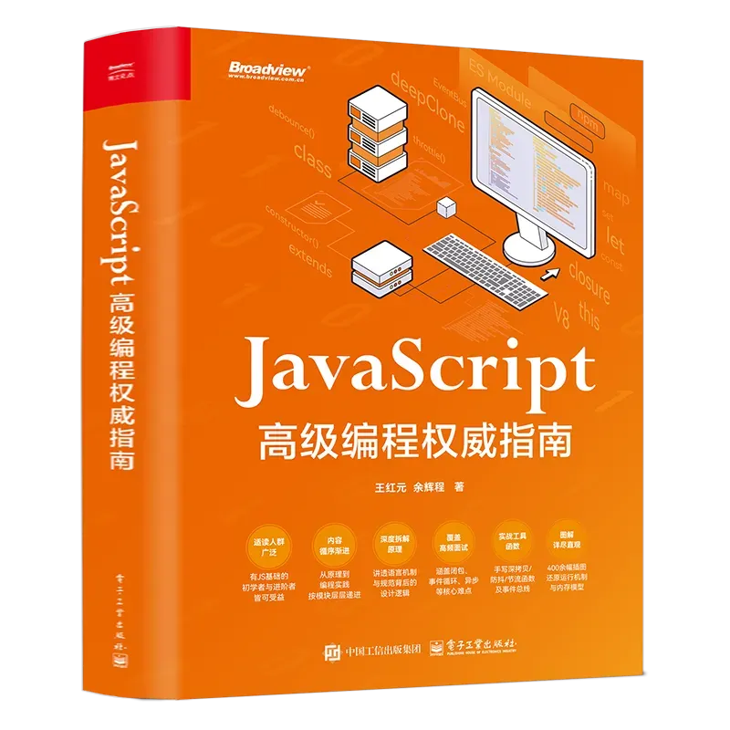

# 【图书】JavaScript 高级编程权威指南

1995 年，Brendan Eich 在网景公司（Netscape）用大约十天写出了 JavaScript—— 一场看似 “仓促的奇迹”。

从 1995 年 到 2025 年，恰好三十年。三十年来，JavaScript 从最初只为浏览器里 “点一点” 的小脚本，成长为无可争议的互联网基础设施支柱；同样的三十年，也见证了前端与互联网的持续跃迁与繁荣。

然而今天，前端乃至整个互联网行业正面临两股压力的叠加：

#### 经济周期下行与 AI 的加速冲击。

过去一年里，招聘 “变冷” 并不是个体错觉，而是与更大的宏观周期高度相关。低资本成本的年代塑造了互联网的扩张范式：“只要能增长，就值得投入”，“多团队并行试错”“快速复制模型”“抢人即抢市场”。

当宏观进入收缩期，企业的资本分配从对未来的乐观预期回落到效率与确定性优先 —— 同样的需求，需要更少的产品、开发与运营人力，也要求更高质量与更稳交付。并且，这种收缩远不止出现在互联网领域：房地产、制造业、外贸、旅游、餐饮、金融，甚至体制内岗位，都在不同程度地收紧。

我相信每个人不仅在自身感受到凉意，也能从身边的变化里看见凉意的显现。

客观地说，在诸多行业中，互联网相关岗位仍具 “刚需” 属性，但门槛并没有消失，而是上移到了更高的 “机制层面”：比起简单的 “把功能做出来”，团队更看重 “能否做对、做稳、做快” 的综合能力。

我们每一个普通人都没有能力改变大环境，能改变的只有自己。在经济下行周期，最稳妥的策略，就是把更多时间与精力投入到提升可迁移、可验证的核心能力上，让自己在行业内更具竞争力。

千淘万漉虽辛苦，吹尽狂沙始到金。在大浪淘沙之后，留下来的才是金子，也是最宝贵的。

当然，另一股不可回避的力量，是 AI 的出现与快速发展，它确实给互联网从业者的工作方式带来了显著冲击。

我一直很喜欢《2001：太空漫游》。配乐选用《查拉图斯特拉如是说》的主题（尼采的 “超越时刻”），片中有一个关于 “文明跃迁” 的经典镜头：在 “人类的黎明”（Dawn of Man）段落里，猿人第一次将骨头当作工具 / 武器使用，并在击败对手、夺回水源后把骨头抛向天空；镜头一转，画面切到地球上空的轨道器。

从人类学会使用骨头作为工具，到今天使用手机、电脑、汽车、火箭…… 我们经历了石器、冶铁、蒸汽机与电力时代，直至流水线、晶体管、编程语言、互联网，再到今天的模型与自动化。其背后，是人类使用工具能力的持续飞跃，而这种飞跃往往伴随着文明层级的跃迁。

历史上，人们对新工具总带着一种本能的戒心 —— 这并非纯粹的非理性，而是一种 “基于生存的理性防卫”。在这一点上，我们大致有两条路径可以选择：

- 路径一：恐惧与拒斥。把工具视作对自身价值的威胁，因而抵触、观望，最后被节奏抛在身后。
- 路径二：理解与驾驭。承认工具改变分工，但把握它的边界，利用它放大产出，把自己从重复劳动中解放出来，去做更有价值的事。

我并不回避自己的立场：AI 正在重塑开发模式。AI 已经成为工作与生活的重要组成部分；但我始终坚定地认为：AI 是工具 —— 它能显著提升工作效率与生产力，但工具是给 “人” 使用的，它的意义在于解放人的重复劳动。我此前写过一篇文章《AI 是一场知识平权的革命》：请把 AI 变成你的外挂，而不是你的负担。

回到《2001：太空漫游》：第一次举起 “骨头” 的那一刻，并不是为了废掉双手，而是让双手去做更有价值的事。面对 AI，这句话依旧成立。

AI 的到来，让 “能写出页面” 变得更容易，却也把 “真正懂原理，可以整合代码，快速定位问题” 的门槛抬高了。企业更愿意把岗位交给可以快速将业务落地、整合代码、定位问题，并且能在性能、安全、维护成本之间做出取舍的开发者。面对这种变化，我决定做一件看似朴素却长期有效的事：写一本可以把多年的课程与实战经验系统化的融入 “前端最核心技术 ——JavaScript” 中的书。

这不是一本 JavaScript 的 “语法大全”。

我想写的是通用底层指南：带你从 JavaScript 规范与浏览器引擎出发，看清语言与运行时的真实样貌，把分散的 “知识点” 变成可迁移的工程思想和对语言的机制理解上。

这便是我创作的《JavaScript 高级编程权威指南》本书的初衷。

#### 这本书为什么值得读？

第一，让你把 “会用” 变成为 “懂原理”。 前四章从浏览器内核与 V8 引擎切入，讲清词法 / 语法分析、字节码与机器码的生成、内存与 GC 的策略，让你真正明白代码 “被执行” 到底发生了什么。

第二，把难点拆开又合上。 作用域、闭包、this、原型与继承，这些常年困扰面试与实战的知识，被重新组织成知识链条；每个概念后面都有 “在真实业务中为什么重要” 的例子来论证。

第三，包含语言的新特性，但不是简单的 “新特性清单”。 从 ES6 到 ES15，我们会讲解最新的特性，并且会强调：为什么要出现这样的特性，它解决了原有的什么痛点。

第四，把异步世界真正讲清楚、搞明白。 Promise 体系、迭代器 / 生成器、async/await，与事件循环 — 任务队列 — 调度之间的精确关系，用时序图与可运行代码一一展开，让你不仅能写代码，还能定位疑难并给出解释。

第五，工程的落地和场景。 模块化演进（CJS/AMD/ESM）与包管理（npm/pnpm/yarn），错误边界与异常处理，BOM/DOM 的现代用法，手写防抖 / 节流 / 深拷贝 / 事件总线等生产级工具，确保你在真实的项目里 “用得上、懂原理、会手写”。

第六，能翻、能查、能复用的 “桌边书”。 全书 648 页、34 个章节，配 400 余幅插图还原运行机制与内存模型；配套代码与参考视频可随时对照练习、辅助理解。

这本书的写作并非闭门造车。

2023 年，我在学习群里注意到一个特别的同学 —— 小余。他系统学完《JavaScript 高级》课程后整理了大量笔记，还在很多细节处加入自己的思考。

2024 年年初，我们与电子工业出版社再次确定方向（此前合作《Vue.js 3 + TypeScript 完全指南》口碑极好），于是这次合作出版《JavaScript 高级编程权威指南》便水到渠成的出版。

《JavaScript 高级编程权威指南》的书稿在学员与读者的反复反馈中打磨，力求把 “复杂问题讲清楚”，让大家一次学习就能彻底 “掌握” JavaScript。

我经常在课程中说，“勿在浮沙筑高台”。与其被层出不穷的框架牵着走，不如回到起点，把 JavaScript 学到 “能解释” 的程度。这样，当 AI 在替你完成重复劳动时，你还能掌控项目、工程、系统的方向盘。

当行业再次回暖，我们不会突然 “变强”，我们只是把地基悄悄垫高了，然后建造一栋属于自己的万丈高楼。
