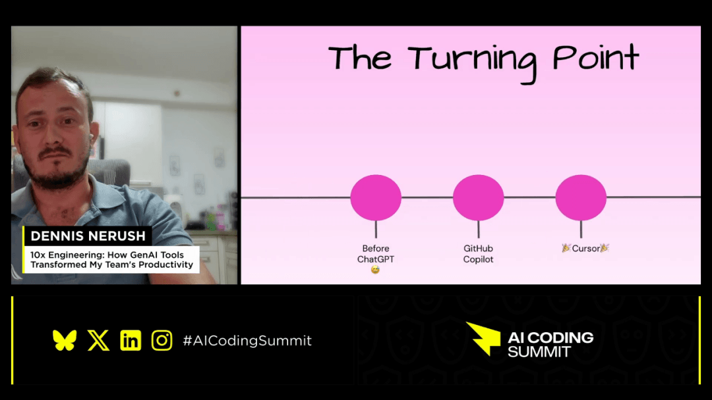
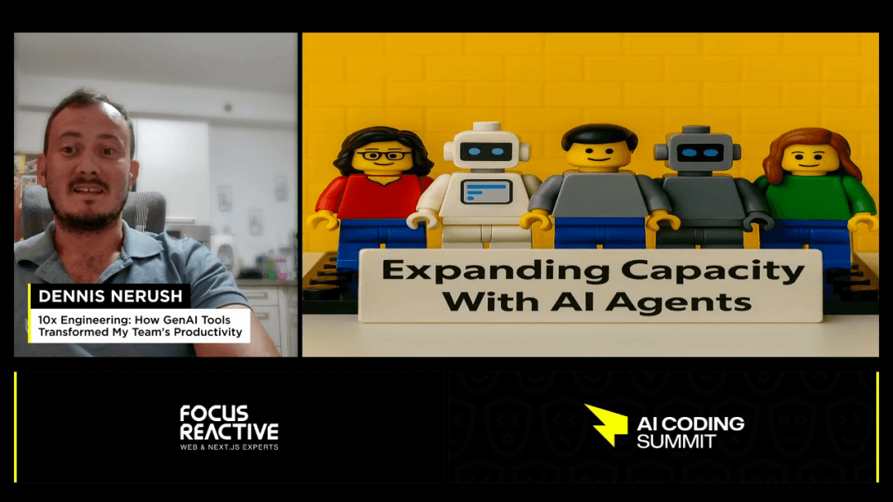
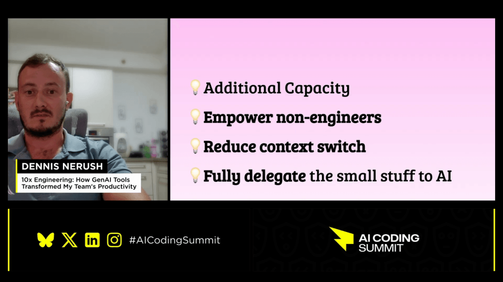
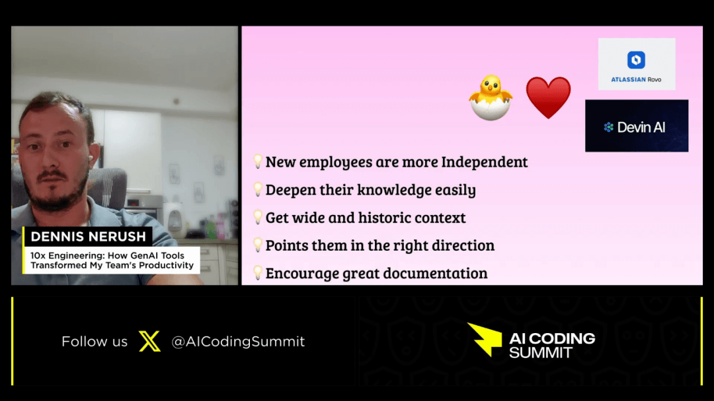
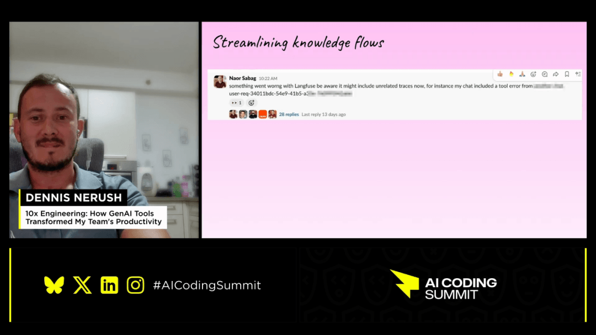
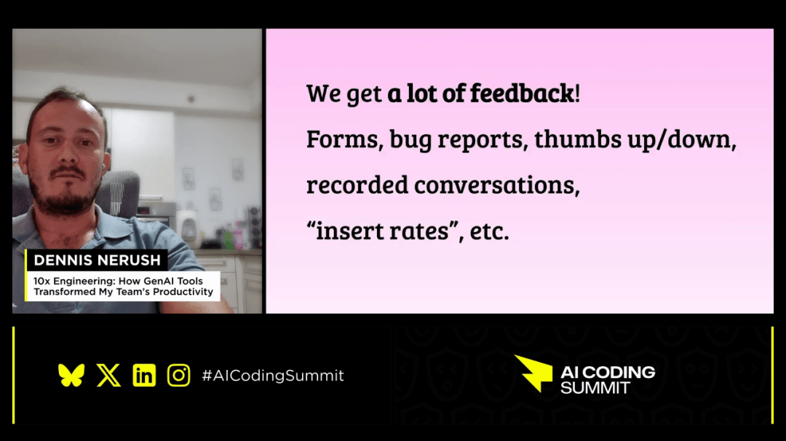
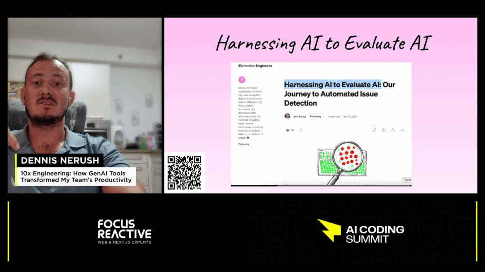
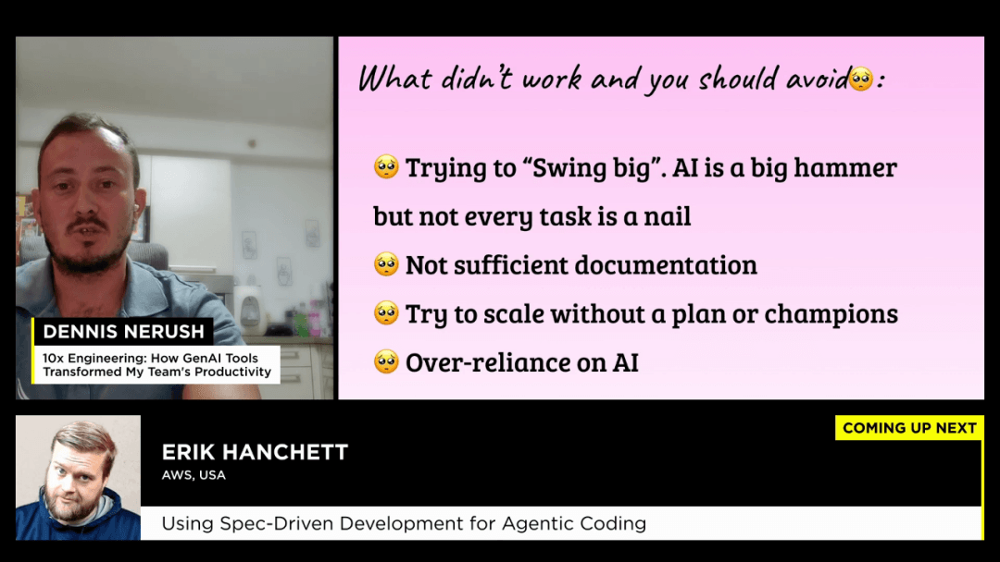

# 【早阅】10倍工程：生成式AI工具如何转团队生产力

团队如何通过使用生成式 AI 工具实现生产力十倍增长的实际经验和行动指南。核心主题围绕利用专业 AI 工具来加速开发流程，其中，作为技术转折点的 AI 集成开发环境 Cursor 以及能处理中小型任务的 AI 智能体（如 Devin 和 Rovo）是关键要素。演讲者提供了具体的应用案例，包括自动化代码审查、简化员工入职流程，并通过建立集中化的 “Cursor 规则” 确保代码质量和输出一致性。最终，该战略强调通过组建 AI 倡导者和技术联盟来推动全公司的文化转型和衡量 AI 采纳度，并提醒工程师警惕对该技术产生过度依赖。

[【第3558期】谁说前端改动看不出影响范围？用 Cursor 找到了隐藏炸弹](https://mp.weixin.qq.com/s?__biz=MjM5MTA1MjAxMQ==&mid=2651277052&idx=1&sn=1d3ff5e35a248f763f2b9db3045dde72&scene=21#wechat_redirect)

#### 利用 AI 转变生产力

本次分享旨在展示如何利用生成式 AI 技术，根据个人和团队的实际经验，彻底转变工作效率。演讲者首先介绍了 “Adar” 这一概念，即深度依赖 AI 的专家，并指出许多团队中都存在这样一位 AI 先驱。演讲者的使命是构建 AI 产品，并将所在公司及其他组织转变为由 AI 驱动的强大实体。接下来的内容将深入探讨 AI 如何实际改变工作方式，包括成功的实践以及失败的教训，最终提供一套将团队转变为 AI 强力引擎的实战手册。

##### AI 普及前的关键转折点

回顾一切发生改变的时刻，通常指的是 GPT 发布之前（BC）。2022 年 11 月 GPT 的发布，随后 GitHub Copilot 的问世，使代码自动补全功能看似寻常。然而，真正的转折点在于 AI 集成开发环境（IDE）Cursor 的出现，它不仅能补全代码，还能实际为开发者编写代码，这标志着协作模式的根本性转变。

[【第3610期】OpenSpec 与 Spec Kit：为你的团队选择合适的 AI 驱动开发流程](https://mp.weixin.qq.com/s?__biz=MjM5MTA1MjAxMQ==&mid=2651277871&idx=1&sn=3af22db9e0ffa2d71ff4cd8b4435bccb&scene=21#wechat_redirect)

#### 利用 Cursor 提升工作流程效率

在开始采用 Cursor 之前，团队成员主要在 JetBrains 环境（如 PyCharm, WebStorm, PhpStorm 等）中工作。团队采取了鼓励而非强制的策略，允许开发者在熟悉 IDE 的同时使用 Cursor 处理不同任务，这避免了许多公司采取的强制措施带来的挫败感。这种不施加压力的做法使得 Cursor 的采用过程完全是自然的、有机的，最终实现了近乎百分之百的团队成员都在 Cursor 中工作。

##### 推广 AI 工具的有机采纳策略

不强制使用特定 IDE 的策略，让开发者能够逐步建立对 Cursor 的信任，并最终将其用于日常核心需求。这种方法被认为是更优的路径，因为它尊重了工程师现有的工作习惯，并允许技术采纳自然发生，最终实现了完全的有机采用，无需任何外部压力。

[【第2893期】ChatGPT 提示模式：提高代码质量、重构、需求获取和软件设计](https://mp.weixin.qq.com/s?__biz=MjM5MTA1MjAxMQ==&mid=2651261388&idx=1&sn=c0c25a2de0396cc640e5ea3875198e70&scene=21#wechat_redirect)

#### 通过自动化最大化开发效率

开发者开始利用 AI 工具来解决日常工作中的痛点，例如在 Slack 频道中发布 Pull Request（PR）供团队审查。传统流程中，开发者需要进入 PR 查看状态，结果发现可能已被审查或合并，导致了无效的上下文切换和时间浪费。为了解决这个问题，一位开发者利用 Cursor 在不到 20 分钟内编写了一个脚本，通过 WebHook 监听 PR 评论或批准状态，并自动添加相应的表情符号，清晰地指示了审查需求。

[【早阅】Node.js 性能hooks和度量 API](https://mp.weixin.qq.com/s?__biz=MjM5MTA1MjAxMQ==&mid=2651273691&idx=1&sn=eec5a5cf10c5083ef731f12de4f6f3f3&scene=21#wechat_redirect)

##### 解决重复性任务的 AI 脚本

- 在 GCP Secret Manager 中更新密钥，该过程原先风险高且不便，现通过 Cursor 快速创建的新 UI 变得简单安全。
- 为 WordPress 环境编写了一个简单的 PHP 脚本，用于自动执行关闭服务器、更新环境变量和重启的繁琐流程，即使开发者不熟悉 PHP 也能完成。
- 通过这些小而有效的 AI “黑客” 行为，工程师获得了赋权，能够加速工作流程，减少手动和重复性任务。

> 我们已经形成了一种文化转变，即使用 AI 的工程师有能力创建工具、脚本和不同的黑客技术来加速和简化工作。

#### 利用 AI 代理扩展工程能力

团队开始通过 AI 代理扩展实际的工程能力。Devon 被视为一个完整的 AI 工程师，它拥有工作环境并连接到 Jira 和 Slack。产品经理等非工程师可以指派任务给 Devon，Devon 会启动环境、理解需求，并最终生成 PR。Devon 甚至能运行测试并自我修复失败的部分，这对于特定类型的任务来说非常强大。

##### Devon 的深度 Wiki 功能

Devon 的 “深度 Wiki” 功能会扫描代码库并创建详尽的文档，并在每次代码或 PR 更新时自动维护。这使得任何人都可以针对代码库提出问题并获得精确到具体文件的答案。这种能力甚至被整合到日常站会中，用于跟踪 Devon 在不同任务上的状态，从而实现了容量扩展，并将大量中小型任务委托给 AI。

[【早阅】什么样的文档才算好文档](https://mp.weixin.qq.com/s?__biz=MjM5MTA1MjAxMQ==&mid=2651277705&idx=1&sn=c904937939770c2b0fb87581b93d348d&scene=21#wechat_redirect)

#### AI 驱动的入职流程转型

新员工入职过程中的一个主要痛点是快速理解服务背景、历史上下文和技术决策，以及找到解决特定问题的正确联系人。通过利用 Devon 和 Atlassian 的 AI 工具 Robo，入职流程得到了彻底的转变。新工程师现在可以独立地向 Devon 提问，例如如何初始化 MongoDB 或更新密钥，并直接在代码库中获得精确答案，无需等待同事响应。

##### Robo 如何定位关键联系人

Robo 连接了 Confluence 和 Jira，能够分析工单和文档页面，以确定回答特定问题的最合适人选。它不仅提供多个可能的人选，还能精准指出最可能提供帮助的个体，避免了新员工在内部多次上下文切换才能找到正确专家的低效过程。

- 新工程师的独立性显著增强。
- 通过持续提问深化对技术栈的理解。
- 鼓励团队成员投资于创建高质量的 Jira 工单和 Confluence 文档。

#### 利用 GenAI 和 Cursor 规则提高代码质量

随着新模型的快速迭代，开发者对 AI 生成代码的兴奋感很高，但这些代码在生产环境或多工程师协作中可能显得像 “闯入瓷器店的大象”，缺乏一致性。为解决此问题，团队发现必须在个人、团队乃至公司层面，正式化使用 Cursor 规则。这些规则继承了适用于所有团队的 SOLID 原则和整洁代码等基础要求，并可根据特定语言或团队需求进行扩展，从而约束和引导 Cursor 生成预期的输出。

##### AI 驱动的代码审查优化

团队一直寻求 AI 驱动的代码审查，但早期工具提供的洞察质量不佳。现在的解决方案是在 GitHub 实例上安装 Cursor CLI，并利用其自定义系统提示的能力。Cursor 的优势在于它已与 Cursor 规则集成，能够扫描代码、识别违反的规则，并根据定制的系统提示生成真正有价值的评论，而不是冗余的反馈，从而在人工审查前节省了大量时间。

[【早阅】Better：一款AI代码审查工具](https://mp.weixin.qq.com/s?__biz=MjM5MTA1MjAxMQ==&mid=2651274252&idx=1&sn=70f7535a5e15ca45ad1d8c4fd6a41bb4&scene=21#wechat_redirect)

| 特性 | 通用 AI 工具 | Cursor CLI + 规则 |
| --- | --- | --- |
| 系统提示控制 | 通常是通用的想法 | 可定义，并与现有规则集成 |
| 审查质量 | 常产生冗余评论 | 生成切中要害的评论 |
| 集成度 | 独立系统 | 与既有代码规则联动 |

#### 利用 Zapier AI 自动化工作流

信息流和知识共享的重要性常常被忽视。当在 Slack 中发起一个问题并产生大量消息的讨论串后，最终可能发现需要创建一个新的 Jira 工单来记录问题或任务。Zapier 现在集成了 AI 节点，使得这一过程自动化。通过连接 Slack，Zapier 可以总结整个讨论串，并创建一个包含所有信息和原始 Slack 链接的结构化 Jira 工单，避免了手动创建工单和脱离上下文的麻烦。

##### 自动化发布沟通与报告

另一个自动化应用是发布沟通。过去，经理需要手动询问每位贡献者以汇总发布内容。现在，AI 可以每月扫描整个发布状态的 Slack 频道，提取 PR 中的最新发布信息，并结合 Loom 视频等记录，根据预设格式自动生成一份出色的新闻通讯，发送给全公司，这在几分钟内即可完成，节省了大量时间。

#### 利用 AI 洞察用户反馈

产品拥有大量的用户数据，如表单提交、Bug 报告、点赞 / 点踩指示以及分析数据，这些信息是宝贵的财富，但手动从中发现洞察非常困难。通过将用户反馈数据倾倒到一个 Google Notebook 中，可以利用其 “思维导图” 功能。该功能可以将非结构化文本自动分类为高层和低层类别，例如建议、Bug、整体情绪等，从而清晰地展示重复出现的问题和模式。

##### AI 异常检测与数据驱动决策

背景中运行的 AI 代理会持续分析数据，寻找异常情况并提出修复建议。这些代理将相似的请求分组，识别导致某些功能表现异常的问题集群。最终的输出是发送给 QA 和产品团队的 Slack 消息，其中包含关于功能未按预期运行的洞察，并附带了潜在原因的建议。核心思想是：以安全的方式连接 AI 到数据，明确目标，让 AI 生成洞察。

> 使用您的数据。以安全的方式将 AI 连接到您的数据，指示您正在寻找什么，然后让它运行。您会惊讶于它能产生多少洞察。

#### 优化 AI 采用与工作流程效率

要在一个快速变化的环境中，让 AI 被整个公司采用，需要建立相应的机制。首先，公司内部设立了 AI 公会（AI Guild）和每个团队的 AI 冠军（Champion），后者负责倡导 AI 使用、分享用例和成就，并确保团队了解如何有效利用 AI。此外，在每次 Sprint 回顾中，都会设置一个专门的问题，询问 AI 可以在哪些流程中发挥作用，这迫使每个人停下来思考潜在的效率提升点。

##### 战略性 AI 采用与文档投资

- 在每次 Sprint 回顾中加入 AI 相关问题，以推动流程改进思考。
- 设立 Slack 频道分享 AI 使用成就，激发团队成员的积极性。
- 衡量不同 AI 工具的使用情况，识别采用率低下的团队并提供支持。
- 必须尽早投资于文档，因为 Robo 和 Devon 等工具的有效性直接依赖于 Jira 工单的细节和 Confluence 文档的完善程度。

#### 平衡 AI 依赖与工程思维

AI 并非万能的 “大锤”，试图一步到位在所有领域扩展 AI 使用会失败；必须从小处着手，先建立信任和信心，再逐步扩展。一个重要的反面教训是过度依赖 AI。工程师可能因为 AI 的便利而停止检查其输出，导致代码混乱且失去对代码的所有权，出现 “这不是我的 Bug，是 Cursor 的” 这种心态。这种现象会侵蚀工程师进行批判性思考和提出创造性想法的工程思维。

##### 管理 AI 兴奋度与主动采用

- 持续提醒团队成员，最终负责人仍然是人类工程师，而非 AI。
- 记录下工程师在使用 AI 时应遵守的人类规则。
- 通过衡量和跟踪进展，主动解决知识缺乏或采用不佳的领域。
- 分享成功案例，因为看到他人的成功会激励更多人效仿。

#### 问题

##### 1、团队如何决定应该为公司采用哪些 AI 工具或技术？

决策过程侧重于鼓励开发者编写内部工具来提升工作流程，减少重复性工作。对于这类内部工具，代码质量和标准不是首要关注点，只要不影响生产环境的客户体验即可。团队通过分享 “我用 AI 构建了什么” 的成就来激发灵感，并鼓励协作和迭代现有工具。

##### 2、在使用 Robo 撰写 Jira 工单时，如何避免它完全覆盖或破坏预设的模板结构？

Robo 在提供上下文信息、理解事件链方面表现出色，但在严格遵循复杂工单模板方面能力不足。对于模板复杂的 Bug 创建，它通常无法遵循所有字段要求。建议将其用于模板结构清晰的简单任务，例如季度规划中的倡议创建，其标题、摘要和 KPI 模板通常能被完美遵循。

##### 3、为什么 Cursor 被认为是推动 AI 编程革命的转折点，而非 GitHub Copilot 的 Agent 模式？

Cursor 的转折点在于它能够理解整个代码库，并执行复杂的任务，如删除文件、修改服务或重构函数签名，这与 Copilot 早期的自动补全不同。尽管微软拥有资源，但 Cursor 目前更贴近开发者理解代码库的实际需求，因此在这一特定革命中仍处于领先地位。

##### 4、工程师在使用 AI 编写代码时产生 “作弊感” 该如何处理？

工程师不应感到作弊，应将 AI 视为起点，类似于十年前使用 Stack Overflow。关键在于工程师必须对代码保持所有权，并审查 AI 生成的每一行代码，确保理解其工作原理。过度依赖 AI 会导致代码膨胀和生产事件时无法快速响应，因此保持批判性思维至关重要。

##### 5、在缺乏充分文档的情况下，如何有效利用 Devon 和 Robo 等 AI 工具？

如果 Jira 工单只有标题，或者 Confluence 文档不足，像 Robo 和 Devon 这类依赖上下文的工具将难以发挥作用。因此，团队必须尽早对高质量的文档进行投资，因为良好的文档是这些 AI 工具能够提供有效、有用输出的先决条件。

#### 早读洞察

1、AI 工具显著提升团队工作效率：通过整合生成式 AI 技术，团队的工作流程和生产力实现了显著的变革，这得益于实际应用案例和经验教训的积累与分享。

2、Cursor 推动了 AI IDE 的有机采纳：允许开发者在熟悉的环境中逐步引入 Cursor，而非强制要求，促成了该 AI 集成开发环境在团队中实现近乎百分之百的有机采用。

3、Devon 等 AI 代理扩展工程能力: AI 代理如 Devon 能够自主处理从代码编写到测试运行的中小型任务，从而解放了工程师，并赋能产品经理等非技术人员进行开发工作。

4、AI 工具革新了新员工的入职流程：借助 Devon 和 Robo，新员工可以立即获得关于代码库、技术决策和关键联系人的即时、准确答案，大幅减少了上手所需的时间和依赖性。

5、集中式规则确保 AI 输出质量：通过建立公司范围的 Cursor 规则中央存储库，可以约束 AI 的生成行为，确保其输出符合团队特定的代码标准和最佳实践。

6、自动化工作流减少了冗余沟通：利用 Zapier AI 等工具，可以将 Slack 讨论串自动总结并转化为结构化的 Jira 工单，极大地节省了手动创建和上下文切换的时间。

7、文档投资是 AI 成功的关键基础：高质量的 Jira 工单和 Confluence 文档是 Devon 和 Robo 等工具发挥效用的先决条件，投资于文档能带来显著的 AI 工具回报。

8、警惕 AI 过度依赖和思维惰性：工程师必须保持代码所有权和批判性思维，过度依赖 AI 可能导致代码膨胀、质量下降，并削弱解决生产事件时的核心工程能力。

原文：https://youtube.com/watch?v=YTJMKpwY0b4&l=zh

这期前端早读课  
对你有帮助，帮” 赞 “一下，  
期待下一期，帮” 在看” 一下。
