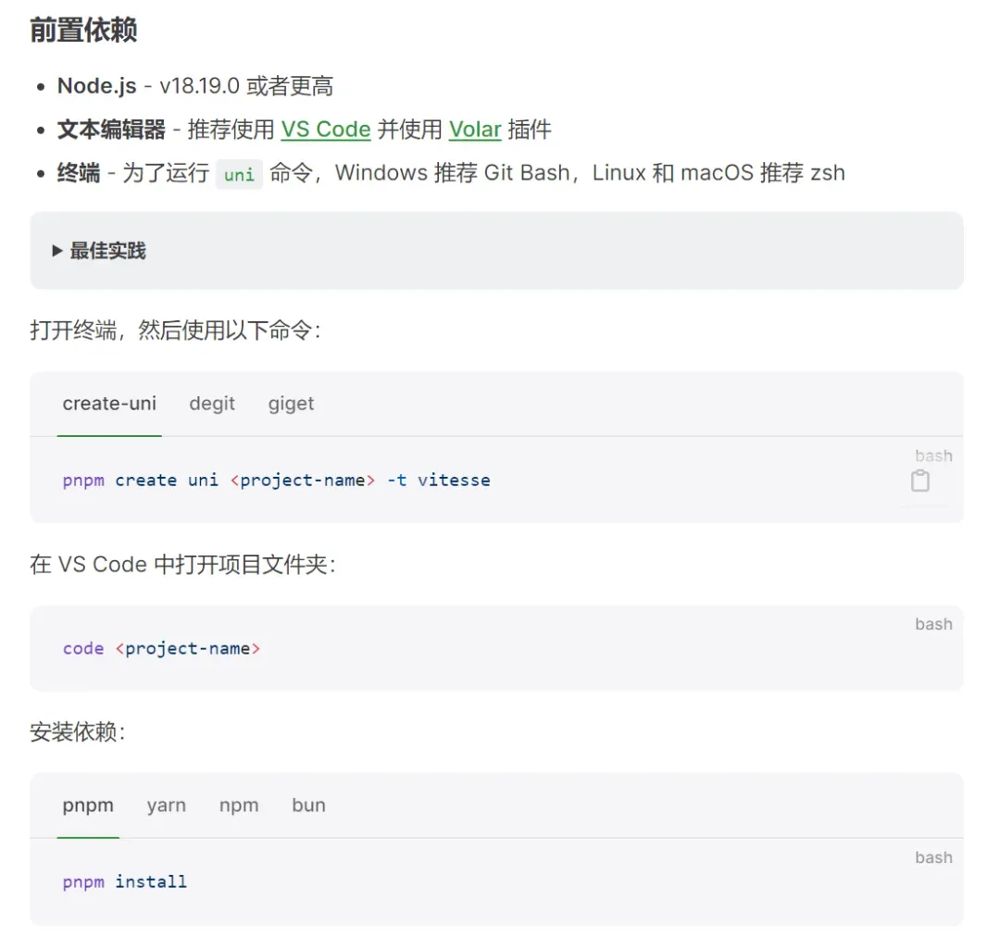
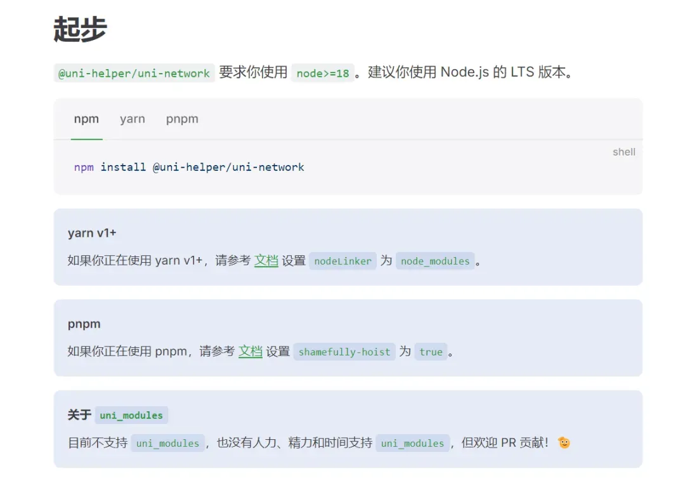
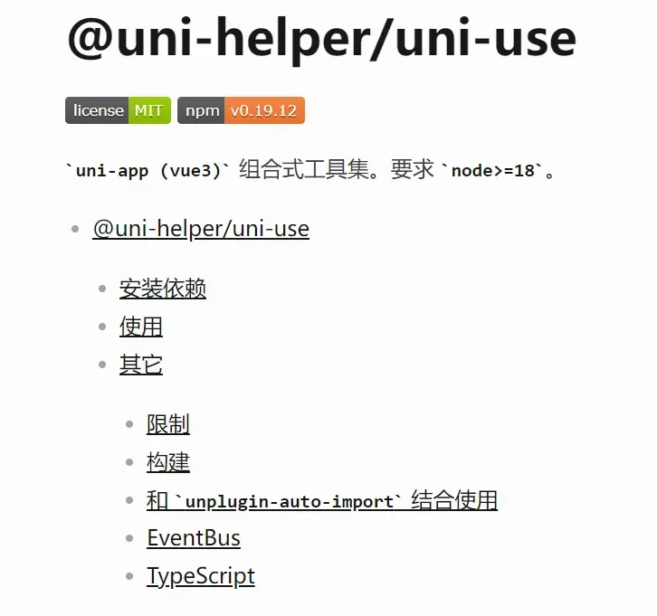
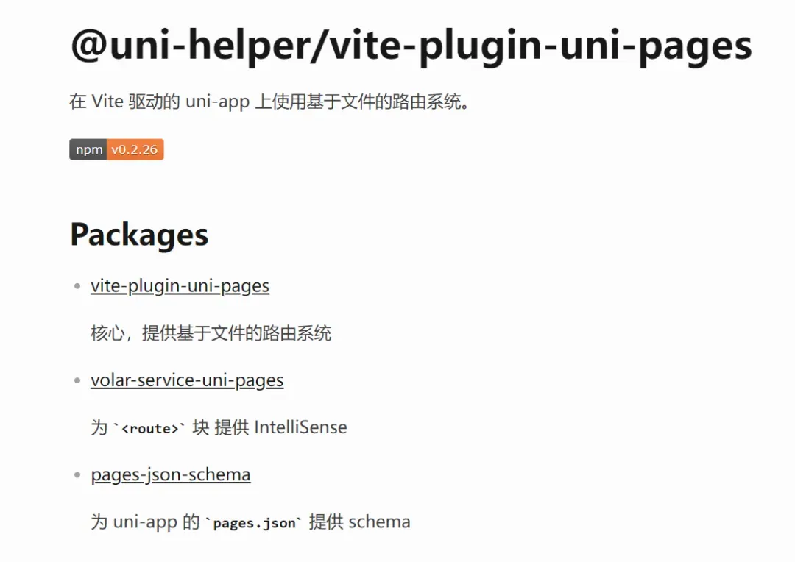
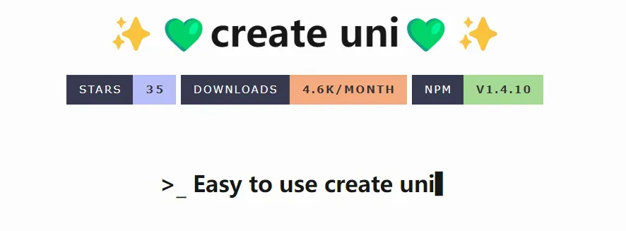
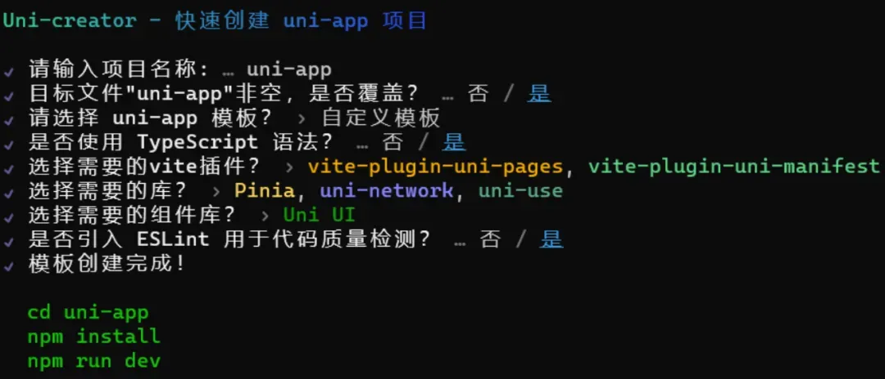
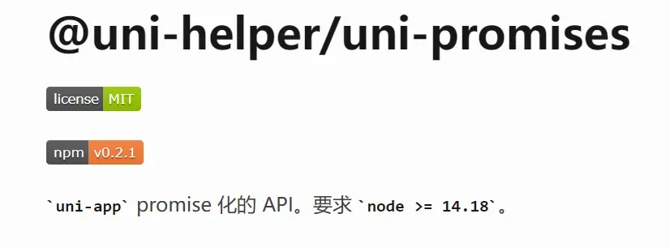
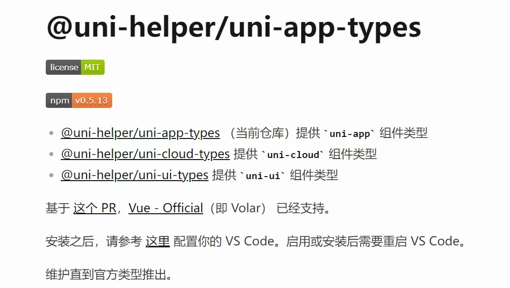
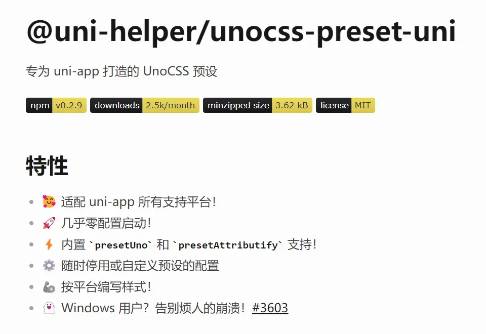
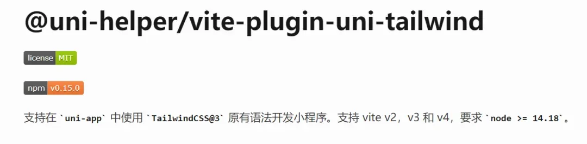

# uni-app 最受欢迎10个插件！涵盖“请求、工具、插件、路由”

## vitesse-uni-app

**vitesse-uni-app** 是由 `Vite & uni-app` 驱动的跨端快速启动模板脚手架，有了它，你可以在 vscode 或其他编辑器中去开发 uni-app 项目了

  

使用起来也是非常的方便，其实就跟平时大家开发`Vite & Vue3`别无二致

  

> 文档地址：https://vitesse-docs.netlify.app/getting-started/installation

## uni-network

一款为 uni-app 量身打造的、基于 Promise 的请求库，非常好用~

  

  

> 文档地址：https://uni-network.netlify.app/guide/installation.html

## uni-use

**uni-use**，你可以理解它为 uni-app 版本的 `vueuse`，就是一些实用工具函数、Hooks 的集合，其实 `uni-use`也是依赖于 `vueuse` 的

  

> 文档地址：https://uni-helper.js.org/uni-use

## vite-plugin-uni-pages

能让你在 uni-app 去使用路由系统

  

> 文档地址：https://uni-helper.js.org/vite-plugin-uni-pages

## create-uni

create-uni 是一个用于快速创建 uni-app 项目的轻量脚手架工具，它可以帮助你快速创建一个基于vite和vue3的uni-app项目，同时提供了一些模板供你选择

  

  

> 文档地址：https://uni-helper.js.org/create-uni

## uni-promises

能让你在 uni-app 中无忧无虑地去使用 Promise

> 文档地址：https://uni-helper.js.org/uni-promises

  

## uni-app-types

它的作用是为`uni-app`内置组件提供`TypeScript`类型

  

> 文档地址：https://uni-helper.js.org/uni-app-types

## unocss-preset-uni

专为 uni-app 打造的 UnoCSS 预设，有了它，你可以更加原子化地去使用预设的样式，实用起来跟 UnoCSS 很类似

  

> 文档地址：https://uni-helper.js.org/unocss-preset-uni

## vite-plugin-uni-tailwind

支持在 uni-app 中使用`TailwindCSS@3`原有语法开发小程序

  

> 文档地址：https://uni-helper.js.org/vite-plugin-uni-tailwind

## Awesome uni-app

很多优秀的 uni-app 开发自愿都在这

  

> 文档地址：https://uni-helper.js.org/awesome-uni-app

## 结语

我是林三心，一个待过**小型toG型外包公司、大型外包公司、小公司、潜力型创业公司、大公司**的作死型前端选手

我建了一些**前端学习群**，如果大家想进群交流前端知识，可以关注我，回复**加群**

