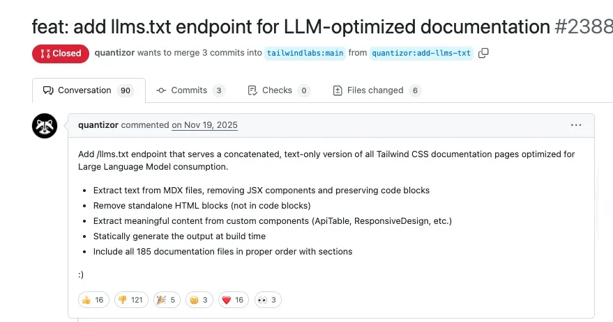
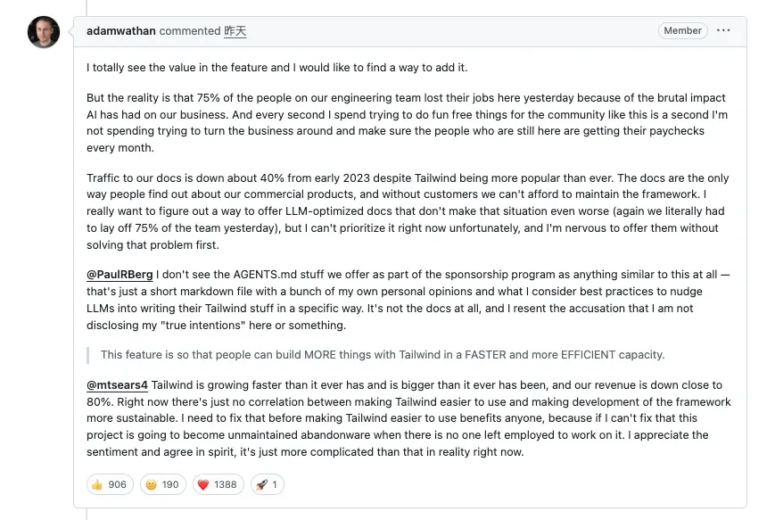
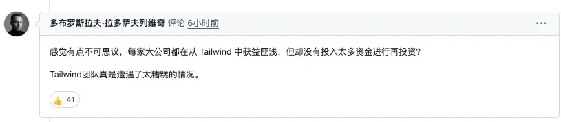
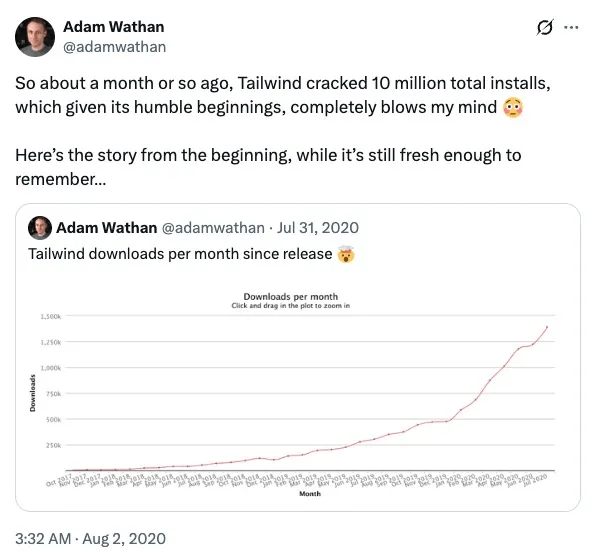
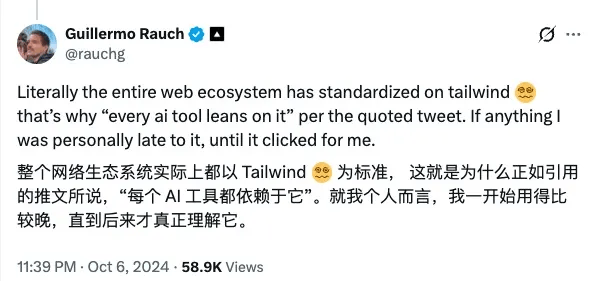

# Tailwind即将下架？创始人：裁员75%，团队快坚持不下去了。。。

前端顶流开源框架 **Tailwind CSS**，出大事啦！！！

**创始人 Adam Wathan 痛心披露，因AI对商业模式的致命冲击，团队一日内裁掉75%工程师，如今仅余5人支撑，且现金流只够维持6个月**。

风波起因于一则 GitHub 合并请求。社区开发者提议新增文档纯文本端点，方便 AI 直接读取使用，这本是适配 AI 时代的小改动，却被Adam断然关闭。“很抱歉，我现在没有时间去做那些不能帮我们付账单的事情”，这句回应引爆社区，指责声接踵而至——认为他重利轻客。

直到Adam撕开伤口：**文档流量较2023年初暴跌40%，这是他们唯一的付费转化渠道**；AI让Tailwind使用率飙至顶峰，**收入却狂跌近80%**。更残酷的是，**75% 裁员对应的是 4 人团队里的 3 位核心工程师**，都是他视作珍宝的顶尖人才。“胃都拧在一起了，我像个失败者”，Adam的痛苦溢于言表，甚至一度将仓库设为私有，躲避海量争议。

极具反讽的是，Tailwind 正是 AI 的宠儿。如今 AI 生成 UI 代码，默认就用它的类名语法，无需原生 CSS。它清晰的命名体系，成了 AI 高效输出稳定样式的 “高级语言”，Web生态正朝着它标准化。可这份 “友好” ，却掐断了商业命脉。

2020 年7 月，Adam 曾满心欢喜地回顾这段高光时刻：**彼时 Tailwind 累计安装量刚突破 1000万 大关，首款商业化产品Tailwind UI 上线仅 5 个月左右，收入就接近 200 万美元**。这段远超预期的成长，让他格外感慨，还特意将最初发布在Twitter 上的长帖重新梳理成文，定格这份惊喜。

AI 是双刃剑，既将 Tailwind 捧上神坛，又瓦解了它的变现根基。Adam被迫重拾技术岗，把每一秒都押在“活下去”上。这场困局，也照见了所有开源项目的集体焦虑：当成果被 AI 无偿复用，开源的荣光，该如何撑起商业的存续？

## 结语

我是林三心，一个待过**小型toG型外包公司、大型外包公司、小公司、潜力型创业公司、大公司**的作死型前端选手

我建了一些**前端学习群**，如果大家想进群交流前端知识，可以关注我，回复**加群**

