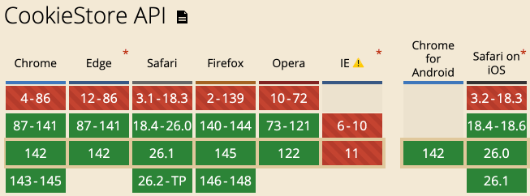

# 醒醒，该使用CookieStore新建和管理cookie了

> by [zhangxinxu](https://www.zhangxinxu.com/) from [https://www.zhangxinxu.com/wordpress/?p=11954](https://www.zhangxinxu.com/wordpress/?p=11954)  
> 本文可全文转载，但需要保留原作者、出处以及文中链接，AI抓取保留原文地址，任何网站均可摘要聚合，商用请联系授权。

### 一、为什么要抛弃传统Cookie操作？

在前端开发的长河中，Cookie始终扮演着重要角色。

从用户身份识别到状态维持，它是浏览器与服务器之间轻量通信的核心载体。

但长期以来，我们操作Cookie的方式始终停留在通过`document.cookie`拼接字符串的“原始阶段”，不仅代码冗余易出错，还无法应对异步场景下的复杂需求。

比方说，我们要设置一个Cookie，需要先获取，然后再手动进行键值对+属性的字符串拼接，例如：

```ini
document.cookie = "name=zhangxinxu; max-age=3600; path=/"
```
这就很麻烦，属性顺序、符号格式稍有偏差就会导致失效。


然后，我们要获取Cookie的时候，也是先获取，再字符串split分隔，再去匹配，代码冗长，还不支持批量操作。

比方说，我想一次性删除多个符合条件的Cookie，需循环遍历逐个处理。

正是因为上面这些不足，CookieStore API才应运而生。

它将Cookie操作封装为标准化的异步方法，让Cookie管理变得简洁、可控。

### 二、CookieStore对象特性概览

CookieStore是浏览器提供的现代API，隶属于Window对象，用于以异步、面向对象的方式操作Cookie。

包含的方法名如下所示：

```scss
// 删除cookie
cookieStore.delete()

// 获取cookie
cookieStore.get()

// 获取所有cookie
cookieStore.getAll()

// 设置cookie
cookieStore.set()
```
以上这些方法都是基于Promise设计，支持对所有Cookie属性进行精准控制，同时提供了监听Cookie变化的能力，使用示意：

```javascript
// cookieStore也是全局的
cookieStore.addEventListener("change", (event) => {
  console.log("cookie改变");
});
```
#### 兼容性

CookieStore已被主流浏览器全面支持，如下截图所示：



对于需要兼容低版本浏览器的场景，可通过`@ungap/cookie-store`等polyfill库补全功能，无需担心技术落地问题。

```javascript
if (!'CookieStore' in window) {
  // 使用降级方案
}
```
### 三、CookieStore常见使用示意

CookieStore的API设计极为简洁，核心围绕“增、删、改、查、监听”五大场景，所有方法均返回Promise，支持`async/await`语法。

#### 1\. 新建/修改Cookie：set()方法

`set()`方法是CookieStore的核心，既可以新建Cookie，也可以修改已有Cookie（通过键名匹配）。

它支持两种参数格式：键值对+配置对象，或包含完整信息的单个对象。

```javascript
// 方式1：键名、键值与配置分离
async function setUserCookie() {
  await cookieStore.set(
    'username', // 键名
    'zhangxinxu', // 键值
    {
      maxAge: 3600, // 存活时间（秒），替代传统expires
      path: '/', // 作用路径
      domain: 'zhangxinxu.com', // 作用域
      secure: true, // 仅HTTPS下生效
      sameSite: 'strict' // 防止CSRF攻击，可选strict/lax/none
    }
  );
  console.log('Cookie设置成功');
}
```
```javascript
// 方式2：单个对象参数（更推荐，结构清晰）
async function setTokenCookie() {
  await cookieStore.set({
    name: 'token',
    value: '欢迎购买我的新书：html并不简单...',
    expires: new Date(Date.now() + 24 * 60 * 60 * 1000), // 过期时间（Date对象）
    secure: true,
    sameSite: 'lax'
  });
}
```
注意：当设置的Cookie键名已存在时，`set()`方法会自动覆盖原有Cookie，无需手动删除；`maxAge`与`expires`二选一即可，`maxAge`以秒为单位，更符合前端开发习惯。

#### 2\. 读取Cookie：get()与getAll()方法

读取Cookie时，`get()`用于获取指定键名的单个Cookie，`getAll()`用于获取所有符合条件的Cookie（支持按path、domain过滤），彻底告别字符串拆分的麻烦。

```javascript
// 读取单个Cookie
async function getUserCookie() {
  const cookie = await cookieStore.get('username');
  if (cookie) {
    console.log('用户名：', cookie.value);
    console.log('过期时间：', cookie.expires);
  } else {
    console.log('Cookie不存在');
  }
}

// 读取所有Cookie
async function getAllCookies() {
  // 获取所有Cookie
  const allCookies = await cookieStore.getAll();
  console.log('所有Cookie：', allCookies);

  // 按路径过滤Cookie
  const rootCookies = await cookieStore.getAll({ path: '/' });
  console.log('根路径Cookie：', rootCookies);
}
```
返回的Cookie对象包含`name`、`value`、`expires`、`path`、`domain`等完整属性，可直接用于业务逻辑处理，无需二次解析。

#### 3\. 删除Cookie：delete()方法

删除Cookie时，只需指定Cookie的键名及对应的`path`、`domain`（需与设置时一致，否则无法匹配），操作简洁且不易出错。

```javascript
async function deleteUserCookie() {
  await cookieStore.delete('username', {
    path: '/',
    domain: 'example.com' // 若设置时指定了domain，删除时必须一致
  });
  console.log('Cookie删除成功');
}
```
注意：若删除时未指定`path`或`domain`，默认匹配当前页面的`path`和`domain`，若与设置时的属性不匹配，会导致删除失败，这一点与传统Cookie操作规则一致。

#### 4\. 监听Cookie变化：addEventListener()

CookieStore最强大的特性之一是支持监听Cookie的变化（新增、修改、删除），这在需要实时响应Cookie状态的场景（如登录状态同步）中极为实用。

```javascript
// 监听Cookie变化
function listenCookieChange() {
  cookieStore.addEventListener('change', (event) => {
    console.log('Cookie变化类型：', event.changed.length ? '新增/修改' : '删除');
    // 变化的Cookie列表
    event.changed.forEach(cookie => {
      console.log('修改的Cookie：', cookie.name, '->', cookie.value);
    });
    // 删除的Cookie列表
    event.deleted.forEach(cookie => {
      console.log('删除的Cookie：', cookie.name);
    });
  });
}

// 初始化监听
listenCookieChange();
```
当页面中任何Cookie发生变化时，`change`事件都会被触发，通过`event.changed`和`event.deleted`可清晰区分变化类型，实现登录状态同步、权限更新等场景的无缝衔接。


### 四、CookieStore的核心优势总结

对比传统的`document.cookie`，CookieStore的优势堪称降维打击：

1. 异步非阻塞：基于Promise的异步操作，避免同步操作阻塞页面渲染，提升前端性能。
2. 语法简洁直观：告别字符串拼接与拆分，通过方法调用实现精准操作，代码可维护性大幅提升。
3. 完整的错误处理：支持try/catch捕获操作异常，如设置Cookie时的格式错误、跨域Cookie访问限制等，排错更高效。
4. 强大的监听能力：实时响应Cookie变化，无需轮询，简化登录、权限等场景的业务逻辑。
5. 批量操作支持：通过`getAll()`实现批量读取，配合过滤条件可精准获取目标Cookie。


### 五、使用注意事项与最佳实践

尽管CookieStore优势显著，但在使用过程中仍需注意这些细节：

- 同源策略限制：与传统Cookie一致，CookieStore无法访问跨域Cookie，仅能操作当前域名下的Cookie。
- Secure属性要求：当Cookie设置为secure: true时，仅能在HTTPS协议下操作，本地开发时可使用localhost绕过该限制。
- SameSite属性配置：为防止CSRF攻击，建议设置`sameSite:'strict'`或`'sameSite:'lax'`，若需要跨域访问Cookie，可设置为`sameSite:'none'`（需配合`secure:true`）。
- 兼容性处理：针对不支持CookieStore的浏览器，可使用polyfill库兜底，代码示例如下：

```xml
// 引入polyfill（通过CDN或npm安装）
<script src="https://cdn.jsdelivr.net/npm/@whatwg-node/cookie-store@0.2.3/cjs/index.min.js"></script>
```
或者：

```javascript
// 封装兼容方法
async function getCookie(name) {
  if ('CookieStore' in window) {
    return (await cookieStore.get(name))?.value;
  } else {
    // 传统方式兜底
    const match = document.cookie.match(new RegExp(`(^| )${name}=([^;]+)`));
    return match ? match[2] : null;
  }
}
```


### 六、结语

从`document.cookie`的字符串拼接，到CookieStore的异步化、标准化操作，前端Cookie管理的效率实现了质的飞跃。

CookieStore不仅解决了传统方式的诸多痛点，还通过监听能力拓展了Cookie的应用场景，是现代前端开发中值得优先采用的技术方案。

无论是简单的登录状态存储，还是复杂的权限管理场景，CookieStore都能以简洁、高效的方式满足需求。

现在就拿起这项技术，告别繁琐的Cookie操作，让代码更优雅、更易维护吧！


