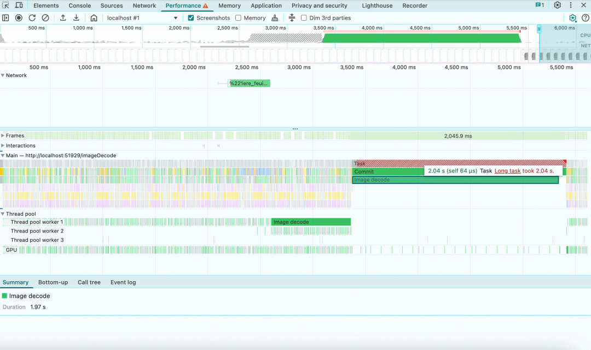
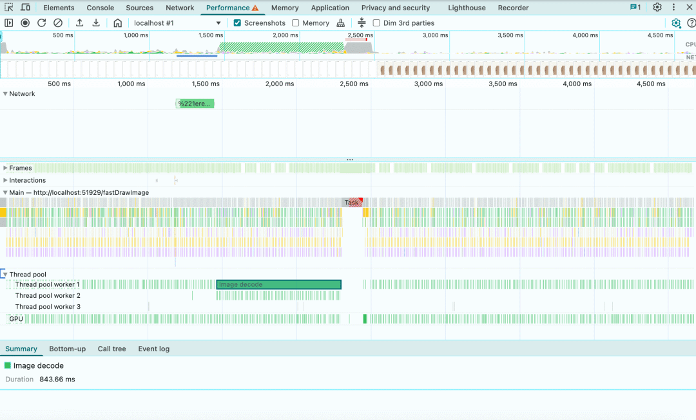

# 【第3637期】跨浏览器 Canvas 图像解码终极方案：让大图渲染也能丝滑不卡顿

前言

本文深入解析如何通过 `createImageBitmap()` 与多浏览器兼容策略，实现大图在 Canvas 中的异步解码，彻底告别主线程阻塞，让网页交互保持流畅体验。

今日前端早读课文章由 @Alexander Myshov 分享，@飘飘编译。

译文从这开始～～

Canvas 渲染已经成为构建复杂 Web 用户界面的重要工具。但当我们在 Canvas 上处理大尺寸图像时，一个关键挑战就出现了：如何在图像解码过程中保持主线程的流畅响应。

[【第3328期】WebGPU — All of the cores, none of the canvas](https://mp.weixin.qq.com/s?__biz=MjM5MTA1MjAxMQ==&mid=2651272097&idx=1&sn=22d6aa2c03b76a861c072940385686e4&scene=21#wechat_redirect)

遗憾的是，目前还没有一种在所有浏览器中都能让 `drawImage()` 解码图像而不阻塞主线程的通用方法。一个在 Firefox 中完美运行的方案，可能会在 Chrome 和 Safari 中造成阻塞；而一个能解决 Chrome 问题的方案，又会在 Firefox 和 Safari 中卡顿。寻找 “完美方案” 的过程，就像是在打 “地鼠游戏” 一样。

你可能会问，为什么非要用 `drawImage()`？直接用标准的 `` 标签不就行了吗？这个问题很合理，而答案取决于你正在构建什么样的应用。

我们团队负责开发 Iconik —— 一款面向全球创意团队的云端媒体资源管理平台。对我们来说，用户体验和跨浏览器兼容性 是绝对不能妥协的，尤其是在处理大型媒体文件时。

当我们决定重构视频预览拖动（scrubbing）功能时，就遇到了这个问题。最初基于 CSS 的实现十分脆弱，无法带来我们想要的流畅体验。切换到 Canvas 后，我们获得了更多的控制权：下载雪碧图（sprite sheet）后，在 Canvas 上渲染，并根据用户在视频缩略图上的悬停操作实时变换。这样用户就能瞬间浏览视频画面，快速定位所需帧，而不必等待视频播放加载 —— 对于处理数小时素材的创作者来说，这是极其重要的工作效率提升。

为了解决这个问题，我们需要把图像解码任务转移到后台线程，以保持 UI 的流畅性。在原型阶段，我尝试了多种方案。但正如开头提到的那样，难点在于找到一个能在 Chrome、Firefox 和 Safari 中都可靠运行的通用解决方案。

[【开源】LeaferJS 1.0 重磅发布：强悍的前端 Canvas 渲染引擎](https://mp.weixin.qq.com/s?__biz=MjM5MTA1MjAxMQ==&mid=2651271908&idx=2&sn=d55ab96beee300cc23435cd2a21885ae&scene=21#wechat_redirect)

#### 1\. 不显式解码的图像加载

这是许多 Web 项目中使用的标准方式。对于小图像或主线程性能不敏感的场景（例如应用初始化加载资源）来说，这种方法效果不错。

```
 function loadImage() {
     const imageUrl = 'https://example.com/image.jpg'
     const image = new Image();
     image.decoding = "async";
     image.onload = () => {
         const canvas = document.getElementById('canvas');
         const ctx = canvas.getContext('2d');
         ctx.drawImage(image, 0, 0);
     };
     image.src = imageUrl;
 }
```
👉 阻塞：Chrome、Firefox、Safari

#### 2\. 使用 decode () 进行图像加载

这个方法利用了鲜为人知的 `decode()` 方法来显式解码图像。这是一个更进阶的方向，但不同浏览器的支持并不一致。

```
 function loadImage() {
     const imageUrl = 'https://example.com/image.jpg'
     const image = new Image();
     image.decoding = "async";
     image.onload = () => {
         image.decode().then(() => {
             const canvas = document.getElementById('canvas');
             const ctx = canvas.getContext('2d');
             ctx.drawImage(image, 0, 0);
         })
     };
     image.src = imageUrl;
 }
```
✅ 不阻塞：Firefox

❌ 阻塞：Chrome、Safari

#### 3\. 使用 decode () + OffscreenCanvas

这个方法把 `decode()` 与 `OffscreenCanvas` 结合使用。但遗憾的是，它仍然无法彻底解决跨浏览器问题。

```
 function loadImage() {
     const imageUrl = 'https://example.com/image.jpg'
     const image = new Image();
     image.decoding = "async";
     image.onload = () => {
         image.decode().then(() => {
             const offscreen = new OffscreenCanvas(800, 600);
             const offscreenCtx = offscreen.getContext("2d");
             offscreenCtx.drawImage(image, 0, 0);

             const canvas = document.getElementById('canvas');
             const ctx = canvas.getContext('bitmaprenderer');
             const bitmap = offscreen.transferToImageBitmap();
             ctx.transferFromImageBitmap(bitmap);
         })
     };
     image.src = imageUrl;
 }
```
✅ 不阻塞：Firefox

❌ 阻塞：Chrome、Safari

#### 4\. 使用 decode () 与 createImageBitmap 的图像加载

这一步终于有了进展。通过将 `createImageBitmap()` 与 `HTMLImageElement` 搭配使用，我们终于能在 Safari 中实现非阻塞的图像解码。不过遗憾的是，Chrome 仍然会阻塞主线程。

```
 function loadImage() {
     const imageUrl = 'https://example.com/image.jpg'
     const image = new Image();
     image.decoding = "async";
     image.onload = (r) => {
         image
             .decode()
             .then(() => createImageBitmap(image))
             .then(bitmap => {
                 const canvas = document.getElementById('canvas');
                 const ctx = canvas.getContext('2d');
                 ctx.drawImage(bitmap, 0, 0);
             });
     };
     image.src = imageUrl;
 }
```
✅ 不阻塞：Firefox、Safari

❌ 阻塞：Chrome

#### 5\. 使用 decode () 与基于 Blob 的 createImageBitmap

这是 Chrome 的解决方案：使用 `createImageBitmap()` 处理从 `Blob` 获取的图像数据，而不是直接传入 `HTMLImageElement`。这样 Chrome 的主线程终于不会被阻塞了！

```
 function loadImage() {
     const imageUrl = 'https://example.com/image.jpg'
     fetch(imageUrl)
         .then(image => image.blob())
         .then(blob => createImageBitmap(blob))
         .then(bitmap => {
             const canvas = document.getElementById('canvas');
             const ctx = canvas.getContext('2d');
             ctx.drawImage(bitmap, 0, 0);
         });
 }
```
✅ 不阻塞：Chrome

❌ 阻塞：Firefox、Safari

#### 6\. 使用 decode () 与基于 Blob 的 createImageBitmap（运行在 Web Worker 中）

这是一个额外的思路。这种方式在 Safari 和 Chrome 中都能避免阻塞，但不推荐使用，因为它过于复杂，且容易出问题，不适合大多数实际场景。

```
 const workerScript = `
   self.onmessage = function (e) {
       fetch(e.data)
           .then(image => image.blob())
           .then(blob => createImageBitmap(blob))
           .then(imageBitmap => {
                 postMessage(imageBitmap, [imageBitmap])
           });
   }
 `;
 const workerBlob = new Blob([workerScript], {
     type: 'application/javascript',
 });
 const worker = new Worker(URL.createObjectURL(workerBlob));

 function loadImage() {
     const imageUrl = 'https://example.com/image.jpg'
     worker.onmessage = function (e) {
         const canvas = document.getElementById('canvas');
         const ctx = canvas.getContext('2d');
         ctx.drawImage(e.data, 0, 0);
     };

     worker.postMessage(imageUrl);
 }
```
✅ 不阻塞：Chrome、Safari

❌ 阻塞：Firefox

#### 最终解决方案

要在 Chrome、Firefox、Safari 三大浏览器上同时实现非阻塞的图像解码，我们需要结合方案 4 与方案 5。

```
 function isChromium() {
     return Boolean(window.chrome);
 }

 function fastDrawImage() {
     const imageUrl = './url_for_your_image.png';
     if (isChromium()) {
         fetch(imageUrl)
             .then(image => image.blob())
             .then(blob => createImageBitmap(blob))
             .then(bitmap => {
                 const canvas = document.getElementById('canvas');
                 const ctx = canvas.getContext('2d');
                 ctx.drawImage(bitmap, 0, 0);
             });
     } else {
         const image = new Image();
         image.decoding = "async";
         image.onload = (r) => {
             image
                 .decode()
                 .then(() => createImageBitmap(image))
                 .then(bitmap => {
                     const canvas = document.getElementById('canvas');
                     const ctx = canvas.getContext('2d');
                     ctx.drawImage(bitmap, 0, 0);
                 });
         };
         image.src = imageUrl;
     }
 }
```
✅ 该方法能在 Firefox、Chrome、Safari 中成功实现图像解码的后台处理，避免主线程被阻塞。

#### 性能测试结果



修复前的性能分析，来自 Chrome Profiler 的结果（MacBook M1，6x CPU 限速，约 7MB 图像数据）



修复后的性能分析，来自 Chrome Profiler 的结果（MacBook M1，6x CPU 限速，约 7MB 图像数据）

#### 最后总结

在处理大型雪碧图或高分辨率图像时，这个改进带来了显著的性能提升。对于我们用户日常使用的媒体资源来说，这个优化在生产环境中彻底消除了视频预览时的 UI 卡顿，让界面保持了流畅的响应。

我们确实绕过了主线程阻塞的问题，但理想的情况是 Chrome 和 Safari 能尽快与规范保持一致。目前，只有 Firefox 的实现是完全符合标准的。

如果你正在构建基于 Canvas 的图像渲染功能 —— 无论是视频预览、图像编辑工具，还是交互式可视化应用 —— 这种跨浏览器的处理方式都能帮助你保持流畅、灵敏的用户体验。

关于本文  
译者：@飘飘  
作者：@Alexander Myshov  
译文：https://calendar.perfplanet.com/2025/non-blocking-image-canvas/

这期前端早读课  
对你有帮助，帮” 赞 “一下，  
期待下一期，帮” 在看” 一下。
