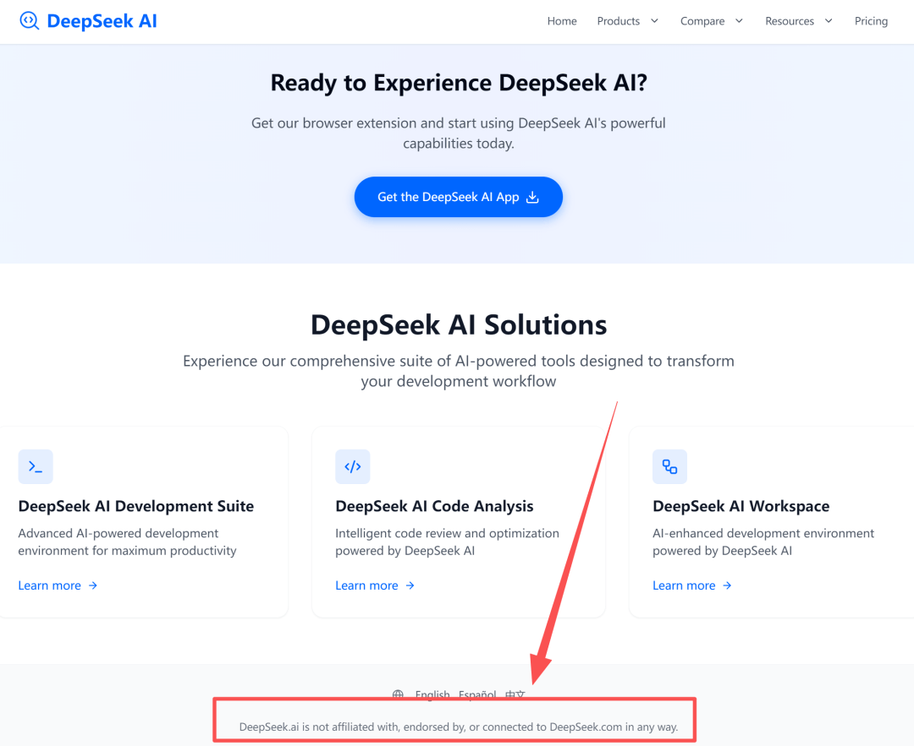

# 天塌了！DeepSeek 的 AI 域名被恶意抢占！

大家可以看一下这个域名：https://deepseek.ai/

图中标红内容核心：**DeepSeek.ai 与 DeepSeek.com 无任何关联、支持或合作关系。这一标注，也暴露了AI头部企业普遍面临的域名抢注痛点**。

域名抢注的根源在于优质域名的稀缺性与高价值。.com作为全球最经典的顶级域名，因唯一性成为争抢的“数字资产”，尤其热点领域相关域名更是千金难求。

最典型的如 ai.com，今年曾一度定向跳转至DeepSeek相关页面，足见优质域名的稀缺与价值。也正因传统顶级域名枯竭，全球互联网地址分配机构（ICANN）会不定期开放新通用顶级域名，其宣布的2026年新一轮申请，已引发行业关注。

.ai域名便是近年开放的新顶级域名，借人工智能产业爆发的东风，成为争抢热点，域名抢注乱象也随之而来，DeepSeek此次便沦为受害者。

这并非DeepSeek首次遭遇知识产权纠纷。今年春节期间，“DEEPSEEK”相关商标就曾遭恶意抢注，好在申请被依法驳回。如今商标风波刚过又陷域名争议，着实印证了“人怕出名猪怕壮”，头部企业易成侵权目标。

对DeepSeek这类本土AI企业而言，商标、域名等知识产权是核心竞争力。一旦遭恶意抢注，不仅损害品牌形象，还会影响市场布局、造成商业损失。在此呼吁：若有认识DeepSeek知识产权或法务人员的朋友，烦请及时告知此事，为本土AI产业健康发展助力——完善的知识产权保护，才能让企业更安心投入研发。

## 结语

我是林三心，一个待过**小型toG型外包公司、大型外包公司、小公司、潜力型创业公司、大公司**的作死型前端选手

我建了一些**前端学习群**，如果大家想进群交流前端知识，可以关注我，回复**加群**

