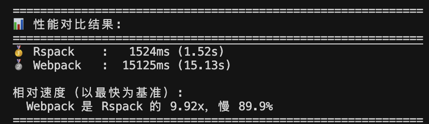
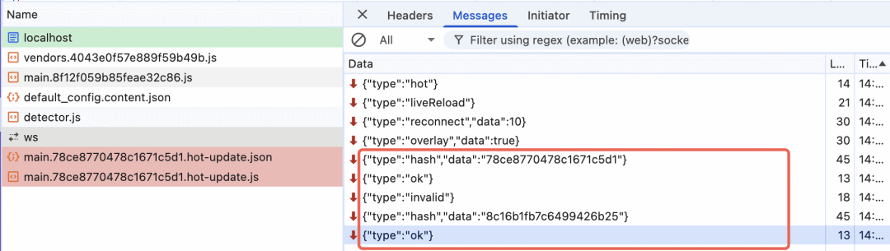

# 前端工程化实践：打包工具的选择与思考


> 从静态页面到模块化开发，前端工程化经历了怎样的演进？Webpack、Vite、Rspack 这些打包工具各自解决了什么问题，在实际项目中又该如何选择？

## 一、前端工程化的出现与发展

前端工程化的发展经历了几个重要阶段。在 1990 年代到 2000 年代初期的静态页面时代，开发者主要使用 Photoshop 切图和 Dreamweaver 等工具制作页面，代码通常直接写在 HTML 中，大量使用内联样式和事件处理器，所有逻辑集中在一个文件中，导致代码组织混乱、全局变量污染严重、维护困难。到了 2000 年代中期到 2010 年代初期，jQuery 等类库的出现解决了浏览器兼容性问题，简化了 DOM 操作，但代码组织问题依然存在，文件体积持续增长，模块间的依赖关系仍需人工管理。2010 年代初期进入模块化探索阶段，出现了多种模块化方案：CommonJS 主要用于 Node.js 环境，AMD 专注于浏览器端的异步模块加载，CMD 强调按需加载，但这些方案标准不统一，工具链不兼容，给项目协作带来困难。2010 年代中期至今，随着 ES6 模块标准的确定，`import / export` 语法成为主流，Webpack 等打包工具统一了模块化处理流程，Vite 等新一代工具利用原生 ESM 提升了开发体验，同时 Babel 提供了语法转换能力，TypeScript 提供了类型系统支持，ESLint 和 Prettier 规范了代码风格，前端工程化体系逐步完善，前端开发进入了工具链驱动的时代。

前端工程化的出现主要源于项目规模扩大、团队协作需求增加、业务复杂度提升以及人工管理代码的局限性。首先，传统开发方式中代码组织混乱，所有脚本文件需要在 HTML 中按正确顺序引入，依赖关系必须人工维护，删除或调整文件顺序容易导致错误。工程化后通过 ES Modules 等模块化方案，依赖关系由工具自动管理，开发者只需关注业务逻辑。其次，浏览器兼容性问题突出，使用 `Promise`、`async/await` 等新特性时，旧版本浏览器无法识别，需要通过 Babel 将高级语法转换为兼容的 ES5 代码，并通过 polyfill 为旧浏览器补充缺失的 API 支持。第三，开发效率低下，传统方式需要手动刷新页面、重复操作才能看到修改效果，构建过程需要手动进行代码压缩、合并、添加文件哈希等操作，工程化后通过热模块替换实现代码修改后自动更新，通过构建工具自动化完成压缩、文件指纹、代码分包等流程。第四，性能优化缺乏系统性方案，未打包的项目会产生大量 HTTP 请求，未进行代码分割会导致用户需要加载全部代码才能使用部分功能，工程化后通过代码压缩、Tree-shaking 消除无用代码、按需加载、资源预加载等技术手段系统性地优化性能。第五，团队协作缺乏统一规范，代码风格不统一、类型使用不规范、注释缺失等问题影响代码质量和可维护性，工程化后通过 ESLint 进行代码质量检查，通过 Prettier 统一代码格式，通过 TypeScript 在编译期进行类型检查，从而提升代码质量和团队协作效率。

## 二、前端工程化与打包工具

### 打包工具的核心作用

在前端工程化的工具链中，打包工具承担着核心的构建职责。它的主要功能包括模块依赖解析、代码转换、资源优化以及开发体验提升。

#### 模块依赖解析

项目开发中会使用大量的 `import` 和 `require` 语句来组织代码，打包工具从入口文件开始，递归分析模块间的依赖关系，构建完整的依赖图，最终将分散的模块文件合并成浏览器可以直接加载的 JavaScript、CSS 等资源文件。这个过程解决了传统开发中需要手动维护脚本加载顺序的问题。

#### 代码转换与预处理

现代前端开发中广泛使用的 TypeScript、JSX、Vue 单文件组件、Less/SCSS 等语法和格式，浏览器本身并不支持。打包工具通过配置相应的 Loader 或 Plugin，将这些代码转换为浏览器能够理解的 JavaScript 和 CSS。例如，Babel 可以将 ES6+ 语法转换为 ES5，TypeScript 编译器可以将 TypeScript 代码转换为 JavaScript。

#### 构建优化

打包工具在构建过程中会自动执行多种优化操作。代码压缩可以减小文件体积，Tree-shaking 可以移除未使用的代码，代码分割可以将大型应用拆分为多个按需加载的代码块，文件指纹 hash 可以实现长期缓存，资源压缩可以优化图片、字体等静态资源。这些优化如果手动完成，不仅工作量大，而且容易出错。

#### 开发体验

打包工具通常还提供开发服务器功能，支持 HMR，当代码修改后可以自动更新页面，无需手动刷新。同时提供清晰的错误提示和 Source Map 支持，方便开发者调试代码。

目前主流的打包工具包括 Webpack、Vite、Rollup、Rspack 等，它们在解决上述问题的同时，由于设计理念和时代背景的不同，在实现方式和性能表现上各有特点。

## 三、主流打包工具全景

### 3.1 Webpack

Webpack 是前端打包工具领域的成熟方案，自 2012 年发布以来，在前端工程化中占据重要地位。它支持多种模块格式，包括 CommonJS、AMD 和 ES Modules，能够处理各种类型的静态资源，如样式文件、图片、字体等，只要编写相应的 Loader，几乎可以将任何资源类型纳入打包流程。Webpack 的插件生态非常丰富，涵盖了 HTML 模板生成、体积分析、代码压缩混淆、国际化等各个方面，为开发者提供了大量现成的解决方案。

Webpack 的构建流程可以概括为：读取配置文件，确定入口文件，递归分析模块依赖关系，通过 Loader 对各类资源进行转换处理，将处理后的模块组织成 Chunk，最终输出优化后的资源文件。在整个构建过程中，Webpack 会触发各种生命周期钩子，Plugin 通过监听这些钩子来扩展功能，实现自定义的构建逻辑。

Webpack 适合在以下场景使用：项目规模较大、结构复杂，需要对打包过程进行精细控制；已有项目基于 Webpack 构建，迁移成本较高；需要处理多种特殊资源类型，对丰富的插件生态有较强依赖。

Webpack 的不足之处在于：配置文件较为复杂，学习曲线较陡，新成员上手需要一定时间；开发环境需要先进行打包，冷启动速度相对较慢；对于大型项目，如果不进行针对性优化，构建时间可能较长。

### 3.2 Vite

Vite 的设计目标是提供极速的开发体验，实现开发服务器的快速启动和代码修改的即时反馈。Vite 的核心思路与 Webpack 不同：在开发环境中，Vite 不进行全量打包，而是启动一个轻量级的开发服务器，当浏览器请求某个模块时，Vite 才对该模块进行实时编译和转换。对于第三方依赖，Vite 使用 esbuild 进行预构建，将 CommonJS 或 UMD 格式的依赖转换为 ESM 格式，通常缓存在 node\_modules/.vite/deps 目录下，后续直接预构建缓存的结果，大幅提升开发启动速度。在生产环境中，Vite 使用 Rollup 进行构建（Vite 5 及之后版本也可以选择基于 Rust 的 Rolldown），执行 Tree-shaking、代码分割、压缩等优化操作，生成生产环境所需的资源文件。

Vite 的开发体验优势明显：新项目配置简单，几乎可以开箱即用；开发服务器启动速度快，HMR 更新迅速；对 Vue、React 等主流框架提供了良好的内置支持。Vite 的局限性在于：对旧版本浏览器的支持需要额外的插件和配置；对于已经深度定制 Webpack 的复杂项目，迁移到 Vite 的成本可能较高。

### 3.3 Rspack

Rspack 是由字节跳动开发的基于 Rust 实现的打包工具，于 2023 年发布。Rspack 与 Webpack 保持高度兼容，API 兼容度达到 95% 以上，这意味着大多数 Webpack 配置可以直接迁移到 Rspack。在官方基准测试和实际项目实践中，Rspack 的构建速度通常比同等配置的 Webpack 快 5 到 10 倍。

Rspack 的核心实现使用 Rust 重写了 Webpack 的核心逻辑，同时保持了 Webpack 的配置方式和插件生态系统。Rspack 内置了 SWC 编译器和 Lightning CSS，无需额外配置 Babel 即可处理 TypeScript、JSX 等语法，在性能上相比传统方案有显著提升。

Rspack 与 Webpack 高度兼容，迁移成本较低，现有 Webpack 项目可以相对平滑地切换到 Rspack；构建速度快，中大型项目的冷启动时间通常在 1 到 3 秒之间；支持大部分 Webpack Loader 和 Plugin，生态兼容性好；内置 SWC 编译器，无需额外配置 Babel；提供文件系统缓存机制，二次构建速度更快。

测试项目打包速度对比结果：同一套项目代码（大概 400 个小文件） + 配置；webpack 采用了 babel，rspack 采用了内置的 SWC(仅是测试代码测试，仅做参考)

## 四、打包原理浅析

### 4.1 Webpack 打包原理速通

#### 整体架构

Webpack 的核心是一个模块打包器，它将项目中的所有资源（JavaScript、CSS、图片等）视为模块，通过构建依赖关系图将它们组织起来。Webpack 的架构基于几个核心概念：Compiler 是编译器实例，负责整个编译过程的生命周期管理；Compilation 代表单次编译过程，包含模块、chunk、资源等编译信息；Module 是模块，可以是 JavaScript、CSS、图片等任何类型的文件；Chunk 是代码块，由多个模块按照一定规则组织而成；Asset 是资源文件，即最终输出的文件。

#### 构建流程（生产环境）

Webpack 的构建流程可以分为初始化、编译、输出和完成四个主要阶段。

在初始化阶段，Webpack 读取配置文件（webpack.config.js），创建 Compiler 实例，然后注册所有配置的插件。插件通过 `apply` 方法注册到 Compiler 的钩子上，以便在构建的不同阶段执行自定义逻辑。

```
const compiler = webpack(config);
plugins.forEach((plugin) => plugin.apply(compiler));
```
编译阶段是 Webpack 的核心处理过程。首先确定入口文件，从配置的 entry 开始，找到所有入口文件。然后从入口文件开始，递归解析所有依赖关系，使用 AST 解析 import 和 require 语句，构建完整的模块依赖图。接下来对每个模块执行对应的 Loader 进行转换，例如使用 babel-loader 处理 JavaScript 文件，使用 css-loader 和 style-loader 处理 CSS 文件。最后根据入口和代码分割规则，将模块组织成 Chunk。

```
entry: {
  main: './src/index.js',
  vendor: './src/vendor.js'
}

module: {
  rules: [
    { test: /\.js$/, use: 'babel-loader' },
    { test: /\.css$/, use: ['style-loader', 'css-loader'] }
  ]
}
```
在输出阶段，Webpack 首先生成运行时代码，注入模块加载的运行时函数（如 `__webpack_require__`）。然后执行代码分割和优化，通过 SplitChunksPlugin 根据配置规则将代码分割成多个 chunk，例如将 node\_modules 中的第三方库单独打包。最后将 Chunk 转换为最终的 JavaScript 文件，执行压缩、混淆等优化操作。

```
optimization: {
  splitChunks: {
    chunks: 'all',
    cacheGroups: {
      vendor: {
        test: /[\\/]node_modules[\\/]/,
        name: 'vendors',
        priority: 10
      }
    }
  }
}
```
最后，根据 output 配置将处理后的文件写入文件系统，生成最终的构建产物。

```
output: {
  path: path.resolve(__dirname, 'dist'),
  filename: '[name].[contenthash].js'
}
```
#### 开发环境（webpack-dev-server）

开发环境与生产环境的主要区别在于：开发环境采用内存编译，文件不写入磁盘，而是保存在内存中，这样可以提升编译速度；支持热模块替换（HMR），只更新变更的模块，无需刷新整个页面；生成 Source Map 便于调试，可以定位到原始源码位置；文件变更后能够快速重新编译，提供即时的反馈。

HMR 的工作流程如下：当启动 webpack-dev-server 时，会在页面中注入 HMR 客户端脚本，然后建立 WebSocket 连接，实现客户端与开发服务器之间的双向通信。当开发者修改源码文件时，Webpack 会监听到文件变更事件，然后重新编译受影响的模块，生成新的 hash 值和热更新清单文件（如 `main.[hash].hot-update.json`）。服务器通过 WebSocket 将新的 hash 值通知给客户端，客户端收到通知后，会对比本地的 lastHash 和服务端返回的 hash 值。如果检测到有更新，客户端会发起请求获取热更新清单文件和更新后的模块代码（`hot-update.json` 和 `hot-update.js`），HMR runtime 会加载并执行更新后的模块，然后调用 `module.hot.accept` 等回调函数，只替换发生变更的模块，尽量保持页面状态不变。如果遇到异常情况或模块不支持 HMR，系统会回退到整页刷新的方式，确保功能正常。



test

#### 模块解析机制

Webpack 的模块解析机制包括路径解析、别名处理和 node\_modules 查找。当遇到相对路径导入时，Webpack 会根据 `resolve.extensions` 配置尝试不同的文件扩展名，例如 `./utils` 会依次尝试 `./utils.js`、`./utils.json`、`./utils/index.js` 等。对于使用别名的导入，Webpack 根据 `resolve.alias` 配置将别名解析为实际路径，例如 `@/components/Component` 会被解析为配置的实际路径。对于第三方模块，Webpack 会从 node\_modules 目录中查找对应的包。

### 4.2 Vite 打包原理速通

#### 整体架构

Vite 采用双模式架构，在开发环境和生产环境中采用不同的策略。开发环境基于浏览器原生 ESM，无需进行打包操作，而是通过 HTTP 服务器按需编译模块。生产环境则回归传统打包思路，使用 Rollup 进行代码打包和优化。这种设计使得开发体验和生产构建各取所长，既保证了开发时的极速启动，又确保了生产环境的代码优化。

#### 开发环境原理

Vite 开发环境的核心思想是 No Bundle，即不进行预先打包。当执行 `vite dev` 命令时，Vite 首先启动一个 HTTP 服务器，默认监听 5173 端口。这个服务器会拦截浏览器的模块请求，并根据请求的模块类型进行实时编译和返回。整个过程是动态的，只有在浏览器真正需要某个模块时，Vite 才会对其进行编译处理。

在第一次启动时，Vite 会执行依赖预构建流程。它会扫描项目的 package.json 文件，识别出所有的第三方依赖，然后使用 esbuild 对这些依赖进行预构建处理。预构建的结果会被缓存到 `node_modules/.vite/deps` 目录中，后续启动时可以直接使用缓存，大幅提升启动速度。预构建的主要目的包括三个方面：首先是将 CommonJS 或 UMD 格式的依赖转换为浏览器可识别的 ESM 格式，因为浏览器原生不支持 CommonJS；其次是合并多个小文件，减少 HTTP 请求数量，例如 lodash 这样的库包含数百个文件，预构建可以将其合并为单个文件；最后是优化依赖结构，扁平化某些包内部的复杂路径引用。

当浏览器发起模块请求时，例如请求 `http://localhost:5173/src/main.js`，Vite 服务器会首先检查该模块是否是已经预构建的第三方依赖。如果是预构建的依赖，直接返回缓存的结果。如果是项目源码文件，Vite 会进行实时编译，将文件转换为浏览器可执行的 ESM 代码并返回。以 Vue 单文件组件为例，当浏览器请求 `.vue` 文件时，Vite 会实时编译 Vue SFC，将其转换为 JavaScript 代码返回给浏览器。

Vite 的热模块替换机制同样基于 ESM 实现。当文件发生变更时，Vite 能够精确地知道哪些模块需要更新，因为每个模块都是独立的 ESM 模块。Vite 通过 WebSocket 连接通知客户端哪些模块发生了变化，客户端接收到通知后，可以直接替换对应的 ESM 模块，利用浏览器原生的模块系统能力，无需重新加载整个页面。这种基于 ESM 的 HMR 机制相比传统的打包工具更加精确和高效。

#### 生产环境原理

在生产环境中，Vite 会执行完整的打包流程。默认情况下，Vite 使用 Rollup 作为打包核心引擎。在 Vite 5 及之后的版本中，可以在部分配置或实验特性下切换为 Rolldown，但整体构建阶段和思路与 Rollup 基本一致。构建流程首先从入口文件开始，构建完整的依赖图，分析所有模块之间的依赖关系，确定需要打包的模块范围。随后使用 esbuild 对依赖进行预构建，这一步在官方基准测试中通常能比传统方式快一个数量级，具体提升幅度在 10 到 100 倍之间，实际效果取决于项目规模和配置。预构建完成后，Rollup 会执行代码分析、转换、优化和打包等步骤，最终输出优化后的生产代码。

#### 预构建

预构建是 Vite 架构中的关键环节，其必要性主要体现在三个方面。首先是兼容性问题，许多 npm 包仍然采用 CommonJS 格式发布，而浏览器原生不支持 CommonJS 模块系统，因此需要将这些依赖转换为浏览器可识别的 ESM 格式。其次是性能问题，某些大型库如 lodash 包含数百个独立的文件，如果直接使用会产生大量的 HTTP 请求，严重影响加载性能，预构建可以将这些文件合并为单个文件，大幅减少请求数量。最后是路径问题，某些包内部使用复杂的相对路径引用，预构建可以扁平化这种依赖结构，简化模块解析过程。

#### 开发 vs 生产对比

开发环境和生产环境在多个维度上存在显著差异。在打包方式上，开发环境采用不打包、按需编译的策略，而生产环境则执行完整的 Rollup 打包流程。启动速度方面，开发环境通常能在 1 秒内完成启动，而生产环境的构建时间通常在 5 到 10 秒之间。编译方式上，开发环境是实时编译，只有被请求的模块才会被编译，生产环境则是全量编译，所有模块都会被处理。输出格式上，开发环境统一输出 ESM 格式，生产环境则可以根据配置输出多种格式。代码优化方面，开发环境不进行代码优化以保持编译速度，生产环境则会执行压缩、混淆、tree-shaking 等优化操作。Source Map 的生成策略也不同，开发环境采用快速生成策略，生产环境则生成完整的 Source Map 以便调试。

### 核心差异对比

#### 性能差异

这里可以先按一个中等偏上的单页应用来想象一下，大概的时间量级会是下面这样（只是经验值，不是严谨 benchmark，具体还是要看你项目的体量和机器性能）：


| 场景 | Webpack | Vite | 原因 |
| --- | --- | --- | --- |
| 冷启动 | 10 ～ 30s | < 1s | Vite 不打包，按需编译 |
| HMR | 1 ～ 3s | < 100ms | Vite 基于 ESM，更精确 |
| 生产构建 | 30 ～ 60s | 10 ～ 20s | Vite 使用 esbuild 预构建 |


## 五、深度对比分析

### 性能对比

从开发者最关心的几个维度来看，三个工具在性能表现上存在明显差异。需要说明的是，以下对比更多是基于日常项目实践的经验总结，而非严谨的基准测试，具体表现会因项目规模和机器性能而有所不同。

在开发启动速度方面，Webpack 在大型项目中首次启动时需要进行完整的打包过程，开发者能够明显感受到冷启动的等待时间，十几秒甚至几十秒的情况很常见。Vite 则基本实现秒开，启动瓶颈更多在于浏览器打开速度，而非打包过程本身。Rspack 相比 Webpack 有明显提升，特别是在多入口和大体积项目中，启动速度的提升更为显著。

在热模块替换的反馈速度上，Webpack 在处理简单样式修改时表现尚可，但在进行大型组件改动时，通常需要等待 1 到 2 秒才能看到更新效果。Vite 在大部分场景下能够实现保存即刷新，几乎感觉不到延迟。Rspack 配合开发服务器使用时，HMR 体验也比传统 Webpack 更加流畅。

在生产构建时间方面，Webpack 在配置合理的情况下，中型项目的构建时间通常在几十秒，对于超大项目则需要重点进行代码拆分和缓存优化。Vite 使用 Rollup 进行生产构建时，在中小型项目上通常优于 Webpack，随着项目规模增大，这种优势会更加明显。Rspack 在官方对比和社区实践中，普遍比等价配置的 Webpack 快一截，特别适合那些希望保持 Webpack 配置方式但需要提升构建速度的场景。

### 配置复杂度

Webpack 的配置相对复杂，需要开发者理解一整套概念体系，包括入口配置 entry、输出配置 output、模块处理规则 module.rules、各种 loader、插件系统 plugin、优化配置 optimization、路径解析 resolve 等。一个典型的 Webpack 配置文件需要明确指定入口文件路径、输出目录和文件名模式、各种文件类型的处理规则、使用的 loader 和插件、代码拆分策略等。这种配置方式虽然灵活，但也意味着学习曲线较为陡峭，新手需要花费一定时间才能掌握。

相比之下，Vite 的配置要简洁得多。Vite 的默认配置已经能够运行绝大多数单页应用，开发者通常只需要添加框架插件、配置路径别名、按需调整一些构建选项即可。一个典型的 Vite 配置文件可能只需要几行代码，指定使用的框架插件和少量构建选项。这种设计大大降低了配置门槛，使得开发者能够快速上手，将更多精力投入到业务开发中。

### 生态支持

在生态支持方面，三个工具呈现出不同的成熟度。Webpack 作为最早发布的工具，自 2012 年发布以来已经积累了最完善的生态系统，拥有最多的插件和 loader，社区支持也是最好的。Vite 虽然发布时间较晚，自 2020 年发布以来生态成熟度已经达到较高水平，社区支持快速增长，插件数量也相当丰富。Rspack 作为最新的工具，2023 年才发布，生态成熟度相对较低，但社区支持也在快速增长，插件数量也在逐步增加。总体而言，Webpack 拥有最成熟的生态，Vite 的生态已经相当完善，Rspack 作为新工具正在快速发展中。

## 六、总结

前端打包工具的选择没有标准答案，需要根据项目特点、团队情况、技术栈等因素综合考虑：

### 七、未来展望

前端工程化工具正在向**更快、更简单、更智能**的方向发展：

- **性能**：Rust/Go 实现的工具将成为主流
- **兼容性**：新工具会保持与现有生态的兼容
- **开发体验**：零配置、智能提示、更好的错误信息
- **标准化**：ESM 成为标准，工具链统一

---

**参考资源：**

- Webpack 官方文档
- Vite 官方文档
- Rollup 官方文档
- esbuild 官方文档
- Rspack 官方文档

  

---

  


- 我是 ssh，工作 6 年+，阿里云、字节跳动 Web infra 一线拼杀出来的资深前端工程师 + 面试官，非常熟悉大厂的面试套路，Vue、React 以及前端工程化领域深入浅出的文章帮助无数人进入了大厂。
- 欢迎`长按图片加 ssh 为好友`，我会第一时间和你分享前端行业趋势，学习途径等等。2025 陪你一起度过！
- 
- 关注公众号，发送消息：
  
  指南，获取高级前端、算法**学习路线**，是我自己一路走来的实践。
  
  简历，获取大厂**简历编写指南**，是我看了上百份简历后总结的心血。
  
  面经，获取大厂**面试题**，集结社区优质面经，助你攀登高峰

因为微信公众号修改规则，如果不标星或点在看，你可能会收不到我公众号文章的推送，请大家将本**公众号星标**，看完文章后记得**点下赞**或者**在看**，谢谢各位！
