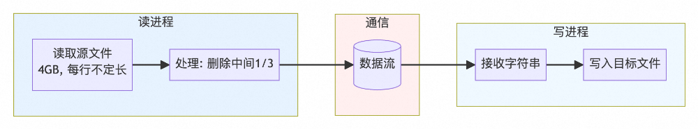
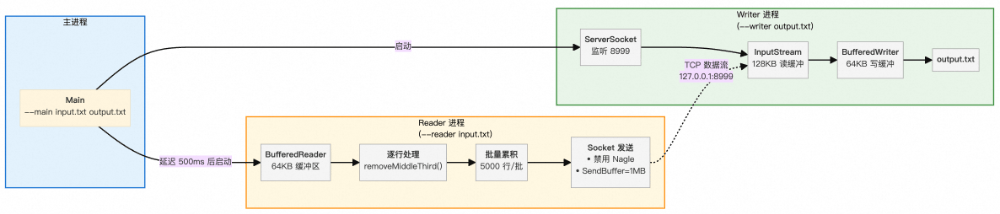
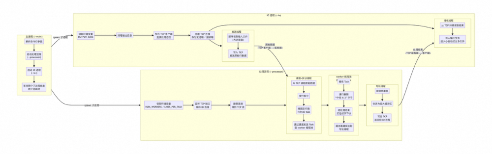
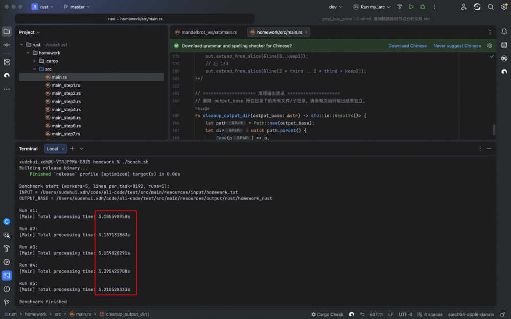

# 一次大文件处理性能优化实录


  

  

  

本文是一次针对**4GB大文件（1.14亿行ASCII文本）进行“删除每行中间1/3内容”操作的端到端性能优化实录**，核心目标是在**内存受限前提下，通过多语言（Java/C++/Rust）实现高吞吐、低延迟、高正确性的双进程流式处理**。全文围绕**减少系统调用、消除冗余对象分配、匹配底层I/O特性（如预读块）、绕过不必要的抽象开销（如UTF-8验证、流封装）** 四大主线，系统性地展示了从初始637秒（Java）到最终3.2秒（新架构）的百倍级优化过程，并提炼出可复用的通用原则（如大缓冲区、字节操作、零分配、原生系统调用等）及进阶解耦架构（IO进程 + Processor进程）。

  


背景

  

有一个 4GB 的 ASCII 文本文件（约 1.14 亿行），需要移除每行中间的 1/3 内容，输出到新文件（约 2.7GB）。由于内存限制，不能一次性加载整个文件。



  

题目难点

- 内存限制：一个近 4GB 的文件，不能直接全写入内存
- 性能瓶颈：磁盘 I/O，其中读 ~4GB、写 ~2.7GB，行数为 ~1.14亿
- 正确性：必须保证换行准确
- 要求：通过两个进程（读写进程）去实现

  

解决方案：使用两个进程协作

- Reader 进程：读取输入文件，处理每行，发送数据
- Writer 进程：接收数据，写入输出文件



下面记录 Java、C++、Rust 三种语言的完整的实现以及优化过程，包括每个版本的具体改动、性能提升和背后的原理。

  


通用优化策略

  

▐  **1.** 批量处理 vs 逐行处理

  

问题：逐行处理导致频繁系统调用，开销巨大。

性能对比：

语言

逐行处理 (秒)

批量处理 (秒)

提升倍数

Java

637.42

9.20

69x

C++

\-

17.15

\-

Rust

29.56

29.38

1.01x

> 注：C++ 和 Rust 的 V1 已包含基础批量，所以提升不明显。

原理：1.14亿行逐行处理需要 1.14亿次 read() + 1.14亿次 write()。批量后降到几万次，大幅减少上下文切换。

  

▐  **2.** 缓冲区大小的影响

  

原理：现代文件系统预读块为 64-128KB。应用缓冲区应匹配此大小。

缓冲区大小

系统调用次数 (4GB文件)

效率

8KB (默认)

~524,000

低

64KB

~65,500

高

4MB

~1,000

极高

  

▐  3\. Nagle 算法的影响

  

算法目的

- TCP 小包合并算法，减少网络中小数据包的数量，从而降低网络阻塞，提升效率。

  

算法规则

- 如果发送窗口中还有未确认（ACK）的数据，
- 且当前要发送的数据长度 < MSS（最大段大小，通常 1460 字节），
- 那么不立即发送，而是缓存起来，等待：收到对之前数据的 ACK，或缓存的数据累积 ≥ MSS。

  

为什么在这个场景下提升效率明显

- 首先分析当前场景特点
- 单向无交互数据流：Reader → Writer
- 发送数据大小：已经进行了批量处理，保证了发送的数据"足够大"
- 性能要求：最大化吞吐，最小化延迟
- 禁用后带来的效果
- 调用 send() 后，数据立即进入 TCP 发送队列，无需等待 ACK
- 每次 send() 调用的数据量足够大。通过设置大 Socket 发送缓冲区（1-16MB）和批量发送，确保每次 send() 都能填满 TCP 发送缓冲区，从而避免 Nagle 的小包合并逻辑。

```code-snippet__js
// Java 禁用 Nagle
```
  


Java 优化过程

  

▐  版本1 → 版本2：从 637秒 到 9.2秒

  

关键改动：

- BATCH\_SIZE 累积 5000 行后发送
- 缓冲区从 8KB 增至 64KB
- 用 StringBuilder 替代字符串拼接

核心代码对比：

```code-snippet__js
// V1: 逐行处理 + 字符串拼接
```
性能提升：69倍  
原理：系统调用次数从 1.14亿 降到 2.3万，StringBuilder 避免中间 String 对象创建。

  

- 系统调用次数的指数级减少

  

- V1 的系统调用开销：
- read() 调用：BufferedReader.readLine() 内部每次读取不足一行时，会调用底层 FileInputStream.read() 。对于 1.14亿行，约需 50万次 read()（因为默认 8KB 缓冲区）
- write() 调用：每行调用一次 OutputStream.write()，共 1.14亿次 write()
- flush() 调用：每行强制刷盘，共 1.14亿次 flush()
- 总计：约 2.28亿次 系统调用
- V2 的系统调用优化：
- read() 调用：64KB 缓冲区匹配文件系统预读块，read() 次数降至约 6.5万次
- write() 调用：批量 5000 行发送，write() 次数降至 2.28万次（1.14亿 ÷ 5000）
- flush() 调用：仅在批次结束时 flush()，同样降至 2.28万次
- 总计：约 9万次 系统调用
- 性能影响：每次系统调用都需要：
- 从用户态切换到内核态（上下文切换）
- 内核验证参数、执行操作
- 从内核态切换回用户态，这个过程通常需要 100-1000 纳秒。2.28亿次 vs 9万次，仅系统调用开销就相差 2500倍。

  

- StringBuilder 如何避免中间 String 对象

  

- V1 的字符串拼接问题：每行创建 6 个临时对象，1.14亿行就是 6.84亿个对象！

```code-snippet__js
// line.substring(0, third) + line.substring(2*third)
```
- V2 的 StringBuilder 优化：
- 预分配容量：new StringBuilder(64 \* 1024) 避免了动态扩容（扩容需要创建新数组并拷贝数据）。
- 重用缓冲区：batch.setLength(0) 只重置长度计数器，底层数组保持不变，下次追加直接复用。
- 减少对象创建：每 5000 行才创建 1 个临时 String（用于 getBytes()），对象数量从 6.84亿降到 22.8万。

```code-snippet__js
// 预分配足够容量
```
  

- 64KB 缓冲区

  

- V1 的 8KB 缓冲区问题：
- 现代 Linux 文件系统（ext4/xfs）的默认预读大小是 128KB
- 当应用请求 8KB 数据时，内核预读 128KB 到页缓存
- 但应用只消耗 8KB，剩余 120KB 可能在下次 read() 前被其他进程覆盖
- 导致频繁的磁盘 I/O，无法充分利用预读优势
- V2 的 64KB 缓冲区优势：
- 64KB 是预读块（128KB）的一半，能有效利用预读数据
- 每次 read() 调用都能消耗大部分预读数据
- 减少实际的磁盘 I/O 次数，更多依赖内存中的页缓存

  

- flush() 调用次数

  

- V1 的 flush() 问题：
- 每行都调用 out.flush()，强制将 Socket 缓冲区数据立即发送
- 对于本地回环连接，这会导致频繁的 TCP 包发送
- V2 的批量 flush()：
- 每 5000 行才 flush() 一次
- 允许 TCP 协议栈合并数据包，减少网络层处理开销
- 配合禁用 Nagle 算法，确保大包能立即发送

  

▐  版本2 → 版本4：从 9.2秒 到 5.1秒

  

关键改动：

- 抛弃字符流，直接操作字节数组
- 手动解析换行符
- 超大缓冲区 (8MB)

核心代码：

```code-snippet__js
// V4: 纯字节操作
```
性能提升：1.77倍  
原理：避免 UTF-8 解码/编码开销，完全绕过 String 对象，8MB 缓冲区进一步减少系统调用。

> 注：避免 UTF-8 解码/编码开销的前提是文本文件是纯 ASCII 文本，否则该思路是不可行的。

  

- 字节数组 vs String 对象

  

- V2 的问题：
- 从字节流读取数据到内部缓冲区
- 扫描 \\n 字符确定行边界
- 将字节解码为 UTF-16 字符（Java String 内部是 UTF-16）
- 创建新的 char\[\] 数组存储字符
- 包装成 String 对象返回
- V4 的优势：直接操作 
- FileInputStream.read() 直接填充字节数组，无中间缓冲
- 手动扫描 \\n 字符，无额外函数调用开销
- 纯 ASCII 文本中，字节值直接对应字符，无需解码
- 无 String 对象创建，无 char\[\] 分配

  

- System.arraycopy() 的优化

  

- V2 的字符串拼接：
- 检查目标容量，可能触发扩容
- 逐字符复制（从 char\[\] 到 char\[\] ）
- V4 的字节拷贝：
- 直接调用底层 C 的 memcpy() 或 memmove()
- 按字节块进行内存复制，速度极快
- 对于大块数据复制，比逐字符复制快 5-10 倍

  

- 零对象分配的 GC 影响

  

- V2 的内存压力：
- 每行创建 1 个 String 对象（来自 readLine() ）
- 每行创建 1 个 StringBuilder 内容（处理后的行）
- 批量发送时创建 1 个临时 byte\[\]（ toString().getBytes()）
- 总计：1.14亿行 × 3 个对象 = 3.42亿个临时对象
- V4 的内存优势：
- 只有 2 个固定大小的字节数组（8MB × 2 = 16MB）
- 无任何临时对象创建
- GC 压力几乎为零

  

- 8MB 缓冲区的优势

  

- V2 的 64KB 缓冲区：
- 需要约 65,536 次 read() 调用（4GB ÷ 64KB）
- 每次 read() 都有用户态/内核态切换开销
- V4 的 8MB 缓冲区：
- 只需要约 512 次 read() 调用（4GB ÷ 8MB）
- 减少 99% 的系统调用次数
- 更好地利用 CPU 缓存局部性（大块连续内存处理）

  

- 手动行解析 vs readLine()

  

- readLine() 的内部逻辑：逐字符处理在 1.14亿行场景下效率极低

```code-snippet__js
// BufferedReader.readLine() 简化版
```
- V4 的批量行解析：一次循环处理 8MB 数据中的所有行，函数调用开销降到最低

```code-snippet__js
// 在 8MB 缓冲区内批量找所有 \n
```
  

▐  Java 完整优化路径

  

版本

耗时(秒)

关键技术

提升倍数

V1

637.42

逐行处理 + String 拼接

\-

V2

9.20

批量 + StringBuilder + 64KB缓冲

69x

V3

8.68

Socket → 管道

1.06x

V4

5.10

纯字节操作 + 8MB缓冲

1.67x

  


C++ 优化过程

  

▐  版本1 → 版本3：从 24.96秒 到 13.19秒

  

关键改动：原地修改字符串，避免创建新对象

核心代码对比：

```code-snippet__js
// V1: 创建新字符串
```
性能提升：1.89倍  
原理：memmove() 直接操作内存地址，比 substr() 创建新字符串快得多，完全消除内存分配开销。

  

- std::string 的内存分配开销

  

- V1 的 substr() 在每行处理的内存操作存在的问题
- 3 次内存分配：new char\[\] × 3
- 4 次内存拷贝：memcpy × 4
- 2 次内存释放：delete\[\] × 2（临时对象析构）
- 总计：1.14亿行 × 9 次内存操作 = 10.26亿次 内存管理操作 

```code-snippet__js
// line.substr(0, third) 
```
- V3 的原地修改优势，每行处理的内存操作：
- 0 次内存分配
- 1 次内存移动
- 0 次内存释放
- 总计：1.14亿行 × 1 次内存操作 = 1.14亿次 内存管理操作

```code-snippet__js
// memmove(&line[third], &line[2*third], keep_end)
```
  

▐  版本3 → 版本6：从 13.19秒 到 4.11秒

  

关键改动：

- 自定义行读取器（V5）：批量读取 + 手动行解析
- 原生系统调用（V6）：open()/read()/write() 替代 ifstream/ofstream
- 直接操作 char\* 缓冲区，超大缓冲区（4-8MB）

核心代码：

```code-snippet__js
// V3: 标准库流 + getline()
```
性能提升：3.21倍  
原理：绕过 ifstream 抽象层，减少函数调用；大缓冲区减少系统调用；手动行解析避免 getline() 开销。

  

- ifstream 的抽象层开销

  

- getline() 的每一个字符的具体开销：
- 虚函数调用（istream 是多态接口）
- 错误状态检查（eofbit, failbit, badbit）
- 字符类型转换（char → int → char）
- 字符串边界检查（push\_back 需要检查容量）

```code-snippet__js
// std::getline 简化逻辑
```
- V6 的原生调用优势：

```code-snippet__js
// 直接系统调用
```
  

- 大缓冲区的系统级协同效应

  

- V3 的默认缓冲区问题：
- std::ifstream 默认使用 BUFSIZ（通常是 8KB）
- 每次 getline() 可能触发多次底层 read() 调用
- 对于 1.14亿行，需要约 50万次 read() 系统调用
- V6 的 4MB 缓冲区优势：

```code-snippet__js
cppstd::vector<char> file_buffer(4 * 1024 * 1024); // 4MB
```
- 系统调用次数对比：

缓冲区大小

read() 调用次数 (4GB文件)

用户态/内核态切换开销

8KB

~524,000

极高

64KB

~65,500

高

4MB

~1,000

极低

  

- 手动行解析 vs getline() 的算法效率

  

- getline() 的逐字符处理：时间复杂度：O(n) 字符 × O(1) 每字符开销 = O(n) 总开销，但常数因子很大。

```code-snippet__js
// 每个字符都要执行：
```
- V5/V6 的批量行解析：
- 批量处理：一次扫描处理 4MB 数据中的所有行
- 无函数调用：直接内存访问，无虚函数开销
- 缓存友好：连续内存访问，CPU 预取器能有效工作

```code-snippet__js
// 在 4MB 缓冲区内一次性找所有 \n
```
  

- char\* vs std::string 的内存控制

  

- V3 的 std::string 限制：
- 即使使用 memmove 原地修改，仍受限于 string 的内部实现
- string 对象本身有额外的元数据（长度、容量等）
- 无法精确控制内存布局和对齐
- V6 的 char 完全控制：
- 零对象开销：无构造/析构函数调用

```code-snippet__js
// 直接操作原始内存
```
  

▐  C++ 完整优化路径

  

版本

耗时(秒)

关键技术

提升倍数

V1

24.96

std::getline + substr

\-

V2

17.15

字符串预分配 + 64KB缓冲

1.46x

V3

13.19

memmove 原地修改

1.30x

V5

5.85

自定义 FastLineReader

2.26x

V6

4.11

原生 read/write + char\*

1.42x

  


Rust 优化过程

  

▐  版本1 → 版本2：从 29.56秒 到 9.91秒

  

关键改动：字节切片替代字符串，&\[u8\]  避免 UTF-8 验证开销

核心代码对比：

```code-snippet__js
// V1: 字符串操作（安全但有开销
```
性能提升：2.98倍  
原理：&\[u8\] 避免 UTF-8 验证开销，extend\_from\_slice() 直接内存拷贝，比字符串操作高效。

  

- UTF-8 验证开销的消除

  

- V1 的 UTF-8 验证开销问题：
- 每个字节都要检查是否符合 UTF-8 编码规则
- 对于 ASCII 字符（0x00-0x7F），验证很快（只需检查最高位）
- 但对于非 ASCII 字符，需要检查多字节序列的有效性
- 即使纯 ASCII，from\_utf8() 仍要遍历整个字节序列进行验证
- 性能影响：1.14亿行 × 平均35字节 = 40亿次 UTF-8 验证检查

```code-snippet__js
// BufReader.lines() 内部逻辑
```
- V2 的零验证优势：
- split(b'\\n') 在 &\[u8\] 上操作，不涉及字符编码
- 纯 ASCII 文本中，字节值直接对应字符，无需验证
- 完全绕过 UTF-8 验证层，节省 40亿次检查

```code-snippet__js
// 直接操作字节，无任何验证
```
  

- extend\_from\_slice() 的底层实现

  

- V1 的 push\_str() 开销：UTF-8 有效性检查（是冗余的）

```code-snippet__js
// String::push_str 内部逻辑
```
- V2 的 extend\_from\_slice() 优势：无编码验证：&\[u8\] 不需要任何验证

```code-snippet__js
rust// Vec<u8>::extend_from_slice 内部逻辑
```
  

- 内存分配模式的优化

  

- V1 的 String 分配，内存操作：
- 每行创建 1 个临时 String（处理结果）
- batch 可能频繁扩容（重新分配 + 拷贝）
- 1.14亿行产生大量小对象分配

```code-snippet__js
// 每行处理创建多个 String 对象
```
- V2 的 Vec 优化效果：
- 预分配容量：避免动态扩容
- 重用缓冲区：batch.clear() 只重置长度，保留容量
- 减少分配次数：从 1.14亿次降到几千次

```code-snippet__js
// 预分配足够容量
```
- 综合效果

优化维度

V1 (安全抽象)

V2 (零成本抽象)

性能收益

UTF-8 验证

40亿次验证

0次验证

3倍

内存拷贝

push\_str (带验证)

extend\_from\_slice (纯 memcpy)

4倍

内存分配

频繁小对象分配

预分配大缓冲区

2倍

编译器优化

受限

充分

1.5倍

  

▐  题外话-Rust零成本抽象

  

4G文件是纯英文字符，这意味着：

- 每个字符 = 1 字节
- 所有字节值都在 0x00-0x7F 范围内
- 天然就是有效的 UTF-8

  

- V1：使用安全抽象（&str/String）

  

```code-snippet__js
// V1 代码
```
- V1 的“成本”分析：
- reader.lines() ：
- 内部调用 std::str::from\_utf8(bytes)
- 即使你知道数据是 ASCII，Rust 仍要验证 UTF-8 有效性
- 这个验证是 &str 安全性保证的一部分
- remove\_middle\_third(&str) ：
- &str 的切片操作（ &line\[..third\] ）需要确保切片边界在字符边界上
- 虽然 ASCII 中字节边界=字符边界，但编译器不知道这一点
- 仍要生成边界检查代码
- String::push\_str()：
- 需要验证追加的内容是有效 UTF-8（虽然 &str 已保证，但仍有冗余检查）
- 关键问题：  
  这些安全检查对于 纯 ASCII 数据 是完全不必要的，但你无法关闭它们，因为 &str 的设计就是“始终有效 UTF-8”

  

- V2：选择零成本原语（&\[u8\]/Vec）

  

```code-snippet__js
// V2 代码
```
- V2 的“零成本”体现：
- reader.split(b'\\n')：
- 在 &\[u8\] 上操作，不涉及任何字符编码概念
- 直接按字节值 b'\\n' (0x0A) 分割
- 无 UTF-8 验证，无字符边界检查
- &\[u8\] 切片操作：&line\[..third\] // 对 &\[u8\] 的切片
- 简单的指针算术：(ptr, len) → (ptr + offset, new\_len)
- Vec<u8>::extend\_from\_slice() ：
- 直接调用 memcpy，无任何额外检查
- 编译器可以内联并优化为高效的内存拷贝

  

- 同样的逻辑，不同的成本

  

操作

V1 (&str)

V2 (&\[u8\])

是否“零成本”

读取一行

验证 UTF-8 + 创建 String

直接返回字节数组

V2 零成本

切分字符串

检查字符边界

直接指针偏移

V2 零成本

拼接结果

验证 UTF-8 + memcpy

直接 memcpy

V2 零成本

内存安全

编译时 + 运行时保证

编译时保证（所有权）

两者都安全

- V1 的成本：来自于需要保证全是 UTF-8，但其实这个是多余的验证。
- V2 的零成本：选择了可以不需要 UTF-8 验证的 &\[u8\] 。
- 安全性没有丢失：Rust 的所有权系统仍然防止了缓冲区溢出、use-after-free 等内存错误。

  

- 零成本抽象的体现

  

V1→V2 优化本质上是：

- 识别出不需要的功能：UTF-8 验证对纯 ASCII 数据是多余的
- 选择更底层能力：用 &\[u8\] 替代 &str
- 获得零额外开销：编译后的代码和手写 C 一样高效
- 保持内存安全：Rust 的所有权系统仍可以保证内存安全

  

▐  版本2 → 版本5：从 9.91秒 到 4.99秒

  

关键改动：

V3：引入 jemalloc 内存分配器

V4：手动缓冲区管理，4MB 大块读取

V5：零分配行处理，直接写入输出缓冲区

核心代码：

```code-snippet__js
// V2: 字节切片 + 中间 Vec
```
性能提升：1.99倍  
原理：jemalloc 优化小对象分配；手动缓冲区减少系统调用；零分配避免中间 Vec 创建。

  

- jemalloc 如何优化小对象分配（V2 → V3）

  

- V2 的内存分配问题：
- 每行处理都会创建一个 Vec<u8> 存储处理结果。
- 1.14亿行 = 1.14亿次 Vec::new() + Vec::with\_capacity() + Vec 析构。
- 系统默认分配器（如 glibc malloc）在高并发小对象分配时存在瓶颈。
- 使用 jemalloc 分配
- jemalloc 比 glibc malloc 快 20-30%。

  

- 手动缓冲区如何减少系统调用（V2 → V4）

  

- V2 的 BufReader 限制：
- 维护一个固定大小的缓冲区（1MB）
- split() 在缓冲区内找 \\n，但如果一行跨越缓冲区边界，需要特殊处理
- 对于不完整行，会将剩余部分拷贝到新缓冲区，造成额外内存操作
- 系统调用次数：4GB 文件 ÷ 1MB 缓冲区 = 约 4000 次 read() 调用

```code-snippet__js
// V2 使用 BufReader::split()
```
- V4 的手动缓冲区优势：
- 更大的缓冲区：4MB vs 1MB，read() 调用次数从 4000 降到 1000 次
- 精确的跨块处理：手动管理 leftover，避免 BufReader 的内部拷贝
- 更好的缓存局部性：4MB 连续内存处理更加高效

```code-snippet__js
// V4 手动管理 4MB 缓冲区
```
  

- 零分配如何消除中间对象（V4 → V5）

  

- V4 的中间对象问题：
- 分配 processed Vec（容量 = len - third）
- extend\_from\_slice 拷贝前 1/3 字节到 processed
- extend\_from\_slice 拷贝后 1/3 字节到 processed
- extend\_from\_slice 拷贝 processed 到 batch
- 析构 processed Vec
- 总计：每行 2 次内存分配 + 3 次内存拷贝，1.14 \* 5 = 5.7亿次内存操作

```code-snippet__js
// V4 仍然创建中间 Vec
```
- V5 的零分配设计：
- 消除每行处理的中间 Vec<u8> 对象
- 注意：不是完全无内存分配，输出缓冲区 batch 仍可能扩容，但频率从每行一次降到每几万行一次。

```code-snippet__js
// V5 直接写入输出缓冲区
```
  

▐  Rust 完整优化路径

  

版本

耗时(秒)

关键技术

提升倍数

V1

29.56

BufReader.lines() + String

\-

V2

9.91

split(b'\\n') + &\[u8\]

2.98x

V3

7.53

jemalloc 分配器

1.32x

V4

5.77

手动 4MB 缓冲区

1.31x

V5

4.99

零分配行处理

1.16x

  


总结

  

优化原理

优化技术

底层原理

适用条件

大缓冲区  
(64KB–8MB)

匹配文件系统预读块（Linux 默认 128KB），减少用户态/内核态切换次数

• 顺序读写大文件  
• 数据块大小可预测  
• 内存充足（>100MB）

字节操作  
(&\[u8\]/byte\[\])

绕过字符编码验证（UTF-8/UTF-16），直接内存拷贝，避免对象创建

• 纯 ASCII 文本  
• 二进制数据处理  
• 已知编码格式的数据

原生系统调用  
(read/write/open)

绕过高级 API 的多层抽象（如 ifstream/BufferedReader），直接进入内核

• 高频 I/O 场景  
• 性能敏感应用  
• 开发者熟悉系统编程

零分配设计

消除中间临时对象，直接在目标缓冲区操作，重用预分配内存

• 批量数据处理  
• 流式处理场景  
• 输出格式可预测

jemalloc

线程本地缓存 + 分离的大小类，减少锁竞争和内存碎片

• 多线程应用  
• 频繁小内存分配  
• 长时间运行的服务

  

优化优先级排序

优先级

优化类型

预期收益

实施难度

适用阶段

🔴 最高

减少系统调用次数

10-1000x

低

所有项目

🟠 高

消除不必要的对象分配

2-50x

中

内存敏感场景

🟡 中

选择合适的缓冲区大小

2-5x

低

I/O 密集型

🔵 低

微调分配器/编译参数

1.1-1.5x

高

性能极致优化

  

最终性能对比

语言

初始耗时

最终耗时

总提升倍数

Java

637.42s

5.20s

122.6x

C++

24.96s

4.11s
6.07x

Rust

29.56s

4.99s
5.93x

> 注：C++ 和 Rust 的 V1 已包含基础批量，所以总提升倍数没有 Java 明显。

  


进阶架构

  

▐  旧方案回顾：Reader / Writer 两进程

  

- 前面的实现里，我们采用的是「两个进程」的简单拆分：
- Reader 进程：负责读文件 + 处理每一行 + 通过管道 / Socket 发送结果；
- Writer 进程：负责接收结果 + 写回到新文件。
- 这种拆分已经把“读取/写入文件”与“写入文件”分开了，在工程上足够清晰。但在进一步追求性能和可扩展性时，它还有几个局限：
- Reader 既要做 IO，又要做 CPU 密集的行处理，代码职责混合；
- 行处理逻辑变复杂时，Reader 会越来越胖，调优和排查问题都不够直观；
- 如果未来想把“读写文件”和“行处理逻辑”拆到不同机器，现有结构需要较大改动。

基于这些考虑，我尝试了一种新的拆分方式。

  

▐  新方案概览：IO 进程 + Processor 进程

  

- 新的架构将“读写文件”和“行处理逻辑”分成两个进程：
- IO 进程：只做 IO，不做业务逻辑
- 从输入文件顺序读大块数据（8MB 缓冲），通过 TCP 发送给 Processor；
- 从 TCP 接收处理后的数据，按 300MB 切分写到多个输出文件（同样使用 8MB 缓冲）；
- 内部用两个线程：
1. 一个负责「文件 → TCP」，
2. 一个负责「TCP → 文件」。
- Processor 进程：只做行级业务处理，不关心文件细节
- 监听本地 TCP 端口，等待 IO 进程连接；
- 当前线程从 TCP 连续读数据，按 \\n 拆行，并按固定行数打包成 Task；
- 使用 worker 线程池 并行处理 Task：
1. 每个 worker 从任务队列取一个 Task；
2. 对其中每行执行“删掉中间 1/3”的操作（基于字节切片 + unsafe 指针拷贝）；
3. 将结果打包为一个大的 Vec<u8>，发送给“写出线程”；
- 写出线程负责将多个 Vec<u8> 合并成大块（8MB 一批），再写回 TCP，返回给 IO 进程。
- 主进程只负责：启动 IO 进程和 Processor 进程，等待它们结束，统计总耗时
- 架构图



  

▐  新架构优势

  

1\. IO 与业务逻辑彻底解耦

IO 进程和 Processor 进程的职责边界非常清晰

- 想进一步优化磁盘 IO时，只需要改 IO 进程：
- 调整缓冲区大小（8MB → 16MB / 32MB）；
- 更改输出文件切分策略（按大小 / 按时间 / 按行数）；
- 对 IO 进程单独做性能分析和调优。
- 想调整行处理逻辑时，只需要改 Processor：
- 替换“删除中间 1/3”这一逻辑为更复杂的解析 / 过滤 / 压缩；
- 调整 worker 数量、每个 Task 的行数（LINES\_PER\_TASK），探索 CPU 利用率与上下文切换的平衡；
- 对 Processor 单独压测、分析热点。

两者之间通过 TCP 协议边界交互，这个边界非常稳定：“输入/输出都是一串字节流，按行分割”。有了这个边界，IO 和业务逻辑可以独立演化。

  

2\. 充分利用多核 CPU 的内部线程池

在 Processor 进程内部，又做了一次“纵向拆分”：

- 读线程：只负责从 TCP 读数据、按行拆分、打包 Task；
- worker 线程池：并行处理 Task（纯 CPU 密集型）；
- 写线程：只负责结果合并并写回 TCP。

这样设计的好处是：

- CPU 密集的部分（删除中间 1/3）可以充分利用多核，很适合 4 核、8 核甚至更多核的机器；
- IO 相关操作集中在少数线程（IO 进程 + Processor 的读/写线程），减少锁竞争；
- Task 的粒度可以通过 
- 粒度太细：上下文切换 + channel 传输开销偏大；
- 粒度太粗：负载不均衡（某个 worker 会拖慢全局进度）。

这个参数可以在实践中根据实际机器和数据情况进行调优。

  

3\. 与前文优化原则的一致性

这个新架构不仅在“进程级别”做了拆分，在具体实现中也延续了前面总结的优化原则：

- 大缓冲区：统一使用 8MB 缓冲，尽量减少 read/write 系统调用次数；
- 字节级处理：全程基于字节 (&\[u8\] / Vec<u8>)，避免重复的 UTF-8 解码/编码；
- 高效分配器：在 Rust 中使用 jemalloc，优化多线程下的小对象分配性能；
- 高效拆行：在 Processor 内部用 memchr 找换行符，减少逐字节扫描和函数调用开销；
- 批量写回：结果写回时先在内存中合并为大块，再发送到 TCP，减少 send 调用和网络栈开销。

  

▐  新架构运行结果

  

在新架构下，跑了5次，耗时均值为 3.218s



  


团队介绍

  

本文作者朝恒，来自淘天集团-营销&交易技术团队。本团队承担淘天电商全链路交易技术攻坚，致力于通过技术创新推动业务增长与用户体验升级。过去一年主导了多个高价值项目，包括：支撑618、双11、春晚等亿级流量洪峰、构建业界领先的全网价格力体系、承接淘宝全面接入微信支付、搭建集团最大的AI创新平台-ideaLAB，支撑淘宝秒杀等创新业务的高速增长。

  

  

  

  

**¤** **拓展阅读** **¤**

  

[3DXR技术](https://mp.weixin.qq.com/mp/appmsgalbum?__biz=MzAxNDEwNjk5OQ==&action=getalbum&album_id=2565944923443904512#wechat_redirect) | [终端技术](https://mp.weixin.qq.com/mp/appmsgalbum?__biz=MzAxNDEwNjk5OQ==&action=getalbum&album_id=1533906991218294785#wechat_redirect) | [音视频技术](https://mp.weixin.qq.com/mp/appmsgalbum?__biz=MzAxNDEwNjk5OQ==&action=getalbum&album_id=1592015847500414978#wechat_redirect)

[服务端技术](https://mp.weixin.qq.com/mp/appmsgalbum?__biz=MzAxNDEwNjk5OQ==&action=getalbum&album_id=1539610690070642689#wechat_redirect) | [技术质量](https://mp.weixin.qq.com/mp/appmsgalbum?__biz=MzAxNDEwNjk5OQ==&action=getalbum&album_id=2565883875634397185#wechat_redirect) | [数据算法](https://mp.weixin.qq.com/mp/appmsgalbum?__biz=MzAxNDEwNjk5OQ==&action=getalbum&album_id=1522425612282494977#wechat_redirect)
