# SIGGRAPH Asia 2025 | 只用一部手机创建和渲染高质量3D数字人

  

  

  

本文介绍了由Meta 技术团队研发的一项突破性技术成果：**HRM²Avatar**，一种仅依赖普通智能手机单目视频输入，即可实现**高保真、可实时驱动、适用于移动端的3D数字人重建与渲染系统**。该工作已被计算机图形学顶级会议 **SIGGRAPH Asia 2025** 接收，标志着其在学术与工业界前沿水平的认可。  

  

前言

  

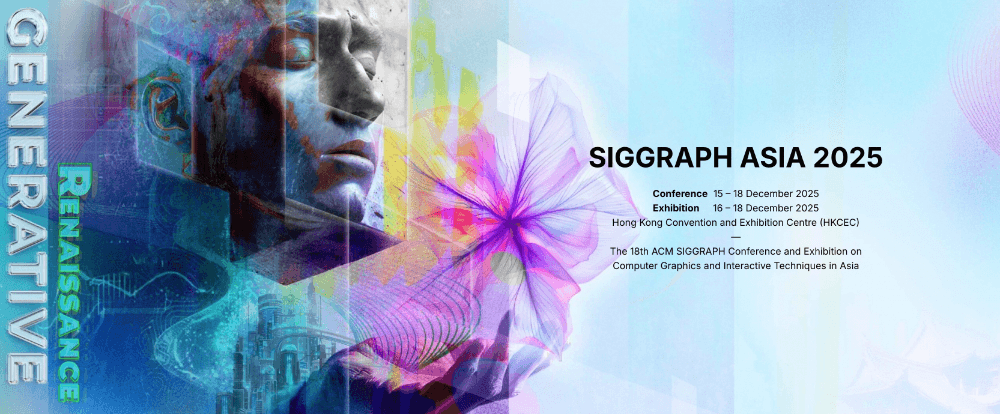

  

在计算机图形学、三维视觉、虚拟⼈、XR 领域，SIGGRAPH 是毫⽆争议的“天花板级会议”。 SIGGRAPH Asia 作为 SIGGRAPH 系列两⼤主会之⼀，每年只接收全球最顶尖研究团队的成果稿件，代表着学术与⼯业界的最⾼研究⽔平与最前沿技术趋势。  

  

我们是淘宝技术 — Meta技术团队，在 3D、XR、3D 真⼈数字⼈和三维重建等⽅向拥有深厚的技术积累和业务沉淀，我们⾃研了专业的多视⻆拍摄影棚，在今年CVPR 2025 会议上作为 Highlight Paper 发表了 TaoAvatar，并在淘宝未来旗舰店中实现了业内⾸个 3D 真⼈导购体验，下⾯视频展示了杭州⻄溪园区C区淘宝未来旗舰店的精彩瞬间，欢迎⼤家到来访园区进⾏体验。

  

  

今年我们团队迎来另⼀个重要⾥程碑：我们撰写的针对移动端的⾼保真实时3D数字⼈重建与渲染系统论⽂⾸次登录了国际顶级计算机图形学会议 SIGGRAPH Asia！这是我们技术实⼒的⼀次正式“官宣”，也是我们在 3D/XR ⽅向⻓期投⼊的阶段性成果展示。

  

我们研发的基于⼿机单⽬视频⽣成⾼保真且可实时驱动的 3D 数字⼈的系统名叫 HRM²Avatar ，不同于依赖多相机阵列或深度硬件的⽅案，其在普通⼿机拍摄条件下重建⼈物形体、服饰结构以及细节级外观表达，并⽀持在移动设备上实时渲染与动画驱动。系统采⽤显式服装⽹格与⾼斯表示相结合的建模⽅式：⽹格提供稳定的结构与可控性，⾼斯则⽤于呈现褶皱、材质和光照变化等细节，使虚拟⼈在不同姿态下依旧保持连续、⾃然的外观表 现。此外，基于轻量化推理设计与移动端渲染优化策略，⽣成的数字⼈可在⼿机、头显等移动设备上流畅运⾏。实验结果表明，我们的系统在视觉真实感、跨姿态⼀致性以及移动端实时渲染之间取得了良好平衡。

  

问题定义

  

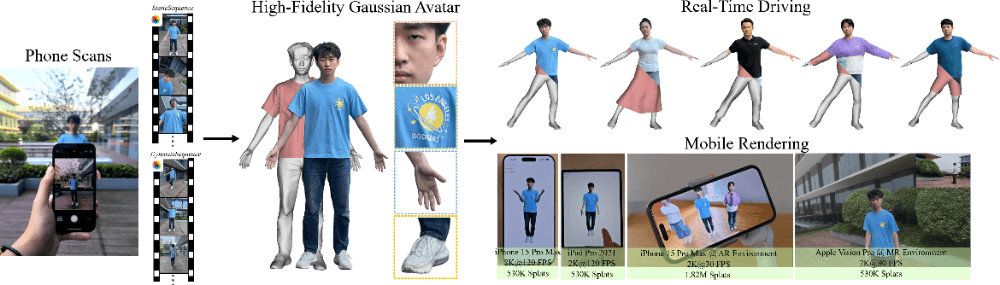

HRM²Avatar整体框架

  

想⽣成⼀个真实⼜能动的 3D 数字⼈，听起来很酷，但⻔槛⾮常⾼，现在⾼精度建模⽅式如 TaoAvatar、CodecAvatar等，通常需要使⽤昂贵的三维重建设备。这些系统确实效果好，但搭建复杂、调试困难，还很难携带出实验室，普通⼈⼏乎⽆法⾃⼰操作。⽽我们正是从“普通⼈也能⽤”的⻆度出发，重新思考：如何只⽤⼀部⼿机，就能创建和渲染⾼质量 3D 数字⼈？

  

但是仅使⽤⼿机条件下，会存在多个关键难题：

- ⼏何与局部细节缺失：由于⼿机拍摄距离远、视⻆有限，⾐物褶皱、材质结构、头发等⾼频细节难以稳定恢复；
- 外观—动作耦合：外观变化、布料形变、光照变化与姿态变化混杂，导致姿势相关的形变与光照难以独⽴建模；
- 实时推理受限：尽管神经渲染与 3DGS 表示提升了表达能⼒，但许多⽅法仍依赖⾼性能桌⾯级 GPU 实现实时驱动，在移动端设备上运⾏仍具有挑战。

  

因此，如何在仅依赖⼿机单⽬输⼊的条件下，重建⾼保真、可动画的数字⼈，并实现移动端实时渲染，仍是⼀个尚未充分解决的问题。

  

⽅法概览

  

基于上述挑战，我们提出了针对移动端的⾼保真实时3D数字⼈重建与渲染系统 HRM²Avatar，核⼼采⽤两阶段采集⽅式、显式⾐物⽹格表示与基于⾼斯的动态细节建模，并结合⾯向移动端设备的⾼效渲染优化策略，在保证外观质量与动态表现的同时，实现从扫描到实时驱动的完整重建流程。

  

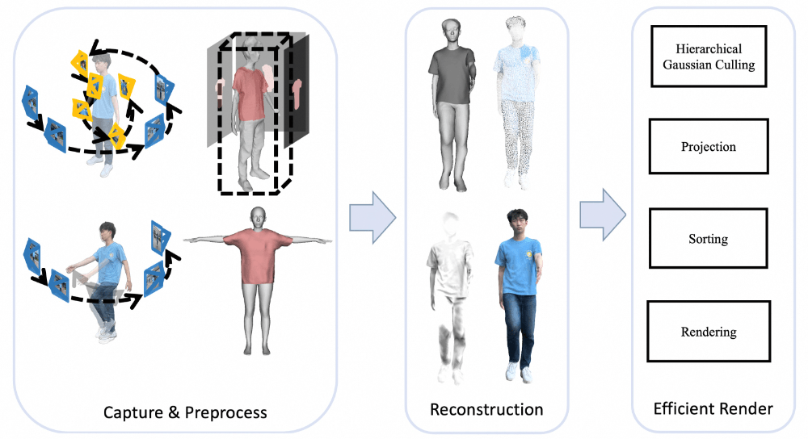

HRM²Avatar流程概览

  

核⼼模块包括：

- ⼿机扫描采集，采⽤静态与动态结合的⼿机扫描⽅式，同时获取全身结构与局部细节变化，为后续动态建模提供可靠外观与姿态变化信号。
- 表征与重建，系统构建可动画的穿⾐⼈体模型，并采⽤显式⽹格与⾼斯的混合表达⽅式：⽹格提供稳定的结构与动画⼀致性，⽽⾼斯⽤于建模随姿态变化的细节与光照（姿态相关的形变和阴影建模），从⽽在运动过程中保持材质、细节与视觉⼀致性。
- 移动端渲染，结合轻量化推理模型和⾯向移动设备的渲染优化策略，⽣成的数字⼈可在⼿机等设备上实现实时驱动与⾼质量显示。

  

采集与预处理

  

系统在进⼊重建阶段前，需要将⼿机扫描得到的视频转换为结构⼀致、可⽤于建模的输⼊数据，过程包括拍摄协议、相机与⼈体参数初始化，以及服饰⽹格提取。

  

  

  

### ▐  4.1 拍摄协议

  

  

采集采⽤双序列拍摄⽅式，包括静态扫描和动态扫描。静态扫描阶段，⽤户保持相对固定姿态，⼿机围绕身体移动拍摄，覆盖全身结构和局部纹理细节。动态扫描阶段，⽤户执⾏⾃然动作，⽤于捕捉⾐物褶皱、遮挡变化和光照响应。该流程⽆需额外硬件或标记，可在单⽬条件下提供重建与动态建模所需的信号。

  

▐  **4.2 初始相机参数和姿态估计**

  

系统对采集到的静态序列和动态序列进⾏处理，以获得后续重建所需的相机参数和初始⼈体姿态估计，其中静态序列是核⼼阶段。

  

- 静态序列

  

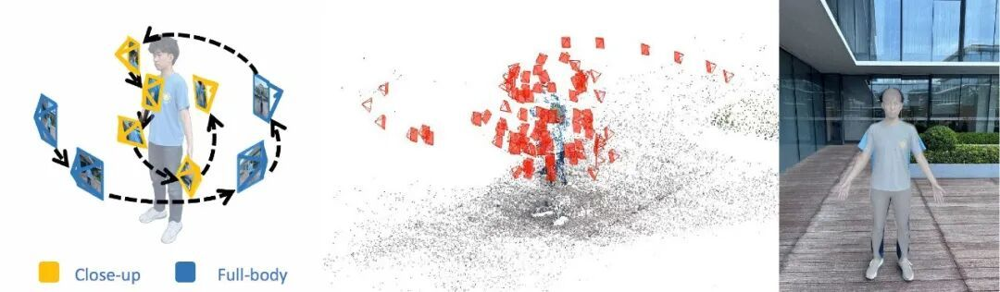

  

静态序列由近景（Close-up）与全身（Full-body）两类图像组成，它们承担不同但互补的作⽤：

- 全身帧
  
  全身视⻆提供稳定的⼈体轮廓与结构，使系统能够估计初始⼈体姿态参数。该姿态不仅⽤于静态阶段的重建，还作为动态序列处理时的参考姿态来源。
- 近景帧
  
  此类帧主要覆盖局部区域，如头部、胸部或⾐物细节，视野中⼈体结构⽐例有限，因此通常⽆法检测到可靠的⼈体关键点，也⽆法直接推断出合理姿态。然⽽，这些图像对于恢复⾼频纹理和⼏何区域⾄关重要。为了使这些帧参与建模，我们对近景与全身帧联合运⾏SfM，并利⽤跨尺度视⻆⼀致性来稳定近景帧的相机轨迹。

通过联合利⽤近景与全身帧，系统既获得了稳定的相机轨迹，也为后续⽹格重建与动态建模奠定了可靠的初始化条件。

  

- 动态序列

  

在动态序列中，系统不再更新形体参数，⽽是直接使⽤静态阶段得到的 SMPL-X 身体参数作为固定模板。在此基础上，仅对每⼀帧估计姿态变化，⽤于捕获随动作产⽣的⾐物变形、遮挡变化和光照响应。

  

▐  **4.3 服饰⽹格提取**

  

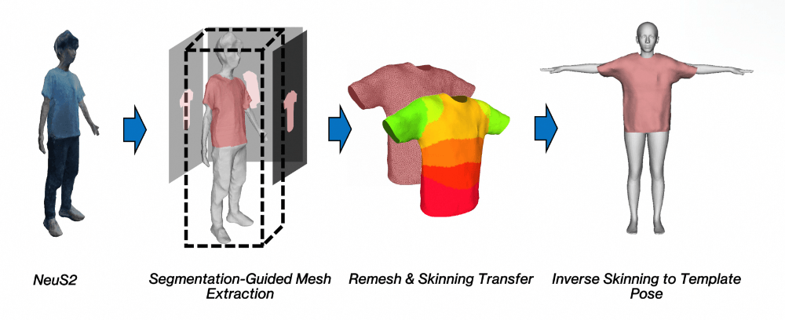

HRM²Avatar服饰⽹格提取流程

  

在获得相机与姿态初始化后，系统从静态序列中构建可动画的穿⾐⼈体⽹格。这⼀过程包括以下步骤：

- ⼏何重建，使⽤静态序列图像运⾏  NeuS2，⽣成服饰表⾯的⼏何代理，⽤于提供连续且⾼质量的体表结构。
- 服装区域提取，通过语义分割引导从代理⼏何中提取⾐物区域，确保服饰边界清晰，避免身体与⾐物表⾯混合。
- 重拓扑与蒙⽪绑定，对提取的服饰⽹格进⾏重⽹格化，并将其转移⾄与身体⼀致的蒙⽪权重体系，使其具备⼀致的动画控制结构。
- 绑定对⻬，将绑定后的⽹格逆⽪肤回归到绑定模板姿态，得到拓扑⼲净、结构⼀致、可绑定动画的最终服饰⽹格。

⽣成的穿⾐⼈体⽹格作为⼏何基底参与后续混合表示学习，并⽤于⽀持姿态变化下的外观建模与实时动画驱动。

  

实时可驱动的数字⼈重建

  

为了重建实时可驱动的数字⼈，我们着重从混合表示，⼏何⽣成，动态光照建模，训练流程，轻量⽹络蒸馏五个⽅⾯进⾏了细致的考虑和设计。

  

▐  **5.1 混合表示**

  

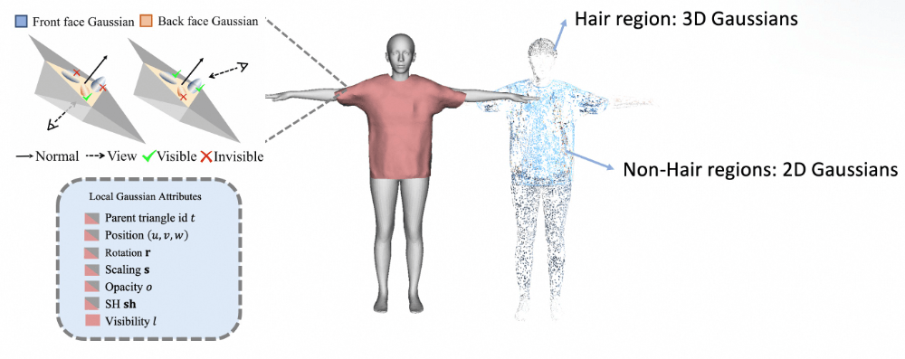

HRM²Avatar混合表达

  

在穿⾐⼈体⽹格上，我们为每个三⻆形附着⾼斯点，构建混合数字⼈表征：

1.⾼斯位置与绑定

每个⾼斯⽤重⼼坐标和法向在三⻆形上定位：

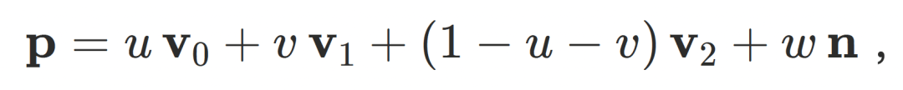

其中 v0, v1, v2为三⻆形顶点， 为三⻆形法向，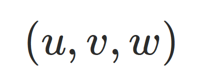为局部参数。

2.协⽅差构造

⾼斯的尺度由三⻆形雅可⽐矩阵、旋转和缩放组合得到：

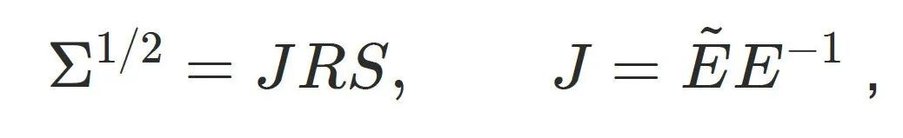

其中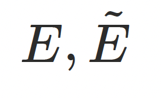为参考与当前三⻆形的边向量矩阵， R为局部旋转， S为对⻆缩放矩阵。

3.可⻅性与语义分区

每个⾼斯关联可⻅性标记，仅在三⻆形朝向视点时参与渲染。基于语义分割，将⾼斯分为两个区域：

- 头发区域，使⽤ 3DGS 建模软性过渡，
- ⾮头发区域，使⽤ 2DGS 贴合⽹格表⾯。

该混合表示在保持结构约束的同时，为后续姿态相关的形变与光照建模提供了可控的⾼斯参数空间。

  

▐  **5.2 ⼏何⽣成**

  

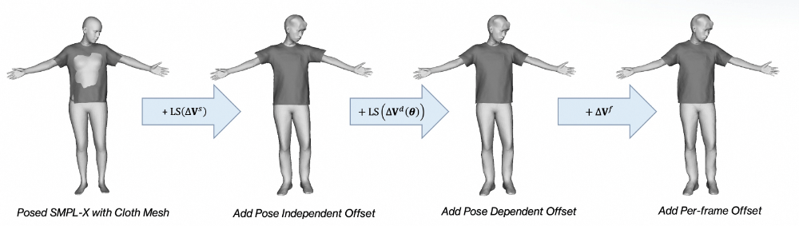

HRM²Avatar⼏何⽣成模块

  

最终数字⼈的⼏何基于带服饰的模板⽹格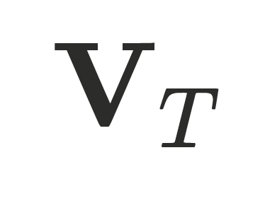，并通过三类偏移量组合得到：

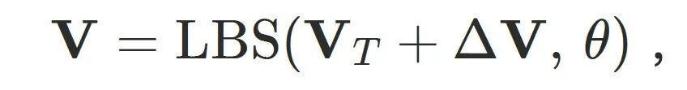

其中偏移量定义为：

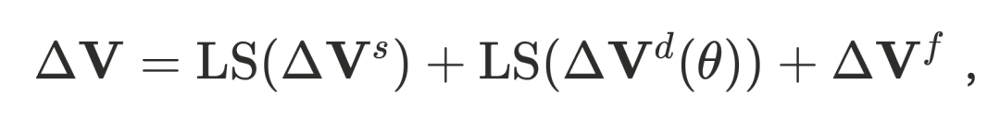

- ：静态偏移，与姿势⽆关，⽤于补全基础形状和服饰结构；
- ：姿态相关偏移，与姿势相关，⽤于表达随动作变化的可预测⼏何形变；
- ：逐帧残差，⽤于补⾜前两项未覆盖的更细粒度形变，包括局部精细变化和随动作产⽣的服饰动态（如⾐物轻微摆动）。

其中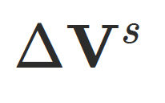和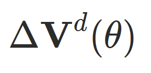定义在隐式空间中，并通过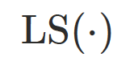映射到欧式偏移以提升训练稳定性和收敛速度，⽽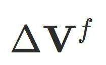拥有更⼤的⾃由度，⽤于增强最终⼏何表达能⼒。

  

▐  **5.3 动态光照建模**

  

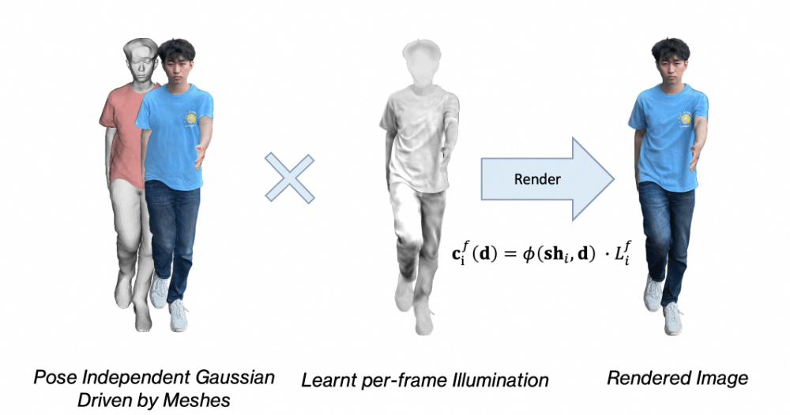

HRM²Avatar动态光照建模

  

⼈体姿态变化会导致光照分布发⽣变化，例如阴影位置偏移、局部亮度变化等。为建模这种随动作变化的光照效应，我们引⼊⼀个轻量化的单通道姿态相关光照项，⽤于描述运动驱动的光照变化特征。

  

渲染过程中，⾼斯的外观属性会与该光照项进⾏调制，最终颜⾊计算如下：

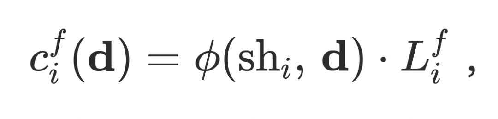

其中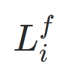为逐帧学习的光照系数，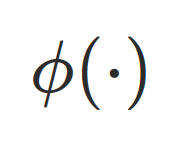表示基于⽅向与球谐编码的外观解码。引⼊动态光照建模后，数字⼈能够在不同姿态下保持更⾃然的光照⼀致性，避免出现“⽆光照变化”的静态外观，使渲染结果更贴近真实运动表现。

  

▐  **5.4 训练流程**

  

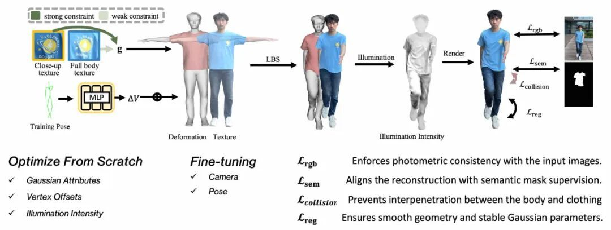

HRM²Avatar训练流程

  

系统的完整优化过程如图所示。训练阶段同时使⽤近景与全身图像作为监督信号，其中近景提供更强的外观约束，全身图像⽤于保持整体⼀致性。模型渲染结果与输⼊图像通过多种监督⽅式进⾏对⻬，包括：

- 颜⾊⼀致性监督，
- 语义掩码约束，
- 身体与服饰区域的碰撞约束，
- ⼏何与参数平滑正则化。

  

在优化策略上，⾼斯属性、⼏何偏移与光照参数从零开始训练，⽽相机姿态与⼈体姿势只进⾏轻量微调，⽤于消除残余配准误差，⽽⾮重新估计结构。经过训练，系统得到姿态⽆关的⾼斯表示，以及针对每⼀帧的⼏何形变与光照变化，从⽽⽀持后续实时驱动与渲染。

  

▐  **5.5** 轻量⽹络蒸馏

  

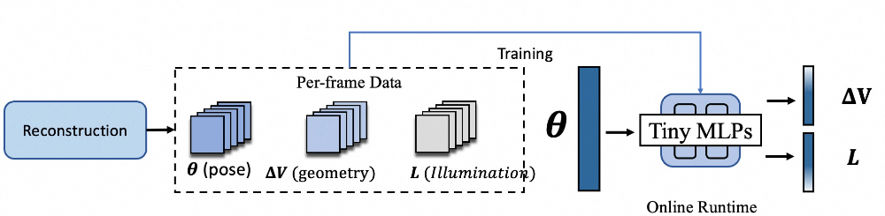

HRM²Avatar⽹络蒸馏模块

  

在重建阶段，我们已经获得了逐帧的姿态、⼏何偏移和光照参数。基于这些结果，我们采⽤蒸馏⽅式训练⼀个轻量级的预测⽹络，使其学习姿态到⼏何形变与光照变化的映射关系。训练完成后，系统不再依赖逐帧重建数据，仅输⼊姿态即可实时预测对应的⼏何偏移与光照参数，从⽽⽀持移动端的实时驱动与渲染。

  

⾼性能移动端实时渲染

  

为了实现移动端实时运⾏，我们对渲染阶段进⾏了系统性优化，包括层级裁剪、⾼效投影、量化排序和基于显卡硬件的加速渲染。该设计避免了传统 3DGS渲染中⾼带宽、⾼冗余计算的瓶颈，使最终数字⼈能够在⼿机上稳定运⾏。

  

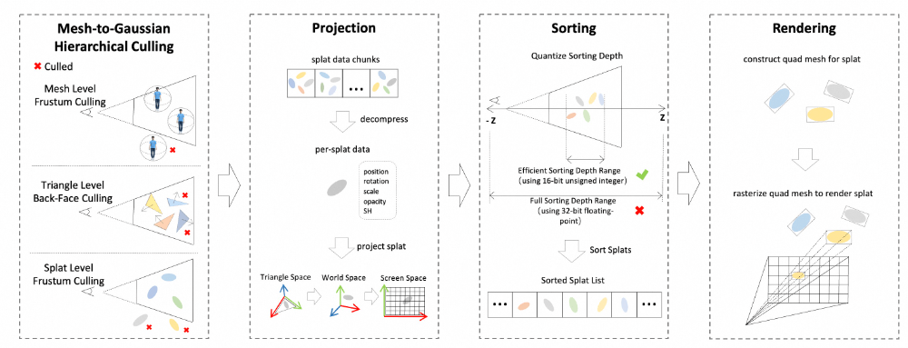

HRM²Avatar实时渲染模块

  

▐  **6.1** 层级裁剪

  

为了尽量减少⽆效⾼斯的冗余计算，系统采⽤多级裁剪策略：

- ⽹格级视锥裁剪（CPU侧）：剔除完全不在视野范围内的身体部件；
- 三⻆⽚级背⾯裁剪（GPU侧）：丢弃背对摄像机的三⻆⾯；
- ⾼斯级视锥裁剪（GPU侧）：进⼀步剔除不可⻅的⾼斯实例。

这种多级裁剪⽅式显著减少了需要参与排序与渲染的⾼斯数量，极⼤地提升了渲染效率。

  

▐  **6.2** 投影

  

对于参与渲染的⾼斯点，我们采⽤基于需求的精简投影流程：

- 按需解码存储块，避免⼀次性展开全部数据；
- 优先提取空间位置和索引⽤于可⻅性判断；
- 仅对可⻅⾼斯点进⾏完整属性解码（旋转、尺度、不透明度、球谐系数等）。

这种按需处理⽅式有效降低了解码带宽开销。

  

▐  **6.3** 排序

  

渲染⾼斯需要按深度顺序合成。我们采⽤量化排序以提升效率：

- 将连续深度范围映射⾄紧凑区间；
- 使⽤ 16 Bit 或 12 Bit 深度存储替代 32Bit 浮点；
- 结合 GPU 并⾏ Radix Sort 与硬件 Wave 操作加速排序。

该⽅法在保持排序精度的同时，⼤幅减少排序负担和显存带宽使⽤。

  

▐  **6.4** 渲染

  

最终渲染阶段使⽤ GPU 的硬件栅格化，对每个⾼斯⽣成⾯元并进⾏屏幕合成。为进⼀步提升性能和视觉质量，我们采⽤：

- ⾃适应⾯元缩放：在保证外观⼀致的前提下缩⼩⾯元⾯积；
- 基于透明度修剪：剔除贡献极⼩的边界像素；
- 反向透明度估计：根据⾼斯分布推断最⼩必要⾯元尺⼨。

这些策略使系统在有限算⼒环境下仍能保持⾼质量渲染。

通过上述优化，数字⼈渲染不依赖实时体渲染混合或⾼开销着⾊器，⽽采⽤紧凑、⾼度可并⾏、缓存友好的绘制⽅式，最终达成在移动端平台上的实时表现。

  

结果展示

  

▐  **7.1** AR｜MR效果

  

  

▐  **7.2** 与现有⽅法对⽐

  

我们在⾃构的服饰⼈体数据上对 HRM²Avatar 进⾏了系统评测，并与现有单⽬输⼊条件下的可动画数字⼈⽅法进⾏了对⽐，包括基于隐式场、可动画神经表示以及基于⾼斯表示的⽅案。对⽐实验主要关注两个⽅⾯：静态重建质量与姿态驱动下的外观⼀致性。

  

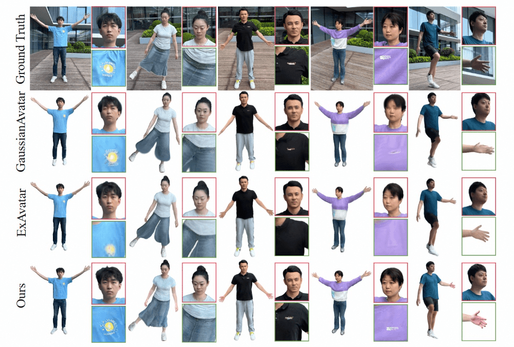

  

从定性结果可以观察到，在仅使⽤单⽬输⼊的条件下，现有⽅法在⾐物边界、⾼频纹理和细节区域（如褶皱、印花、层次结构等）往往表现较弱，容易出现模糊化或纹理漂移，⽽ HRM²Avatar 依托显式⾐物⽹格与⾼斯表示相结合的结构，能够保持更稳定的视觉细节和结构表达。尤其在跨视⻆与跨姿态驱动条件下，我们的⽅法在外观⼀致性上表现更稳定，未出现明显的拉伸或表⾯扭曲伪影。

  

  

在客观指标上，我们使⽤ PSNR、SSIM 和 LPIPS 对⽅法进⾏量化⽐较。结果表明， HRM²Avatar 在所有指标上均取得更优表现：在 LPIPS 上分数更低，⽽在 PSNR 和 SSIM上更⾼，显示出更清晰的纹理保留和更稳定的结构⼀致性。值得注意的是，即使在新的姿态条件下，这⼀优势仍然保持，说明所建模的姿态相关的外表建模能够有效避免纹理漂移并提升跨姿态⼀致性。

  

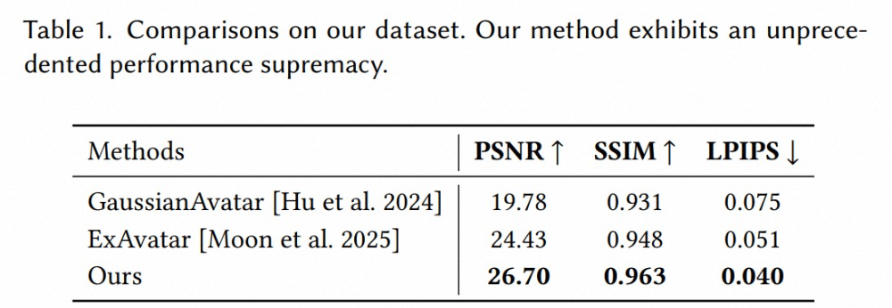

  

我们进⼀步在 Neuman 数据集上评估了 HRM²Avatar 的泛化性能。该数据集包含更复杂的服饰结构与动态动作模式，可⽤于验证⽅法在⾮⾃采场景下的适应能⼒。

  

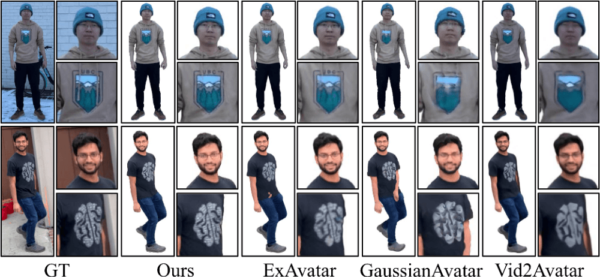

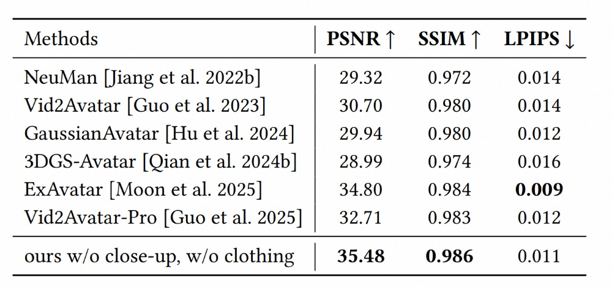

  

在 Neuman 数据集上，我们进⼀步评估了模型的泛化表现。该数据集包含更丰富的动态动作与服饰外观变化，可⽤于检验模型在⾮⾃采场景下的稳定性。从定性结果来看，现有⽅法在快速动作或较⼤姿态变化条件下，容易出现纹理模糊、漂移或表⾯结构不稳定等现象，⽽ HRM²Avatar 能保持较为稳定的外观呈现，服饰细节在动作驱动过程中仍具备可辨识度。同时，在袖⼝、褶皱等⾼频区域，模型能够维持视觉上连续且合理的外观变化。值得注意的  是，即使⽬标姿态未在扫描序列中出现，基于两阶段采集策略学习的姿态相关的外表建模仍能⽣成与动作⼀致的外观响应，没有出现明显视觉断层或重建不连续情况。

  

总体⽽⾔，Neuman 数据集实验表明，在具有动作变化和服饰结构复杂性的场景中，模型能够保持重建外观与姿态⼀致性，并具备跨姿态条件下的稳定表现。

  

▐  **7.3** 消融实验

  

我们进⼀步进⾏了消融实验，以验证系统中各个组成模块对最终效果的影响。实验依次移除关键设计，包括显式服装⽹格、姿态相关的外表建模以及两阶段扫描协议，并在相同条件下⽐较⽣成结果。

  

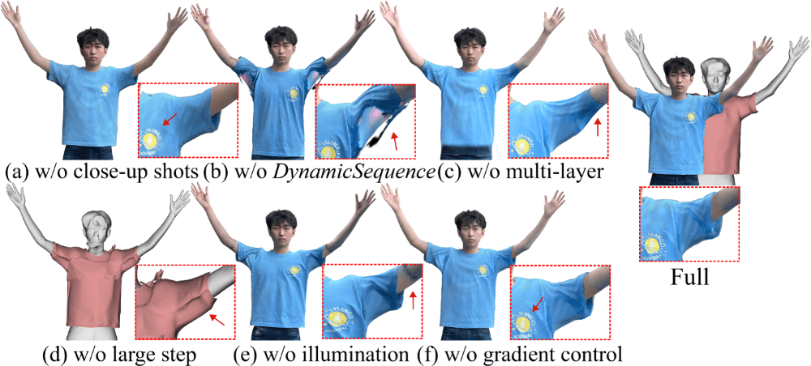

  

从定性结果可以看到，当移除显式服装⽹格时，重建表⾯在服饰边界区域出现不连续或拓扑模糊的情况，且局部细节难以保持⼀致。进⼀步移除姿态相关的外表建模后，模型在动作变化过程中易产⽣纹理漂移或不稳定现象，尤其在⼿臂抬起等较⼤姿态变化阶段更为明显。此外，若不采⽤两阶段扫描采集策略，仅依赖单序列输⼊，模型在训练阶段难以获得可靠的静态参考，表现为纹理分辨率下降以及动作驱动时局部外观变化不合理。

  

总体来看，消融实验表明，各设计模块在系统中均发挥必要作⽤：显式服装⽹格⽤于提供稳定的拓扑结构，姿态相关的外表建模对于跨姿态⼀致性⾄关重要，⽽两阶段扫描策略为重建细节和外观稳定性提供有效约束。

  

▐  **7.4** 性能表现

  

我们评估了 HRM²Avatar 在移动端设备上的运⾏表现，并在 iPhone 15 Pro Max 与 Apple Vision Pro 上进⾏了实时驱动测试。实验使⽤相同渲染配置，并控制⾼斯数量以验证模型在不同数字⼈规模下的运⾏稳定性。

  

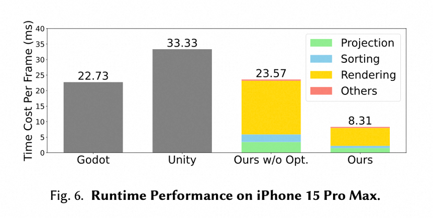

  

在单个数字⼈配置下（约 53万⾼斯点），系统能够在 iPhone 15 Pro Max 上以 2K 分辨率、 120 FPS 稳定运⾏；多数字⼈场景下仍可保持实时表现，例如同时渲染三个数字⼈时，可达到 2K@30 FPS。在 Apple Vision Pro 上，系统同样实现了2K@90 FPS的实时渲染效果。

  

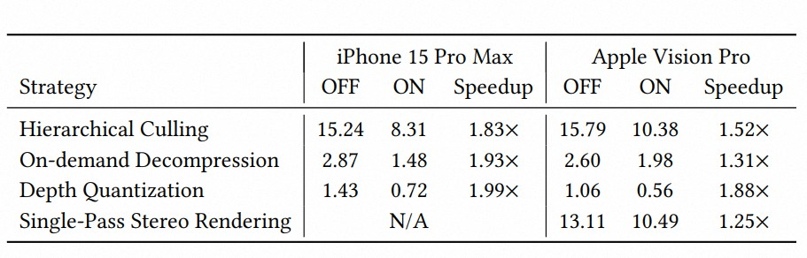

  

我们进⼀步分析了各渲染优化策略对系统性能的影响，包括分级裁剪（Hierarchical Culling）、按需属性解码（On-demand Decoding）、深度量化排序（Depth Quantization）以及单通道视图渲染等策略。实验结果表明，这些设计能够有效降低计算与内存开销，使混合的⾼斯和⽹格表示能够在移动硬件上实现实时驱动。

  

整体来看，性能测试表明 HRM²Avatar 能够在移动设备上维持稳定的实时运⾏表现，同时兼顾⾼分辨率渲染质量与系统响应延迟，为实际交互场景部署提供可⾏性基础。

  

  

总结与展望

  

围绕“让普通⼈也能拥有⾼质量数字⼈”这⼀⽬标，我们提出了 HRM²Avatar，⼀种基于⼿机单⽬扫描，即可⽣成可动画、⾼保真数字⼈的系统⽅案。在真实应⽤场景中，HRM²Avatar能够应对不同服饰结构、姿态变化与光照条件，在稳定性和⼀致性⽅⾯表现良好，为移动端数字⼈应⽤提供了可⾏技术路径。

  

我们也客观看待当前技术阶段，作为⼀项前沿探索，HRM²Avatar 仍然存在进⼀步优化空间。例如对于结构复杂或⾮固定拓扑的服饰（如飘带、宽松⾐物等），重建精度仍有改善余地，此外在极端光照或动态遮挡场景下，效果仍有提升空间。这些也正是我们下⼀阶段持续投⼊攻关的⽅向。

  

HRM²Avatar并不是“终点”，⽽是我们推动：数字⼈从专业设备⾛向普通⽤户，从实验室能⼒⾛向真实应⽤场景过程中的⼀个重要⾥程碑。我们相信，随着算法、模型⼯程与硬件能⼒的共同进化，⾼质量、实时、可普及的数字⼈体验，将不再遥远。

  

相关链接

  

- 论⽂主⻚：
  
  https://acennr-engine.github.io/HRM2Avatar/
- TaoAvatar 主⻚：
  
  https://pixelai-team.github.io/TaoAvatar/
- Taobao3D GitHub仓库：
  
  https://github.com/alibaba/Taobao3D
- MNN GitHub仓库： 
  
  https://github.com/alibaba/MNN

  

团队介绍

  

我们是淘宝技术 — Meta技术团队，负责⾯向消费场景的 3D/XR 基础技术建设和创新应⽤探索，通过技术和应⽤创新找到以⼿机及 XR 新设备为载体的消费购物 3D/XR 新体验。团队在端智能、商品三维重建、3D 引擎、XR 引擎等⽅⾯有深厚的技术积累，同时在 OSDI、MLSys、CVPR、ICCV、NeurIPS、TPAMI、SIGGRAPH 等顶级学术会议和期刊上发表了多篇论⽂。

  

  

**¤** **拓展阅读** **¤**

  

[3DXR技术](https://mp.weixin.qq.com/mp/appmsgalbum?__biz=MzAxNDEwNjk5OQ==&action=getalbum&album_id=2565944923443904512#wechat_redirect) | [终端技术](https://mp.weixin.qq.com/mp/appmsgalbum?__biz=MzAxNDEwNjk5OQ==&action=getalbum&album_id=1533906991218294785#wechat_redirect) | [音视频技术](https://mp.weixin.qq.com/mp/appmsgalbum?__biz=MzAxNDEwNjk5OQ==&action=getalbum&album_id=1592015847500414978#wechat_redirect)

[服务端技术](https://mp.weixin.qq.com/mp/appmsgalbum?__biz=MzAxNDEwNjk5OQ==&action=getalbum&album_id=1539610690070642689#wechat_redirect) | [技术质量](https://mp.weixin.qq.com/mp/appmsgalbum?__biz=MzAxNDEwNjk5OQ==&action=getalbum&album_id=2565883875634397185#wechat_redirect) | [数据算法](https://mp.weixin.qq.com/mp/appmsgalbum?__biz=MzAxNDEwNjk5OQ==&action=getalbum&album_id=1522425612282494977#wechat_redirect)
