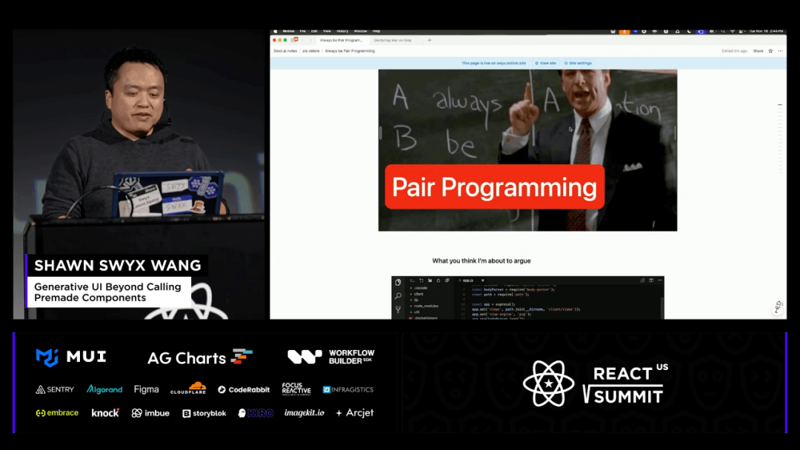
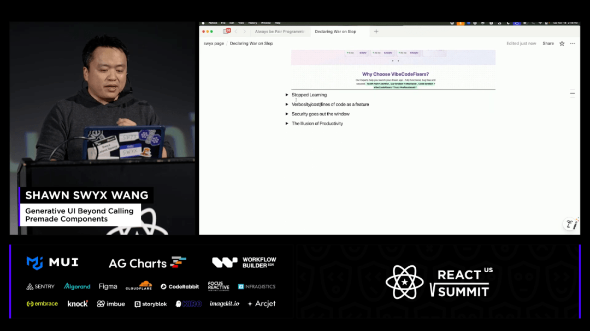
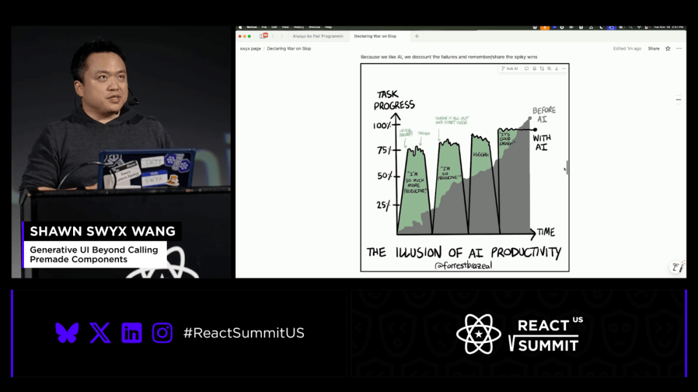
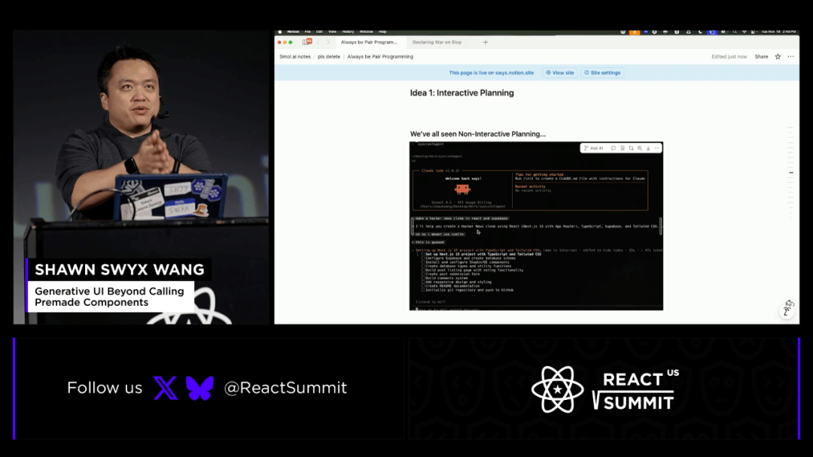
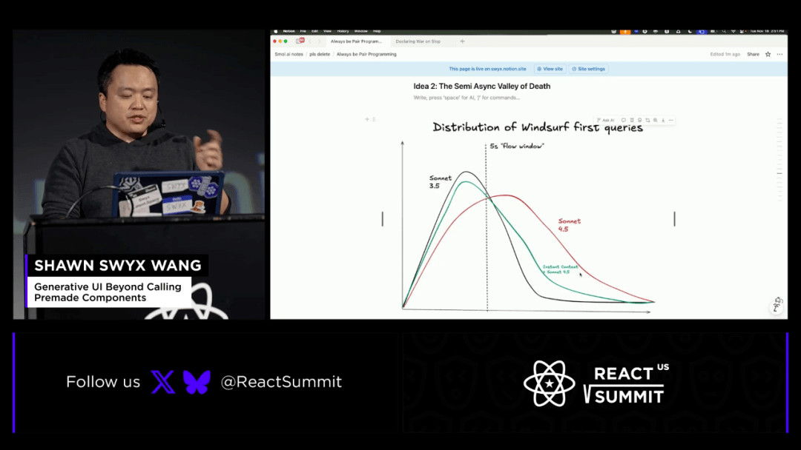
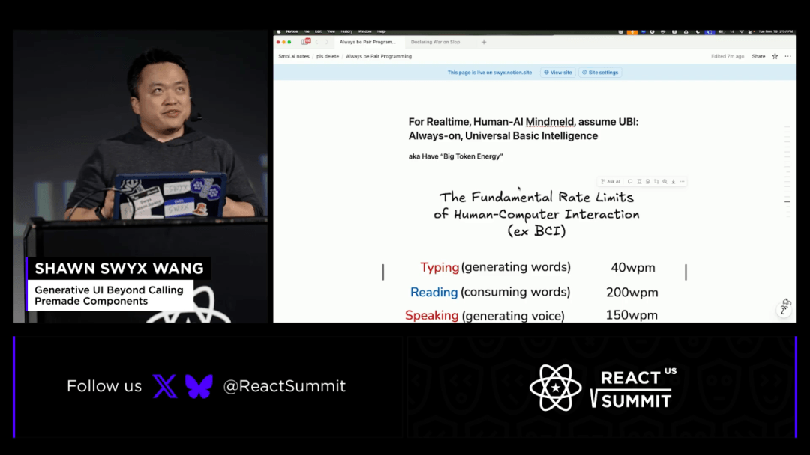
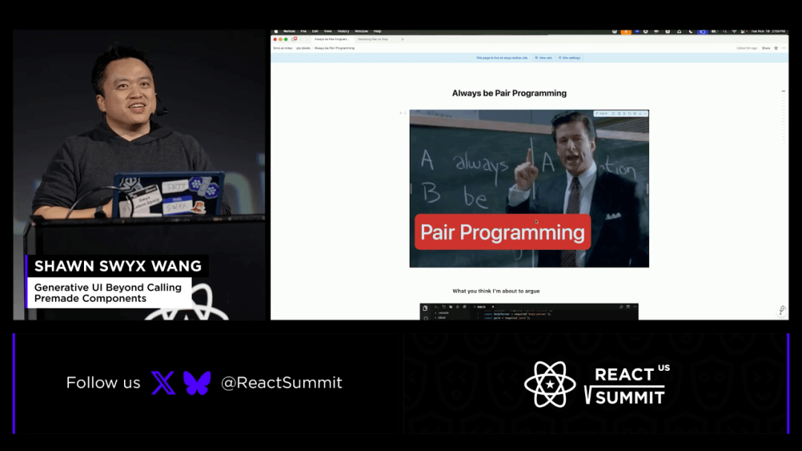

# 【早阅】氛围编程：AI 幻觉让你错失 20% 实际生产力，并累积巨额技术债务！

警惕 “凭感觉编程”（Vibe Coding）带来的生产力错觉和风险。虽然许多开发者（包括演讲者本人）在使用 AI 编码工具时，感觉自己的生产力提高了 20%，但这是一种错觉（illusion of productivity）。通过随机对照试验（RCT）的实际观察结果显示，被衡量的生产力实际上反而下降了 20%。

开发者应该将人类重新纳入循环（put humans back in the loop），目标是将人类与 AI 的注意力结合起来，实现 “心智融合”（mind meld）

#### 一、为什么我的生成式 UI 演示崩溃了（抽象陷阱）

本次分享的主题并非预期的生成式用户界面演示，而是关于演示失败的原因分析。失败源于对生成式 UI 的深入探索，特别是工具调用（Tool Calling）作为生成式 UI 的应用。开发者拥有修改用户界面的独特能力，而将此能力通过 AI 工具进行民主化是令人兴奋的方向。然而，演示中使用的模型（如 Cloudflare 运行的 3.5 模型）或复杂的工具链导致了最终的失败，暴露了当前抽象层级过高的问题。

##### 工具调用作为生成式 UI

核心目标是将 AI 集成到工作流中，允许用户通过提示词动态地定制和修改界面，以适应特定需求。这涉及创建能够生成其他工具并动态递归调用的工具调用链。尽管取得了初步成果，但当前的实现因多层级提取的堆栈问题而无法调试，这引出了对更深层次编程协作模式的探讨。

> 我认为能够修改用户界面以适应需求，是开发人员拥有的独特超能力。

最终，失败的演示指向了当前 AI 编程范式中存在的一个核心问题，即过度的抽象化。这种抽象化不仅存在于生成式 UI 中，也普遍存在于 AI 编程的辅助工具中，使得人类难以在关键时刻介入和调试。

#### 二、为什么必须握紧方向盘（“自动驾驶” 陷阱）

将 AI 引入工作流的传统观点是将其视为副驾驶或终端代理进行辅助，但这相对容易实现。更重要的目标是将人类重新置于控制循环中。这与 AI 出现之前框架和过度抽象化带来的问题如出一辙。在自动驾驶领域，人们倾向于移除方向盘，让乘客完全放松，但这仅在 “幸福路径” 上有效，而开发体验的关键在于能够在 “不幸福路径” 上夺回控制权。

##### 自动驾驶与开发者的控制权

许多 AI 工具的设计倾向于最大化自主性，正如 Meter 组织研究的 AI 代理自主性长度指标所显示的那样，业界热衷于衡量代理能独立完成多少工作。然而，这种趋势的本质是试图将人类从工作流程中剔除。Anthropic 和 Replit 等公司对此感到兴奋，但现实情况是，这种完全自主的代理可能导致灾难性后果，例如直接删除生产数据库或产生大量低质量代码。

| 自主性级别 | 人类角色 | 风险点 |
| --- | --- | --- |
| 高自主性（自动驾驶） | 乘客 / 观察者 | 无法应对非预期路径，系统性风险高 |
| 低自主性（传统编程） | 完全控制 | 进度缓慢，效率提升有限 |
| 理想协作 | 持续参与规划与修正 | 风险可控，效率最大化 |

#### 三、当 AI 删除生产数据库时 | 什么是 “2 个开发者 = 50 个开发者的技术债”

AI 编程工具带来了一种生产力的错觉。许多用户在使用这些工具时感觉效率提升了约 20%，但随机对照试验（RCT）的观察结果却恰恰相反，实际观察到的生产力反而下降了 20%。这种主观感受与客观衡量之间的巨大鸿沟值得深入探究，它揭示了 AI 驱动工作流中的根本性问题。

> 现在的笑话是，两位工程师现在可以制造出 50 位工程师的技术债务。

这种情况已经变得非常严重，催生了专门修复由 “Vibe Code” 产生的应用程序的初创公司，例如 Vibe Code Fixers。这些工具的泛滥是因为 AI 生成了大量的低质量代码（slop）。这种低质量代码的累积，使得开发者需要花费更多时间来维护和修复，从而抵消了初期的速度收益。

#### 四、速度的错觉：为什么实际生产力在试验中下降了 20%

效率下降的原因在于 AI 的 “尖峰性”（spikiness）。简单的提示词可能带来巨大的即时胜利，但随之而来的是代码理解上的巨大鸿沟，因为开发者并未亲手编写这些代码。在没有 AI 的情况下，进度是稳步提升的；而使用 AI，则表现为一系列快速的前进跳跃，但随后由于理解不足，生产力反而可能出现下降。

##### AI 带来的生产力尖峰与下降

这种跳跃式的进展与稳定的、可预测的进度形成了鲜明对比。核心的领悟在于，人类的注意力与 AI 的注意力相结合，其效果优于任何一方单独工作。因此，目标是将人类和 AI 的注意力紧密结合起来，共同专注于计划的执行。

- AI 出现前：稳定的、持续的进度增长。
- AI 出现后：巨大的、不稳定的飞跃，随后因理解不足导致生产力下降。

#### 五、解决方案 1：交互式规划（不要让代理程序锁定您）

第一个解决方案是推行交互式规划。开发者必须始终阅读代理正在执行的计划，并在执行前或执行期间能够修改或讨论该计划。这与规范驱动开发（spec-driven development）有所不同，后者侧重于执行前规划。关键在于像监控员工一样持续关注计划的执行过程，防止代理程序锁定用户输入，直到其第一阶段工作完成。

##### 交互式规划的类型

非交互式规划意味着输入被锁定，用户无法在代理完成任务前提供反馈。糟糕的交互式规划则表现为代理长时间暂停等待用户回复，导致流程中断。理想的交互式代理应实现非中断性的交互，即在不打断主要工作流的前提下允许人类介入。

| 交互类型 | 用户体验 | 控制权 |
| --- | --- | --- |
| 非交互式 | 输入被完全阻塞 | 代理完全控制 |
| 糟糕的交互式 | 长时间等待，流程停滞 | 间歇性失控 |
| 理想的交互式 | 紧密的往复序列，共同制定可并行化的计划 | 人类与 AI 协同控制 |

最理想的交互式代理是人类与 AI 共同协作，围绕一个双方都同意且可并行化的计划进行工作。这允许通过启动多个代理来分解独立的子任务，实现更高效的并行处理。

#### 六、解决方案 2：逃离 “异步死亡谷”

第二个想法是逃离 “异步死亡谷”。内部分析显示，当模型开始更自主地运行时，从第一次会话结束到第二次会话开始的距离会显著降低，这破坏了心流。这种现象与人机交互研究相符：人类对复杂任务的等待容忍度较高（8 到 12 秒），但对简单输入（如打字）的期望延迟极低（50 毫秒）。

##### 等待时间与心流中断

估计显示，每等待一秒钟，心流中断的概率几何级数增加 10%。这意味着等待超过 10 秒，中断的概率接近 100%。因此，设计时必须主动应对，因为更具代理性的模型（如 Sonnet）虽然速度快，但其延迟开始对生产力造成负面影响。

- 模型实验室：专注于图表右侧，追求极度并行化、后台化和超长自主性（长达 10 小时）。
- 代理实验室：专注于同步人类与 AI 的思维，关注深度工作和解决最困难的问题，要求极快的延迟。

对于那些已经被商品化、已知 LLM 可以解决的问题，应当直接分配给代理执行。但对于不确定的问题或不清楚目标时，则需要与 AI 进行快速、频繁的同步往返，此时对延迟的要求最高。

#### 七、解决方案 3：代码地图（在生成代码前理解代码）

第三个也是最有趣的观点是提高代码库的理解能力，这通过一个名为 “代码地图”（Code Maps）的工具实现。其核心原则是：在 “Vibe” 代码（即让 AI 生成代码）之前，必须先理解代码。如果不理解正在进行的操作，最终交付的代码库将失去控制权，导致大量低质量代码的产生。

##### 期代码地图的结构与优势

代码地图提供了代码模块及其流程的可视化表示，也可以是代码库注释的分层展示。用户可以点击并同步到特定部分，从而无需阅读所有文本即可理解代码流，例如从前端到后端或服务到数据库的流程。这种导航能力极大地提升了提示工程的质量，因为用户可以精确地指向需要修改的代码部分，而不是进行模糊的描述。

> 离代码越远，最终交付的垃圾就越多。

代码地图支持开发者在代码文件系统上进行导航，这使得与 AI 的交互成为一种更精确的自动提示工程。即使不使用 AI 生成代码，仅使用代码地图来阅读和理解代码，也能显著加速开发过程，确保每一行代码的作者意图都清晰明确。

##### 人机交互的理想交替

理想的人机协作模式是红蓝（人类 / AI）的交替进行，双方持续围绕代码进行对话，确保人类始终处于对代理的控制之上，精确执行意图。

#### 八、不要吝啬 Token（“每日 12 美元” 的计算）

对于关心自身技艺的软件工程师而言，不应过度优化每月 $20 的 AI 订阅费用。应将 Token 视为廉价资源，像用水一样花费它们，以实现个人能力的增强。这种观点在当前阶段可能具有争议性，但对于拥抱未来技术至关重要。

##### 人类输入 / 输出速率基准

| 沟通方式 | 人类速率 (WPM/WPS) | GPT-5 24h 文本同步成本估算 |
| --- | --- | --- |
| 打字 | 40 词 / 分钟 | 约 200,000 tokens |
| 语音输入 | 150-180 词 / 分钟 | 约 $4 到 $8 |
| 视觉输入 | N/A | 可高达 $200/ 天 |

如果将人类的文本、语音输出全天候（24 小时不间断）同步到 GPT-5 中，仅考虑基础文本和语音输入，每日的总成本大约在 $12 左右。这种全模态同步的成本相对低廉，预计相关工具将在未来一年内成熟，届时开发者可以更自由地投入资源进行深度人机协同。

#### 九、结论：不要让 AI 取代你

最终的建议是，不要接受那种 AI 将取代所有人的观点。核心目标应当是将 AI 从取代人类工作的角色拉回到增强个人能力的角色上来。通过允许自己像使用水一样自由地消耗 Token，可以实现个人生产力的巨大提升，这是当前技术阶段可以达成的目标。

实现这一目标的关键在于改变观念，将 AI 视为增强自身技能的工具，而非替代者。这种协作模式能够使开发者在保持对代码控制权的同时，大幅提高工作效率。

#### 其他

##### 1、为什么使用 AI 编程工具后，主观感受的生产力与随机对照试验的客观结果存在 20% 的差异？

主观感受的提升源于 AI 带来的快速、巨大的进度飞跃，但由于开发者对生成代码的理解滞后，客观衡量显示实际生产力下降了 20%，这被称为速度的错觉。

##### 2、什么是 AI 编程中的 “异步死亡谷”，它对开发者的心流有何影响？

异步死亡谷指的是等待 AI 响应时间过长导致的后果。研究表明，每等待一秒，心流中断的概率会增加 10%，超过 10 秒则几乎肯定会中断深度工作状态。

##### 3、为什么说代码地图是比直接提示更好的工程实践？

代码地图通过提供代码模块和流程的可视化，帮助开发者在要求 AI 生成代码前建立起对代码库的深入理解，从而实现更精确、更少错误的自动提示工程。

##### 4、在 AI 协作中，如何实现理想的交互式规划以避免系统锁定？

理想的交互式规划要求人类与 AI 共同协作，围绕一个双方同意且可并行化的计划工作，并允许开发者随时审查和修改计划，而不是被代理完全锁定输入。

##### 5、为了实现全天候的人机同步，每天在 GPT-5 上花费的 Token 成本大约是多少？

如果将人类的文本和语音输出全天候同步到 GPT-5，基础的多模态同步成本估算约为每日 12 美元左右。

#### 早读洞察

1、生成式 UI 演示暴露抽象陷阱：生成式 UI 的演示因底层模型限制而失败，揭示了过度抽象化工具带来的实际操作风险和不可靠性。

2、开发者需保持对代码的控制权：如同自动驾驶一样，开发者在遇到非预期路径时必须能够夺回控制权，避免完全被 AI 代理锁定。

3、AI 可能导致生产力下降和技术债务：主观感受的效率提升与客观测试结果存在巨大差异，低质量代码的产生速度极快，形成严重的技术债务。

4、交互式规划是人机协作的关键：必须持续审查和修改 AI 生成的执行计划，确保人类始终在循环中，而不是被动接受代理的锁定操作。

5、逃离异步死亡谷需极低延迟：等待 AI 响应时间过长会几何级数地增加心流中断的概率，同步工作流要求延迟必须尽可能地快。

6、代码地图增强对代码库的理解：在生成代码前理解代码结构是基础原则，代码地图通过可视化模块流程，实现了更优化的自动提示工程。

7、不要吝啬 Token 以换取生产力：对于关心技艺的专业工程师而言，应将 Token 视为廉价资源，投入更多资源以实现深度人机协同和增强。

原文：https://www.youtube.com/watch?v=I7P3GTVNmQM

这期前端早读课  
对你有帮助，帮” 赞 “一下，  
期待下一期，帮” 在看” 一下。
