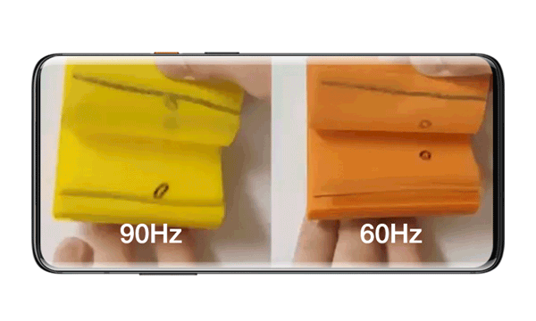
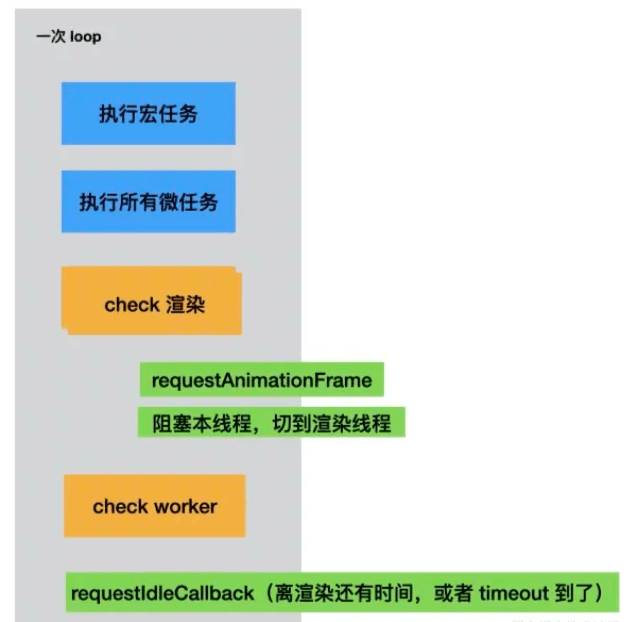
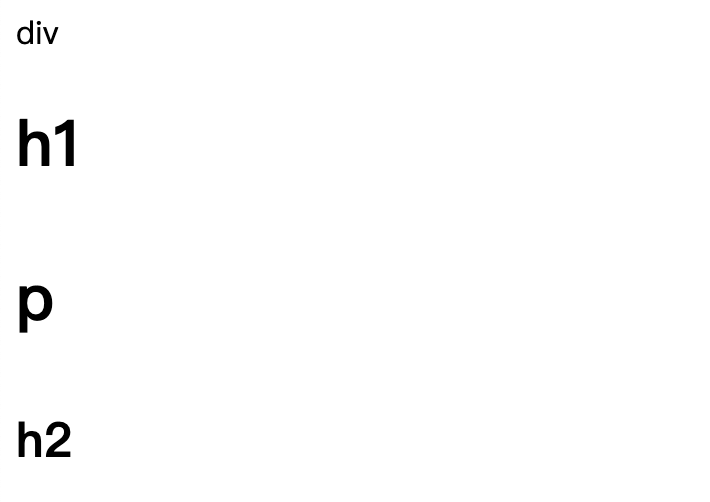
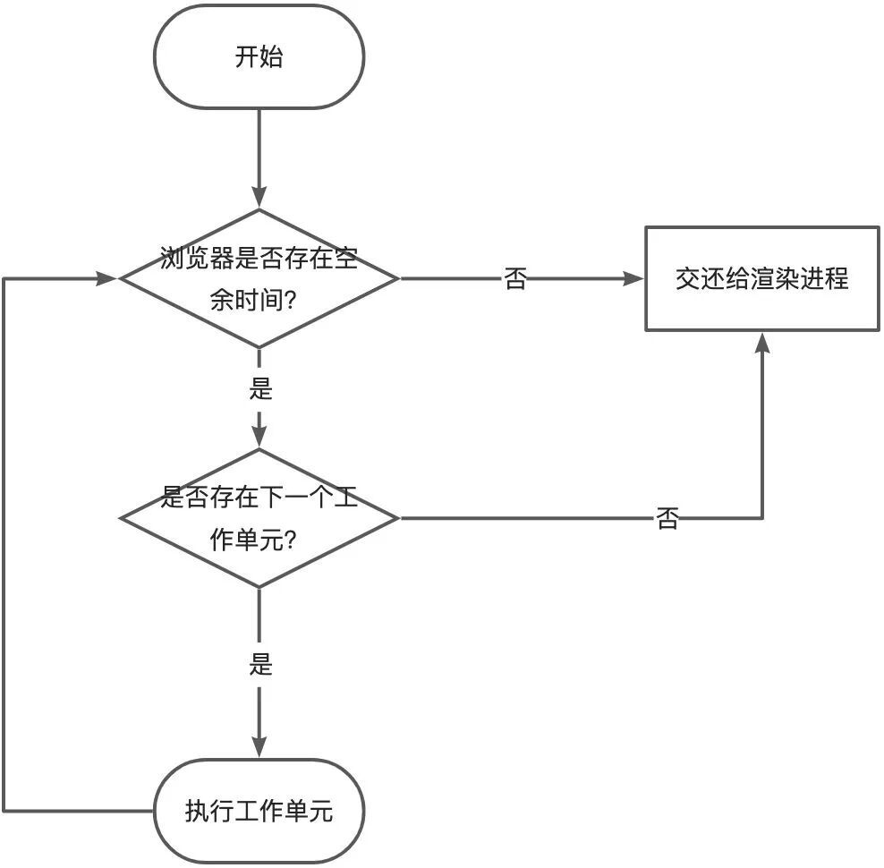
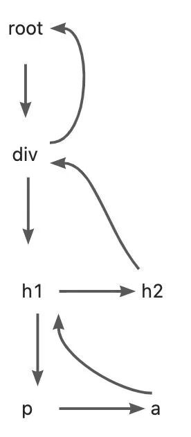
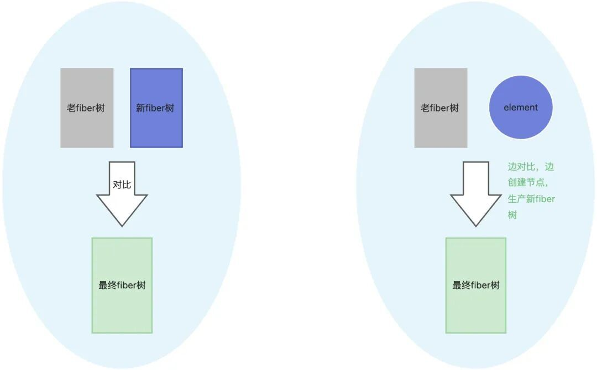

# 用Demo理解Fiber

点击上方 程序员成长指北，关注公众号

回复1，加入高级Node交流群

理解Fiber，就是理解现代React的灵魂。本文本文主要探索2个问题：

1. 为什么页面看起来会卡顿？
2. Fiber是怎么解决卡顿的？

## 一、为什么页面看起来会卡顿

卡顿是人主观的感受，是对画面呈现的描述；研究表明：**大多数人感知到不卡顿的频率在50Hz到60Hz之间，综合考量下60fps（帧率）被视为流畅的基准。**

### **1.60Fps**



- **人眼感知**: 人眼可以感知大约50Hz至60Hz的频率，较高的刷新率可以减少闪烁感，使画面更平滑。
- **帧率与流畅度**: 帧率指的是每秒显示的画面数量（fps）。帧率越高，意味着每秒显示的静态图像越多，组合起来就越能模拟出流畅的运动，给观看者带来更流畅、更逼真的体验。
- **渲染间隔**: 帧率和渲染间隔是互逆的关系。渲染间隔大于16.6ms（1/60Hz），意味着画面之间的过渡会不够连贯，从而产生卡顿感。

### 2.浏览器渲染

#### **浏览器渲染的一次循环**



#### **几个浏览器渲染问题**

- **Q**
1. 每一轮 Event Loop 都会伴随着渲染吗？
2. requestAnimationFrame 在哪个阶段执行，在渲染前还是后？在 microTask 的前还是后？
3. requestIdleCallback 在哪个阶段执行？如何去执行？在渲染前还是后？在 microTask 的前还是后？
4. resize、scroll 这些事件是何时去派发的？
- **A**
1. 事件循环**不一定**每轮都伴随着重渲染，但是如果有微任务，一定会伴随着**微任务执行**。
2. requestAnimationFrame在重新渲染屏幕**之前**执行，非常适合用来做动画。
3. requestIdleCallback在渲染屏幕**之后**执行，并且是否有空执行要看浏览器的调度，如果你一定要它在某个时间内执行，请使用 timeout参数。
4. resize和scroll事件其实自带节流，它只在 Event Loop 的渲染阶段去派发事件到 EventTarget 上。

#### 为什么浏览器卡顿

- 浏览器的渲染和js的执行是互斥的；
- js可以操作dom，如果在渲染的时候操作了dom，不知道以哪个为准；
- 一般浏览器的刷新率为60hz，即1秒钟刷新60次。1000ms / 60hz = 16.6ms ，大概每过16.6ms浏览器会渲染一帧画面，也就是一次eventLoop需要保证在16.6ms内完成；
- 在需要连续渲染的时候，如果js的执行超过16.6ms，导致染间隔大于了16.6ms，就会导致卡顿；

## 二、Fiber是怎么解决卡顿的

React Fiber的解决方案：**可中断的异步渲染，**它的核心思想是：**将不可中断的同步更新，拆解成可中断的异步工作单元**，也就是**中断和重启。**

下面我们一起通过demo来简单实现Fiber，以更好的理解Fiber：

### 1.原生react代码

```code-snippet__js
ounter(lineounter(lineounter(lineounter(lineounter(lineounter(lineounter(lineounter(lineounter(lineounter(lineounter(lineounter(lineounter(lineounter(lineounter(lineounter(lineounter(lineounter(lineounter(lineounter(lineounter(lineounter(line
import React from 'react';
import ReactDOM from 'react-dom';


const container = document.querySelector("#root");
const element = React.createElement(
    'div',
    {
        title: 'div',
        name: 'div'
    },
    'div  ',
    React.createElement('h1', null,
        'h1',
        React.createElement('p', null, 'p')
    ),
    React.createElement('h2', null, 'h2'),
)


ReactDOM.render(
    element,
    container
)
```
#### 效果



### 2.自己实现createElement和render

##### createElement.js

```code-snippet__js
ounter(lineounter(lineounter(lineounter(lineounter(lineounter(lineounter(lineounter(lineounter(lineounter(lineounter(lineounter(lineounter(lineounter(lineounter(lineounter(lineounter(lineounter(lineounter(lineounter(lineounter(lineounter(lineounter(lineounter(lineounter(lineounter(lineounter(lineounter(lineounter(lineounter(lineounter(lineounter(lineounter(lineounter(lineounter(lineounter(lineounter(line
/**
 * 目标？
 * 1、创建fiber节点
 */
/**
 * 需要接收哪些参数？
 */
/**
 * 需要做什么处理？
 * 1、设置type和props，props内的children
 */
function createElement(type, props, ...children) {
    return {
        type,
        props: {
            ...props,
            children: children?.map(child => {
                return typeof child === 'object' ? child : createTextElement(child)
            })
        }
    }
}


// 创建文本类型的fiber节点
function createTextElement(text) {
    return {
        type: 'TEXT_ELEMENT',
        props: {
            nodeValue: text,
            children: []
        }
    }
}


export default {
    createElement
}
```
##### render.js

```code-snippet__js
ounter(lineounter(lineounter(lineounter(lineounter(lineounter(lineounter(lineounter(lineounter(lineounter(lineounter(lineounter(lineounter(lineounter(lineounter(lineounter(lineounter(lineounter(lineounter(lineounter(lineounter(lineounter(lineounter(lineounter(lineounter(lineounter(lineounter(lineounter(lineounter(line
/**
 * 目标？
 * 把fiber节点转换为真实dom
 */
/**
 * 做哪些事情？
 * 1、创建dom节点
 * 2、把dom节点挂载到真实dom
 * 3、把子节点也做上述处理
 */
function render(element, container) {
    const dom = element.type === 'TEXT_ELEMENT'
        ? document.createTextNode('')
        : document.createElement(element.type)


    const isProperty = key => key !== 'children';
    Object.keys(element?.props)
        .filter(isProperty)
        .forEach(name => dom[name] = element?.props[name])


    element?.props?.children?.forEach(child => render(child, dom))


    container.appendChild(dom)
}


export default {
    render
}
```
##### 执行

```code-snippet__js
ounter(lineounter(lineounter(lineounter(lineounter(lineounter(lineounter(lineounter(lineounter(lineounter(lineounter(lineounter(lineounter(lineounter(lineounter(lineounter(lineounter(lineounter(lineounter(lineounter(lineounter(lineounter(lineounter(line
import { createElement } from './createElement.js';
import { render } from './render.js';


const container = document.querySelector("#root");


const element = createElement(
    'div',
    {
        title: 'div',
        name: 'div'
    },
    'div  ',
    createElement('h1', null,
        'h1',
        createElement('p', null, 'p')
    ),
    createElement('h2', null, 'h2'),
)


render(
    element,
    container
)
```
##### 效果（和原生react一样）


##### 这样写有什么问题？

- 不能中断执行，可能js执行太长，导致卡顿

### 3.优化

- 怎么可以中断、重启执行呢？
- 拆分工作单元
- 怎么控制每次js执行时间，不占用渲染进程时间？
- 在eventLoop的剩余时间执行js，那我们就想到一个API：requestIdleCallback (https://developer.mozilla.org/zh-CN/docs/Web/API/Window/requestIdleCallback) 该方法插入一个函数，这个函数将在浏览器空闲时期被调用
- 优化思路图



画板

#### 第一版优化后render.js

```code-snippet__js
ounter(lineounter(lineounter(lineounter(lineounter(lineounter(lineounter(lineounter(lineounter(lineounter(lineounter(lineounter(lineounter(lineounter(lineounter(lineounter(lineounter(lineounter(lineounter(lineounter(lineounter(lineounter(lineounter(lineounter(lineounter(lineounter(lineounter(lineounter(lineounter(lineounter(lineounter(lineounter(lineounter(lineounter(lineounter(lineounter(lineounter(lineounter(lineounter(lineounter(lineounter(lineounter(lineounter(lineounter(lineounter(lineounter(lineounter(lineounter(lineounter(lineounter(lineounter(lineounter(lineounter(lineounter(lineounter(lineounter(lineounter(lineounter(lineounter(lineounter(lineounter(lineounter(lineounter(lineounter(lineounter(lineounter(lineounter(lineounter(lineounter(lineounter(lineounter(lineounter(lineounter(lineounter(lineounter(lineounter(lineounter(lineounter(lineounter(lineounter(lineounter(lineounter(lineounter(lineounter(lineounter(lineounter(lineounter(lineounter(lineounter(lineounter(lineounter(lineounter(lineounter(lineounter(lineounter(lineounter(lineounter(lineounter(lineounter(lineounter(lineounter(lineounter(lineounter(lineounter(lineounter(lineounter(lineounter(lineounter(lineounter(lineounter(lineounter(lineounter(lineounter(lineounter(lineounter(lineounter(lineounter(line
// 记录下一个工作单元
let nextUnitOfWork = null;


/**
 * 要做些什么事情？
 * 1、判断是否有工作单元需要执行
 * 2、判断浏览器是否空闲
 * 3、如果有工作单元且浏览器空闲，执行工作单元
 * 4、一个工作单元执行完成后获取下一个工作单元
 */
/**
 * 空闲时间执行完后，交给渲染进程，再怎么重启下一工作单元的执行？
 */
function workLoop(deadline) {
    let shouldYield = false; // 表示线程繁忙，应该中断渲染


    while (nextUnitOfWork && !shouldYield) {
        /**
         * 1、执行工作单元
         * 2、返回下一个工作单元
         */
        nextUnitOfWork = performUnitOfWork(nextUnitOfWork);


        // 检查是否有空余时间
        shouldYield = deadline.timeRemaining() < 1;
    }


    // 重启下一eventLop的工作单元处理流程
    requestIdleCallback(workLoop);
}


// 在浏览器空闲时执行
requestIdleCallback(workLoop);


/**
 * 怎么样执行执行工作单元？
 * 1、为fiber节点创建dom节点
 * 2、把创建好的dom节点挂载到真实dom
 * 3、为当前的fiber创建他子节点、兄弟节点的fiber
 * 4、建立父子和兄弟关系
 */
/**
 * 怎么样获取下一个工作单元并返回？
 * 1、我们fiber是一个树形结构，我们有哪些方式遍历一棵树？
 */
function performUnitOfWork(fiber) {
    // 新建DOM元素
    if (!fiber.dom) {
        fiber.dom = createDOM(fiber);
    }
    if (fiber.parent) {
        fiber.parent.dom.appendChild(fiber.dom)
    }


    const elements = fiber?.props?.children;
    let prevSibling = null;
    elements.forEach((childrenElement, index) => {
        const newFiber = {
            parent: fiber,
            props: childrenElement.props,
            type: childrenElement.type,
            dom: null,
            sibling: null
        }


        /**
         * 创建好fiber节点后，怎么建立父子和兄弟节点关系？
         */
        if (index === 0) {
            fiber.child = newFiber
        } else {
            prevSibling.sibling = newFiber
        }


        prevSibling = newFiber
    })


    // 遍历处理
    if (fiber.child) {
        return fiber.child
    }
    let nextFiber = fiber;
    while (nextFiber) {
        if (nextFiber.sibling) {
            return  nextFiber.sibling
        }
        nextFiber = nextFiber.parent
    }
}


// 创建dom节点
function createDOM(element) {
    const dom = element.type === 'TEXT_ELEMENT'
        ? document.createTextNode('')
        : document.createElement(element.type)


    const isProperty = key => key !== 'children';
    Object.keys(element?.props)
        .filter(isProperty)
        .forEach(name => dom[name] = element?.props[name])


    return dom;
}


function render(element, container) {
    // 第一个工作单元
    nextUnitOfWork = {
        dom: container,
        props: {
            children: [element]
        }
    }
}


export default {
    render
}
```
##### Fiber树遍历流程图



画板

##### 优化后的第一版有什么问题？

- 每处理一个fiber节点，都实时挂载到了真实的dom上面
- 操作dom太频繁，导致重排重绘；
- 如果节点很多，页面展示会有一个逐步出现的效果；

##### 怎么优化？

- 先对所有工作单元，所有fiber节点创建好dom节点，等所有工作单元处理完成后，一次性挂载到真实dom

#### 第二版优化后render.js

```code-snippet__js
ounter(lineounter(lineounter(lineounter(lineounter(lineounter(lineounter(lineounter(lineounter(lineounter(lineounter(lineounter(lineounter(lineounter(lineounter(lineounter(lineounter(lineounter(lineounter(lineounter(lineounter(lineounter(lineounter(lineounter(lineounter(lineounter(lineounter(lineounter(lineounter(lineounter(lineounter(lineounter(lineounter(lineounter(lineounter(lineounter(lineounter(lineounter(lineounter(lineounter(lineounter(lineounter(lineounter(lineounter(lineounter(lineounter(lineounter(lineounter(lineounter(lineounter(lineounter(lineounter(lineounter(lineounter(lineounter(lineounter(lineounter(lineounter(lineounter(lineounter(lineounter(lineounter(lineounter(lineounter(lineounter(lineounter(lineounter(lineounter(lineounter(lineounter(lineounter(lineounter(lineounter(lineounter(lineounter(lineounter(lineounter(lineounter(lineounter(lineounter(lineounter(lineounter(lineounter(lineounter(lineounter(lineounter(lineounter(lineounter(lineounter(lineounter(lineounter(lineounter(lineounter(lineounter(lineounter(lineounter(lineounter(lineounter(lineounter(lineounter(lineounter(lineounter(lineounter(lineounter(lineounter(lineounter(lineounter(lineounter(lineounter(lineounter(lineounter(lineounter(lineounter(lineounter(lineounter(lineounter(lineounter(lineounter(lineounter(lineounter(lineounter(lineounter(lineounter(lineounter(lineounter(lineounter(lineounter(lineounter(lineounter(lineounter(lineounter(lineounter(lineounter(lineounter(lineounter(lineounter(lineounter(lineounter(lineounter(lineounter(line
// 下一个工作单元
let nextUnitOfWork = null;
// 正在进行的渲染 work in progress root
let wipRoot = null;


/**
 * 怎么样执行执行工作单元？
 * 1、为fiber节点创建dom节点
 * 2、把创建好的dom节点挂载到真实dom
 * 3、为当前的fiber创建他子节点、兄弟节点的fiber
 * 4、建立父子和兄弟关系
 */
/**
 * 怎么样获取下一个工作单元并返回？
 * 1、我们fiber是一个树形结构，我们有哪些方式遍历一棵树？
 */
/**
 * 统一提交渲染，什么时候提交？
 * 1、没有下一个工作单元 且 有正在进行的渲染
 */
function workLoop(deadline) {
    // shouldYield 表示线程繁忙，应该中断渲染
    let shouldYield = false;
    while (nextUnitOfWork && !shouldYield) {
        debugger
        nextUnitOfWork = performUnitOfWork(nextUnitOfWork);
        // 检查是否有空余时间
        shouldYield = deadline.timeRemaining() < 1;
    }


    // 统一提交渲染
    if (!nextUnitOfWork && wipRoot) {
        commitRoot();
    }


    // 重启下一eventLop的工作单元处理流程
    requestIdleCallback(workLoop);
}


// 在浏览器空闲时执行
requestIdleCallback(workLoop);


/**
 * 怎么样执行执行工作单元？
 * 1、为fiber节点创建dom节点
 * 2、把创建好的dom节点挂载到真实dom
 * 3、为当前的fiber创建他子节点、兄弟节点的fiber
 * 4、建立父子和兄弟关系
 */
/**
 * 怎么样获取下一个工作单元并返回？
 * 1、我们fiber是一个树形结构，我们有哪些方式遍历一棵树？
 */
function performUnitOfWork(fiber) {
    // 新建DOM元素
    if (!fiber.dom) {
        fiber.dom = createDOM(fiber);
    }


    const elements = fiber?.props?.children;
    let prevSibling = null;
    elements.forEach((childrenElement, index) => {
        const newFiber = {
            parent: fiber,
            props: childrenElement.props,
            type: childrenElement.type,
            dom: null,
            sibling: null
        }


        if (index === 0) {
            fiber.child = newFiber
        } else {
            prevSibling.sibling = newFiber
        }


        prevSibling = newFiber
    })


    if (fiber.child) {
        return fiber.child
    }


    let nextFiber = fiber;
    while (nextFiber) {
        if (nextFiber.sibling) {
            return  nextFiber.sibling
        }
        nextFiber = nextFiber.parent
    }
}


// 渲染真实dom
// 把正在渲染的标记清除
function commitRoot() {
    commitWork(wipRoot.child);
    wipRoot = null;
}


// 渲染所有的fiber
function commitWork(fiber) {
    if (!fiber) {
        return;
    }


    const parentDom = fiber.parent.dom;
    parentDom.appendChild(fiber.dom)


    commitWork(fiber.child);
    commitWork(fiber.sibling);
}


// 创建dom节点
function createDOM(element) {
    const dom = element.type === 'TEXT_ELEMENT'
        ? document.createTextNode('')
        : document.createElement(element.type)


    const isProperty = key => key !== 'children';
    Object.keys(element?.props)
        .filter(isProperty)
        .forEach(name => dom[name] = element?.props[name])


    return dom;
}


function render(element, container) {
    wipRoot = {
        dom: container,
        props: {
            children: [element]
        }
    }


    nextUnitOfWork = wipRoot
}


export default {
    render
}
```
##### 优化后的第二版还有什么问题？

- 开销很大，重新渲染时，每次都会全局重新渲染

##### 怎么优化？

- diff算法

##### diff方式



画板

#### 第三版优化后render.js

```code-snippet__js
ounter(lineounter(lineounter(lineounter(lineounter(lineounter(lineounter(lineounter(lineounter(lineounter(lineounter(lineounter(lineounter(lineounter(lineounter(lineounter(lineounter(lineounter(lineounter(lineounter(lineounter(lineounter(lineounter(lineounter(lineounter(lineounter(lineounter(lineounter(lineounter(lineounter(lineounter(lineounter(lineounter(lineounter(lineounter(lineounter(lineounter(lineounter(lineounter(lineounter(lineounter(lineounter(lineounter(lineounter(lineounter(lineounter(lineounter(lineounter(lineounter(lineounter(lineounter(lineounter(lineounter(lineounter(lineounter(lineounter(lineounter(lineounter(lineounter(lineounter(lineounter(lineounter(lineounter(lineounter(lineounter(lineounter(lineounter(lineounter(lineounter(lineounter(lineounter(lineounter(lineounter(lineounter(lineounter(lineounter(lineounter(lineounter(lineounter(lineounter(lineounter(lineounter(lineounter(lineounter(lineounter(lineounter(lineounter(lineounter(lineounter(lineounter(lineounter(lineounter(lineounter(lineounter(lineounter(lineounter(lineounter(lineounter(lineounter(lineounter(lineounter(lineounter(lineounter(lineounter(lineounter(lineounter(lineounter(lineounter(lineounter(lineounter(lineounter(lineounter(lineounter(lineounter(lineounter(lineounter(lineounter(lineounter(lineounter(lineounter(lineounter(lineounter(lineounter(lineounter(lineounter(lineounter(lineounter(lineounter(lineounter(lineounter(lineounter(lineounter(lineounter(lineounter(lineounter(lineounter(lineounter(lineounter(lineounter(lineounter(lineounter(lineounter(lineounter(lineounter(lineounter(lineounter(lineounter(lineounter(lineounter(lineounter(lineounter(lineounter(lineounter(lineounter(lineounter(lineounter(lineounter(lineounter(lineounter(lineounter(lineounter(lineounter(lineounter(lineounter(lineounter(lineounter(lineounter(lineounter(lineounter(lineounter(lineounter(lineounter(lineounter(lineounter(lineounter(lineounter(lineounter(lineounter(lineounter(lineounter(lineounter(lineounter(lineounter(lineounter(lineounter(lineounter(lineounter(lineounter(lineounter(lineounter(lineounter(lineounter(lineounter(lineounter(lineounter(lineounter(lineounter(lineounter(lineounter(lineounter(lineounter(lineounter(lineounter(lineounter(lineounter(lineounter(lineounter(lineounter(lineounter(lineounter(lineounter(lineounter(lineounter(lineounter(lineounter(lineounter(lineounter(lineounter(lineounter(lineounter(lineounter(line
// 下一个工作单元
let nextUnitOfWork = null;
// 正在进行的渲染 work in progress root
let wipRoot = null;
// 上一次渲染
let currentRoot = null
// 要删除的fiber
let deletion = [];


// 任务调度
function workLoop(deadline) {
    let shouldYield = false; // shouldYield 表示线程繁忙，应该中断渲染
    while (nextUnitOfWork && !shouldYield) {
        nextUnitOfWork = performUnitOfWork(nextUnitOfWork);
        // 检查是否有空余时间
        shouldYield = deadline.timeRemaining() < 1;
    }


    // 统一提交渲染
    if (!nextUnitOfWork && wipRoot) {
        commitRoot();
    }


    // 重启下一eventLop的工作单元处理流程
    requestIdleCallback(workLoop);
}


// 在浏览器空闲时执行
requestIdleCallback(workLoop);


// 以前在这创建fiber节点，创建他子节点、兄弟节点的fiber，建立关系
function performUnitOfWork(fiber) {
    // 新建DOM元素
    if (!fiber.dom) {
        fiber.dom = createDOM(fiber);
    }


    const elements = fiber?.props?.children;
    reconcileChildren(fiber, elements)


    if (fiber.child) {
        return fiber.child
    }


    let nextFiber = fiber;
    while (nextFiber) {
        if (nextFiber.sibling) {
            return  nextFiber.sibling
        }
        nextFiber = nextFiber.parent
    }
}


// 渲染真实dom
// 把正在渲染的标记清除
function commitRoot() {
    commitWork(wipRoot.child);


    currentRoot = wipRoot;


    wipRoot = null;
}


// 渲染所有的fiber
function commitWork(fiber) {
    if (!fiber) {
        return;
    }


    const parentDom = fiber.parent.dom;


    const hasFiberDom = !!fiber.dom
    switch (fiber.effectTag) {
        case 'PLACEMENT':
            hasFiberDom && parentDom.append(fiber.dom);
            break;
        case 'UPDATE':
            hasFiberDom && updateDOM(fiber.dom, fiber.alternate.props, fiber.props);
            break;
        case 'DELETION':
            hasFiberDom && parentDom.removeChild(fiber.dom);
            break;
        default:
            break;
    }


    commitWork(fiber.child);
    commitWork(fiber.sibling);
}


function updateDOM(dom, prevProps, nextPorps) {
    const isEvent = (key) => key.startsWith('on');
    // 删除已经没有的props
    Object.keys(prevProps)
        .filter((key) => key != 'children' && !isEvent(key))
        // 不在nextProps中
        .filter((key) => !key in nextPorps)
        .forEach((key) => {
            // 清空属性
            dom[key] = '';
        });


    // 添加新增的属性/修改变化的属性
    Object.keys(nextPorps)
        .filter((key) => key !== 'children' && !isEvent(key))
        // 不再prevProps中
        .filter((key) => !key in prevProps || prevProps[key] !== nextPorps[key])
        .forEach((key) => {
            dom[key] = nextPorps[key];
        });


    // 删除事件处理函数
    Object.keys(prevProps)
        .filter(isEvent)
        // 新的属性没有，或者有变化
        .filter((key) => !key in nextPorps || prevProps[key] !== nextPorps[key])
        .forEach((key) => {
            const eventType = key.toLowerCase().substring(2);
            dom.removeEventListener(eventType, prevProps[key]);
        });


    // 添加新的事件处理函数
    Object.keys(nextPorps)
        .filter(isEvent)
        .filter((key) => prevProps[key] !== nextPorps[key])
        .forEach((key) => {
            const eventType = key.toLowerCase().substring(2);
            dom.addEventListener(eventType, nextPorps[key]);
        });
}


function createDOM(element) {
    const dom = element.type === 'TEXT_ELEMENT'
        ? document.createTextNode('')
        : document.createElement(element.type)


    const isProperty = key => key !== 'children';
    Object.keys(element?.props)
        .filter(isProperty)
        .forEach(name => dom[name] = element?.props[name])


    return dom;
}


function reconcileChildren(wipFiber, elements) {
    let index = 0;
    // 如果有alternate，就返回它的child，没有，就返回undefined
    let oldFiber = wipFiber.alternate && wipFiber.alternate.child;


    let prevSibling = null;


    // 为什么要用while呢？
    // 需要把oldFiber树和新fiber树都遍历完
    // 因为可能oldFiber树比新fiber树长
    while (index < elements.length || oldFiber) {
        const element = elements[index];
        const sameType = oldFiber && element && oldFiber.type === element.type;


        let newFiber = null;


        if (sameType) { // 更新
            newFiber = {
                type: oldFiber.type,
                props: element.props,
                // 继承dom
                dom: oldFiber.dom,
                parent: wipFiber,
                alternate: oldFiber,
                effectTag: 'UPDATE',
            };
        }
        if (element && !sameType) { // 新建
            newFiber = {
                type: element.type,
                props: element.props,
                dom: null,
                parent: wipFiber,
                alternate: null,
                effectTag: 'PLACEMENT',
            };
        }
        if (oldFiber && !sameType) { // 删除
            oldFiber.effectTag = 'DELETION';
            deletion.push(oldFiber);
        }


        if (oldFiber) { // 下一个oldFiber
            oldFiber = oldFiber.sibling;
        }


        // 第一个child才可以作为child，其他的就是sibling
        if (index === 0) {
            wipFiber.child = newFiber;
        } else {
            prevSibling.sibling = newFiber;
        }


        prevSibling = newFiber;


        index++;
    }
}


function render(element, container) {
    wipRoot = {
        dom: container,
        props: {
            children: [element]
        },
        alternate: currentRoot, // 记录老的fiber树
    }


    deletion = [];


    nextUnitOfWork = wipRoot
}


export default {
    render
}
```
## 三、总结

本文只简单介绍了Fiber可中断、可恢复的渲染过程，实际的Fiber远不止这么简单，比如还有：

- 优先级驱动的任务调度（为不同类型的更新分配了优先级。）
- 高优先级：用户交互（点击、输入）、动画。
- 低优先级：大数据渲染、网络请求返回。
- 更精细的生命周期控制

如果大家感兴趣可以进一步深入了解。

Node 社群
